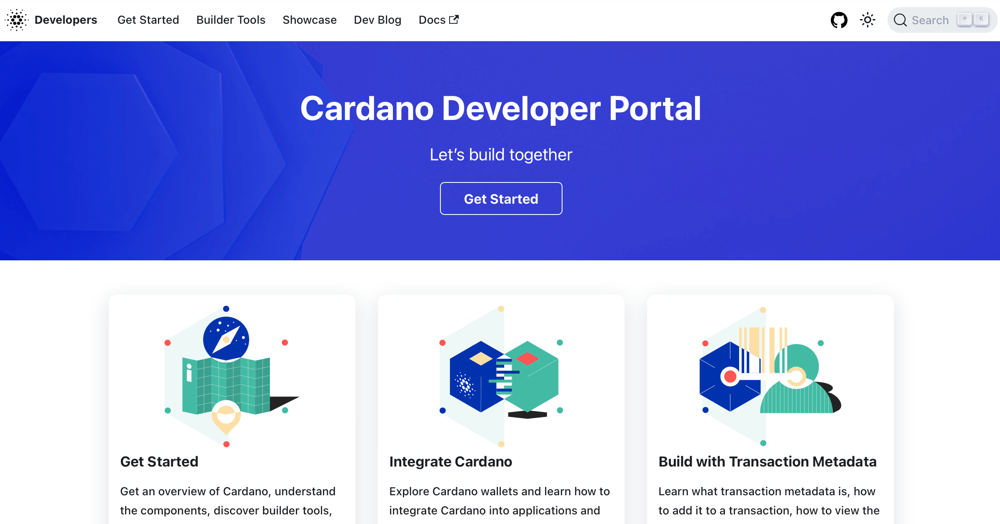

<div align="center">



**[developers.cardano.org](https://developers.cardano.org/)**

[](./LICENSE)
[](https://app.netlify.com/sites/staging-dev-portal/deploys)

</div>

The Cardano Developer Portal covers smart contracts, native tokens, stake pool operation, governance, and [builder tools](https://developers.cardano.org/tools/). 

The portal relies on your contributions. If you're reading this, you probably have something to contribute, even if you're not a developer.

## Contribute

Every content page on the portal has an **Edit this page** link at the bottom, letting you propose changes directly from your browser.

Before contributing, check the [Contributing Guide](./CONTRIBUTING.md).

Found something broken? [Open an issue.](https://github.com/cardano-foundation/developer-portal/issues/new) Have an idea? [Start a discussion.](https://github.com/cardano-foundation/developer-portal/discussions)

### Local development setup

[Fork the repo](https://github.com/cardano-foundation/developer-portal/fork), then:

```bash
git clone https://github.com/<your-github-username>/developer-portal.git
cd developer-portal
yarn install
yarn build           # also validates builder tools and links
yarn start           # dev server on localhost:3000
```

Requires [Node.js](https://nodejs.org/) 20+ and [Yarn](https://classic.yarnpkg.com/) 1.20+. Built with [Docusaurus](https://docusaurus.io/).

All pull requests should target the `staging` branch. Changes are merged from `staging` into `main` for production periodically by the maintainers.

## License

[MIT](./LICENSE)
