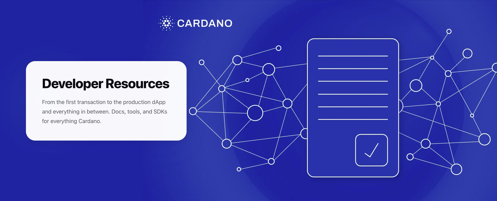

<div align="center">



**[developers.cardano.org](https://developers.cardano.org/)**

[](./LICENSE)
[](https://app.netlify.com/sites/staging-dev-portal/deploys)

</div>

We wanted to build a developer portal as open and inclusive as Cardano. A portal that is in the hands of the Cardano community and can be constantly evolved by it.

The portal relies on your contributions. If you're reading this, you probably have something to contribute, even if you're not a developer.

## Contribute

The easiest way to start is the [GitHub web editor](https://github.com/cardano-foundation/developer-portal/edit/staging/README.md), no setup needed.

To work locally, [fork the repo](https://github.com/cardano-foundation/developer-portal/fork) and then:

```bash
git clone https://github.com/<your-github-username>/developer-portal.git
cd developer-portal
yarn install
yarn build
yarn start        # dev server on localhost:3000
```

You'll need [Node.js](https://nodejs.org/) 20+ and [Yarn](https://classic.yarnpkg.com/) 1.20+ installed.

For details on what to contribute and how, check the [Contributing Guide](./CONTRIBUTING.md). If you're adding a tool to the [Builder Tools](https://developers.cardano.org/tools/) showcase, the guide walks you through it step by step.

Found something broken? [Open an issue.](https://github.com/cardano-foundation/developer-portal/issues/new) Have an idea? [Start a discussion.](https://github.com/cardano-foundation/developer-portal/discussions)

The site is built with [Docusaurus](https://docusaurus.io/docs). See the [technical setup guide](https://developers.cardano.org/docs/portal-contribute/) and [style guide](https://developers.cardano.org/docs/portal-style-guide/) for more.

## License

[MIT](./LICENSE)

