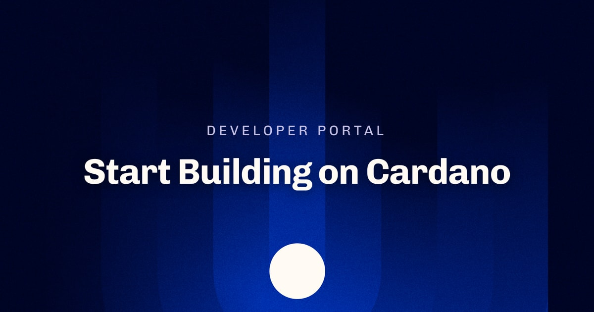

<div align="center">



# Cardano Developer Portal

**[developers.cardano.org](https://developers.cardano.org/)**

[](https://github.com/cardano-foundation/developer-portal/actions/workflows/yarn-build.yml)
[](./LICENSE)
[](https://staging-dev-portal.netlify.app/)

</div>

The Cardano Developer Portal is built to be as open and inclusive as Cardano itself: it is in the hands of the Cardano community and constantly evolved by it.

For this to work, the portal relies on your contributions, and the fact that you are reading this probably means you have something to contribute, even if you are not a developer.

The portal covers everything Cardano developers need in one place: documentation, [builder tools](https://developers.cardano.org/tools/), [dApp templates](https://developers.cardano.org/templates/), and runnable starter projects in [`examples/`](./examples/). The content spans smart contracts, native tokens, stake pool operation, and governance.

## Contribute

Every content page on the portal has an **Edit this page** link at the bottom, letting you propose changes directly from your browser with no local setup.

Before contributing, check the [Contributing Guide](./CONTRIBUTING.md). If you work with an AI coding agent, point it at [AGENTS.md](./AGENTS.md).

Found something broken? [Open an issue](https://github.com/cardano-foundation/developer-portal/issues/new). Have an idea? [Start a discussion](https://github.com/cardano-foundation/developer-portal/discussions).

### Local development setup

[Fork the repo](https://github.com/cardano-foundation/developer-portal/fork), then:

```bash
git clone https://github.com/<your-github-username>/developer-portal.git
cd developer-portal
yarn install
yarn build           # also validates builder tools and links
yarn start           # dev server on localhost:3000
```

Requires [Node.js](https://nodejs.org/) 22 (see `.nvmrc`) and [Yarn](https://classic.yarnpkg.com/) 1.20+. Built with [Docusaurus](https://docusaurus.io/).

All pull requests should target the `staging` branch. Changes are merged from `staging` into `main` for production periodically by the maintainers.

## Conduct and security

Contributions are covered by our [Code of Conduct](./CODE_OF_CONDUCT.md). To report a security issue privately, see [SECURITY.md](./SECURITY.md).

## License

[MIT](./LICENSE)
