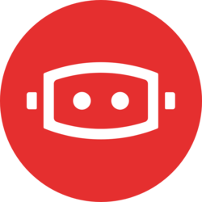

 

  

 For the January edition of the Spotlight Article, we interviewed Robert Hever, COO / Co-Founder, and Damon Zwarich, CMO / Co-Founder from Charli3.
  

 **_Hey Robert and Damon! Happy to connect today and learn more about the Charli3 project! Can you tell us more about the project and the problem you were addressing?_**

 [Charli3](https://charli3.io/) is a decentralized oracle solution natively built in Haskell / on the [PAB](https://iohk.io/en/blog/posts/2021/10/28/plutus-application-backend-pab-supporting-dapp-development-on-cardano/) (Plutus Application Backend). We held our Initial DEX Offering in April 2021 and set out to solve the following three problems.

 1. **General oracle problem:** Smart contract solutions need accurate, reliable, secure, and trusted off-chain data that fit their requirements (e.g., for speed). There is a need for aggregation of data to provide a trusted source to the chain (e.g., many single sources with conflicting values).

 2. **Cardano problem:** There are no blockchain agnostic solutions. The current solutions are paired with network lag and high update fees. The barrier of entry to support launching Cardano projects is that the oracles must be built from scratch, natively with Haskell/Plutus code. 

 3. **Decentralization problem:** We see centralized oracle solutions, where one party is the governing authority on who gets what data and from where. We see centralization as part of the current financial system’s problem. We hope to solve that problem by being as “hands-off” as possible with our ecosystem solution.

<!-- truncate -->

 **_What are the most important things about Charli3?_**

 - **From a team perspective:** Most importantly, Charli3 is working towards our company vision, mission, and cultivating a culture that reflects our core values. It is critical that we internalize our core values and reflect them in our actions with the community and our partners.

 - **From a business perspective:** Our specific role as a middleware solution to facilitate the transmission of data between off-chain providers and on-chain Dapp and Defi smart contract solutions comes with the responsibility of ensuring the integrity of the data these projects rely on as their lifeblood. 

 Without question, Charli3 prides the accuracy, reliability, and security of the data flowing through our ecosystem as the single most important metric of success for our company. 

  

 **_Going forward, how will Charli3 make an impact in the crypto space or on the world?_**

 Charli3’s team envisions a future of global smart contract adoption that uplifts and betters the world we live in; **supporting this vision is of the utmost importance**. We believe building on the Cardano infrastructure is the best way to support this vision.

 Dapps and Defi solutions will become available to people across the globe that never before had reliable access to such services in our current financial system. In that regard, **supporting the launch and scaling of Cardano is incredibly important to our team**.

  

 **_Now, what are your accomplishments so far, and what are you most proud of?_**

 The top two most important accomplishments are building our community and team.

 - **Community:** Built and sustained a community of 12k token holders and 45k+ members on Twitter.
 - **Team:** Scaled team from 3 members to 15+; International presence with diverse team members across 4 continents.
 - **Team success:**
     - **Contract-on-mainnet:** One of the first projects to launch a functioning contract on the main net [(9-13-2021, less than 24 hrs after 9-12-2021 hard fork)](https://cardanoscan.io/transaction/6e18eff1930b29f133599577c0e06225372ac33846cbdddcd0d0d47b224c19e1).
     - **MVP:** The first version of our on-chain Oracle contract MVP completed.
     - **Audit:** Inaugural project to pass level 2 certification by CertiK through the IOHK certification program.
 - **Charity:** Spearheaded a [charitable campaign](https://www.growyourstake.com/2021/08/02/the-right-to-clean-water/) to pay for clean water sources in Africa through Grow Your Stake stake-pool and charity Drop4drop. 
 - **Data consumers:** 16 Cardano projects publicly announcing us as their preferred Oracle solution; 29 Total projects in conversations to be data consumers.
 - **CDA:** Founding member of the [Cardano DeFi Alliance](https://www.linkedin.com/company/cardano-defi-alliance). 

  

 **_Why should people choose to use Charli3? What are the advantages over your competitors?_**

 - **Competitors are healthy, especially Cardano native ones:** Our vision entails multiple solutions, and competition pushes us to improve and innovate to create a better ecosystem; using multiple oracle solutions is prudent.
 - **Cardano-centric:**  Our team is working directly with the largest projects in the space, the governing bodies, and we are a founding member of the CDA (Cardano DeFi Alliance). 
 - **Haskell / PAB native:** Our solution is built Haskell native from the ground up to maximize Cardano’s benefits, reducing integration challenges and data lag. We see Charli3 as uniquely positioned to support the launch and scaling of the Cardano ecosystem, in particular the large community of Dapps and Defi solutions. 
 - **Aim to provide world-class data providers on launch:** As a double-sided marketplace, it is important we bring high-value data sources (as well as reputable node operators).
 - **Inclusivity and accessibility - Fund7 Proposal:** If you aren’t aware, data consumption can be a barrier of entry for developing Dapp and DeFi solutions. As a company, we want to ensure that even the smaller and underfunded projects (especially those being made by entrepreneurs in developing countries) have the same opportunities to build solutions as everyone else. Through our Fund7 initiative, we aim to provide community feeds to get all projects off the ground.  

  

 **_What is the future of Charli3? For example, what new things to come, and what will it mean for the overall project?_**

 - **Onboard and launch:** Initial data consumers, data providers, and node operators.
 - **Launch community feeds**
 - **Maintain our feeds, heighten security:** Ensure we meet KPIs (avoiding breaches, feed issues, etc.) and plan recurring audits.
 - **Improving UIUX:** Make it easier for projects to use our ecosystem (automation and self-service is something we are actively exploring).
 - **R&D / innovation and increased security**: We will look to any innovations to improve the security and accuracy of our data feeds. We’ve thrown around the idea of exploring complementary technology to improve value in our ecosystem, such as integrating machine learning into our pricing models or catching bad actors. However, nothing is planned, but our team sees technological innovation as critical to our future success.
 - **Migration from Cardano:** In the future, we are looking for cross-chain interoperability and facilitating the migration of projects moving to Cardano.

  

 **_Tell us about your team. Who are the people behind Charli3?_**

 Our team is currently at 18+ members, and we are looking to double our team size in 2022.
 - **Leadership:**
     - Damon: CMO and the usual voice of Charli3
     - Jonas: CTO 
     - Robert: COO

 - **Development team**
     - Our success is largely dependent on our global team of developers. 
     - We also work with an incredible Haskell / functional programming lab that forms one of our key partnerships with our company.

 - **Community and Marketing**
     - We have a team of community moderators, social managers, and graphical/ marketing support. 
     - Graphics teams are working behind the scenes too.
     - Tech and marketing advisors for support.

  

 **_Which partnerships have you engaged so far, and which ones are the most impactful?_**

 - **Grow your stake and the clean water coalition x Drop4Drop:** As we spoke on this before, we have allocated time to creating a coalition of Cardano projects to aid in this humanitarian effort, supporting a cornerstone of the Cardano ethos. 
 - **Data consumers:** Approximately 29 projects are in line to launch data feeds with Charli3; Charli3 won’t succeed without their support.
 - **Cardstarter:** An incubated accelerator that was instrumental in our IDO success. Without their partnership, we would not have raised our initial funding or grown our community to the point where we could have accomplished everything we’ve done to date.
 - **Cardano DeFi Alliance:** as a founding partner of the alliance, we see this organization as one of our most impactful partnerships moving forward as we share values and a similar vision.
 - **IOHK:** Although we are not officially partnered with the IOHK, their team from front-lines to the executive level has welcomed our team with open arms and supported us wholeheartedly. We are incredibly grateful for this relationship and see its impact growing parallel to our company’s growth.

 **IOHK is not an official partner of Charli3.

  

 **_Thank you for your time, and best of luck!_**

  
