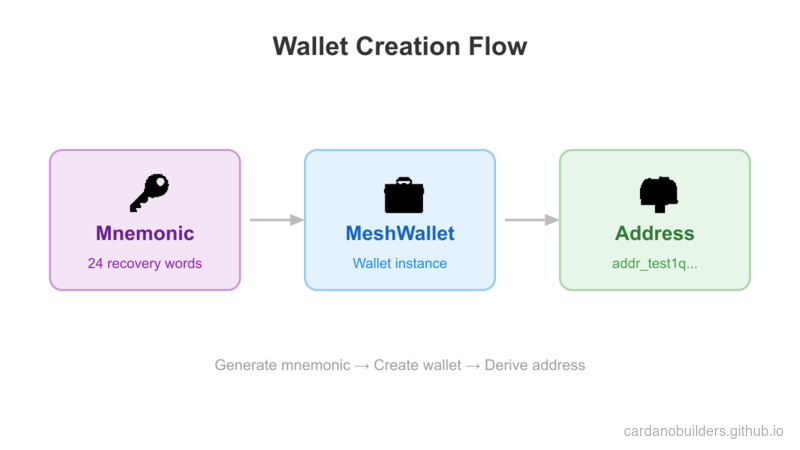
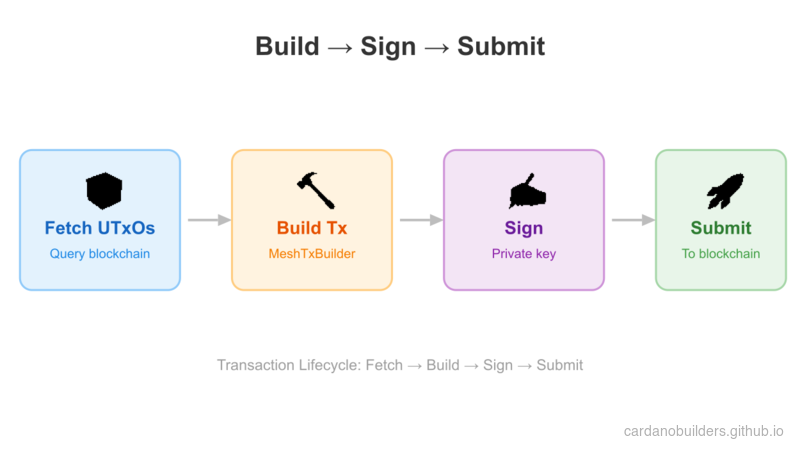
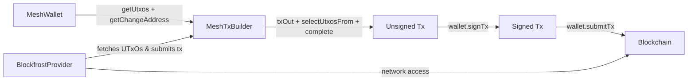

# Lesson #01: Hello World

This lesson covers the fundamentals of Cardano application development: installing the [Mesh SDK](https://meshjs.dev/), creating a wallet with `MeshWallet`, and sending lovelace using `MeshTxBuilder`.

> Source code: [GitHub](https://github.com/cardano-foundation/developer-portal/tree/staging/bootcamp-codes/01-wallet-send-lovelace)

## System setup

This course requires Node.js v24+. We recommend using [nvm](https://github.com/nvm-sh/nvm) to manage your Node versions.

### Create a package.json file

First, create a new `package.json` file in the root of your project with the following content:

```json
{
  "type": "module",
  "dependencies": {},
  "scripts": {}
}
```

### Install the necessary packages

Open your terminal and run these commands to install the MeshSDK:

```bash
npm install
npm install @meshsdk/core
```

Here's how your `package.json` file should look after installing the package:

```json
{
  "type": "module",
  "dependencies": {
    "@meshsdk/core": "^1.9.0",
  },
  "scripts": {}
}
```

- `@meshsdk/core`: Core functionality for network interactions, wallets, and transactions.

## Create a wallet



[`MeshWallet`](https://meshjs.dev/apis/wallets/meshwallet) provides methods to create wallets, generate mnemonic phrases, and retrieve wallet addresses.

### Generate mnemonic phrases

A mnemonic phrase is a set of words used to recover your wallet. Keep your mnemonic phrase safe and secure; anyone with access to it can control your funds.

Generate a new mnemonic:

```ts
import { MeshWallet } from "@meshsdk/core";

// Generate new mnemonic phrases for your wallet
const mnemonic = MeshWallet.brew();
console.log("Your mnemonic phrases are:", mnemonic);
```

- Use the `brew` method to generate a new mnemonic phrase.

### Initialize the wallet and get the wallet address

With a mnemonic phrase generated, initialize the wallet:

```ts
// Initialize the wallet with a mnemonic key
const wallet = new MeshWallet({
  networkId: 0, // preprod testnet
  key: {
    type: "mnemonic",
    words: mnemonic as string[],
  },
});

// Get the wallet address
const address = await wallet.getChangeAddress();
console.log("Your wallet address is:", address);
```

- `networkId`: Specify the network, 0 for preprod testnet.
- `key`: Specify the key type and mnemonic phrases.
- `getChangeAddress`: Method to get the wallet address.

### Run the code

Create a new file `mnemonic.ts` with the following code:

```ts
import { MeshWallet } from "@meshsdk/core";

// Generate new mnemonic phrases for your wallet
const mnemonic = MeshWallet.brew();
console.log("Your mnemonic phrases are:", mnemonic);

// Initialize the wallet with a mnemonic key
const wallet = new MeshWallet({
  networkId: 0, // preprod testnet
  key: {
    type: "mnemonic",
    words: mnemonic as string[],
  },
});

// Get the wallet address
const address = await wallet.getChangeAddress();
console.log("Your wallet address is:", address);
```

Update the `package.json` file to add a script to run the code:

```json
{
  "type": "module",
  "dependencies": {
    "@meshsdk/core": "^1.9.0",
  },
  "scripts": {
    "mnemonic": "node mnemonic.ts"
  }
}
```

Run the script:

```bash
npm run mnemonic
```
This generates a new mnemonic phrase and wallet address. The output looks similar to:

```bash
> mnemonic
> node mnemonic.ts

Your mnemonic phrases are: [
  'access',  'spawn',   'taxi',
  'prefer',  'fortune', 'sword',
  'nerve',   'price',   'valid',
  'panther', 'sure',    'hello',
  'layer',   'try',     'grace',
  'seven',   'fossil',  'voice',
  'tobacco', 'circle',  'measure',
  'solar',   'pride',   'together'
]
Your wallet address is: addr_test1qptwuv6dl863u3k93mjrg0hgs0ahl08lfhsudxrwshcsx59cjxatme29s6cl7drjceknunry049shu9eudnsjvwqq9qsuem66d
```

## Send lovelace

With a funded wallet, you can send lovelace using the `MeshTxBuilder` class to build and submit transactions to the network.

### Get lovelace from faucet

Use the [Cardano Preprod Testnet Faucet](https://docs.cardano.org/cardano-testnets/tools/faucet) to get test lovelace. Paste your wallet address, click "Request funds," and you will receive lovelace shortly.

### Get Blockfrost API key

Transaction building requires fetching UTXOs from the network. Sign up for a free [Blockfrost](https://blockfrost.io/) account and get a preprod API key (it starts with `preprod`). You can find the key in the "Projects" section of your Blockfrost dashboard.

### Get wallet information

Retrieve the wallet's UTXOs and change address:

```ts
// Get wallet data needed for the transaction
const utxos = await wallet.getUtxos();
const changeAddress = await wallet.getChangeAddress();
```

- `getUtxos`: Method to get the UTXOs from the wallet.
- `getChangeAddress`: Method to get the change address.

### Create a transaction to send lovelace

Build the transaction using [`MeshTxBuilder`](https://meshjs.dev/apis/txbuilder):

```ts
// Create the transaction
const txBuilder = new MeshTxBuilder({
  fetcher: provider,
  verbose: true, // optional, prints the transaction body
});

const unsignedTx = await txBuilder
  .txOut(
    "addr_test1qpvx0sacufuypa2k4sngk7q40zc5c4npl337uusdh64kv0uafhxhu32dys6pvn6wlw8dav6cmp4pmtv7cc3yel9uu0nq93swx9",
    [{ unit: "lovelace", quantity: "1500000" }]
  )
  .changeAddress(changeAddress)
  .selectUtxosFrom(utxos)
  .complete();
```

- `txOut`: Add the recipient address and amount.
- `changeAddress`: Set the change address.
- `selectUtxosFrom`: Provide wallet UTXOs into the transaction as inputs.
- `complete`: Create the transaction.

### Sign and submit the transaction

Sign and submit the transaction to the network:

```ts
const signedTx = await wallet.signTx(unsignedTx);
const txHash = await wallet.submitTx(signedTx);
console.log("Transaction hash:", txHash);
```

- `signTx`: Method to sign the transaction, which will return the signed transaction.
- `submitTx`: Method to submit the transaction to the network.

### Run the code

Create a new file `send-lovelace.ts` with the complete code:

```ts
import { BlockfrostProvider, MeshTxBuilder, MeshWallet } from "@meshsdk/core";

// Set up the blockchain provider with your key
const provider = new BlockfrostProvider("YOUR_KEY_HERE");

// Initialize the wallet with a mnemonic key
const wallet = new MeshWallet({
  networkId: 0,
  fetcher: provider,
  submitter: provider,
  key: {
    type: "mnemonic",
    words: ["your", "mnemonic", "...", "here"],
  },
});

// Get wallet data needed for the transaction
const utxos = await wallet.getUtxos();
const changeAddress = await wallet.getChangeAddress();

// Create the transaction
const txBuilder = new MeshTxBuilder({
  fetcher: provider,
  verbose: true, // optional, prints the transaction body
});

const unsignedTx = await txBuilder
  .txOut(
    "addr_test1qpvx0sacufuypa2k4sngk7q40zc5c4npl337uusdh64kv0uafhxhu32dys6pvn6wlw8dav6cmp4pmtv7cc3yel9uu0nq93swx9",
    [{ unit: "lovelace", quantity: "1500000" }]
  )
  .changeAddress(changeAddress)
  .selectUtxosFrom(utxos)
  .complete();

const signedTx = await wallet.signTx(unsignedTx);
const txHash = await wallet.submitTx(signedTx);
console.log("Transaction hash:", txHash);
```

Update the `package.json` file to add a script to run the code:

```json
{
  "type": "module",
  "dependencies": {
    "@meshsdk/core": "^1.9.0",
  },
  "scripts": {
    "mnemonic": "node mnemonic.ts",
    "send-lovelace": "node send-lovelace.ts"
  }
}
```

Run the script:

```bash
npm run send-lovelace
```

This builds, signs, and submits a lovelace transaction. The output looks similar to:

```bash
> send-lovelace
> node send-lovelace.ts

txBodyJson - before coin selection {"inputs":[],"outputs":[{"address":"addr_test1qpvx0sacufuypa2k4sngk7q40zc5c4npl337uusdh64kv0uafhxhu32dys6pvn6wlw8dav6cmp4pmtv7cc3yel9uu0nq93swx9","amount":[{"unit":"lovelace","quantity":"1500000"}]}],"fee":"0","collaterals":[],"requiredSignatures":[],"referenceInputs":[],"mints":[],"changeAddress":"addr_test1qp2k7wnshzngpqw0xmy33hvexw4aeg60yr79x3yeeqt3s2uvldqg2n2p8y4kyjm8sqfyg0tpq9042atz0fr8c3grjmysdp6yv3","metadata":{},"validityRange":{},"certificates":[],"withdrawals":[],"votes":[],"signingKey":[],"chainedTxs":[],"inputsForEvaluation":{},"network":"mainnet","expectedNumberKeyWitnesses":0,"expectedByronAddressWitnesses":[]}
txBodyJson - after coin selection {"inputs":[{"type":"PubKey","txIn":{"txHash":"99d859b305ab8021e497fad0dc55373e50fffd3e7026142fa3cf5accfe0d3aab","txIndex":1,"amount":[{"unit":"lovelace","quantity":"9823719"}],"address":"addr_test1qp2k7wnshzngpqw0xmy33hvexw4aeg60yr79x3yeeqt3s2uvldqg2n2p8y4kyjm8sqfyg0tpq9042atz0fr8c3grjmysdp6yv3"}}],"outputs":[{"address":"addr_test1qpvx0sacufuypa2k4sngk7q40zc5c4npl337uusdh64kv0uafhxhu32dys6pvn6wlw8dav6cmp4pmtv7cc3yel9uu0nq93swx9","amount":[{"unit":"lovelace","quantity":"1500000"}]},{"address":"addr_test1qp2k7wnshzngpqw0xmy33hvexw4aeg60yr79x3yeeqt3s2uvldqg2n2p8y4kyjm8sqfyg0tpq9042atz0fr8c3grjmysdp6yv3","amount":[{"unit":"lovelace","quantity":"8153730"}]}],"fee":"169989","collaterals":[],"requiredSignatures":[],"referenceInputs":[],"mints":[],"changeAddress":"addr_test1qp2k7wnshzngpqw0xmy33hvexw4aeg60yr79x3yeeqt3s2uvldqg2n2p8y4kyjm8sqfyg0tpq9042atz0fr8c3grjmysdp6yv3","metadata":{},"validityRange":{},"certificates":[],"withdrawals":[],"votes":[],"signingKey":[],"chainedTxs":[],"inputsForEvaluation":{"99d859b305ab8021e497fad0dc55373e50fffd3e7026142fa3cf5accfe0d3aab1":{"input":{"outputIndex":1,"txHash":"99d859b305ab8021e497fad0dc55373e50fffd3e7026142fa3cf5accfe0d3aab"},"output":{"address":"addr_test1qp2k7wnshzngpqw0xmy33hvexw4aeg60yr79x3yeeqt3s2uvldqg2n2p8y4kyjm8sqfyg0tpq9042atz0fr8c3grjmysdp6yv3","amount":[{"unit":"lovelace","quantity":"9823719"}]}}},"network":"mainnet","expectedNumberKeyWitnesses":0,"expectedByronAddressWitnesses":[]}
Transaction hash: 62a825c607e4ca5766325c2fccd7ee98313ff81b7e8a4af67eac421b0f0866ff
```

The transaction hash confirms your transaction was submitted. Setting `verbose: true` in `MeshTxBuilder` prints the transaction body before and after coin selection, which is useful for debugging.

## Source Code Walkthrough

This section ties together the full picture of what you built, how the files relate, and how the concepts map to patterns you already know from web development.

### Project Structure

```
01-wallet-send-lovelace/
├── package.json          # Project config with @meshsdk/core dependency
├── mnemonic.ts           # Generates wallet credentials (mnemonic + address)
└── send-lovelace.ts      # Builds, signs, and submits a lovelace transfer
```

This is a minimal Node.js project with no framework -- just two standalone TypeScript scripts and a single dependency. Think of it like a CLI tool that talks to a remote API, except the "API" is the Cardano blockchain.

- **package.json** declares the project as an ES module and pulls in `@meshsdk/core`, which handles all blockchain communication, wallet management, and transaction construction.
- **mnemonic.ts** is a one-time setup script. It generates your wallet credentials (mnemonic phrase + derived address). You run it once, save the output, and use it in the next script.
- **send-lovelace.ts** is the main script. It initializes a wallet from your saved mnemonic, connects to the blockchain through Blockfrost, builds a transaction, signs it, and submits it.

### Transaction Flow





The flow follows a **build-sign-submit** pattern:
1. **Fetch state** -- The wallet queries the blockchain (via Blockfrost) for your available UTxOs.
2. **Build transaction** -- `MeshTxBuilder` assembles the transaction: who receives funds, which UTxOs to spend, and where change goes.
3. **Sign** -- Your wallet's private key signs the transaction, proving you authorized the spend.
4. **Submit** -- The signed transaction is sent to the blockchain network through Blockfrost.

### Web2 Equivalents

If you are coming from traditional web development, this table maps the blockchain concepts in this lesson to patterns you already know.

| Cardano Concept | Web2 Equivalent | Explanation |
|---|---|---|
| Mnemonic phrase | Master password / recovery key | A set of words that derives all your private keys. Losing it means losing access forever -- there is no "forgot password" flow. |
| MeshWallet | Auth credentials + session | Holds your keys and signs requests on your behalf, similar to how an authenticated session authorizes API calls. |
| UTxO (Unspent Transaction Output) | Database row with a balance | Each UTxO is a discrete chunk of value. Spending means consuming existing rows and creating new ones, not updating a balance field in place. |
| BlockfrostProvider | REST API client / SDK | Handles all HTTP communication with the Cardano network. You configure it with an API key, just like any third-party service SDK. |
| MeshTxBuilder | Request builder (like an ORM query builder) | Chains methods to construct a transaction, similar to how query builders chain `.where()`, `.select()`, `.limit()`. |
| Transaction signing | Request signing (HMAC / JWT) | Cryptographically proves you authorized this specific transaction. Similar to signing API requests with a secret key. |
| Transaction hash | Response ID / receipt | A unique identifier for your submitted transaction. Use it to look up the transaction on a block explorer, like tracking a payment by its confirmation ID. |
| Testnet faucet | Sandbox environment with test data | Gives you free test tokens to experiment with, just like Stripe test mode or a sandbox API. |

## Source code

The source code for this lesson is available on [GitHub](https://github.com/cardano-foundation/developer-portal/tree/staging/bootcamp-codes/01-wallet-send-lovelace).

## Challenge

Create a transaction that sends multiple assets to multiple addresses. Explore the Mesh SDK docs for more!
