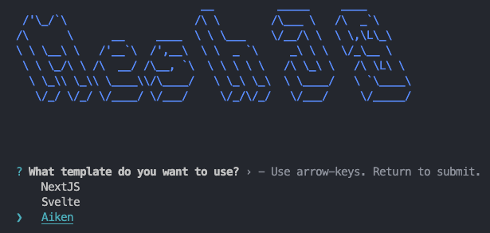
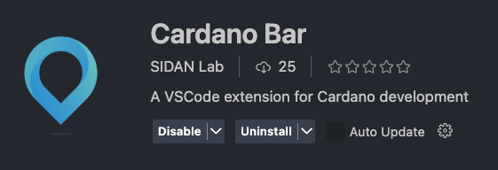
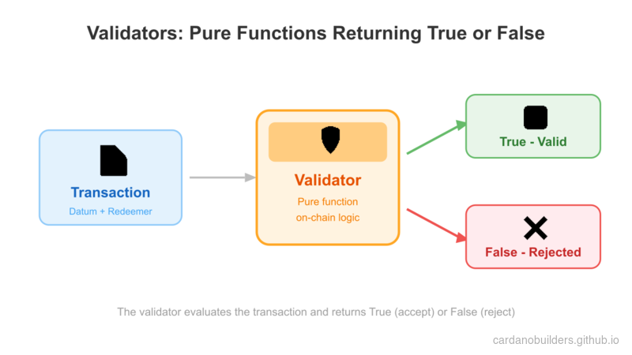
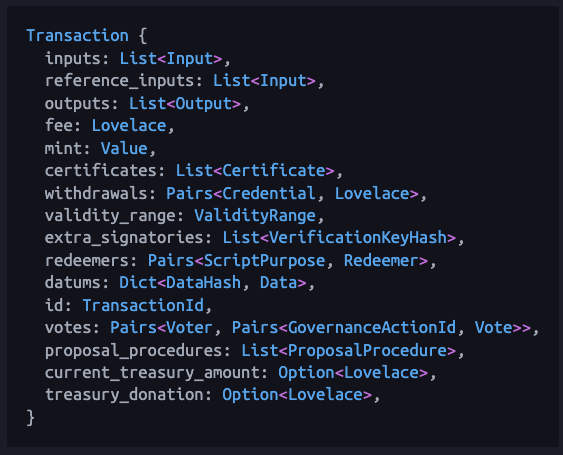
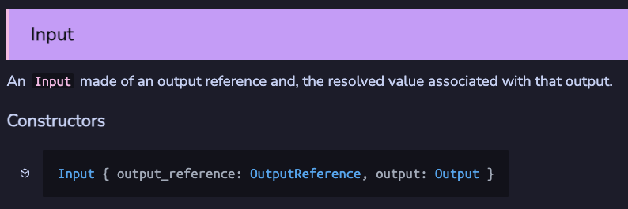
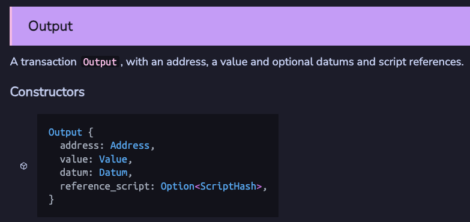
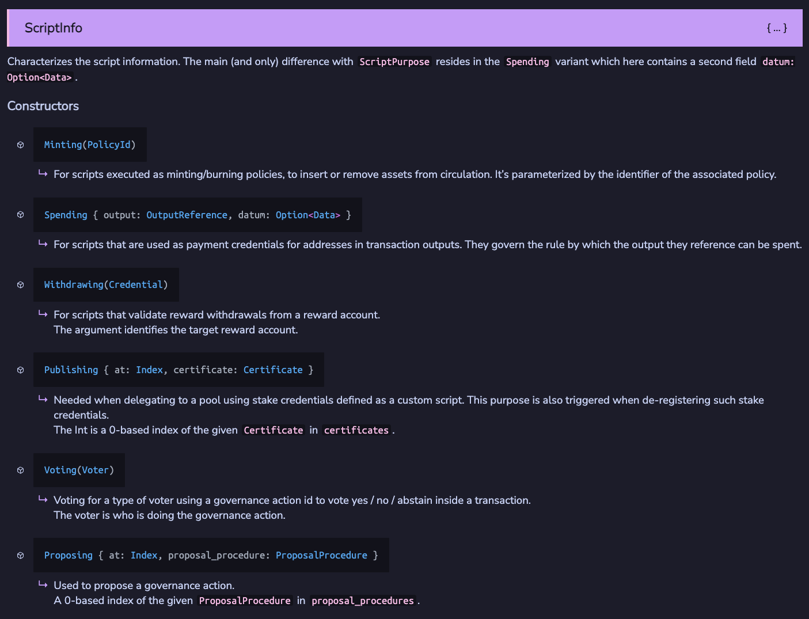
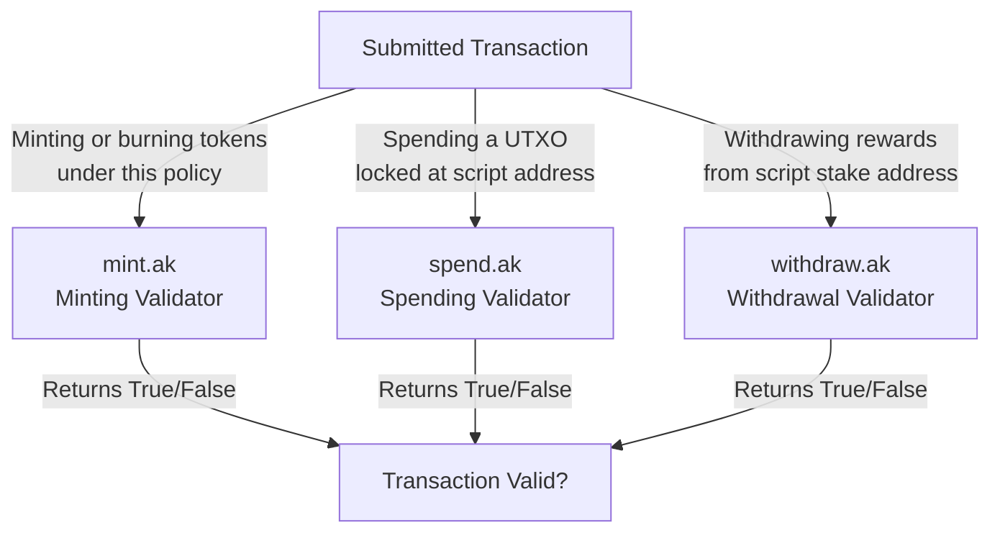

# Lesson #03: Aiken Contracts

Lessons 3 through 6 cover the core concepts of building Aiken smart contracts. Some materials are adapted from [Andamio's AikenPBL](https://app.andamio.io/course/db22e013578fcead6c2fed5446d61891ad31f3cb4955e88d980107e7).

### Overview

- **Hello Cardano Course**: Covers selected key concepts of Aiken smart contract development.
- **AikenPBL**: A complete end-to-end project-based learning course covering essential and foundational concepts.

Aiken smart contract development is a specialized field. To go deeper and pursue a career as a Cardano on-chain developer, we recommend completing both courses.

> Source code: [GitHub](https://github.com/cardano-foundation/developer-portal/tree/staging/bootcamp-codes/03-aiken-contracts)

## System Setup

Install Aiken using one of these guides:

1. [Aiken Official Installation Guide](https://aiken-lang.org/installation-instructions)
2. [Andamio's AikenPBL Setup Guide](https://app.andamio.io/course/db22e013578fcead6c2fed5446d61891ad31f3cb4955e88d980107e7/101/lesson/1)

### Set Up an Empty Aiken Project

Run the following command to create a new Aiken project using Mesh's template:

```bash
npx meshjs 03-aiken-contracts
```

Select the `Aiken` template when prompted.



After installation, a new folder `03-aiken-contracts` will be created with the following structure:

```
03-aiken-contracts
├── aiken-workspace  // Main Aiken project folder used in lessons
└── mesh             // Folder for equivalent Mesh off-chain code (not used in lessons)
```

### Optional: Install Cardano-Bar

If you use VSCode as your IDE, install the [Cardano-Bar](https://marketplace.visualstudio.com/items/?itemName=sidan-lab.cardano-bar-vscode) extension for code snippets to follow the course more easily.



## Understanding Transaction Context



Cardano contracts function differently from smart contracts on other blockchains. They act as validation rules that determine whether a transaction is valid. **Validator** is the more accurate term for Cardano contracts.

Building validators requires understanding how transactions work. Refer to the [Aiken documentation](https://aiken-lang.github.io/stdlib/cardano/transaction.html#Transaction) for the full `Transaction` structure.



### Inputs & Outputs

All Cardano transactions must have inputs and outputs:
- **Inputs**: UTXOs being spent in the transaction.
- **Outputs**: UTXOs being created in the transaction.

See the [Aiken documentation](https://aiken-lang.github.io/stdlib/cardano/transaction.html#Input) for type definitions:




Key concepts:
- An input references an output of a previous transaction, identified by `output_reference`.
- Validators can check:
  - If an input spends from a specific address.
  - If an input spends a specific asset.
  - If an output sends to a specific address.
  - If an output sends a specific asset.
  - If input/output datum contains specific information.

### Reference Inputs

`reference_inputs` in `Transaction` are inputs not spent but referenced in the validator. Useful for reading datum from a UTXO without spending it.

### Mint

`mint` in `Transaction` lists assets being minted or burned. Useful for creating or burning tokens.

### Signatures

`extra_signatories` in `Transaction` lists public key hashes required to sign the transaction. Useful for enforcing specific users to sign.

### Time

`validity_range` in `Transaction` specifies the range of slots the transaction is valid for. Useful for enforcing time locks.

## Types of Scripts

See the [Aiken documentation](https://aiken-lang.github.io/stdlib/cardano/script_context.html#ScriptContext) for script types. The most common:
- **Minting**
- **Spending**
- **Withdrawing**



### Minting Script

Minting script validation triggers when assets are minted or burned under the script's policy.

Example: `/aiken-workspace/validators/mint.ak`:

```rs
use cardano/assets.{PolicyId}
use cardano/transaction.{Transaction, placeholder}

validator always_succeed {
  mint(_redeemer: Data, _policy_id: PolicyId, _tx: Transaction) {
    True
  }

  else(_) {
    fail @"unsupported purpose"
  }
}

test test_always_succeed_minting_policy() {
  let data = Void
  always_succeed.mint(data, #"", placeholder)
}
```

This script compiles into a script with hash `def68337867cb4f1f95b6b811fedbfcdd7780d10a95cc072077088ea`, also called `policy Id`. It validates transactions minting or burning assets under this policy.

#### Parameters

Upgrade the script to allow minting/burning only when signed by a specific key:

```rs
validator minting_policy(owner_vkey: VerificationKeyHash) {
  mint(_redeemer: Data, _policy_id: PolicyId, tx: Transaction) {
    key_signed(tx.extra_signatories, owner_vkey)
  }

  else(_) {
    fail @"unsupported purpose"
  }
}
```

- `owner_vkey`: Public key hash of the owner allowed to mint/burn assets.
- Use `key_signed` from [vodka](https://github.com/sidan-lab/vodka) for validation.

#### Redeemer

Extend the policy to include a redeemer specifying the transaction action (minting or burning):

```rs
pub type MyRedeemer {
  MintToken
  BurnToken
}

validator minting_policy(
  owner_vkey: VerificationKeyHash,
  minting_deadline: Int,
) {
  mint(redeemer: MyRedeemer, policy_id: PolicyId, tx: Transaction) {
    when redeemer is {
      MintToken -> {
        let before_deadline = valid_before(tx.validity_range, minting_deadline)
        let is_owner_signed = key_signed(tx.extra_signatories, owner_vkey)
        before_deadline? && is_owner_signed?
      }
      BurnToken -> check_policy_only_burn(tx.mint, policy_id)
    }
  }

  else(_) {
    fail @"unsupported purpose"
  }
}
```

### Spending Script

Spending script validation triggers when a UTXO at the script address is spent in a transaction.

Example: `/aiken-workspace/validators/spend.ak`:

```rs
pub type Datum {
  oracle_nft: PolicyId,
}

validator hello_world {
  spend(
    datum_opt: Option<Datum>,
    _redeemer: Data,
    _input: OutputReference,
    tx: Transaction,
  ) {
    when datum_opt is {
      Some(datum) ->
        when inputs_with_policy(tx.reference_inputs, datum.oracle_nft) is {
          [_ref_input] -> True
          _ -> False
        }
      None -> False
    }
  }

  else(_) {
    fail @"unsupported purpose"
  }
}
```

#### Datum

- `Datum`: Data attached to UTXOs at script addresses.
- Common design pattern: Use an oracle NFT (state thread token) to ensure UTXO uniqueness.

### Withdrawing Script

Withdrawal script validation triggers when withdrawing from a reward account.

Example: `/aiken-workspace/validators/withdraw.ak`:

```rs
use aiken/crypto.{VerificationKeyHash}
use cardano/address.{Credential, Script}
use cardano/certificate.{Certificate}
use cardano/transaction.{Transaction, placeholder}

validator always_succeed(_key_hash: VerificationKeyHash) {
  withdraw(_redeemer: Data, _credential: Credential, _tx: Transaction) {
    True
  }

  publish(_redeemer: Data, _certificate: Certificate, _tx: Transaction) {
    True
  }

  else(_) {
    fail @"unsupported purpose"
  }
}

test test_always_succeed_withdrawal_policy() {
  let data = Void
  always_succeed.withdraw("", data, Script(#""), placeholder)
}
```

#### Handling Publishing

All withdrawal scripts must be registered on-chain before they can be used. This is done by publishing a registration certificate with the script hash as the stake credential. The publishing of the script is also validated by the `publish` function in the withdrawal script, which is triggered whenever the current withdrawal script is being registered or deregistered.

#### When withdrawal script is used?

Most Cardano users stake and withdraw rewards using a standard payment key. However, Cardano DApps commonly use withdrawal scripts to improve validation efficiency. This technique is covered in [Lesson 5](../05-avoid-redundant-validation).

## Source Code Walkthrough

This section provides a guided tour of the lesson's source code repository, connecting the Aiken concepts above to a project structure you can clone and build locally.

### Project Structure

```
03-aiken-contracts/
├── aiken-workspace/          # Main Aiken project folder (used in this lesson)
│   └── validators/
│       ├── mint.ak           # Minting validator (always succeed + parameterized)
│       ├── spend.ak          # Spending validator (oracle NFT pattern)
│       └── withdraw.ak       # Withdrawal validator (always succeed)
├── mesh/                     # Off-chain code folder (not used in this lesson)
└── package.json
```

**`aiken-workspace/`** contains the on-chain validators -- the code that runs on the Cardano blockchain itself. Think of this as your "backend logic" folder. Each `.ak` file compiles into a Plutus script that the network executes during transaction validation.

**`mesh/`** holds the off-chain TypeScript code that builds and submits transactions. It is the equivalent of a frontend or API client that talks to the validators. This folder is not used in the current lesson but becomes relevant in later lessons when you connect a web application to your contracts.

If you are coming from a web2 background, the split is similar to having a `contracts/` folder for your database constraints and a `client/` folder for your API server.

### Validator Types and Transaction Triggers

The three `.ak` files correspond to the three most common validator types on Cardano. Each type triggers under a different transaction condition:



- **`mint.ak`** runs when a transaction mints or burns tokens under the validator's policy ID. It starts as an "always succeed" policy, then evolves to require an owner signature and a deadline.
- **`spend.ak`** runs when a transaction tries to spend a UTXO sitting at the validator's script address. This example uses the oracle NFT pattern -- it checks that a specific reference input is present before allowing the spend.
- **`withdraw.ak`** runs when a transaction withdraws staking rewards from the validator's reward account. The "always succeed" version here is a scaffold; Lesson 5 shows how withdrawal validators are used for efficient multi-UTXO validation.

### Web2 Equivalents

If you are familiar with building REST APIs or server-side applications, these mappings will help bridge the mental model:

| Cardano Concept | Web2 Equivalent | Explanation |
|---|---|---|
| **Validator** | Route middleware / auth guard | A pure function that returns allow or deny. It does not modify state directly -- it only decides whether the transaction is permitted. |
| **Datum** | Database record / row | Data attached to a UTXO at a script address. When you "lock" funds, you attach a datum the same way you write a row to a table. |
| **Redeemer** | API request body | Data the user provides when they interact with the validator. The validator reads the redeemer to decide which code path to execute (e.g., `MintToken` vs `BurnToken`). |
| **Policy ID** | API key scope / permission set | A unique hash identifying a minting policy. Tokens minted under different policies are distinct, similar to how different API keys grant access to different resources. |
| **Transaction** | HTTP request | The complete bundle of inputs, outputs, signatures, and metadata that a validator inspects -- analogous to the full request object your middleware receives. |

### Key Takeaway

Every Aiken validator is a pure function: it receives transaction context and returns `True` or `False`. There are no side effects, no database writes, no network calls inside the validator. The blockchain runtime handles state changes only if the validator approves. This is fundamentally different from web2 backends where your route handler both validates and mutates state.

## Source code

The source code for this lesson is available on [GitHub](https://github.com/cardano-foundation/developer-portal/tree/staging/bootcamp-codes/03-aiken-contracts).
