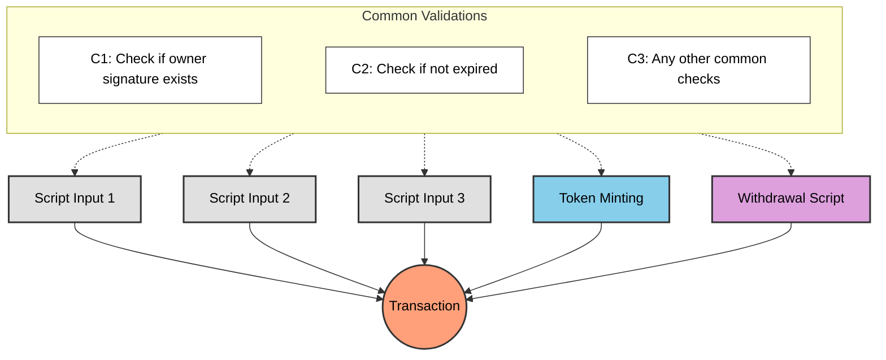
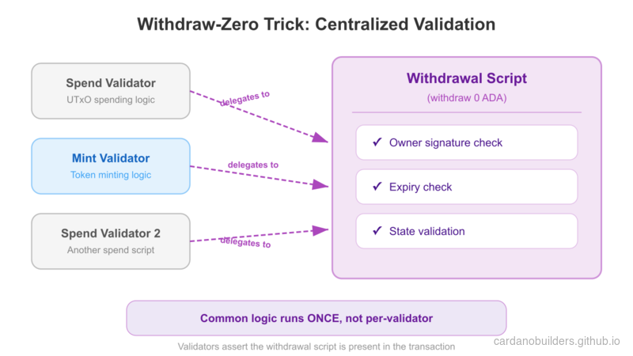
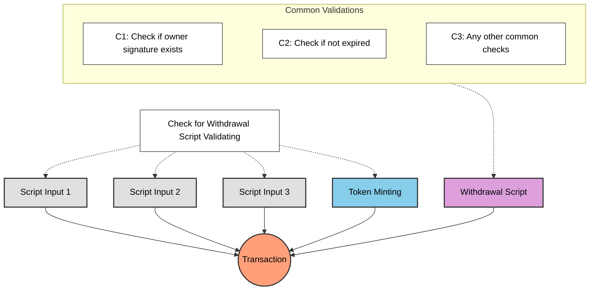
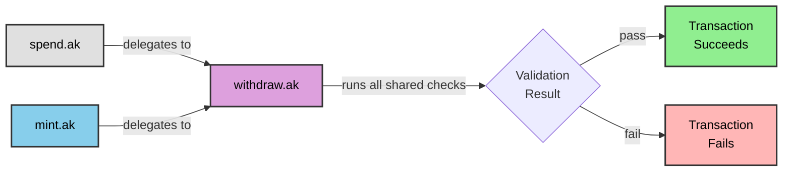

# Lesson #05: Avoid Redundant Validation

A common question from the previous lessons: why use a withdrawal script for minting and state updates instead of validating directly in the spending validator? Every UTXO spent from a spending validator triggers validation, so why not put the logic there?

> Source code: [GitHub](https://github.com/cardano-foundation/developer-portal/tree/staging/bootcamp-codes/05-avoid-redundant-validation)

## A Transaction with Multiple Script Validation

Consider a complex transaction involving multiple script validations: minting tokens, spending multiple script UTXOs, and withdrawing funds. Each action may require its own set of checks.



Enforcing common checks in every script causes redundant validation: the same logic executes multiple times, increasing transaction costs and script size.

## How Can We Do Better?



Centralize common checks in a single script that executes once. All other scripts delegate to it, eliminating duplicate logic while preserving all necessary validations.



The `WithdrawalCheck` script performs common validations once, checking conditions for all other scripts in the transaction.

## Example: Continue from Lesson 4

Assume Lesson 4's withdrawal script contains all common validation logic. Instead of duplicating those checks in spending and minting validators, delegate to the withdrawal script:

### Spending

```rs
use aiken/crypto.{ScriptHash}
use cardano/transaction.{OutputReference, Transaction}
use cocktail.{withdrawal_script_validated}

validator spending_logics_delegated(
  delegated_withdrawal_script_hash: ScriptHash,
) {
  spend(
    _datum_opt: Option<Data>,
    _redeemer: Data,
    _input: OutputReference,
    tx: Transaction,
  ) {
    withdrawal_script_validated(
      tx.withdrawals,
      delegated_withdrawal_script_hash,
    )
  }

  else(_) {
    fail @"unsupported purpose"
  }
}
```

### Minting

```rs
use aiken/crypto.{ScriptHash}
use cardano/assets.{PolicyId}
use cardano/transaction.{Transaction}
use cocktail.{withdrawal_script_validated}

validator minting_logics_delegated(
  delegated_withdrawal_script_hash: ScriptHash,
) {
  mint(_redeemer: Data, _policy_id: PolicyId, tx: Transaction) {
    withdrawal_script_validated(
      tx.withdrawals,
      delegated_withdrawal_script_hash,
    )
  }

  else(_) {
    fail @"unsupported purpose"
  }
}
```

## Why delegate to withdrawal script?

Delegating validation to a withdrawal script is a common Cardano smart contract pattern. While you could delegate to a spending or minting validator instead, withdrawal scripts have a distinct advantage.

### Clean trigger

Spending validation triggers when a UTXO is spent, and minting validation triggers when a token is minted. Both require an actual on-chain action. A withdrawal script, by contrast, can be triggered by withdrawing 0 lovelace (the [`withdraw 0 trick`](https://aiken-lang.org/fundamentals/common-design-patterns#forwarding-validation--other-withdrawal-tricks)). This triggers validation cleanly without affecting the transaction's logic or state.

## Simplified Explanation

### Why Avoid Redundant Validation?
When multiple scripts participate in a transaction, repeating the same checks in each one wastes execution budget and increases fees. Centralizing common checks in one script runs them once.

### How Delegation Works
A withdrawal script acts as the central validator:

- **Spending Validator**: Checks that the withdrawal script is present in the transaction
- **Minting Validator**: Also checks for the withdrawal script
- **Withdrawal Script**: Runs all shared validation logic once

### The Withdraw-Zero Trick
The withdrawal script triggers via the `withdraw 0 trick`: withdrawing 0 lovelace activates validation without affecting transaction state. This approach is widely adopted for its simplicity.

### Key Benefits
- **Efficiency**: Common checks execute once instead of per-script
- **Lower Fees**: Reduced execution budget means lower transaction costs
- **Maintainability**: Validation logic lives in one place

## Source Code Walkthrough

This section walks through the project files so you can see how the delegation pattern is organized in practice. If you are coming from a Web2 background, think of this as examining the middleware architecture of a backend service.

### Project Structure

```
05-avoid-redundant-validation/
├── validators/
│   ├── withdraw.ak    # Shared middleware - all common validation lives here
│   ├── spend.ak       # Spending validator - delegates to withdraw.ak
│   └── mint.ak        # Minting validator - delegates to withdraw.ak
├── aiken.toml         # Project manifest (like package.json)
├── aiken.lock         # Dependency lockfile (like bun.lockb)
└── plutus.json        # Compiled output (like a dist/ build artifact)
```

### Web2 Mental Model

If you have built Express.js or Hono middleware chains, this pattern will feel familiar:

| Cardano Concept | Web2 Equivalent |
|---|---|
| `withdraw.ak` (withdrawal script) | Shared middleware function (e.g., `authMiddleware`) |
| `spend.ak` / `mint.ak` delegating to withdrawal | Route handlers calling `next()` through the middleware chain |
| Withdraw-zero trick | A no-op trigger -- like calling a health-check endpoint solely to activate middleware side effects |
| Centralizing validation in one script | The DRY principle -- write auth checks once, apply everywhere |

In Express terms, instead of copy-pasting authentication checks into every route handler, you extract them into a middleware function and attach it to your router. That is exactly what `withdraw.ak` does for on-chain validation.

### How the Files Work Together



As the diagrams earlier in this lesson illustrate, without delegation every validator would independently repeat the same checks. With delegation, `spend.ak` and `mint.ak` each contain a single guard: "is the withdrawal script present in this transaction?" If yes, they pass. All real validation logic executes once inside `withdraw.ak`.

### `withdraw.ak` -- The Shared Middleware

This is the central validator where all common checks live. It receives the transaction context and validates conditions like owner signatures, expiration, and any other shared business rules. In the diagrams above, this corresponds to the purple "Withdrawal Script" node that receives all the common validation arrows.

### `spend.ak` -- The Spending Delegate

The spending validator's only job is to confirm that `withdraw.ak` is participating in the transaction. It calls `withdrawal_script_validated(tx.withdrawals, delegated_withdrawal_script_hash)` and returns the result. Think of it as a route handler whose entire body is `return authMiddleware(req)`.

### `mint.ak` -- The Minting Delegate

Identical delegation pattern to `spend.ak`, but for minting operations. It checks that the withdrawal script is present and lets the central validator handle the real logic. This means adding new minting rules only requires changes in `withdraw.ak`, not in every minting validator.

### `aiken.toml` and `aiken.lock`

These serve the same role as `package.json` and a lockfile in a Node.js project. `aiken.toml` declares the project name, version, and dependencies (such as the `cocktail` library that provides `withdrawal_script_validated`). `aiken.lock` pins exact dependency versions for reproducible builds.

### `plutus.json`

The compiled output produced by `aiken build`. This JSON file contains the compiled bytecode for all three validators and their type information. Off-chain TypeScript code reads this file to construct transactions. The next lesson covers this file in detail.

## Source code

The source code for this lesson is available on [GitHub](https://github.com/cardano-foundation/developer-portal/tree/staging/bootcamp-codes/05-avoid-redundant-validation).