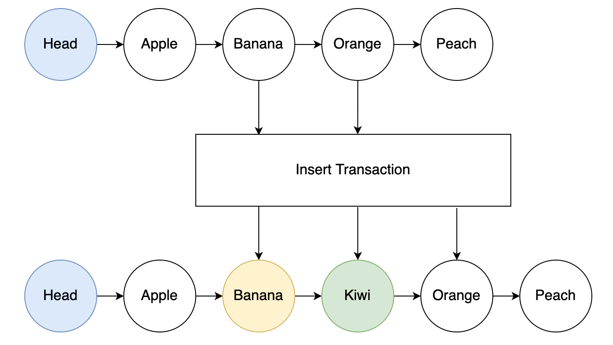

## Introduction

Storing lists in datums is generally impractical, as their growth can lead to unspendable UTxOs due to limited resources available on-chain. A linked list is a construct for storing an infinitely large array of elements on-chain, such that each element is represented with a UTxO that points to its immediate successor.

Linked list structures leverage the EUTXO model to enhance scalability and throughput significantly. By linking multiple UTxOs together through a series of minting policies and validators, they improve the user experience when interacting with smart contracts concurrently.

### Structure

Each element in the list is stored as a separate UTxO containing:

- **NFT**: A unique authentication token identifying the element
- **Datum**: An `Element` containing the element's data and a link (pointer) to the next element


The list distinguishes between two kinds of elements:

- **Root**: The first element of the linked list, holding `root_data`
- **Node**: Any other element, holding `node_data`

Each element's NFT asset name encodes its identity — the root uses a configurable `RootKey`, while nodes use a `NodeKeyPrefix` concatenated with their unique `NodeKey`.

### Insertion



Inserting involves spending an existing anchor element and producing three UTxOs:

- The anchor element, updated to point to the new node
- The new node, pointing to what the anchor previously linked to
- For ordered lists, key ordering is validated automatically

### Removal


Removing a node requires spending both the node and its predecessor (anchor):

- The anchor element is updated to point to what the removed node was pointing to
- The removed node's NFT is burnt

### NFTs as Pointers

NFTs serve as robust and unique pointers within the list. Their uniqueness is ensured by minting policies tied to the list's authentication policy. Each node's NFT asset name is derived from a prefix concatenated with its unique key.

### Key Considerations

- **Efficiency**: On-chain lookups are inefficient; off-chain structures are recommended for indexing
- **Security**: List integrity is maintained through minting policies, datum validation, and NFT authentication
- **No reference scripts**: Elements are required to have no scripts attached to them, keeping the API manageable
- **Address flexibility**: While continued anchor nodes are validated to go to the same address, new/removed nodes only validate that payment credentials match, allowing customization of staking parts

## Aiken Implementation

The API handles all linked list structural validations internally — pointer updates, key ordering, NFT minting/burning, and element authentication. Your contract only needs to provide application-specific validations through callback functions (`additional_validations`).

This is why the API does not expose granular helper functions, and only provides functions that perform primary linked list operations (e.g. `init`, `insert_ascending`, etc.). A good rule of thumb: if a validation is related to the linked list structure itself, the library has already taken care of it.

The implementation uses a Reader monad-style pattern where operations return `Eval` or `RootEval` functions that must be finalized with environment constants (policy ID, root key, node key prefix).

### Key Types

```aiken
/// The datum type for linked list UTxOs. Define your datum as:
/// pub type Datum = linked_list.Element<RootType, NodeType>
pub type Element<root_data, node_data> {
  data: ElementData<root_data, node_data>,
  link: Link,
}

pub type ElementData<root_data, node_data> {
  Root { data: root_data }
  Node { data: node_data }
}

/// Asset name of the root element's NFT (32 bytes max).
/// Keep in mind that some UTF-8 characters occupy more than 1 byte
/// (e.g. the tree emoji 🌳 takes up 4 bytes).
pub type RootKey = AssetName

/// Key for linked list nodes (at least 1 byte, at most
/// (32 - NodeKeyPrefixLength) bytes). Keys should be unique — the
/// recommended approach is to use the hash of an input's output
/// reference. If you need duplicate keys, proceed with extreme
/// caution as linked list integrity can break without other means
/// of preserving it.
pub type NodeKey = ByteArray

/// Bytes prefixing all node NFT asset names. Note that the total
/// bytes allowed for node NFTs is 32 at most, so if your prefix
/// occupies 4 bytes, keys can have 28 bytes at most.
pub type NodeKeyPrefix = ByteArray

/// Length of the NodeKeyPrefix in bytes. Use `const` to leverage
/// Aiken compiler optimizations and avoid computing the length
/// on-chain:
/// const node_key_prefix_length = bytearray.length(node_key_prefix)
pub type NodeKeyPrefixLength = Int

/// Pointer to the next element
pub type Link = Option<NodeKey>

/// Reader monad for operations that validate node key prefixes
pub type Eval =
  fn(PolicyId, RootKey, NodeKeyPrefix, NodeKeyPrefixLength) -> Bool

/// Reader monad for init/deinit (no node key prefix needed)
pub type RootEval =
  fn(PolicyId, RootKey) -> Bool

/// Reader monad with polymorphic return type
pub type ElementEval<a> =
  fn(PolicyId, RootKey, NodeKeyPrefix, NodeKeyPrefixLength) -> a
```

### Initialization and De-initialization

#### `init`

Initialize a linked list by producing a root element UTxO with its authentication NFT.

```aiken
pub fn init(
  nonce_validated: Bool,
  produced_element_output: Output,
  tx_mint: Value,
  root_validator: fn(Lovelace, Data) -> Bool,
) -> RootEval
```

- `nonce_validated`: guardrail confirming nonce validation has been performed
- `produced_element_output`: the output UTxO that will hold the root element
- `tx_mint`: transaction's mint field
- `root_validator`: callback to validate Lovelace count and root data

#### `deinit`

Destroy an empty linked list by spending and burning the root element.

```aiken
pub fn deinit(
  root_input: Input,
  tx_mint: Value,
  root_validator: fn(Lovelace, Data) -> Bool,
) -> RootEval
```

- `root_input`: the spent root element input
- `tx_mint`: transaction's mint field
- `root_validator`: callback to validate Lovelace count and root data

### Element Addition

All addition functions validate NFT minting, pointer updates, address matching, and datum structure. The `additional_validations` callback receives context about the anchor element and the new node for application-specific checks.

#### `insert_ascending`

Insert a node maintaining ascending key order relative to the anchor element.

```aiken
pub fn insert_ascending(
  anchor_element_input: Input,
  continued_anchor_element_output: Output,
  new_element_output: Output,
  tx_mint: Value,
  additional_validations: fn(
    LovelaceChange, Option<NodeKey>, Data,
    Lovelace, NodeKey, NodeData, Link,
  ) -> Bool,
) -> Eval
```

The `additional_validations` callback receives:
1. Change in Lovelace count from anchor input to continued anchor output
2. Anchor element's key (`None` if anchor is root)
3. Underlying data of the anchor element
4. Lovelace count of the new node UTxO
5. Key of the new node
6. Underlying data of the new node
7. Link of the new node

#### `insert_descending`

Identical to `insert_ascending`, but the inserted key is expected to be less than the anchor's and greater than the anchor's link.

```aiken
pub fn insert_descending(
  anchor_element_input: Input,
  continued_anchor_element_output: Output,
  new_element_output: Output,
  tx_mint: Value,
  additional_validations: fn(
    LovelaceChange, Option<NodeKey>, Data,
    Lovelace, NodeKey, NodeData, Link,
  ) -> Bool,
) -> Eval
```

#### `append_unordered`

Append a new element at the end of an unordered list. No key ordering is validated.

```aiken
pub fn append_unordered(
  anchor_element_input: Input,
  continued_anchor_element_output: Output,
  new_element_output: Output,
  tx_mint: Value,
  additional_validations: fn(
    LovelaceChange, Option<NodeKey>, Data,
    Lovelace, NodeKey, NodeData,
  ) -> Bool,
) -> Eval
```

#### `prepend_unordered`

Prepend a new element at the start of an unordered list. The anchor must be the root element.

```aiken
pub fn prepend_unordered(
  root_element_input: Input,
  continued_root_element_output: Output,
  new_element_output: Output,
  tx_mint: Value,
  additional_validations: fn(
    LovelaceChange, RootData,
    Lovelace, NodeKey, NodeData, Link,
  ) -> Bool,
) -> Eval
```

### Element Removal

#### `remove`

Remove a node from the list. Expects two spent UTxOs: the node being removed and its anchor (predecessor) element.

```aiken
pub fn remove(
  anchor_element_input: Input,
  removing_node_input: Input,
  continued_anchor_element_output: Output,
  tx_mint: Value,
  additional_validations: fn(
    LovelaceChange, Option<NodeKey>, Data,
    Lovelace, NodeKey, NodeData, Link,
  ) -> Bool,
) -> Eval
```

The `additional_validations` callback receives the same values as `insert_ascending`, but the `NodeKey` and `NodeData` refer to the node being removed.

### Fold Operations

#### `fold_from_root`

Spend a root element and its linked node, reproduce the root while burning the node's NFT. Useful for accumulating data from nodes back into the root.

```aiken
pub fn fold_from_root(
  anchor_root_input: Input,
  folding_node_input: Input,
  continued_anchor_root_output: Output,
  tx_mint: Value,
  additional_validations: fn(
    LovelaceChange, RootData,
    Lovelace, NodeKey, NodeData, Link, RootData,
  ) -> Bool,
) -> Eval
```

The `additional_validations` callback receives:
1. Change in Lovelace count from input root to output
2. Underlying data of the input root
3. Lovelace count of the folding node
4. Key of the folding node
5. Underlying data of the folding node
6. Link of the folding node
7. Underlying data of the reproduced root

### Data Updates

#### `spend_for_updating_elements_data`

Update an element's data without affecting the linked list structure. Uses the [UTxO Indexers](../utxo-indexers) pattern for one-to-one input/output mapping.

```aiken
pub fn spend_for_updating_elements_data(
  element_input_index: Int,
  continued_element_output_index: Int,
  element_input_outref: OutputReference,
  inputs: List<Input>,
  outputs: List<Output>,
  tx_mint: Value,
  additional_validations: fn(LovelaceChange, Option<NodeKey>, Data, Data) ->
    Bool,
) -> Eval
```

The `additional_validations` callback receives:
1. Change in Lovelace count from input to output
2. Possible node key (`None` if element is root)
3. Input underlying data
4. Updated data in the reproduced element

### Helpers

#### `spend_for_adding_or_removing_an_element`

Checks if any tokens are being minted or burnt under the linked list's policy. Used in spending validators to gate structural operations.

```aiken
pub fn spend_for_adding_or_removing_an_element(
  list_nft_policy_id: PolicyId,
  tx_mint: Value,
) -> Bool
```

#### `get_element_info`

Extract validated element information from a UTxO. Useful when another script needs to validate expenditure from the linked list.

```aiken
pub fn get_element_info(
  element_utxo: Output,
  info_validations: fn(Lovelace, Option<NodeKey>, Data, Link) -> a,
) -> ElementEval<a>
```

The continuation receives:
1. Lovelace count
2. Possible node key (`None` if root)
3. Underlying data
4. Element's link

### Finalization

Operations return `Eval` or `RootEval` values that must be finalized with environment constants. Define a helper like this:

```aiken
use aiken_design_patterns/linked_list

const node_key_prefix = "NODE"

const node_key_prefix_length =
  bytearray.length(node_key_prefix)

pub fn finalize_linked_list(
  eval: linked_list.Eval,
  list_nft_policy_id: PolicyId,
  root_key: RootKey,
) -> Bool {
  linked_list.run_eval_with(
    eval,
    list_nft_policy_id,
    root_key,
    node_key_prefix,
    node_key_prefix_length,
  )
}
```

Then use it in your minting contract:

```aiken
let linked_list_eval = insert_ascending(...)

expect linked_list_eval |> finalize_linked_list(own_policy_id, root_key)
```

The three finalization functions:

```aiken
/// Finalize an Eval with all environment constants
pub fn run_eval_with(
  reader: Eval,
  list_nft_policy_id: PolicyId,
  root_key: RootKey,
  node_key_prefix: NodeKeyPrefix,
  node_key_prefix_length: NodeKeyPrefixLength,
) -> Bool

/// Finalize a RootEval (for init/deinit)
pub fn run_root_with(
  reader: RootEval,
  list_nft_policy_id: PolicyId,
  root_key: RootKey,
) -> Bool

/// Finalize an ElementEval with polymorphic return type
pub fn run_element_with(
  reader: ElementEval<a>,
  list_nft_policy_id: PolicyId,
  root_key: RootKey,
  node_key_prefix: NodeKeyPrefix,
  node_key_prefix_length: NodeKeyPrefixLength,
) -> a
```

## Example Code

Library implementation: [linked_list module](https://github.com/Anastasia-Labs/aiken-design-patterns/blob/main/lib/aiken-design-patterns/linked-list.ak)

Test suite: [linked_list tests](https://github.com/Anastasia-Labs/aiken-design-patterns/blob/main/lib/tests/linked-list.ak)

## Acknowledgments

This documentation and the linked list implementation draw inspiration from original ideas presented in the Plutonomicon. For further details on the foundational concepts, see the [Plutonomicon's Associative Data Structures Overview](https://github.com/Plutonomicon/plutonomicon/blob/main/assoc.md#overview).
