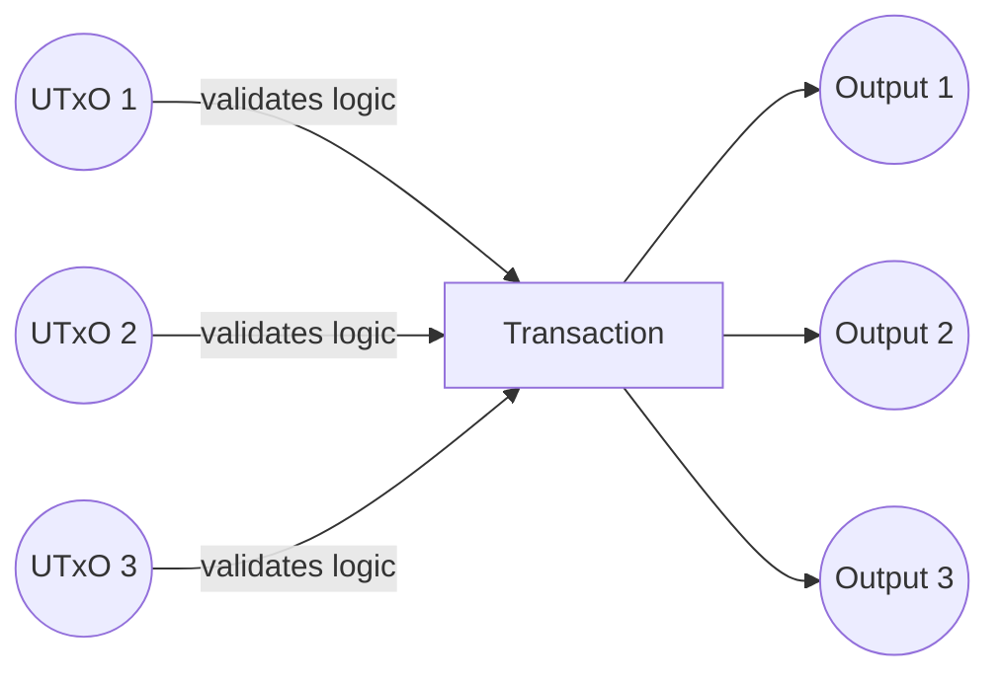
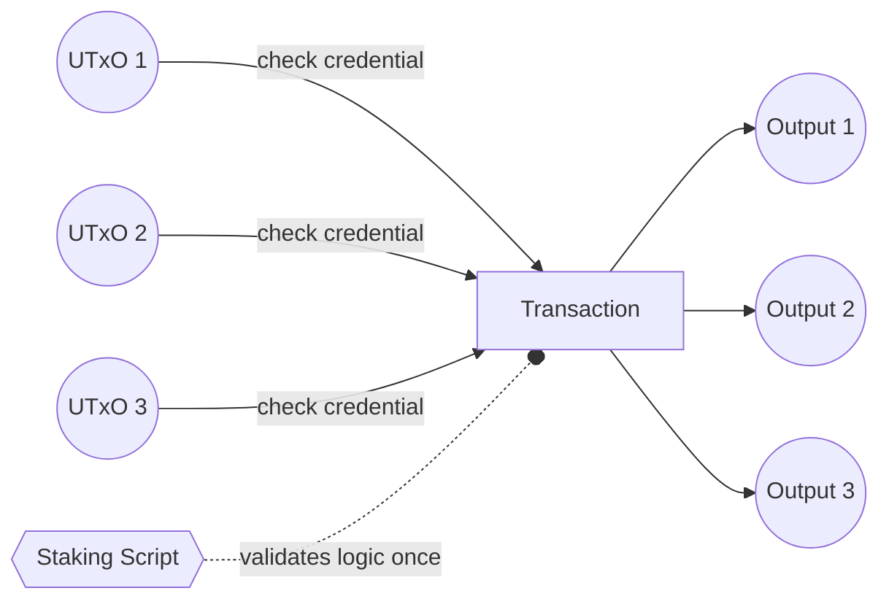

## Overview

The Stake Validator pattern allows you to delegate validation logic to a staking script, significantly reducing script execution costs when processing multiple UTxOs. This is achieved through the "withdraw zero trick" - where spending validators simply check for the presence of a staking credential withdrawal, and the staking validator performs the actual business logic validation once per transaction.

## The Problem

When multiple UTxOs from the same script are spent in a transaction, the validator logic runs for each UTxO. This quickly becomes expensive:



## The Solution

Move heavy validation logic to a staking validator that runs once per transaction. Spending validators only check that the staking credential is present:



## Aiken Implementation

This pattern allows for delegating some computations to a given staking script. The primary application for this is the so-called "withdraw zero trick," which is most effective for validators that need to go over multiple inputs.

With a minimal spending logic (which is executed for each UTxO), and an arbitrary withdrawal logic (which is executed only once), a much more optimized script can be implemented.

The module offers three functions, primarily meant to be implemented under spending endpoints:
- `validate_withdraw`
- `validate_withdraw_with_amount`
- `validate_withdraw_minimal`

Use `validate_withdraw_minimal` if you don't need to perform any validations on either the staking script's redeemer or withdrawal Lovelace quantity.

All three functions go over the `withdrawals` list in the transaction. However, `validate_withdraw` and `validate_withdraw_with_amount` also traverse the `redeemers` field in order to let you validate against the redeemer (and the withdrawal quantity in case of the latter).

### Example

The following example shows a spending validator that uses `validate_withdraw_with_amount` to delegate to a staking script, and a minimal accompanying withdrawal script:

```aiken
use aiken/crypto.{ScriptHash}
use aiken_design_patterns/stake_validator
use cardano/address.{Credential}
use cardano/transaction.{OutputReference, Transaction}

pub type ExampleSpendRedeemer {
  withdraw_redeemer_index: Int,
  withdrawal_index: Int,
}

/// Example for a validator that requires a withdrawal from a given staking
/// script hash.
validator spend(withdraw_script_hash: ScriptHash) {
  spend(
    _datum,
    redeemer: ExampleSpendRedeemer,
    own_out_ref: OutputReference,
    tx: Transaction,
  ) {
    // Extract needed values from `tx`
    let Transaction { withdrawals, redeemers, .. } = tx

    // Validate the required staking script is present in transaction, and grab
    // its redeemer data and withdraw quantity in Lovelace.
    let
      redeemer_data,
      withdraw_amount,
    <-
      stake_validator.validate_withdraw_with_amount(
        withdraw_script_hash: withdraw_script_hash,
        redeemers: redeemers,
        withdraw_redeemer_index: redeemer.withdraw_redeemer_index,
        withdrawals: withdrawals,
        withdrawal_index: redeemer.withdrawal_index,
      )

    // Example validation, ensuring the staking script has been invoked with
    // access to the output reference of the UTxO being spent.
    expect out_ref_passed_to_staking_script: OutputReference = redeemer_data
    expect out_ref_passed_to_staking_script == own_out_ref

    // Another example validation, only allowing withdrawals from the staking
    // script as long as no rewards had been accumulated for said script.
    withdraw_amount == 0
  }

  else(_) {
    fail
  }
}

/// A very minimal example just to show how an accompanying staking script can
/// be defined.
validator witdhraw {
  withdraw(
    redeemer: OutputReference,
    _own_credential: Credential,
    _tx: Transaction,
  ) {
    let OutputReference { output_index, .. } = redeemer
    // A contrived check. Only UTxOs that have an output index of 0 pass this
    // script's validation.
    output_index == 0
  }

  else(_) {
    fail
  }
}
```

## Key Functions

The library provides three functions, all meant to be used in spending endpoints:

### `validate_withdraw`

Helper function for implementing validation for spending UTxOs, essentially delegating their requirements to the given withdrawal validator.

In simpler terms, it says: As long as there is a redeemer with a withdrawal purpose, for the given script in transaction, this UTxO can be spent.

Allows you to validate based on the withdrawal's redeemer, which is mostly useful for ensuring specific endpoints are invoked.

```aiken
pub fn validate_withdraw(
  withdraw_script_hash: ScriptHash,
  redeemers: Pairs<ScriptPurpose, Redeemer>,
  withdraw_redeemer_index: Int,
  withdraw_redeemer_validator: fn(Redeemer) -> Bool,
) -> Bool
```

### `validate_withdraw_with_amount`

Similar to `validate_withdraw`, but with the additional steps for extracting the withdrawal amount from the `withdrawals` field:

```aiken
pub fn validate_withdraw_with_amount(
  withdraw_script_hash: ScriptHash,
  redeemers: Pairs<ScriptPurpose, Redeemer>,
  withdraw_redeemer_index: Int,
  withdrawals: Pairs<Credential, Lovelace>,
  withdrawal_index: Int,
  withdraw_redeemer_validator: fn(Redeemer, Lovelace) -> Bool,
) -> Bool
```

### `validate_withdraw_minimal`

A more minimal version of `validate_withdraw`, where only the presence of a given staking script is checked, regardless of withdraw amount or redeemer:

```aiken
pub fn validate_withdraw_minimal(
  withdraw_script_hash: ScriptHash,
  withdrawals: Pairs<Credential, Lovelace>,
  withdrawal_index: Int,
) -> Bool
```

## Why "Withdraw Zero"?

The pattern is called "withdraw zero trick" because you can withdraw 0 lovelace from the staking credential to trigger the staking validator - the withdrawal amount is irrelevant to the validation logic.

## Double Satisfaction Protection

When using this pattern with multiple inputs/outputs, protect against [double satisfaction attacks](../../security/vulnerabilities/double-satisfaction) by:

1. **Tagging outputs** - Include input OutRef in output datums
2. **Unique indexing** - Use redeemer indices to pair inputs with outputs
3. **Filtering inputs** - Validate only inputs from your script address

See [UTxO Indexers](../utxo-indexers) for robust input/output pairing patterns.

## Example Code

Full working example: [stake-validator.ak](https://github.com/Anastasia-Labs/aiken-design-patterns/blob/main/validators/examples/stake-validator.ak)

Library implementation: [stake_validator module](https://github.com/Anastasia-Labs/aiken-design-patterns/blob/main/lib/aiken-design-patterns/stake-validator.ak)

## When to Use

**Use stake validators when:**

- Processing multiple UTxOs in single transactions
- Validation logic is expensive (CPU/memory)
- You need transaction-level validation rather than per-UTxO validation
