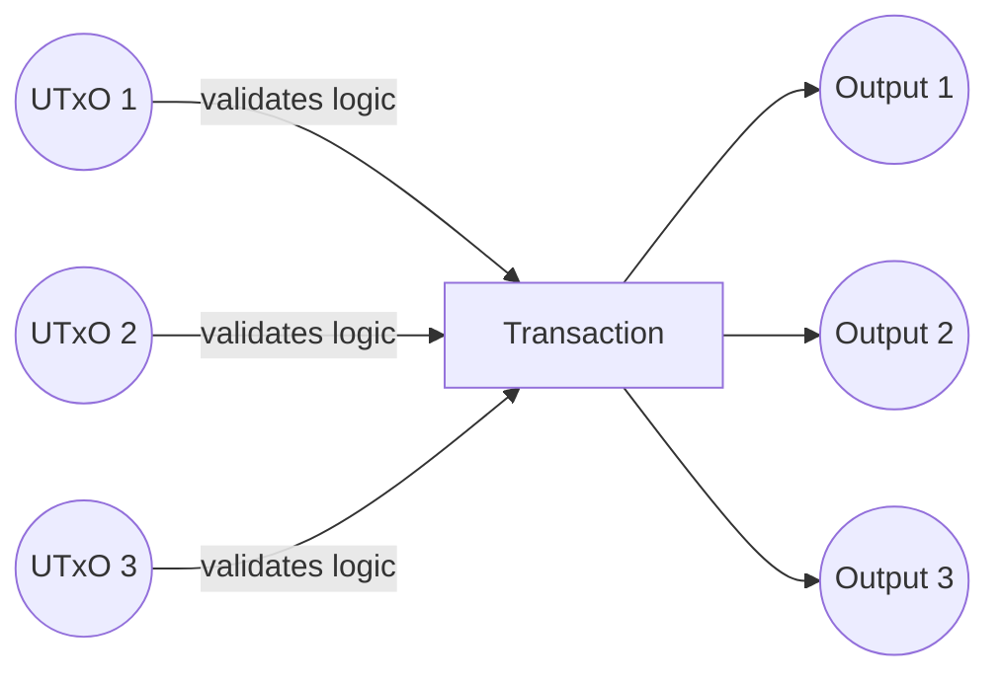
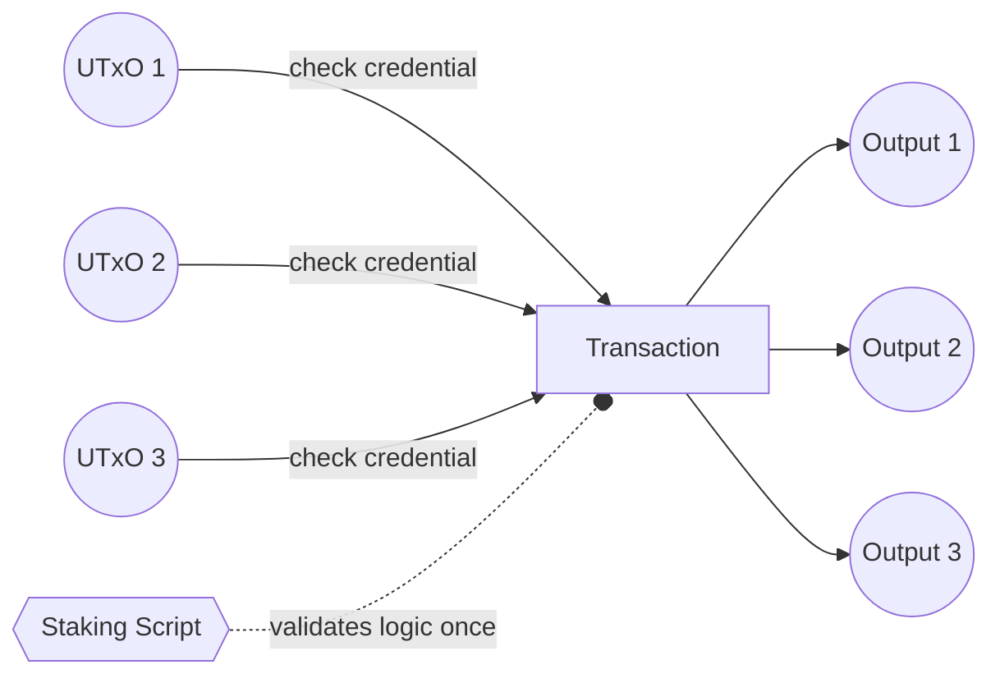

## Overview

The Stake Validator pattern allows you to delegate validation logic to a staking script, significantly reducing script execution costs when processing multiple UTxOs. This is achieved through the "withdraw zero trick" - where spending validators simply check for the presence of a staking credential withdrawal, and the staking validator performs the actual business logic validation once per transaction.

## The Problem

When multiple UTxOs from the same script are spent in a transaction, the validator logic runs for each UTxO. This quickly becomes expensive:



## The Solution

Move heavy validation logic to a staking validator that runs once per transaction. Spending validators only check that the staking credential is present:



## Aiken Implementation

### Spending Validator (Minimal Check)

```rust
use aiken_design_patterns/stake_validator

validator my_spending_validator {
  spend(
    _datum: Option<Datum>,
    _redeemer: Redeemer,
    _own_ref: OutputReference,
    tx: Transaction,
  ) {
    // Minimal validation: just check the staking credential is present
    stake_validator.spend_minimal(withdraw_script_hash, tx)
  }
}
```

### Spending Validator (With Redeemer Validation)

```rust
use aiken_design_patterns/stake_validator

validator my_spending_validator {
  spend(
    _datum: Option<Datum>,
    _redeemer: Redeemer,
    _own_ref: OutputReference,
    tx: Transaction,
  ) {
    // Validate both the withdrawal redeemer and amount
    stake_validator.spend(
      withdraw_script_hash,
      fn(redeemer, amount) {
        // Custom validation logic here
        validate_redeemer(redeemer) && amount >= 0
      },
      tx,
    )
  }
}
```

### Staking Validator (Business Logic)

```rust
use aiken_design_patterns/stake_validator

validator my_staking_validator {
  withdraw(
    redeemer: MyRedeemer,
    stake_cred: Credential,
    tx: Transaction,
  ) {
    stake_validator.withdraw(
      fn(rdmr, script_hash, transaction) {
        // All your business logic goes here
        // This runs once per transaction, not per UTxO
        validate_business_logic(rdmr, script_hash, transaction)
      },
      redeemer,
      stake_cred,
      tx,
    )
  }
}
```

## Key Functions

The library provides three main functions:

### `spend_minimal`

Most efficient option - only checks if the withdrawal credential exists:

```rust
pub fn spend_minimal(withdraw_script_hash: ScriptHash, tx: Transaction) -> Bool
```

### `spend`

Allows validation of withdrawal redeemer and amount:

```rust
pub fn spend(
  withdraw_script_hash: ScriptHash,
  withdraw_redeemer_validator: fn(Redeemer, Lovelace) -> Bool,
  tx: Transaction,
) -> Bool
```

### `withdraw`

Helper for staking validator implementation:

```rust
pub fn withdraw(
  withdrawal_logic: fn(a, ScriptHash, Transaction) -> Bool,
  redeemer: a,
  stake_cred: Credential,
  tx: Transaction,
) -> Bool
```

## Script Address Construction

When using this pattern, your script address includes both payment and staking credentials:

```rust
// Address composed of spending and staking validators
Address {
  payment_credential: ScriptCredential(spending_validator_hash),
  stake_credential: Some(Inline(ScriptCredential(staking_validator_hash)))
}
```

## Why "Withdraw Zero"?

The pattern is called "withdraw zero trick" because you can withdraw 0 lovelace from the staking credential to trigger the staking validator - the withdrawal amount is irrelevant to the validation logic.

## Double Satisfaction Protection

When using this pattern with multiple inputs/outputs, protect against [double satisfaction attacks](../security/vulnerabilities/double-satisfaction) by:

1. **Tagging outputs** - Include input OutRef in output datums
2. **Unique indexing** - Use redeemer indices to pair inputs with outputs
3. **Filtering inputs** - Validate only inputs from your script address

See [UTxO Indexers](utxo-indexers) for robust input/output pairing patterns.

## Example Code

Full working example: [stake-validator.ak](https://github.com/Anastasia-Labs/aiken-design-patterns/blob/main/validators/examples/stake-validator.ak)

Library implementation: [stake_validator module](https://github.com/Anastasia-Labs/aiken-design-patterns/blob/main/lib/aiken-design-patterns/stake-validator.ak)

## When to Use

**Use stake validators when:**

- Processing multiple UTxOs in single transactions
- Validation logic is expensive (CPU/memory)
- You need transaction-level validation rather than per-UTxO validation