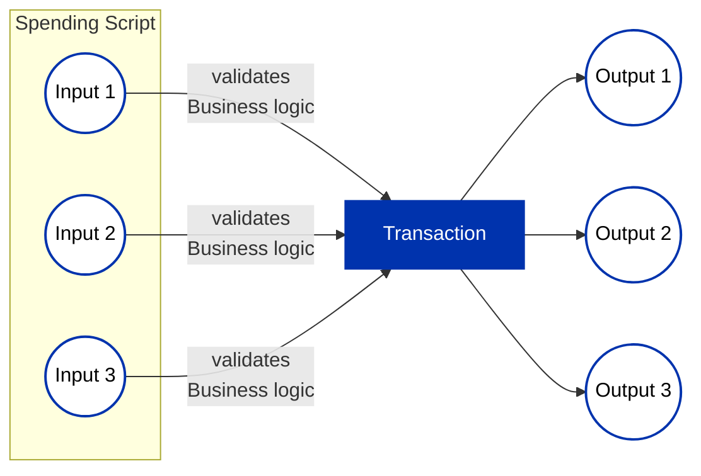
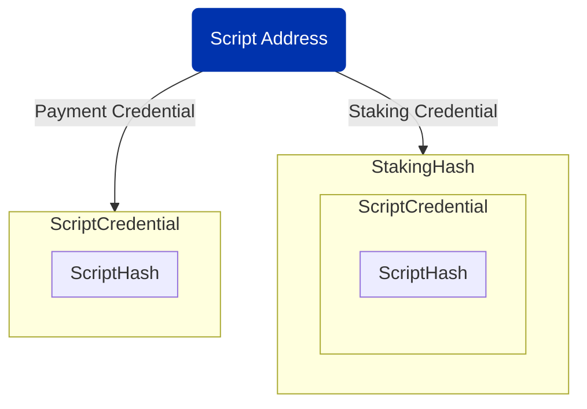
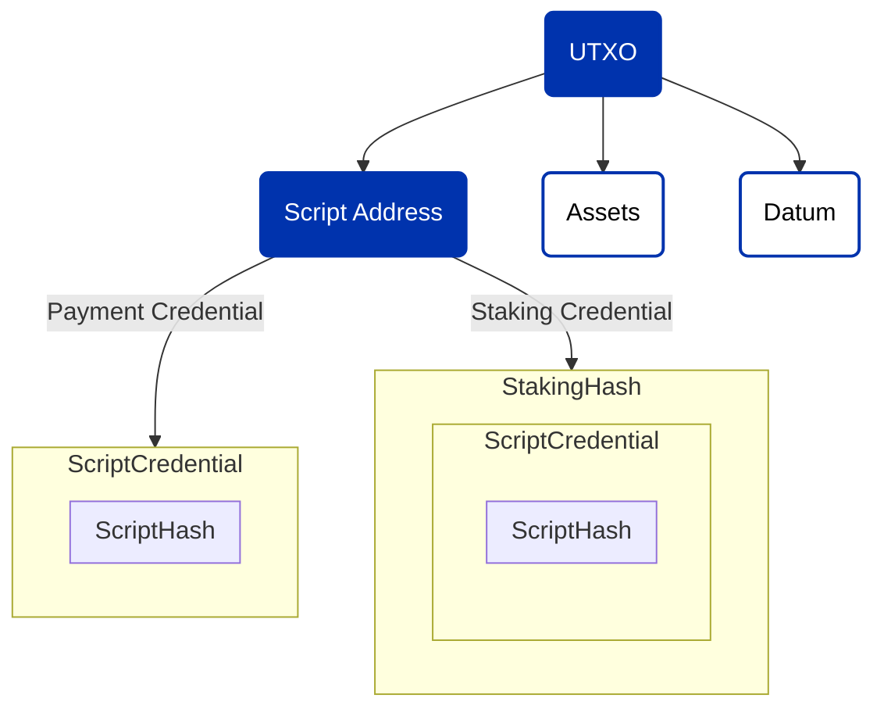
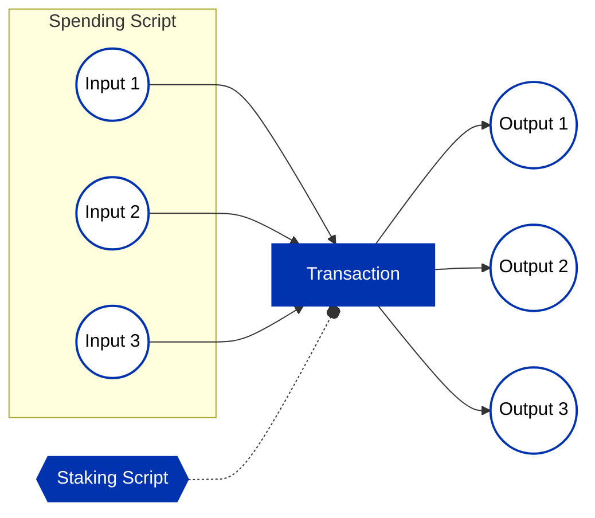
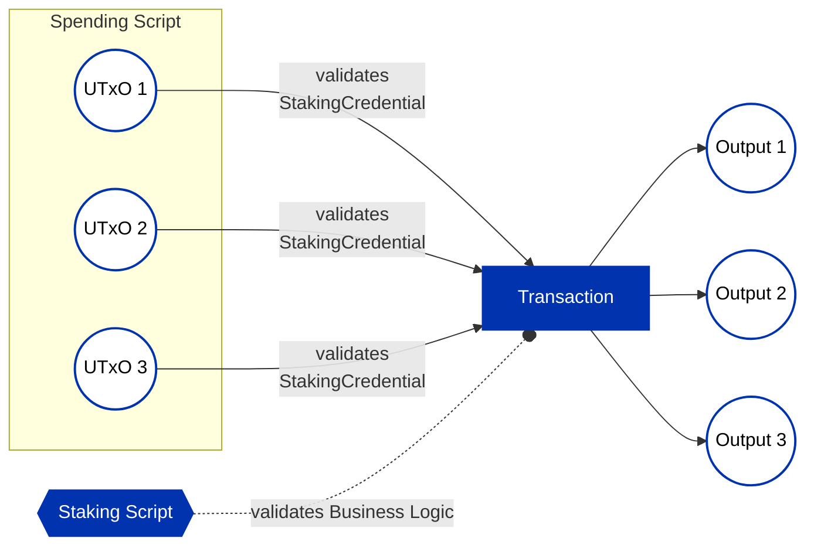

## Table of Contents

- [Table of Contents](#table-of-contents)
  - [How to use this document](#how-to-use-this-document)
  - [Introduction](#introduction)
  - [Why Staking Validators?](#why-staking-validators)
  - [What are the main features of the Staking Account?](#what-are-the-main-features-of-the-staking-account)
    - [The Cardano Model Demystified](#the-cardano-model-demystified)
    - [What are the components of an Address?](#what-are-the-components-of-an-address)
    - [What are the component of a Script Address?](#what-are-the-component-of-a-script-address)
      - [Constructing the Script address](#constructing-the-script-address)
  - [Let's dive into the implementation](#lets-dive-into-the-implementation)
  - [Create a simple Spending Validator](#create-a-simple-spending-validator)
  - [Validating the business logic at Staking Validator](#validating-the-business-logic-at-staking-validator)
    - [Protect against Double Satisfaction exploit](#protect-against-double-satisfaction-exploit)

## How to use this document

The documentation is organized sequentially, starting with basics and progressing to advanced topics for
building your smart contract application.
You can read it in any order or directly access pages relevant to your use case.
A table of contents on the top facilitates easy navigation between sections.

> It is important to note that all types and functions will be exclusively defined in PlutusTx.
This approach aims to establish a common foundation, especially in the context of the growing variety of languages such as Plutarch, Aiken, etc.

## Introduction

In this comprehensive guide, you will discover how to strategically implement the Staking Validator design pattern to enhance your protocol's performance and introduce composability by employing the innovative "withdraw zero trick."

## Why Staking Validators?

Consider a scenario as described in the illustration below, with multiple UTXOs at a `Spending Validator`; if your entire protocol logic resides within it, the logic has to run for each UTXO, quickly reaching transaction limits and increasing CPU and memory usage.



The solution involves the `Spending Validator` checking that the `Staking validator` is called in the same transaction, consolidating the logic to run once at the `Staking Validator`. This significantly reduces script size and simplifies business logic.

`Staking Validators` play a crucial role, not only in adding logic to stake control but also in minimizing script size and optimizing CPU and memory usage.
It's essential to note that staking validators aren't a one-size-fits-all solution; careful evaluation is needed to determine if this design pattern aligns with your specific purpose.

## What are the main features of the Staking Account?

The Staking Account offers to users the ability to:

- Receive Staking Rewards: Users can earn rewards every epoch through the staking of their ADA holdings.
- Withdraw Staking Rewards: Allows users to withdraw their rewards accumulated through staking.
- Register Staking Credential
- Deregister Staking Credential
- Delegate to a Stake Pool

To comprehend the essence of the Staking Account, it is imperative to grasp the two foundational models within Cardano.

### The Cardano Model Demystified

Cardano operates on two primary models:

- The Extended Unspent Transaction Output (EUTXO) model:
  - Each unspent output is linked to a specific address.
  - The spending of this input is controlled by a payment credential or a script credential
- The Accounting model (Staking):
  - Each utxo can be associated with an address containing an optional staking credential
  - Staking credential owners have control over delegation and possess the capability to withdraw rewards.

### What are the components of an Address?

Cardano address consists of two crucial components.

- Payment Credential
  - Controls the spending of the UTXO associated with the payment credential address.
- Staking Credential
  - Controls the registration, de-registration, delegation, and withdrawal of rewards

Let's explore the representation of an address type in Plutus:

Constructing an Address involves specifying the Credential and optionally the StakingCredential

```rust
data Address = 
  Address 
  { addressCredential :: Credential
  , addressStakingCredential :: Maybe StakingCredential 
  }
```

> Note: While it is possible to construct addresses without a staking credential, this document will not delve into that aspect.

### What are the component of a Script Address?

Addresses are not only used in wallet, but also in smart contracts, often referred to as scripts.

For the purpose of this article we are going to create an Script Address by hashing the Spending Validator and the Staking Validator.

#### Constructing the Script address

In the below code we can see that our address is composed of the Spending Validator and Staking Validator

```rust
scriptAddress = 
  Address 
    (ScriptCredential $ ScriptHash "SpendingValidatorHash") 
    (Just $ StakingHash $ ScriptCredential $ ScriptHash "StakingValidatorHash")
```



Once you have the script address and following your business logic, now you can lock assets along with datums into the Script Address, therefore associating the new EUTXO and the Script Address with both components `Payment Credential` and `Staking Credential`



## Let's dive into the implementation

The strategy involves enforcing the spending validator to require invocation of staking validator, upon each attempted expenditure of the script input.
Following this, the staking validator assumes the responsibility of validating each spending script input to ensure strict adherence to the protocol specifications.



From the transaction we are going to specifically focus on the `ScriptContext`
This shared context is accessible to all validators within the transaction, enabling the enforcement of certain conditions, such as the presence of the `Staking Validator`.

Specifically, every `Spending Validator` is mandated to verify the existence of the `Staking Validator` within the transaction.

Consider the definition of the `ScriptContext` data type:

```haskell
data ScriptContext = 
  ScriptContext 
    { scriptContextTxInfo :: TxInfo
    , scriptContextPurpose :: ScriptPurpose 
    }
```

Within the `TxInfo` type, note the importance of the `txInfoWdrl :: Map StakingCredential Integer` field.

This field encapsulates a Map where each `StakingCredential` serves as a key, paired with its corresponding withdrawal amount as the associated value.
> Note: The `txInfoWdrl` contains all the staking credentials attempting to withdraw rewards from their staking accounts. Also keep in mind that the Map type in Plutus Core is implemented as a list of builtin pairs [^1].

[^1]: [https://github.com/input-output-hk/plutus/blob/d6382618ae38ce75cdef432e4974809ec466456e/plutus-tx/src/PlutusTx/Builtins/Internal.hs#L473-L476]

```rust
data TxInfo = TxInfo
    { txInfoInputs          :: [TxInInfo] -- ^ Transaction inputs
    , txInfoReferenceInputs :: [TxInInfo] -- ^ Transaction reference inputs
    , txInfoOutputs         :: [TxOut] -- ^ Transaction outputs
    , txInfoFee             :: Value -- ^ The fee paid by this transaction.
    , txInfoMint            :: Value -- ^ The 'Value' minted by this transaction.
    , txInfoDCert           :: [DCert] -- ^ Digests of certificates included in this transaction
    , txInfoWdrl            :: Map StakingCredential Integer -- ^ Withdrawals
    , txInfoValidRange      :: POSIXTimeRange -- ^ The valid range for the transaction.
    , txInfoSignatories     :: [PubKeyHash] -- ^ Signatures provided with the transaction, attested that they all signed the tx
    , txInfoRedeemers       :: Map ScriptPurpose Redeemer
    , txInfoData            :: Map DatumHash Datum
    , txInfoId              :: TxId -- ^ Hash of the pending transaction (excluding witnesses)
    }
```

## Create a simple Spending Validator

To implement this validation requirement, a parameterized `Spending Validator` is created as follows:

```rust
mkValidator :: StakingCredential -> Datum -> Redeemer -> ScriptContext -> Bool
mkValidator stakingCred _datum _redeemer context =
  case PlutusTx.AssocMap.lookup stakingCred $ txInfoWdrl txinfo of
    Just _ -> True
    Nothing -> PlutusTx.Prelude.error ()
  where
    txinfo = scriptContextTxInfo context
```

The `Spending Validator` utilizes the lookup function to verify the presence of `StakingCredential` of the required `Staking Validator` in `txInfoWdrl` field of `TxInfo`. This enforces invocation of the `Staking Validator`. If this lookup fails, spending of the corresponding UTXO will result in failure.

It's important to highlight that this approach is often referred to as the `withdraw zero trick`, but it does not enforce the user to withdraw a specific amount, therefore the logic remains independent of the withdrawal amount

> Note: Please be aware that this validator serves only as a reference. There might be instances where your protocol does not necessarily require the staking validator to be present. This is particularly applicable in situations where, for example, you aim to facilitate a user's withdrawal of assets from the spending script. In such cases, the primary validation is ensuring that the user is appropriately signing the transaction.

## Validating the business logic at Staking Validator

As illustrated below, the spending script performs validation by ensuring the presence of the staking credential corresponding to the staking validator within the transaction.
The staking validator, in turn, is responsible for executing the protocol's business logic, which may vary based on the specific use case.



However it is a must to consider key components to ensure the efficiency and that there are no exploits in your protocol.

### Protect against Double Satisfaction exploit

In scenarios where the protocol necessitates spending from the script back to a specific output—such as returning funds from the script to the same script, directing them to another script, or transferring assets to a wallet, it is imperative to ensure that each script input is uniquely associated with an output. This preventive measure is essential for mitigating the risk of [Double Satisfaction Attack](https://plutus.readthedocs.io/en/latest/reference/writing-scripts/common-weaknesses/double-satisfaction.html?highlight=double#unique-outputs).

We have outlined some patterns

1. Unique output datum tagging

The simplest implementation to ensure the uniqueness of the script outputs is by tagging the serialized input script outref at the output datum level.
This prevents that the outputs remain distinct.
>Note: This tagging validation should be done at the spending validator.

2. Folding inputs

Consider taking all the inputs list and making sure each input in unique by folding the list and removing the element use,also within this fold function you must introduce your business logic.The drawback of using this folding pattern is that you input list must be return in the recursion of the computation, increasing the execution of your script.

3. Filter inputs using multi-validator

Another consideration involves filtering all inputs associated with the same spending script hash. This approach necessitates the parametrization of the staking validator with the spending script hash.
When implementing this filtering mechanism, the staking validator requires the spending script hash as a parameter. Since the spending script inherently depends on the staking credential, introducing the spending script hash into the staking validator may not be possible due to the unidirectional dependency nature of the scripts.
One potential solution to this challenge is the implementation of a `Multi Validator`. By consolidating both the spending and staking validators, these dependencies can be unified. In this approach, the script hash and staking hash become identical, eliminating the problem posed by unidirectional dependencies.
In addition to this you must introduce a list of unique index at the redeemer level which corresponds to each input, and because this list is unique you can use it to validate unique outputs

4. Unique redeemer inputs/ouputs index

Lastly you can use a redeemer containing one-to-one correlation between script input UTxOs and output UTxOs. This is provided via ordered lists of input/output indices of inputs/ouputs present in the Script Context.

```hs
data StakeValidatorRedeemer = StakeValidatorRedeemer
  { inputIdxs :: [Integer]
  , outputIdxs :: [Integer]
  }
```

For e.g.

```rust
Inputs     :  [scriptInputA, scriptInputC, randomInput3, scriptInputB, randomInput1, randomInput2]          // random inputs are not the concerned script inputs
Outputs    :  [outputA, outputB, outputC, randomOuput1, randomOutput2, randomOutput3]
InputIdxs  :  [0, 1, 3]
OutputIdxs :  [0, 1, 2]
```

Here the validator needs to check that there are no duplicate indices in either of the lists. While its easy to understand and declare indices of outputs (the order in which outputs appear in the tx builder), we cannot control the order of inputs as seen by the script. As inputs are sorted lexicographically based on their output reference, first by Tx#Id and then by Tx#Idx.
