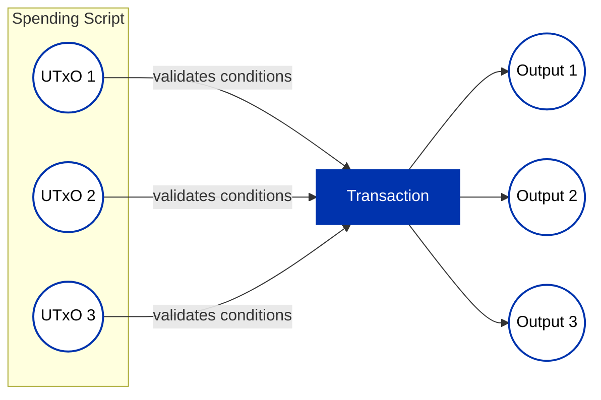
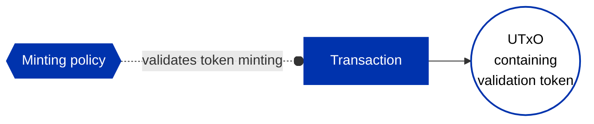
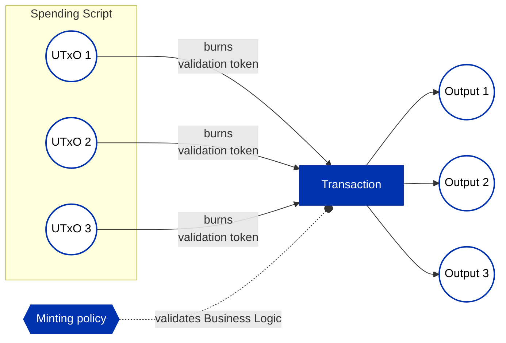

## Introduction

When crafting transactions to process a single script (smart contract) UTxO, enforcing spending
requirements seems straightforward. However, in high-throughput applications, a more efficient
approach is desired – allowing the processing (spending) of these script UTxOs in a "batch."
Unfortunately, invoking the validator script for each input UTxO in a transaction repeats
pre-processing steps, making it less optimal. To overcome this, the technique of "transaction level
validation" is employed.

This design pattern couples the spend and minting endpoints of a validator. Very similar to the [Stake Validator](stake-validator) pattern, this approach delegates validation logic to execute once per transaction rather than per UTxO.

For transaction level validation using staking validators, refer to the [Stake Validator Design pattern](stake-validator). This document outlines implementing the same pattern via minting policies.

## The Problem

A batch transaction involves multiple input UTxOs at a specific script address, and spending can
only occur when specific conditions apply (i.e., the validator function does not reject the
transaction). In this scenario, the validator script is executed for each UTxO, and the transaction
fails if any of the scripts reject it.



## The Solution

The role of the spending input is to ensure the minting endpoint executes. It does so by looking at the mint field and making sure **only** a non-zero amount of its asset (i.e. its policy is the same as the validator's hash, with its name specified as a parameter) are getting minted/burnt.

The arbitrary logic is passed to the minting policy so that it can be executed a single time for a given transaction.


## Aiken Implementation

### Spending Validator (Minimal Check)

```rust
use aiken_design_patterns/tx_level_minter

validator my_spending_validator {
  spend(
    _datum: Option<Datum>,
    _redeemer: Redeemer,
    _own_ref: OutputReference,
    tx: Transaction,
  ) {
    // Minimal validation: just check the minting policy executes
    tx_level_minter.spend_minimal(mint_script_hash, tx)
  }
}
```

### Spending Validator (With Validation)

```rust
use aiken_design_patterns/tx_level_minter

validator my_spending_validator {
  spend(
    _datum: Option<Datum>,
    _redeemer: Redeemer,
    _own_ref: OutputReference,
    tx: Transaction,
  ) {
    // Validate both the mint redeemer and tokens being minted/burnt
    tx_level_minter.spend(
      mint_script_hash,
      fn(redeemer) {
        // Validate minting redeemer
        validate_redeemer(redeemer)
      },
      fn(tokens) {
        // Validate minted/burnt token amounts
        validate_tokens(tokens)
      },
      tx,
    )
  }
}
```

### Minting Policy (Business Logic)

```rust
validator my_minting_policy {
  mint(
    redeemer: MyRedeemer,
    policy_id: PolicyId,
    tx: Transaction,
  ) {
    // All your business logic goes here
    // This runs once per transaction, not per UTxO
    validate_business_logic(redeemer, policy_id, tx)
  }
}
```

## Minting vs Burning

The drawback of this approach is that the minted validation tokens must be included in one of the
outputs, potentially consuming unnecessary block space.

A more desirable solution involves burning the validation tokens instead of minting them in the
batch transaction. However, this requires minting and storing the validation tokens in the input
UTxOs beforehand, allowing for pre-validation steps attached to their creation.

### Initial Minting



### Batch Burning



## Stake Validator vs Minting Policy

Transaction level validation can be implemented using minting policies. However, if minting
validation tokens is impractical, the recommended approach is to implement transaction level
validation using a staking validator due to lower ExUnits cost compared to minting policy checks,
based on our experience.

## Example Code

Full working example: [tx-level-minter.ak](https://github.com/Anastasia-Labs/aiken-design-patterns/blob/main/validators/examples/tx-level-minter.ak)

Library implementation: [tx_level_minter module](https://github.com/Anastasia-Labs/aiken-design-patterns/blob/main/lib/aiken-design-patterns/tx-level-minter.ak)

Additional sample: [aiken-delegation-sample](https://github.com/keyan-m/aiken-delegation-sample/blob/main/validators/spend-logic.ak)

## Related Patterns

- [Stake Validator](stake-validator) - Alternative approach with lower ExUnits cost
- [UTxO Indexers](utxo-indexers) - Combine with indexing for batch processing
