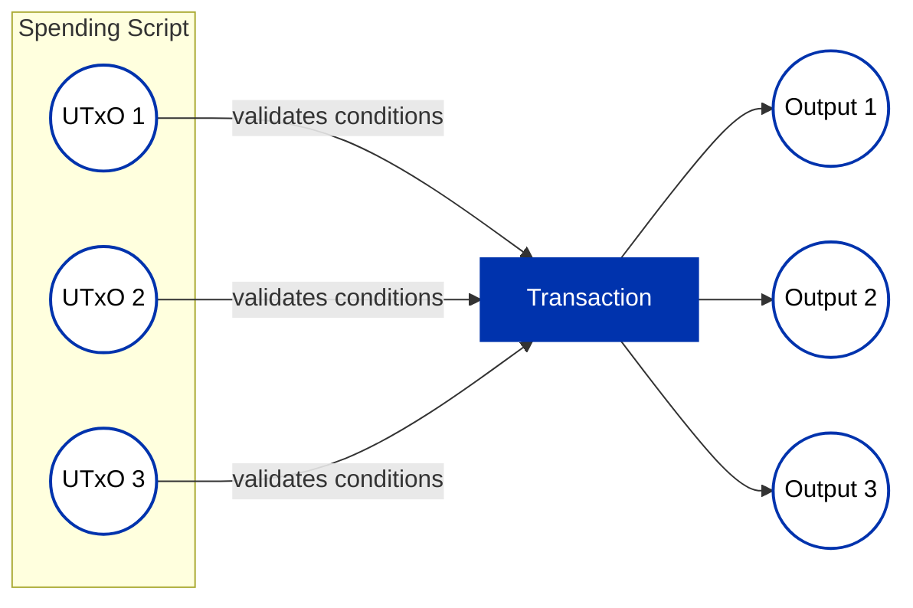
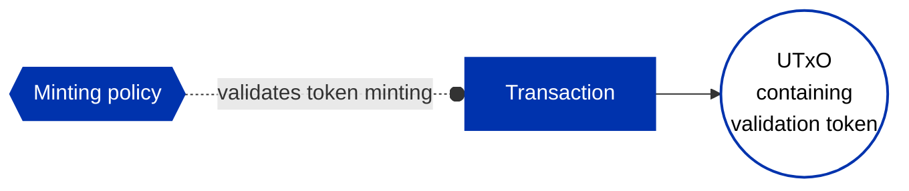
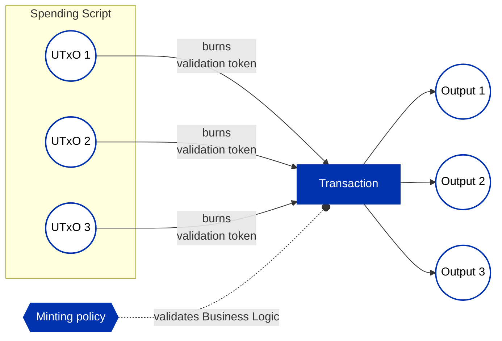

## Introduction

When crafting transactions to process a single script (smart contract) UTxO, enforcing spending
requirements seems straightforward. However, in high-throughput applications, a more efficient
approach is desired – allowing the processing (spending) of these script UTxOs in a "batch."
Unfortunately, invoking the validator script for each input UTxO in a transaction repeats
pre-processing steps, making it less optimal. To overcome this, the technique of "transaction level
validation" is employed.

This design pattern couples the spend and minting endpoints of a validator. Very similar to the [Stake Validator](stake-validator) pattern, this approach delegates validation logic to execute once per transaction rather than per UTxO.

For transaction level validation using staking validators, refer to the [Stake Validator Design pattern](stake-validator). This document outlines implementing the same pattern via minting policies.

## The Problem

A batch transaction involves multiple input UTxOs at a specific script address, and spending can
only occur when specific conditions apply (i.e., the validator function does not reject the
transaction). In this scenario, the validator script is executed for each UTxO, and the transaction
fails if any of the scripts reject it.



## The Solution

The role of the spending input is to ensure the minting endpoint executes. It does so by looking at the mint field and making sure a non-zero amount of its asset (i.e. with a policy identical to the provided script hash) are getting minted/burnt.

The arbitrary logic is passed to the minting policy so that it can be executed a single time for a given transaction.


## Aiken Implementation

This design pattern couples the spend and minting endpoints of a validator, in order to have minimal spend costs, in exchange for a single execution of the minting endpoint.

In other words, spend logic only ensures the minting endpoint executes. It does so by looking at the mint field and making sure a non-zero amount of its asset (i.e. with a policy identical to the provided script hash) are getting minted/burnt.

The arbitrary logic is passed to the minting policy so that it can be executed a single time for a given transaction.

### Key Functions

#### `validate_mint`

Function primarily meant to be used in your spending validator. It looks at both the redeemers and minted tokens to allow you to validate against the policy's redeemer, and its tokens getting minted/burnt.

`mint_redeemer_index` is the positional index of the policy's redeemer in the `redeemers` field of the transaction.

```aiken
pub fn validate_mint(
  mint_script_hash: PolicyId,
  mint: Value,
  redeemers: Pairs<ScriptPurpose, Redeemer>,
  mint_redeemer_index: Int,
  mint_validator: fn(Redeemer, Dict<AssetName, Int>) -> Bool,
) -> Bool
```

#### `validate_mint_minimal`

A minimal version of `validate_mint`, where the only validation is the presence of at least one minting/burning action with the given policy ID:

```aiken
pub fn validate_mint_minimal(
  mint_script_hash: PolicyId,
  mint: Value,
) -> Bool
```

### Example

The following example shows a complete validator with both spend and mint endpoints. The spending logic uses `validate_mint` to delegate to the minting policy, which performs the actual business logic:

```aiken
use aiken/collection/dict
use aiken/collection/list
use aiken_design_patterns/tx_level_minter
use cardano/address.{Address, Script}
use cardano/transaction.{Input, Output, OutputReference, Transaction}

pub type SampleSpendRedeemer {
  own_index: Int,
  mint_redeemer_index: Int,
  burn: Bool,
}

pub type SampleMintRedeemer {
  max_utxos_to_spend: Int,
}

validator example {
  // Sample spend logic on how to use the provided interface. Here we are
  // passing script's own hash as the expected minting policy.
  spend(
    _datum,
    redeemer: SampleSpendRedeemer,
    own_out_ref: OutputReference,
    tx: Transaction,
  ) {
    // Grabbing spending UTxO based on the provided index.
    expect Some(Input {
      output: Output { address: own_addr, .. },
      output_reference,
    }) = list.at(tx.inputs, redeemer.own_index)

    // Validating that the found UTxO is in fact the spending UTxO.
    expect own_out_ref == output_reference

    // Getting the validator's script hash.
    expect Script(own_hash) = own_addr.payment_credential

    // Getting access to the mint script's redeemer, and the tokens being
    // minted/burnt using the design pattern. The logic that follows expects a
    // single "BEACON" token to be either burnt or minted.
    let
      redeemer_data,
      tn_qty_dict,
    <-
      tx_level_minter.validate_mint(
        mint_script_hash: own_hash,
        mint: tx.mint,
        redeemers: tx.redeemers,
        mint_redeemer_index: redeemer.mint_redeemer_index,
      )
    expect SampleMintRedeemer { max_utxos_to_spend } = redeemer_data
    expect max_utxos_to_spend > 0
    expect [Pair("BEACON", mint_quantity)] = dict.to_pairs(tn_qty_dict)
    if redeemer.burn {
      mint_quantity == -1
    } else {
      mint_quantity == 1
    }
  }

  // Sample mint logic to complete the example. This policy expects a specific
  // number of inputs to be spent in each transaction.
  mint(redeemer: SampleMintRedeemer, own_policy, tx: Transaction) {
    let script_inputs_count =
      tx.inputs
        |> list.foldr(
            0,
            fn(i, acc) {
              when i.output.address.payment_credential is {
                Script(input_script_hash) ->
                  if input_script_hash == own_policy {
                    acc + 1
                  } else {
                    acc
                  }
                _ -> acc
              }
            },
          )
    script_inputs_count == redeemer.max_utxos_to_spend
  }

  else(_) {
    fail
  }
}
```

## Minting vs Burning

The drawback of this approach is that the minted validation tokens must be included in one of the
outputs, potentially consuming unnecessary block space.

A more desirable solution involves burning the validation tokens instead of minting them in the
batch transaction. However, this requires minting and storing the validation tokens in the input
UTxOs beforehand, allowing for pre-validation steps attached to their creation.

### Initial Minting



### Batch Burning



## Stake Validator vs Minting Policy

Transaction level validation can be implemented using minting policies. However, if minting
validation tokens is impractical, the recommended approach is to implement transaction level
validation using a staking validator due to lower ExUnits cost compared to minting policy checks,
based on our experience.

## Example Code

Full working example: [tx-level-minter.ak](https://github.com/Anastasia-Labs/aiken-design-patterns/blob/main/validators/examples/tx-level-minter.ak)

Library implementation: [tx_level_minter module](https://github.com/Anastasia-Labs/aiken-design-patterns/blob/main/lib/aiken-design-patterns/tx-level-minter.ak)

Additional sample: [aiken-delegation-sample](https://github.com/keyan-m/aiken-delegation-sample/blob/main/validators/spend-logic.ak)

## Related Patterns

- [Stake Validator](stake-validator) - Alternative approach with lower ExUnits cost
- [UTxO Indexers](utxo-indexers) - Combine with indexing for batch processing
