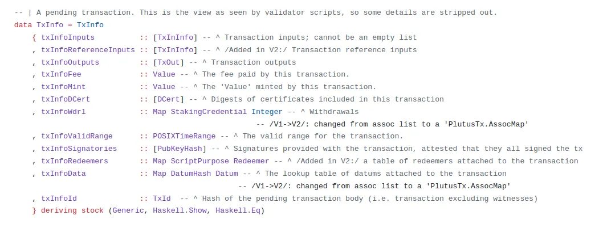
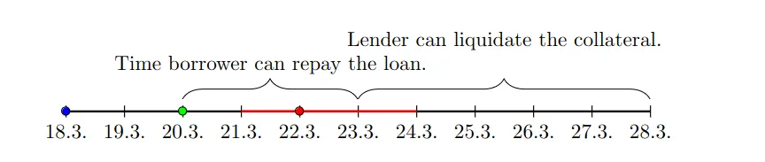

> Following sections can be found also at this [blog](https://medium.com/@invariant0/cardano-vulnerabilities-time-handling-3b0925df7fc2)

Time in Cardano transactions is a complex topic. To understand why, we must first understand Cardano's transaction validation philosophy.

One of its main ideas is that the transaction execution is deterministic. The whole transaction is constructed locally on the computer of the transaction creator and then it is sent to the blockchain. A Cardano transaction includes the end result. This contrasts with Ethereum transactions, where the creator of the transaction just calls a function of a smart contract, not necessarily knowing the end result as it depends on the chain state at that moment which is not fully known in advance. Taken to the extreme, the function can potentially do something completely different than the user expected.

Cardano smart contract validation consists of two phases. The first phase validates that the relevant part of the blockchain state the transaction sees is the same as the state when the user built the transaction. For example, if some transaction outputs that the transaction spends have already been spent, the transaction fails the first validation phase. The second validation phase executes Plutus scripts.

Let's look at time handling. In Ethereum, smart contracts can use the block.timestamp to get the timestamp of the current block in which the transaction executes. You could, for example, create an Ethereum smart contract that checks whether the "current timestamp" is even or odd, and depending on that either sends the user money or not. Some smart contracts even go as far as to consider this timestamp a source of randomness in their contracts. It is not a good idea, as it can be manipulated by the block producers.

As mentioned, a user building a Cardano transaction needs to know exactly what the transaction does. It is part of the transaction itself. As a result, it's impossible to write a similar script on Cardano. The timestamp at which the block is mined is unknown when the user builds the transaction, therefore it can not be part of the transaction data.

However, without any kind of access to the current time, Cardano scripts would be greatly limited. Many dApp use-cases such as vesting, lending, and much more depend on it.

To recap, the Cardano time model needs to satisfy both these points:

1) Give validators some information about the current time if they need it.

2) Not require a user to know the exact time when the transaction will be processed as it is impossible to know.

## Time intervals

Even though a user can't exactly know when a transaction will be included in a block, he can set a time interval when the transaction is valid and can be included in a block. By doing so, he provides the validator with some information about the current time. This interval is included in the txInfoValidRange field that is part of the transaction properties accessible from Plutus:

Transaction information in Plutus

The valid range is an interval of timestamps, which must contain the actual block timestamp. It has a lower bound and an upper bound, both of which can be either integer values or can refer to a negative/positive infinity. Phase 1 transaction validation, which has access to the current timestamp, validates that the current timestamp lies somewhere in this interval. The Plutus script only sees the interval specified by the transaction creator.

To recap:

1) The transaction creator does not know the exact timestamp when his transaction will be validated but can specify a sufficiently long interval covering it.

2) The Phase 1 transaction validation sees both the current timestamp and the specified transaction validity interval. It verifies that the current timestamp lies in the interval, and if so, continues with the Phase 2 validation.

3) The Phase 2 validation that includes Plutus script execution only sees the interval.

The user building the transaction can now provide the validator with useful time information without having to know the exact timestamp at which the transaction will be validated. What's more, the transaction creator can still deterministically check whether the transaction will pass or fail the Phase 2 validation. Note that he can not influence when the transaction will be included in a block and so he can not know whether it will pass the Phase 1 validation. However, he can be sure that if it does, meaning the time falls in the validity interval, the scripts will pass.

This solution elegantly solves the problem while maintaining determinism but is sometimes difficult for new programmers to fully understand and leads to potential smart contract security issues.

## Example vulnerabilities

Let's demonstrate potential time-related vulnerabilities on a simple peer-to-peer lending protocol! A lender can create a lending UTxO holding a proposed loan's amount and specifying the loan properties including the loan's duration. A borrower can accept the loan by spending such UTxO and locking collateral into it. If he does not repay the loan until the specified time, the lender can liquidate the collateral.

The following diagram shows the expected workflow:

Time diagram of loan repayment

The blue dot on 18.3. represents the moment when a lending UTxO is created. The lender specifies the loan duration as three days. On 20.3. a borrower accepts this loan, locks the collateral and has to note the date when the loan needs to be repaid as the current day plus 3 days. After that, if the loan is still not repaid, the lender can take the collateral.

We will focus purely on the time handling. We have two transactions in which we need to consider the current timestamp in the smart contract validation logic:

1) When a borrower accepts the loan, he needs to write the time when the loan ends into the datum. To do this, he should take the "current time" and add the loan duration from the loan properties. The script needs to check that this is done properly.

2) When the lender tries to liquidate a collateral, the script needs to verify that the current timestamp is after the loan ending timestamp. It can not allow the lender to liquidate before this time.

Let's consider the first of these points. Recall that the script has no access to the current timestamp on Cardano. The script can only access the validity interval specified by the transaction creator and the script knows that the current timestamp lies somewhere in this interval (otherwise the Phase 1 validation would fail and so the script can trust that it indeed lies in the interval). One common approach is to use only one side of the interval, either the lower bound or the upper bound and assume that's a good approximation of the current time. Let's show what would happen if the script chose the end of the time interval:

Attacker moves the upper bound of interval and tricks the smart contract into having more time to repay the loan.

A borrower is creating the accept-loan transaction. The current date is March 20 (the green dot, 20.3.). The borrower specified the green time interval as the validity range of the transaction which contains this date. Phase 1 validation passes as the current timestamp is inside the interval. However, the application takes the end of the interval for the current time and therefore assumes that the loan begins on 24.3. and so it should end on 27.3. This is wrong. This represents an attack of the borrower on the lender in which the loan duration can be prolonged by abusing the time handling. The severity of such an attack depends on the Cardano network parameters (we describe this in a later section).

A similar attack would be possible by a lender in the collateral liquidation case:

Lender moves the upper bound of the interval and tricsk the smart contract into liquidating loan before it should be liquidated.

In this example, we look at a liquidation transaction. The lender liquidates the collateral at the red dot. The lender specifies a time interval that ends after the supposed loan duration, and because the validator looks at this upper bound value the lender can liquidate the collateral before the loan ends.

We can see that always taking the upper bound is not a good solution. In both these examples, the lower bound would be a better solution. A lower bound tells the script that the current timestamp is definitely after it, which is the information we need in these examples. A liquidation can happen only after the loan ends. We can be sure that the current time is after that if we compare the lower bound to this timestamp. In the second example, since the borrower constructs the accept-loan transaction and is incentivized to have the loan for as long as possible, the script needs to protect the lender — by taking the lower bound of the current time to determine the start of the loan. However, just because in this case the lower bound was the better option does not mean that it is always the case. Everything depends on the context in which the timestamp is used.

Another intuitive option when trying to convert an interval to a specific timestamp would be to use the middle of the interval. However, this does not make any sense — an attacker can just move sides of the interval to force the middle of the range to be anywhere. Even more importantly, just because the average is intuitive it does not mean it's right — the current timestamp could be closer to the lower bound of the validity range than the average.

## Considerations

There are two general tips we can give developers:

1) Think about the use case and incentives. The developers should think about who specifies the time interval in which transaction and what their incentives are. Usually, a cheating party could manipulate either the lower bound or the upper bound or both, and a careful developer should always check the bound that makes more sense for a given use case. It may mean using different ends of the interval for different use cases even in the same transaction.

2) Check the length of the validity range. Developers can prevent many (but not all) of these edge cases by simply checking the length of the validity range (end — begin) and enforcing that it is fairly short (e.g. 1 hour). It is also necessary to check this in case a close enough time approximation is really necessary. Even if the length of the validity range is restricted, developers still should choose the correct end of the interval for the use case, though.

## Theory meets practice

Although a transaction creator could choose any validity interval for his transaction in theory, it's not quite that way in practice. The inner representation of the validity interval in the raw transaction format consists of two integers representing the number of slots. However, as we showed, the script context that smart contracts have access to lists the validity interval as two POSIX timestamps. That means that those slots need to be translated into timestamps before the scripts are run.

This translation currently errors out for slots that are more than a few days in the future. That's because the translation depends on the chain's network parameters that may themselves be changed during the longer time period.

A direct consequence of this is that some of the attacks on the time-related smart contract vulnerabilities are limited in severity currently, as an attacker can not select a timestamp in the further future as his transaction's upper bound.

Ultimately, we certainly don't recommend relying on this as the length of this period may change without any notice. From the smart contract security point of view, you can not take the upper bound of the validity interval for the current time!

## Recapitulation

Time handling in Cardano is a complex topic with many pitfalls for developers. In this blog, we have shown reasons why Cardano requires such complex handling and what developers can consider to check the time correctly in their smart contracts. For a practical hands-on experience, we recommend trying to solve the Cardano [CTF](https://github.com/vacuumlabs/cardano-ctf) tasks. The second task vesting requires a player to perform an attack similar to the one described in this blog.

For a deeper dive into this topic, we strongly recommend two blogs from IOG — [1](https://iohk.io/en/blog/posts/2022/12/07/time-handling-on-cardano-part-1-about-ouroboros-and-the-importance-of-determinism/) and [2](https://iohk.io/en/blog/posts/2022/12/08/time-handling-on-cardano-part-2-use-cases/).
