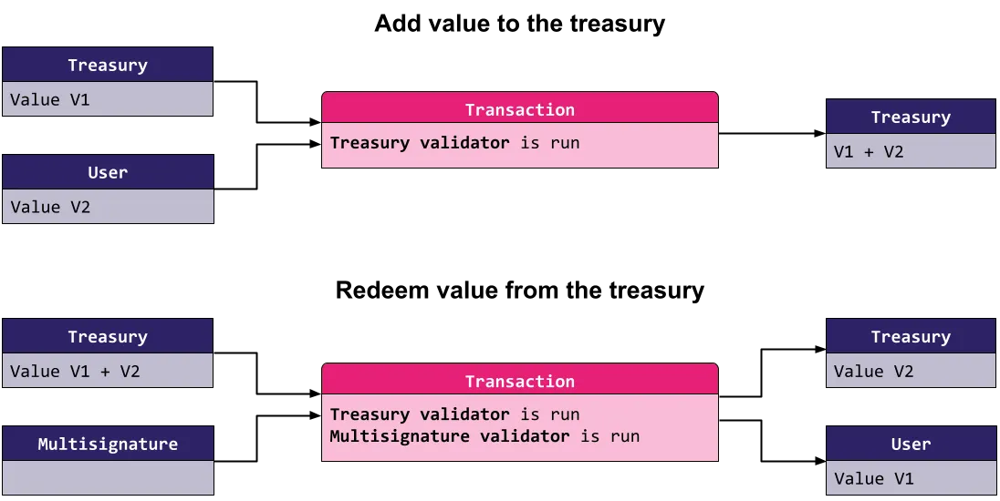

> Following sections can be found also at this [blog](https://medium.com/@invariant0/cardano-vulnerabilities-5-token-security-d9abe2a8d084)

Native tokens introduced in the Mary protocol upgrade are an essential part of the Cardano blockchain. They represent value that can be created and traded on the blockchain in addition to ADA.

Tokens can be more than just a representation of value. While interacting with Cardano, you will encounter a myriad of different tokens serving various purposes. It is therefore important to know what the tokens are, and to understand their common use and security pitfalls.

In this blog we will focus on the basics — what tokens are, how they integrate into the Cardano blockchain and how they can be incorporated into dApps. We will focus on what challenges they represent for smart contract developers. In our next blog, we will look at more interesting use cases that show the true potential of native tokens.

To make things simple, we will use the word token to represent both ADA and native tokens. However, note that ADA is a special case and its handling may be different from time to time, even though it behaves similarly to native tokens in a lot of cases.

## Basics

A token on the Cardano blockchain is an asset that can be stored inside an Unspent Transaction Output (UTxO). Tokens can be minted (new tokens are created), burned (existing tokens are destroyed), or transferred. Any token is defined by two parameters — a policy ID and an asset name sometimes called its token name. The rules detailing how and if new tokens can be minted or old tokens burned is written in a minting policy. A minting policy is a smart contract and it is linked to the tokens through the tokens’ policy ID (the first identifier of a token). More specifically, the policy ID of a token is a cryptographic hash of its minting policy’s code. Tokens that have different minting policies are very different. Tokens that are different only in the token name are somewhat related, they are governed by the same smart contract.

The policy specifies the conditions under which tokens can be minted or burned. If any token is minted or burned in a transaction, the minting policy of that token must be part of the transaction and must successfully validate the operation. However, tokens’ transfer alone does not execute the minting policy and the transfer therefore can’t be controlled by the token’s code. Note: Stay tuned for our programmable tokens’ design that will feature how programmable on-transfer functionality could be added.

Token names are additional data associated with tokens. They are set by the minting party in the minting transactions. The minting policy governs the minting of all tokens with the same policy ID, even though they can have different token names. More often than not, it governs what token names can look like and under which circumstances.

Note that in a single transaction, each minting policy is run only once. If the transaction mints and/or burns several tokens with the same policy ID but different token names, the corresponding minting policy is run only once and it needs to validate all the policy’s minted and burned tokens.

```rust
validator {
  fn mint_and_burn(_redeemer: Void, ctx: ScriptContext) -> Bool {
    let ScriptContext { transaction, purpose } = ctx
    expect Mint(own_policy_id) = purpose
    let Transaction { mint, ..} = transaction

    let mint_value = value.from_minted_value(mint)
    let own_tokens = dict.to_list(value.tokens(mint_value, own_policy_id)

    // Allowing only mint, not burn
    list.all(
      tokens,
      fn(token) {
        let (asset_name, amount) = token
        amount > 0
      },
    )
  }
}
```

The code above shows a simple minting policy that lets anyone mint any tokens, but does not allow burning them at all. Note that the transaction.mint contains all the tokens minted or burned in the transaction. We therefore want to filter out only tokens governed by our minting policy whose id we extracted to the policy_id variable. The resulting list can contain a number of records. Each is a pair consisting of an asset name and an amount of tokens of that asset name that were minted (representing a positive number) or burned (representing a negative number). Finally, the final check makes sure that all the amounts are positive, meaning that no token was burned. Note that it does not restrict anything else and you could mint tokens of any token name under this policy. However, naturally, you can not mint tokens of a different policy using this code. For that, you need the other policy to validate.

It is therefore possible to create tokens that:

- can be minted only with a specific token name.
- can be minted only once — this can be used to create NFTs.
- can be minted only if another token of the same policy ID and a different name is burned.
- can be minted only if enough ADA is deposited into a specified UTxO.
- can be burned only if the transaction is signed by a specified key.
- cannot be burned under any circumstances.

Note that the policy ID of ADA is an empty string. Therefore, there is no minting policy that corresponds to it. As a consequence, it is not possible to mint or burn ADA this way.

## Tokens as value

Many tokens represent value. Whether it is ADA, stablecoins, NFTs or tokens minted by promising projects, they have value and are often stored and transferred between various UTxOs.

As a developer, you need to ensure that you handle these tokens correctly when designing your dApp. Let’s assume you have created a simple treasury to which value can be freely added by anyone, but can only be redeemed in a correctly signed multi-signature transaction. For example, such treasury could be used by a DAO that’s selling NFTs on a marketplace. Users buying the NFTs would pay into this treasury, and they can withdraw the tokens only if multiple members of the DAO agree on how they want to use the funds received. This protocol can be demonstrated in these two simple transactions.



What are the security risks you want to prevent when implementing this treasury?

Let’s focus on the first transaction type — a transaction in which additional value is added to the treasury. The user submitting such a transaction should not be able to withdraw anything from the UTxO so you implement a simple check that “Amount of ADA present in the output UTxO is at least the amount of ADA present in the input UTxO”.

This works just fine for ADA (double satisfaction vulnerability aside), but there are no restrictions placed on any other tokens. In our example with the DAO selling NFTs, the DAO decides to sell an NFT for some tokens other than ADA, and someone buys such an NFT. Let’s assume that the trade went through and the DAO balance was updated correctly. Anyone can retrieve those tokens simply by spending the DAO’s UTxO and withdrawing the tokens. As we saw, the validator only checks that no ADA is stolen. This is an example of a vulnerability in the token handling. We will now show how to fix it.

## Value size and execution limits

So we can edit the treasury validator to check the following condition:

For each token type present in the input treasury UTxO, at least that amount of the same tokens must be present in the output treasury UTxO.

This is better, as it guarantees that the value in the treasury UTxO only accumulates, until the DAO members withdraw from the treasury via a multi-signature scheme.

But there are glaring security issues with this approach which are apparent in a broader context of the Cardano blockchain. Each transaction needs to go through two validation phases. In the second phase, the scripts are executed. To avoid unproportional spending of resources there are several limits that Cardano enforces.

The first important limit in this context is the maximum value size limit. This is a protocol parameter, which is currently set to 5000 bytes. All the tokens in the value contribute towards the value size, and therefore this limits the amount of different tokens we can hold in a single UTxO. To exploit this limit, an attacker could DDoS the treasury by minting many different worthless tokens into it, thus disabling other people from contributing valuable tokens. We call this attack “dust tokens”.

The multi-signature parties could mitigate this issue by withdrawing the worthless tokens and thus allowing others to contribute. However, this does not prevent the attacker from repeating the attack again.

The other relevant limits are the execution limits. Execution limits limit the amount of time and memory units for each transaction’s script execution. Again, these limits can not be exceeded. For example, if we parse the value in the transaction validation, this counts towards both the time and the memory execution limits.

By attacking these execution limits, an attacker could block even the withdrawal operation, depending on its complexity. The withdrawal transaction can be more complicated than the depositing transaction, as it needs to find and run two validators instead of one. If our validator runs code in which the resource consumption depends on the number of tokens (e.g. for each token type as in our case), the artificially enlarged UTxO can potentially stretch the execution limits to such an extent that the withdrawal validation can not fit in the execution limits. That effectively makes it impossible for the value contained within to be withdrawn unless an (unlikely) protocol change is made, e.g. increasing the limits.

## Correct value handling

As always, theory is a lot cleaner than practice. The actual execution limits are determined by the validators that are run where it heavily depends on their actual implementation — how complex and efficient it is. Moreover, it also depends heavily on the context the validators are run on, the transaction validated, its structure and size.

Unfortunately, there is no simple catch-all solution for token handling. The best course of action is first think about the types of tokens that can be deposited into the UTxO. If you only really care about ADA, enforce that no other tokens are added. If you need to support multiple policies, specify the set of policy IDs in the datum and test that the validator is efficient enough that it validates even when it contains all of them at the same time. If you need to be able to support any tokens, you could limit how many different tokens can be in a single UTxO. You might require a different solution altogether, though.

As always, rigorous testing should be in place to test whether even the most extreme edge cases allowed by your validator fit into the execution limits. Remember to try enlarging the transaction as well when testing, e.g. increase the number of normal inputs and outputs, put tokens into those artificial inputs and outputs as well, etc.

## What’s next?

We went through the token basics and talked about the use of tokens as a representation of value which is their primary purpose. But native tokens can be used in various creative, more technical ways as well.

To demonstrate one use case, let’s consider on-chain oracles. The main goal of an oracle is to reliably bring real-world data onto the Cardano blockchain. For example, we could want to know the value of a currency, a particular stock or the results of a real-world event. To do so, a special UTxO is often created and this UTxO contains the required information in its datum. The script validator of the UTxO can easily govern how updates are performed — usually, this is by allowing only certain trusted entities to spend the oracle UTxO, often requiring multiple of them to agree on the update. However, there could be multiple UTxOs created on the same script address and they could be created by anyone with any data (see our [Trust no UTxO blog](2-trust-no-utxo) post). Therefore, there is a need to recognize the correct current oracle UTxO.

Let’s suppose the oracle’s purpose is to bring just a single data point to the chain, meaning there’s always just a single up-to-date UTxO valid. To make a UTxO uniquely recognizable, we can create a special kind of an NFT (without an image, just for development purposes) and lock it into the correct oracle UTxO. As there can be only one such NFT (by definition, a non-fungible token), there is always at most one oracle UTxO containing this NFT. When this UTxO is used in a transaction, either as a normal input or as a reference input, any validator can easily check whether the correct NFT is present. When the oracle information needs to be renewed, the old oracle UTxO is spent and the token is sent into the newly created oracle UTxO.

This is probably the most simple technical use case for tokens. This token does not hold any value, it is part of the technical design of the protocol. Implemented correctly, the above-mentioned NFT can not be withdrawn from the protocol, and thus traded, or otherwise interacted with. The only purpose this NFT serves is to uniquely identify a UTxO carrying the correct data.

## Validation tokens

This brings us to a fairly common use case of native tokens — to provide UTxO validation. Often there is a need to make sure that a UTxO was created correctly, it wasn’t tampered with in any way or to prove authenticity of some kind. We have first discussed this and a possible solution in our Trust no UTxO blog. Here, we will return to the introduced concept of validation tokens and take a better and more technical look at them.

The crux of the problem is that a validator is run only when a UTxO at its address is spent, not when it is created. It is therefore very simple to create malicious UTxOs with invalid data and present them as a real thing. Without further protection, it’s impossible to distinguish between them on-chain.

Validation tokens fill in this missing piece of the puzzle as they can validate the initial transaction. We can enforce that the tokens can only be minted during the UTxO creation, validating that the created UTxO is correct and in the proper initial state. This validation is part of the corresponding minting policy. Note, that the minting policy has access to the whole script context, and it can therefore look at the whole transaction, including all the transaction inputs, outputs, signatories, datums, other minted tokens, etc.

The minting policy of the validation token ensures that it is placed into the correct UTxO. As a result, the validator can assume that any UTxO that contains the validation token was created according to the specification. It is important to note that malicious UTxOs without the validation token may still exist. It is thus important for the protocol to not interact with any such invalid UTxOs.

The idea is simple but not yet complete. As described, it creates several security pitfalls. Above, we’ve stated that the validation token serves as a proof that the UTxO that holds it is correct. But this would only be the case if the UTxO was unspendable — once it’s spent, the validation token could freely move away, potentially into a malicious UTxO.

The spending of the UTxO is solely in the hands of the UTxO validator. The mint of the token alone is thus only a part of this design pattern. It is essential for any validator that can hold a validation token to control where and how those tokens can be transferred.

Consider a situation in which the validation token is correctly minted and after a series of transactions, due to a faulty implementation of the validator holding it, it ends up in a user’s wallet. That user can create a fake UTxO that pretends to belong to the protocol and include this old validation token in it. For all purposes of the validator, it will appear as a valid UTxO. Similar attacks are common in more complex smart contracts and are often critical in nature, possibly leading to a complete drain of all protocol funds.

It is therefore worth repeating that it is paramount for any smart contract with a validation token to take care of these tokens. The actual implementation varies depending on the use case. However, we recommend following these two general recommendations:

1) Count the number of validation tokens across all inputs and outputs to prevent double satisfaction attacks that could result in a “loss” of a token. The code should check that the number of input tokens and output tokens is as expected. For example, this way, you can not merge two UTxOs with validation tokens in them into a single one and claim the other validation token for nefarious uses. Remember that any single token lost to an unknown contract or to a public key address can ultimately break the whole protocol. You really need to validate every single token. Also note, that tokens can possibly be minted or burned in the same transaction if you don’t restrict it. These double satisfaction attacks can be especially tricky when the minting policy is combined with the validator — an example of such an attack is as described previously in this blog.

2) Lock the validation tokens into very specific UTxOs. Make sure to check the whole UTxO (address, value, datum) of all output UTxOs holding your validation tokens. By checking the address, you can be sure that a script you trust keeps the control of the token. By checking the datum, you make sure that you do not validate malicious data. You need to be careful of double satisfaction attacks again here (e.g. do not validate two of the same correct outputs if only one should be validated). Lastly, you should check the value of the UTxO as well; e.g. to verify that there are no dust tokens present that could potentially prevent you from further spending the UTxO by maliciously increasing the execution units.

Additionally, if you don’t need it, do not allow a mint of new validation tokens in case there are any on the input. It makes double satisfaction reasoning easier and, more often than not, you do not really need to allow it.

## Implementation

This brings us to the technical part of the actual implementation. It was mentioned above that we need to lock the validation token into a correct UTxO. Therefore, the minting policy of the validation token needs to know the script hash of the correct validator. It can be either written directly into the minting policy or used as a parameter of it. The parametrization is a better code practice. The compiled code, however, is almost identical.

Additionally, the validator needs to check that the correct validation token is part of it in later transactions. Therefore, the validator needs to know the policy ID (hash of the minting policy) so that only that special validation token is supported. Once again, it can be known by the script by putting it as its parameter.

As the hashes of both the validator and the minting policy depend on each other, we have a new problem — a cyclic dependency. To know the policy ID, the script hash needs to be known and for that, the policy ID is needed. This cycle needs to be broken as the code can not be compiled as described.

There are several options for how to fix this. Perhaps the most elegant is to use the token name. Recall that the token name can be set arbitrarily by the minter, assuming the minting policy allows it. Therefore, for one minting policy, there are a lot of different token names, each possibly creating a unique token type. Let’s keep the UTxO validator parametrized by the policy ID.

The minting policy won’t be parametrized and it will contain the following change: the validation token can be minted into any address, but its token name needs to match the payment credential part of the address of that UTxO. The script validator then needs to check that the validation token of the policy ID set as a parameter that is present in the UTxO has the corresponding name — that it matches its own script hash. By doing that, the validator can be sure that the token was minted to the same script. Different token names are untrustworthy and need to be considered invalid.

```rust
use aiken/dict.{to_list}
use aiken/transaction.{
 Mint, ScriptContext, Spend, Transaction, find_input, find_script_outputs,
}
use aiken/transaction/credential.{ScriptCredential}
use aiken/transaction/value.{from_minted_value, quantity_of, tokens}


// Minting policy of the validation token
validator {
 fn validation_token_policy(_redeemer: Void, ctx: ScriptContext) -> Bool {
   let ScriptContext { transaction, purpose } = ctx
   expect Mint(policy_id) = purpose
   let Transaction { outputs, mint, .. } = transaction

   expect [(asset_name, amount)] =
     to_list(tokens(from_minted_value(mint), policy_id))
   when amount is {
     1 -> {
       expect [token_output] =
         find_script_outputs(outputs, asset_name)

       and {
         quantity_of(token_output.value, policy_id, asset_name) == 1,
         // ... other checks, including:
         // ... double satisfaction prevention
         // ... initial state validation (datum, value)
       }
     }
     -1 -> True
     _ -> False
   }
 }
}


// Validator expects to have the correct validation token
validator(validation_token_policy: ByteArray) {
 fn multisig(_datum: Void, _redeemer: Void, ctx: ScriptContext) -> Bool {
   let ScriptContext { transaction, purpose } = ctx
   let Transaction { inputs, outputs, .. } = transaction
   expect Spend(output_reference) = purpose

   expect Some(own_input) = find_input(inputs, output_reference)
   expect ScriptCredential(own_hash) =
     own_input.output.address.payment_credential

   // expect to have the correct validation token
   expect
     quantity_of(
       own_input.output.value,
       validation_token_policy,
       own_hash, // expected token name == this script's hash
     ) == 1

   expect [expected_token_output] =
     find_script_outputs(outputs, own_hash)

   expect
     quantity_of(
       expected_token_output.value,
       validation_token_policy,
       expected_token_name,
     ) == 1

   // ... other checks, including:
   // ... double satisfaction prevention
   // ... correct state transition validation (datum, value)
 }
}
```

The result of this is that the validation tokens can be minted freely into other script UTxOs, but such tokens are worthless as they don’t have the correct name. So even if they are later deposited to the original script address, the name won’t match and the validator will recognize it and invalidate any following transactions. The only way to mint a valid validation token is to mint it into the correct script address straight away.

Transaction token
There is one more common use of token minting and it is frequently used when dealing with batching or any other kind of running multiple validations in the same transaction. Let’s assume you have a simple marketplace similar to the one mentioned in our previous blog — anyone can create an offer and this offer can be filled by anyone. This marketplace would like to support batching in a sense that more than one offer can be filled in a single transaction.

The code is secured against double satisfaction attacks. The validator checks the whole transaction, gathers all the offer UTxOs and computes the overall value that needs to be sent to each seller.

While this double satisfaction prevention is secure, it is inefficient. Let’s assume there are 5 offers that are put as inputs of the transaction. The aforementioned validator is run 5 times — once for each UTxO. However, the computation is always (almost) the same as the validator looks at the whole transaction. This puts a strain on the execution limits, making the transactions more expensive and limiting the number of offers that can be filled in a single transaction before hitting the limits.

It would be much more efficient if this expensive validation could be run just a single time. This can be achieved by **delegating the whole transaction-level validation to a minting policy** of an artificially created token. The transaction token is a special token whose minting policy contains the validation logic. The actual validator now only needs to check that a correct transaction token is indeed minted, meaning that the validation is run in the transaction. It therefore really just delegates its validation to the transaction token’s minting policy.

Note that it is just an artificially created token for only this purpose. The token itself is not important, it can be freely moved or burned. The only important aspect of the token is that its mint provides the validation so that in our example, 5 inputs just check that the minting policy is run and the policy validates the whole transaction thoroughly. To read more about the transaction token pattern, look into [Plutonomicon](https://github.com/Plutonomicon/plutonomicon) which, as far as we know, first came up with the idea.

We acknowledge that this solution may appear hacky. It indeed is. Right now, unfortunately, there are just hacky ways to provide transaction-level validation. This is one example on how to achieve it.

Another way would be to forward the validation to a single script input — e.g. the first one found in the transaction inputs as the order is set for the transaction and all the scripts see it in the same order. That would mean checking whether the current validation run is of the first script input, if so, run the transaction-level validation, otherwise validating straight away.

Yet another approach is to use stake validators. This is our least favorite way and we don’t recommend using it. That’s because it’s the most hacky, to the point that it might break in the future. You need to always withdraw all the staking rewards in a withdraw staking rewards transaction. This inevitably means that, in order to be flexible, you would need to run it also when there are zero rewards available. This is currently possible and the validation is indeed required to run even when you specify in the transaction that you want to withdraw zero rewards. This, however, does not make sense when you think about it — why require a script when there are no rewards withdrawn from it? Also, it’s inconsistent with how minting of zero tokens is handled. You can not mint zero tokens, such value would get filtered out from the mint transaction field. There’s been an effort to even “fix” this behavior on the ledger level. It wasn’t fixed as there’s been pushback from developers already using it this way, though.

## Conclusion

We have shown that tokens have various use cases and can be used to both validate the initial state of a contract and to transparently mark UTxOs that are valid and that can be freely used by the protocol. They can also make smart contract execution more efficient. As a result, they are an invaluable tool in a developer’s arsenal but need to be implemented with care and security in mind.

As token security is an integral part of overall Cardano smart contract security, our [Capture the Flag](https://github.com/vacuumlabs/cardano-ctf) game features not one, but two levels focused on it. Check the levels `07_multisig_treasury_v2` and `09_multisig_treasury_v3`.

Both of these tasks feature validation tokens. You can look at their implementation, find in what way they break our general recommendations, and try to exploit the vulnerabilities. Good luck!
