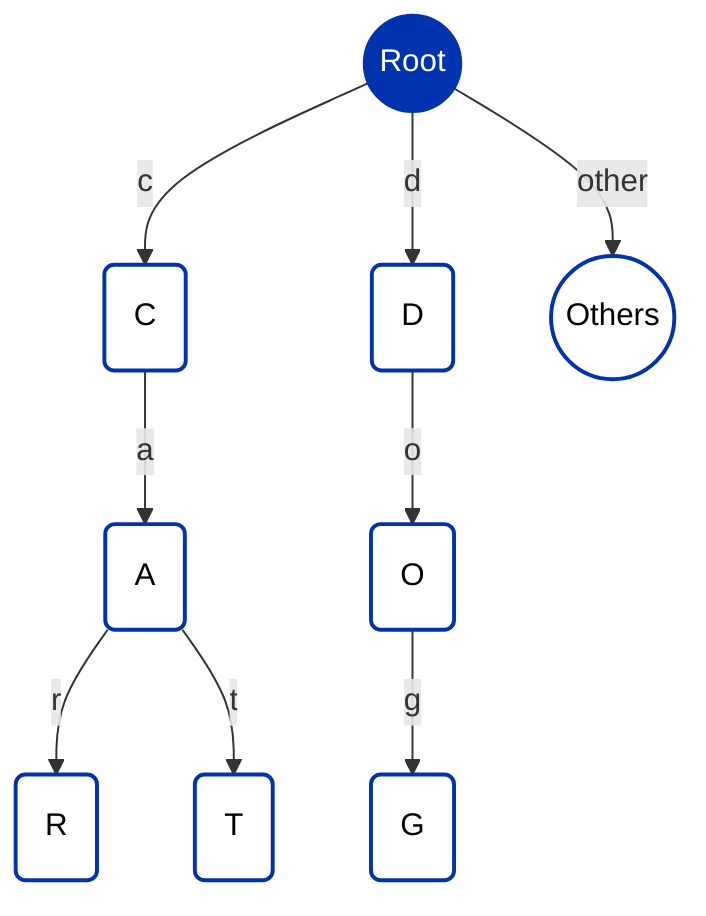

## Introduction

The Aiken Trie project provides a Aiken-based implementation of Distributed Tries for the Cardano blockchain. This project allows developers to leverage the security and efficiency of Tries in their Cardano smart contracts, ensuring data integrity and efficient data verification. This project uniquely allows scalable data structures across multiple utxos, with a developer-friendly typescript api.

:::info 
The github repository introducing these data structures can be found [here](https://github.com/Anastasia-Labs/aiken-trie).
:::

## Documentation

### Trie

A trie, also known as a prefix tree or digital tree, is a kind of search tree—an ordered tree data structure used to store a dynamic set or associative array where the keys are usually strings. Unlike a binary search tree, no node in the tree stores the key associated with that node; instead, its position in the tree defines the key with which it is associated. This makes tries extremely useful for applications like autocomplete systems, spell checkers, and IP routing. Here's a detailed explanation:

#### Basic concept

A Trie is a type of search tree, an ordered tree data structure that is used to store a dynamic set or associative array where the keys are usually strings. Here's how it's structured:

- **Leaf Nodes**: These are the nodes at the bottom of the tree that contain values associated with the keys. The keys are formed by the path from the root to the leaf.
- **Non-Leaf (Intermediate) Nodes**: These nodes contain the common prefixes of the keys or parts of them. They help in reducing the search space for a query.
- **Root Node**: The single node at the top of the tree represents the starting point of every key stored in the trie. It is usually empty.

#### Key Encoding

The core of a Trie is its key encoding mechanism. This mechanism takes input keys of any size and encodes them into a path through the Trie. Each character or byte of the key represents a step down the Trie, from the root towards the leaves.

#### Construction

- **Inserting Keys**: Keys are inserted by walking through the Trie according to the encoded path of the key. If a path does not exist, new nodes are created to accommodate it.
- **Node Structure**: Each node in the Trie can have several children, each representing a possible continuation of the key. The value associated with a key is stored in the leaf node at the end of its path.
- **Prefix Sharing**: Nodes share common prefixes, which makes Tries highly space-efficient for datasets with keys that share common prefixes.

#### Features

- **Efficiency in Search Operations**: Tries allow for efficient search operations, including lookups, insertions, and deletions, all with time complexity proportional to the length of the key.
- **Prefix Matching**: Tries excel at prefix matching, allowing for quick searches of all keys that share a common prefix, which is useful for autocomplete systems and spell checkers.
- **Space Efficiency**: By sharing common prefixes among keys, Tries use space more efficiently than other data structures like hash tables, especially when the dataset contains many similar keys.

#### Example

Consider a Trie with the keys "car", "cat", and "dog":
The structure of the Trie after inserting the keys "car", "cat", and "dog" would look something like this:



Imagine the Trie as a tree where each node represents a character. The root node is empty and branches out to three paths: one for "c", one for "d", and potentially others for different starting letters of keys not shown in this example. The "c" node branches into "a", which further branches into "r" and "t" to form the words "car" and "cat". Each of these nodes, "r" and "t", would be leaf nodes for "car" and "cat", respectively, possibly containing values or simply marking the end of the word. Similarly, the "d" node branches into "o", which then branches into "g", forming the word "dog" with "g" as its leaf node. This structure allows for efficient searching, adding, and deleting of keys by following the branches corresponding to each character in the key.

This visual representation helps understand how Tries optimize space and search time, especially with a large number of keys sharing common prefixes. By sharing the initial "ca" in "car" and "cat", the Trie saves space compared to storing each word independently. This efficiency becomes more pronounced with a larger dataset with more shared prefixes.

## Validator Logic

```aiken
use aiken/dict
use aiken/list
use aiken/transaction.{
  Input, Mint, Output, ScriptContext, Spend, Transaction, WithdrawFrom,
}
use aiken/transaction/credential.{Inline, ScriptCredential}
use aiken_trie/trie
use aiken_trie/types

validator {
  fn spend(_d: Data, _r: Data, ctx: ScriptContext) {
    expect ScriptContext {
      transaction: Transaction { inputs, withdrawals, .. },
      purpose: Spend(own_oref),
    } = ctx
    expect Some(self) =
      inputs |> list.find(fn(inp) { inp.output_reference == own_oref })
    withdrawals
      |> dict.has_key(Inline(self.output.address.payment_credential))
  }

  fn main(r: Data, ctx: ScriptContext) {
    let ScriptContext { transaction, purpose } = ctx
    when purpose is {
      Mint(policy_id) ->
        // validation happens in staking
        transaction.withdrawals
          |> dict.has_key(Inline(ScriptCredential(policy_id)))
      WithdrawFrom(stake_cred) -> {
        expect redeemer: types.TrieAction = r
        trie.trie_handler(stake_cred, redeemer, transaction)
      }
      _ -> fail
    }
  }
}
```

## Offchain Logic

For a guide demonstrating how to use the Trie for blockchain applications using a transaction builder please refer to the [codebase](https://github.com/Anastasia-Labs/aiken-trie).