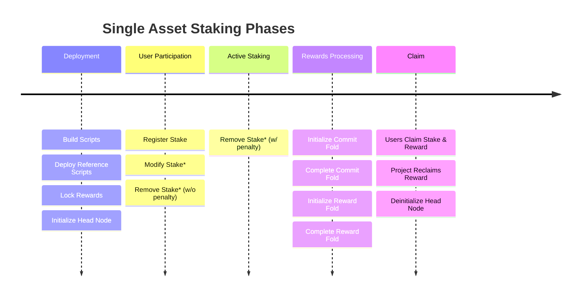
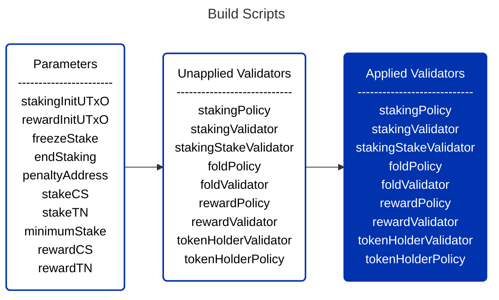
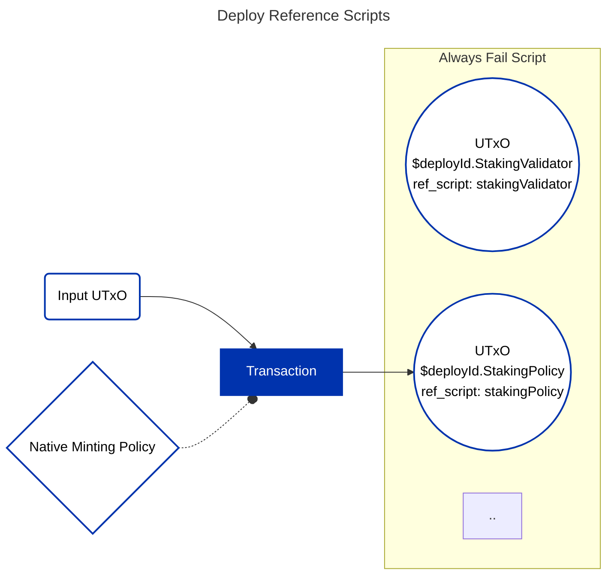
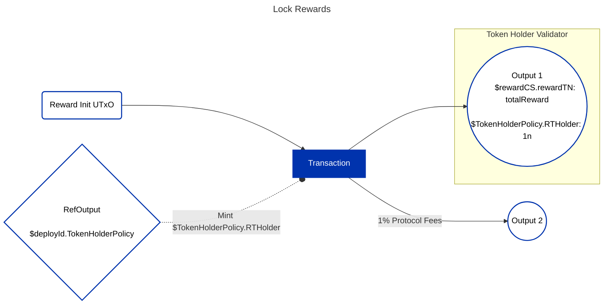
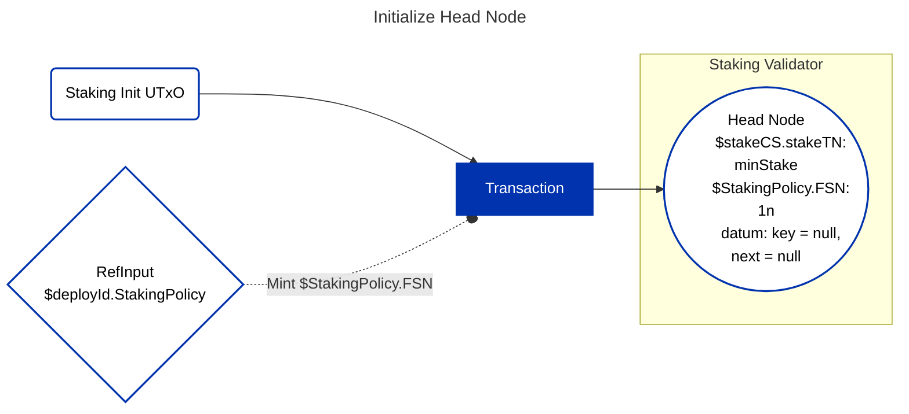
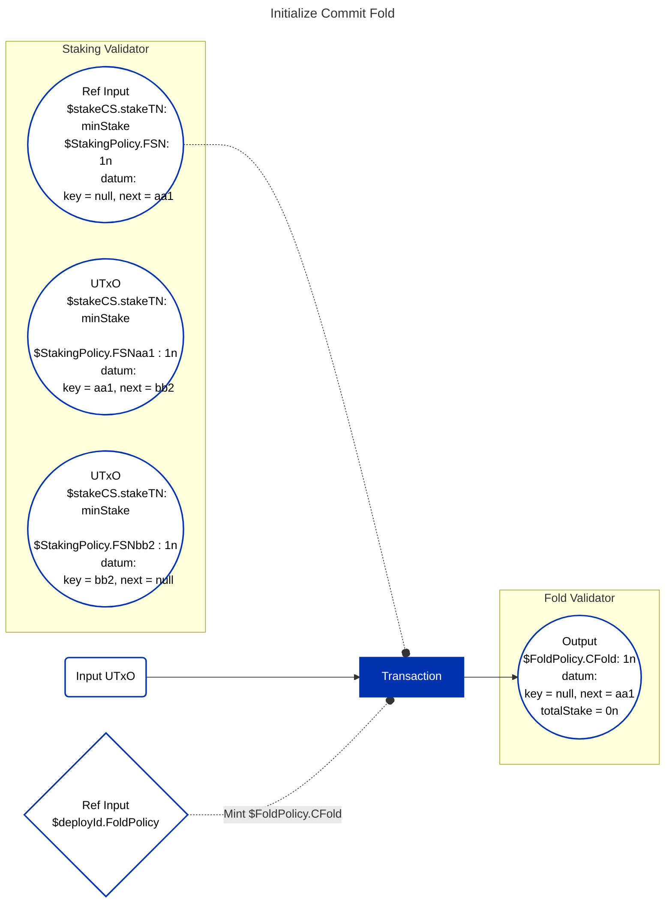
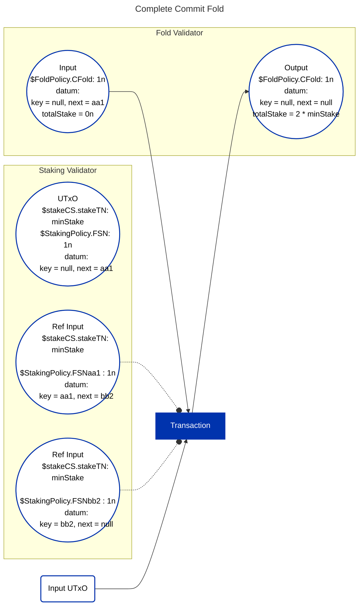
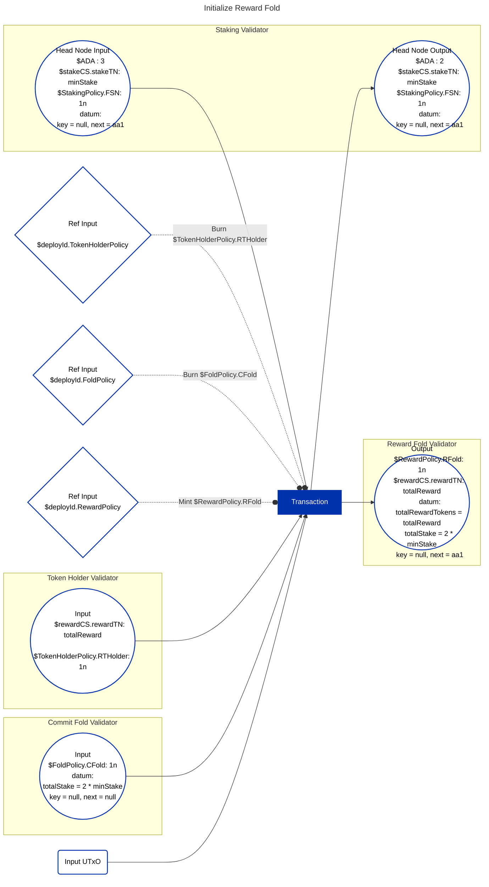
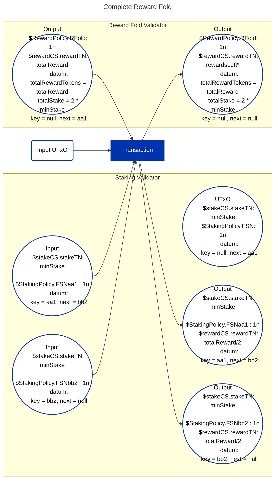

## Introduction

Single Asset Staking contracts facilitate collective staking of digital assets and distributing rewards among participants in a completely on-chain and trustless manner.

As the name suggests, it allows for a single asset, which can be any Cardano Native Fungible Token, to be staked to earn rewards. The reward itself can be any Cardano Native Fungible Token. The contracts are parameterized with `policyId` and `tokenName` (in addition to a few others) of stake token and reward token. This allows different projects conducting the Staking event to configure the contracts accordingly.

Instead of a fixed percentage based return, the staking reward obtained is not known beforehand. Because its determined by the total amount of assets staked till the end of the staking period and the total rewards locked before staking begins. Eligible participants are then given rewards propotional to their share of stake (`(userStake * totalRewards) / totalStake`).

:::info
The source code for these dApps can be found [here](https://github.com/Anastasia-Labs/single-asset-staking).
:::

## Overview

An interesting technical detail about this protocol is the use of an [on-chain association list](https://github.com/Plutonomicon/plutonomicon/blob/main/assoc.md). It maintains every unique public key's stake in a separate UTxO which points to the next stake UTxO. Every UTxO in the list will have `StakingSetNode` in its datum.

```rust
data StakingSetNode = MkSetNode
  { key :: StakingNodeKey  -- owner wallet's PaymentPubKeyHash
  , next :: StakingNodeKey -- next PaymentPubKeyHash in a list of lexicographically sorted key hashes
  }

data StakingNodeKey = Key BuiltinByteString | Empty
```

This sections provides you with the timeline of different phases involved in Single Asset Staking. With each phase further listing the order of actions which comprises it.



:::note
Actions which can be performed if user wishes to.
:::

## Deployment

Everything begins here with the project configuring and setting up the Smart Contracts. Its only after the deployment phase is completed that users can begin staking. It comprises of below four actions that need to be performed.

### Build Scripts

The contracts available from [Single Asset Staking](https://github.com/Anastasia-Labs/single-asset-staking) repository, require paramters configuring details of Staking event.



### Deploy Reference Scripts

This step uses the applied validators obtained above to create a [Reference Script UTxO](https://github.com/cardano-foundation/CIPs/tree/master/CIP-0033) for every validator. In order to easily identify a particular validator on-chain, a native minting policy is used in conjuction. It mints an NFT with the validator name and is made available inside the `RefUTxO`. This native minting policy allows minting for a very short duration of **thirty mintues** within which all the `RefUTxOs` must be created. All the `RefUTxOs` are sent to an `Always Fail Script` address ensuring they are immutable and locked forever.



### **Lock Rewards**

Here project locks the entire staking reward in `tokenHolderValidator`. The total reward amount will be distributed among participants in proportion to their stake. Locking of rewards beforehand gives high assurance to all the participants before they can begin staking. One percent of total reward amount is paid as protocol fees for facilitating staking.



### **Initialize Head Node**

This marks the beginning of the association list which will contain all the stake by different participants as separate UTxOs. The first node of the list know as head node is created in this step.

Head node differs from all the nodes in that its key is null. Every valid stake UTxO in the list has a unique "Node Token" which is minted by `stakingPolicy` at the time of its insertion. The token name is derived as `NODE_PREFIX ("FSN") + PaymentPubKeyHash` thereby making every node token unique. Head node just has `NODE_PREFIX` as the token name.



## User Participation

Now the Staking event is opened and users can participate by locking their stake in `stakingValidator` by updating the linked list. Before the stake is frozen, participants can choose to increase, decrease or remove their stake altogether.

## Active Staking

Once stake is frozen (configured by parameter `freezeStake :: POSIXTime`), the active staking phase begins for which the participants will be earning rewards. This phase lasts till `endStaking :: POSIXTime` as decided by the project. During this period, new participants cannot enter nor can the old ones modify their stake. However, existing stakers can still get their stake back if they choose to, by paying 25% of their stake as penalty fee.

## Rewards Processing

After the active staking phase has ended (after `endStaking :: POSIXTime`) comes the part where project processes and allocates rewards to its participants who staked till now.

Its done by first calculating and saving the total amount staked on-chain. Then every participant's stake UTxO is updated to include rewards in it, in proportion to their stake. Reward calculation is given by the formula `(userStake * totalRewards) / totalStake`.

Following sequence of on-chain actions elaborate further on how rewards processing mechanism works.

### Initialize Commit Fold

Commit Fold carries out the computation of total staked amount by going over all the linked list UTxOs one after the other in order. The current state of the computation, i.e. how far along the linked list it has summed and the current sum, is stored in a UTxO at `foldValidator`. This UTxO is uniquely identified with the presence of an NFT (`$FoldPolicy.CFold`) minted using `foldPolicy`. This initialization of commit UTxO is perfomed in this step.



### Complete Commit Fold

Here one stake UTxO after another is used as reference input to calculate and update `totalStake` value in Commit Fold UTxO's datum. This is done till the end of list is not reached, at which point `next = null` in fold datum and `totalStake` is finally determined.



:::note
Head Node's stake is never taken into account.
:::

### Initialize Reward Fold

Now that we have total staked amount available on-chain, we initialize the reward fold wherein a UTxO to `rewardValidator` is sent. This contains total reward amount obtained from UTxO locked at `Token Holder Validator` along with `totalRewardTokens` and `totalStake` in its datum. Additionally, it has `$RewardPolicy.RFold` NFT minted from `Reward Policy` which validates that the initialization is carried out accurately.



> Note: Upon undergoing rewards fold a UTxO has to pay 1 ADA folding fee.

### Complete Reward Fold

With Reward Fold UTxO initialized with rewards and other essential information, rewards can be distributed into individual stake UTxO. This is similar to commit fold, with UTxO after head node being processed first and other UTxOs in the order they appear in list. Rewards fold gets concluded when `next = null` on processing the last UTxO of the list. Upon undergoing rewards fold a UTxO has to pay 1 ADA folding fee.



:::note
If any reward tokens are left due to remainder from integer division in `(userStake * totalRewards) / totalStake`
:::

## Claim

Only after rewards are processed can the participants claim their stake and reward. They can do so by spending their stake UTxO from "Staking Validator" after signing transaction with private key belonging to the PaymentPubKeyHash as `key` in UTxO's datum.

### Project Reclaims Reward

Once the rewards are processed, project is free to claim any remaining project tokens left in "Reward Fold UTxO" along with any lovelaces present. They'll have to additionally burn "$RewardPolicy.RFold" token for this, which is only allowed when `next = null` i.e. all rewards are processed.

### Deinitialize Head Node

The project is also free to reclaim the Head Node with the "minStake" and lovelaces present in it. It can only be done after the reward fold is initiated (Reward Fold Token datum has `next == *head node's next*`), therefore ensuring no information is lost.

## Offchain Implementation

You can find the entire offchain implementation complimenting this dApp [here](https://github.com/Anastasia-Labs/single-asset-staking-offchain).