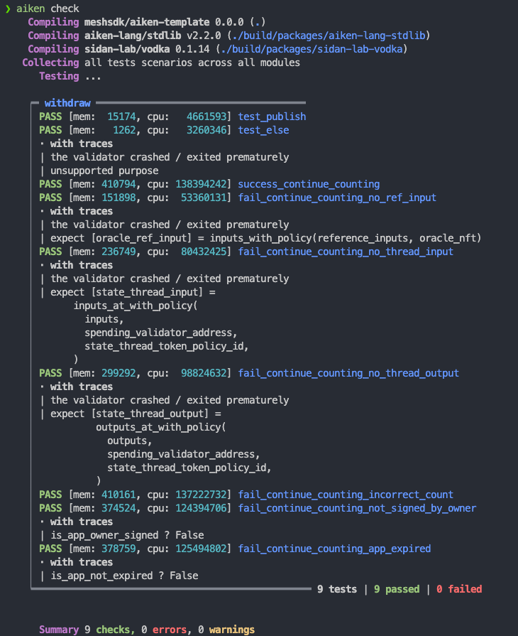

Testing Aiken contracts is crucial to ensure they behave as expected. In this lesson, we will cover:

- Preparing a complex contract for testing
- Building mock transactions in Aiken and running tests

## Preparing a Complex Contract

We will enhance the withdrawal contract from the previous lesson to include two user actions: `ContinueCounting` or `StopCounting`.

1. **ContinueCounting**:
   - Verify the transaction is signed by the app owner.
   - Ensure the app is not expired (using a POSIX timestamp).
   - Carry forward the state thread token to the output.
   - Increment the count in the state thread token's datum by 1.

2. **StopCounting**:
   - Verify the transaction is signed by the app owner.
   - Ensure the state thread token is burned (not carried forward to any output).

### Contract Code

```aiken
use aiken/crypto.{VerificationKeyHash}
use cardano/address.{Address, Credential}
use cardano/assets.{PolicyId}
use cardano/certificate.{Certificate}
use cardano/transaction.{Transaction}
use cocktail.{input_inline_datum, inputs_with_policy, key_signed, valid_before}

pub type OracleDatum {
  app_owner: VerificationKeyHash,
  app_expiry: Int,
  spending_validator_address: Address,
  state_thread_token_policy_id: PolicyId,
}

pub type MyRedeemer {
  ContinueCounting
  StopCounting
}

validator complex_withdrawal_contract(oracle_nft: PolicyId) {
  withdraw(redeemer: MyRedeemer, _credential: Credential, tx: Transaction) {
    let Transaction {
      reference_inputs,
      mint,
      extra_signatories,
      validity_range,
      ..
    } = tx

    expect [oracle_ref_input] = inputs_with_policy(reference_inputs, oracle_nft)
    expect OracleDatum {
      app_owner,
      app_expiry,
      ..
    } = input_inline_datum(oracle_ref_input)

    let is_app_owner_signed = key_signed(extra_signatories, app_owner)

    when redeemer is {
      ContinueCounting -> {
        let is_app_not_expired = valid_before(validity_range, app_expiry)
        let is_nothing_minted = mint == assets.zero

        is_app_owner_signed? && is_app_not_expired? && is_nothing_minted?
      }
      StopCounting -> todo
    }
  }

  publish(_redeemer: Data, _credential: Certificate, _tx: Transaction) {
    True
  }

  else(_) {
    fail @"unsupported purpose"
  }
}
```

In this setup, we define 2 potential user action with `MyRedeemer`, either to `ContinueCounting` or `StopCounting`. We built the partial logics for `ContinueCounting` action, which we put all the logics we have learnt from lesson 3.

### `expect`

Notice we touch on the syntax of `expect` the first time here. `expect` is used to enforce the exact pattern for a variable. In above example, `inputs_with_policy(reference_inputs, oracle_nft)` returns `List<Input>`. However, since in this application we are confident that there is always one item in the list, perhaps since `oracle_nft` is unique, it is impossible to obtain two inputs with `oracle_nft` in value. So that we can use `expect` here.

### `?` operator

In the last line of `ContinueCounting` branch, you may notice the use of `?` operator. This operator is a tracing operator that helps to trace which condition fails when the validator fails. For example, if `is_app_owner_signed` is false, then the validator will fail with message `is_app_owner_signed?` which helps to identify the root cause of failure.

## Validating Input & Output

We complete the contract by validating inputs and outputs:

```aiken
use aiken/crypto.{VerificationKeyHash}
use cardano/address.{Address, Credential}
use cardano/assets.{PolicyId, without_lovelace}
use cardano/certificate.{Certificate}
use cardano/transaction.{Transaction}
use cocktail.{
  input_inline_datum, inputs_at_with_policy, inputs_with_policy, key_signed,
  output_inline_datum, outputs_at_with_policy, valid_before,
}

pub type OracleDatum {
  app_owner: VerificationKeyHash,
  app_expiry: Int,
  spending_validator_address: Address,
  state_thread_token_policy_id: PolicyId,
}

pub type SpendingValidatorDatum {
  count: Int,
}

pub type MyRedeemer {
  ContinueCounting
  StopCounting
}

validator complex_withdrawal_contract(oracle_nft: PolicyId) {
  withdraw(redeemer: MyRedeemer, _credential: Credential, tx: Transaction) {
    let Transaction {
      reference_inputs,
      inputs,
      outputs,
      mint,
      extra_signatories,
      validity_range,
      ..
    } = tx

    expect [oracle_ref_input] = inputs_with_policy(reference_inputs, oracle_nft)
    expect OracleDatum {
      app_owner,
      app_expiry,
      spending_validator_address,
      state_thread_token_policy_id,
    } = input_inline_datum(oracle_ref_input)

    expect [state_thread_input] =
      inputs_at_with_policy(
        inputs,
        spending_validator_address,
        state_thread_token_policy_id,
      )

    let is_app_owner_signed = key_signed(extra_signatories, app_owner)

    when redeemer is {
      ContinueCounting -> {
        expect [state_thread_output] =
          outputs_at_with_policy(
            outputs,
            spending_validator_address,
            state_thread_token_policy_id,
          )
        expect input_datum: SpendingValidatorDatum =
          input_inline_datum(state_thread_input)
        expect output_datum: SpendingValidatorDatum =
          output_inline_datum(state_thread_output)

        let is_app_not_expired = valid_before(validity_range, app_expiry)
        let is_count_added = input_datum.count + 1 == output_datum.count
        let is_nothing_minted = mint == assets.zero

        is_app_owner_signed? && is_app_not_expired? && is_count_added && is_nothing_minted?
      }
      StopCounting -> {
        let state_thread_value =
          state_thread_input.output.value |> without_lovelace()
        let is_thread_token_burned = mint == assets.negate(state_thread_value)
        is_app_owner_signed? && is_thread_token_burned?
      }
    }
  }

  publish(_redeemer: Data, _credential: Certificate, _tx: Transaction) {
    True
  }

  else(_) {
    fail @"unsupported purpose"
  }
}
```

We have used some new techniques here. We have extracted the inline datum of the state thread token input and output using `input_inline_datum` and `output_inline_datum`. We have also used `inputs_at_with_policy` and `outputs_at_with_policy` to filter the inputs and outputs at a specific address with a specific policy ID. With that, we can compare the datum of input and output to ensure the count is incremented by 1.

In `StopCounting` case, we ensure the state thread token is burned by checking the `mint` field of the transaction. We use `without_lovelace` to ignore the lovelace part of the value when comparing.

## Build mock transaction in Aiken

All Aiken contracts can be interpreted as simple functions, which takes in a few parameters and returns a boolean value. This makes it easy to test the contract by providing mock data.

In Aiken, we can build testing functions with `test` keyword, followed by running `aiken check` in project root to execute the tests.

The vanilla example:

```aiken
test always_true() {
  True
}
```

With `aiken check`, we will see:


### Testing always succeed and always fail cases

In our complex withdrawal contract, we have a `publish` function that always returns `True`. We can write a test for it:

```aiken
use mocktail.{complete, mock_utxo_ref, mocktail_tx}

test test_publish() {
  let data = Void
  complex_withdrawal_contract.publish(
    "",
    data,
    RegisterCredential(Script(#""), Never),
    mocktail_tx() |> complete(),
  )
}
```

In this test, we call the `publish` function of our contract with mock parameters. We use `mocktail_tx()` to create a mock transaction and `complete()` to provide an empty `Transaction`.

For the rest of script purposes, it will fallback to the `else` branch which always fails. We can write a test for it:

```aiken
test test_else() fail {
  complex_withdrawal_contract.else(
    "",
    ScriptContext(
      mocktail_tx() |> complete(),
      Void,
      Spending(mock_utxo_ref(0, 0), None),
    ),
  )
}
```

Note that the test is not returning a `False`, but the programme breaks with `fail`. We can indicate that the test is expected to fail by adding `fail` after the test name.

Running `aiken check` will show:


### Testing `withdraw` function

You will notice the `withdraw` function is validated the `Transaction` mostly, therefore, we should craft the `Transaction` carefully. However, crafting it with mock data is a bit tricky especially when we have to deal with all the Aiken types. `vodka` library comes to rescue.

In `vodka`, the `mocktail` module provides a set of functions to create mock data for testing Aiken contracts. We can use `mocktail_tx()` to create a mock `Transaction` and then use various functions to modify the transaction to fit our test case.

```aiken
const mock_oracle_nft = mock_policy_id(0)

const mock_oracle_address = mock_script_address(0, None)

const mock_oracle_value =
  assets.from_asset(mock_oracle_nft, "", 1) |> assets.add("", "", 2_000_000)

const mock_app_owner = mock_pub_key_hash(0)

const mock_spending_validator_address = mock_script_address(1, None)

const mock_state_thread_token_policy_id = mock_policy_id(1)

const mock_state_thread_value =
  assets.from_asset(mock_state_thread_token_policy_id, "", 1)
    |> assets.add("", "", 2_000_000)

const mock_oracle_datum =
  OracleDatum {
    app_owner: mock_app_owner,
    app_expiry: 1000,
    spending_validator_address: mock_spending_validator_address,
    state_thread_token_policy_id: mock_state_thread_token_policy_id,
  }

fn mock_datum(count: Int) -> SpendingValidatorDatum {
  SpendingValidatorDatum { count }
}

fn mock_continue_counting_tx() -> Transaction {
  mocktail_tx()
    |> ref_tx_in(
        True,
        mock_tx_hash(0),
        0,
        mock_oracle_value,
        mock_oracle_address,
      )
    |> ref_tx_in_inline_datum(True, mock_oracle_datum)
    |> tx_in(
        True,
        mock_tx_hash(1),
        0,
        mock_state_thread_value,
        mock_spending_validator_address,
      )
    |> tx_in_inline_datum(True, mock_datum(0))
    |> tx_out(True, mock_spending_validator_address, mock_state_thread_value)
    |> tx_out_inline_datum(True, mock_datum(1))
    |> required_signer_hash(True, mock_app_owner)
    |> invalid_hereafter(True, 999)
    |> complete()
}
```

We can import all the `mock_...` functions from `mocktail` module to build up the types we need. In above example, we create a mock transaction for `ContinueCounting` action. We create the oracle NFT input with inline datum, the state thread token input with inline datum, the state thread token output with inline datum, the required signer and the validity range.

Now we can write a test for `ContinueCounting` action:

```aiken
test success_continue_counting() {
  complex_withdrawal_contract.withdraw(
    mock_oracle_nft,
    ContinueCounting,
    Credential.Script(#""),
    mock_continue_counting_tx(),
  )
}
```

### Dynamically Testing Failure Cases

In the mocktail transaction building methods, we can pass a boolean parameter to indicate whether we want the field to be present or not. This allows us to dynamically create failure cases by omitting certain fields.

```aiken
type ContinueCountingTest {
  is_ref_input_presented: Bool,
  is_thread_input_presented: Bool,
  is_thread_output_presented: Bool,
  is_count_added: Bool,
  is_app_owner_signed: Bool,
  is_tx_not_expired: Bool,
}

fn mock_continue_counting_tx(test_case: ContinueCountingTest) -> Transaction {
  let ContinueCountingTest {
    is_ref_input_presented,
    is_thread_input_presented,
    is_thread_output_presented,
    is_count_added,
    is_app_owner_signed,
    is_tx_not_expired,
  } = test_case

  let output_datum =
    if is_count_added {
      mock_datum(1)
    } else {
      mock_datum(0)
    }
  mocktail_tx()
    |> ref_tx_in(
        is_ref_input_presented,
        mock_tx_hash(0),
        0,
        mock_oracle_value,
        mock_oracle_address,
      )
    |> ref_tx_in_inline_datum(is_ref_input_presented, mock_oracle_datum)
    |> tx_in(
        is_thread_input_presented,
        mock_tx_hash(1),
        0,
        mock_state_thread_value,
        mock_spending_validator_address,
      )
    |> tx_in_inline_datum(is_thread_input_presented, mock_datum(0))
    |> tx_out(
        is_thread_output_presented,
        mock_spending_validator_address,
        mock_state_thread_value,
      )
    |> tx_out_inline_datum(is_thread_output_presented, output_datum)
    |> required_signer_hash(is_app_owner_signed, mock_app_owner)
    |> invalid_hereafter(is_tx_not_expired, 999)
    |> complete()
}
```

And we update the successful test accordingly:

```aiken
test success_continue_counting() {
  let test_case =
    ContinueCountingTest {
      is_ref_input_presented: True,
      is_thread_input_presented: True,
      is_thread_output_presented: True,
      is_count_added: True,
      is_app_owner_signed: True,
      is_tx_not_expired: True,
    }

  complex_withdrawal_contract.withdraw(
    mock_oracle_nft,
    ContinueCounting,
    Credential.Script(#""),
    mock_continue_counting_tx(test_case),
  )
}
```

And we can populate the failure cases at ease:

```aiken
test fail_continue_counting_no_ref_input() fail {
  let test_case =
    ContinueCountingTest {
      is_ref_input_presented: False,
      is_thread_input_presented: True,
      is_thread_output_presented: True,
      is_count_added: True,
      is_app_owner_signed: True,
      is_tx_not_expired: True,
    }

  complex_withdrawal_contract.withdraw(
    mock_oracle_nft,
    ContinueCounting,
    Credential.Script(#""),
    mock_continue_counting_tx(test_case),
  )
}

test fail_continue_counting_no_thread_input() fail {
  let test_case =
    ContinueCountingTest {
      is_ref_input_presented: True,
      is_thread_input_presented: False,
      is_thread_output_presented: True,
      is_count_added: True,
      is_app_owner_signed: True,
      is_tx_not_expired: True,
    }

  complex_withdrawal_contract.withdraw(
    mock_oracle_nft,
    ContinueCounting,
    Credential.Script(#""),
    mock_continue_counting_tx(test_case),
  )
}

test fail_continue_counting_no_thread_output() fail {
  let test_case =
    ContinueCountingTest {
      is_ref_input_presented: True,
      is_thread_input_presented: True,
      is_thread_output_presented: False,
      is_count_added: True,
      is_app_owner_signed: True,
      is_tx_not_expired: True,
    }

  complex_withdrawal_contract.withdraw(
    mock_oracle_nft,
    ContinueCounting,
    Credential.Script(#""),
    mock_continue_counting_tx(test_case),
  )
}

test fail_continue_counting_incorrect_count() {
  let test_case =
    ContinueCountingTest {
      is_ref_input_presented: True,
      is_thread_input_presented: True,
      is_thread_output_presented: True,
      is_count_added: False,
      is_app_owner_signed: True,
      is_tx_not_expired: True,
    }

  !complex_withdrawal_contract.withdraw(
    mock_oracle_nft,
    ContinueCounting,
    Credential.Script(#""),
    mock_continue_counting_tx(test_case),
  )
}

test fail_continue_counting_not_signed_by_owner() {
  let test_case =
    ContinueCountingTest {
      is_ref_input_presented: True,
      is_thread_input_presented: True,
      is_thread_output_presented: True,
      is_count_added: True,
      is_app_owner_signed: False,
      is_tx_not_expired: True,
    }

  !complex_withdrawal_contract.withdraw(
    mock_oracle_nft,
    ContinueCounting,
    Credential.Script(#""),
    mock_continue_counting_tx(test_case),
  )
}

test fail_continue_counting_app_expired() {
  let test_case =
    ContinueCountingTest {
      is_ref_input_presented: True,
      is_thread_input_presented: True,
      is_thread_output_presented: True,
      is_count_added: True,
      is_app_owner_signed: True,
      is_tx_not_expired: False,
    }

  !complex_withdrawal_contract.withdraw(
    mock_oracle_nft,
    ContinueCounting,
    Credential.Script(#""),
    mock_continue_counting_tx(test_case),
  )
}
```

Running `aiken check` will show:


### Exercise

Write tests for `StopCounting` action. Refer to `ContinueCounting` tests for guidance. Suggested answers are in the code example.
