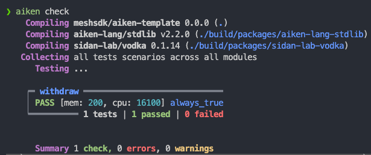
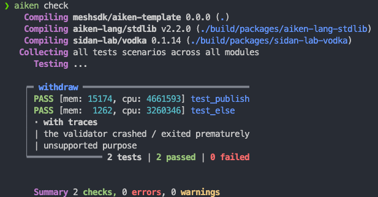
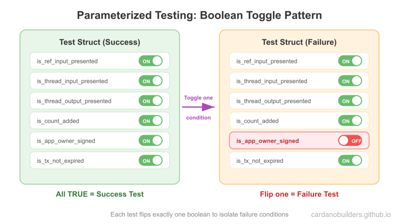
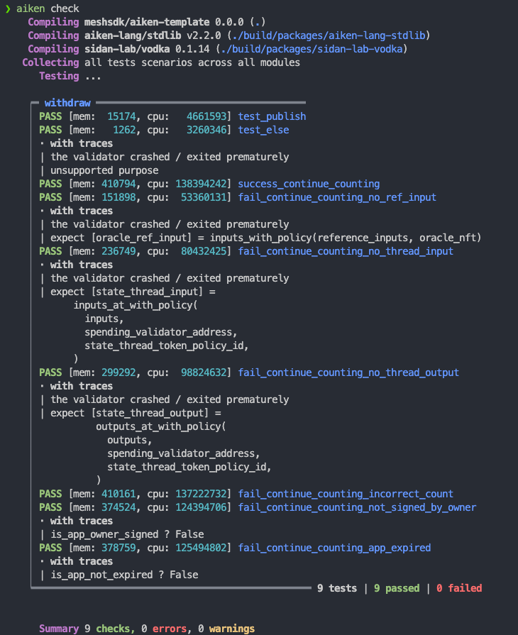
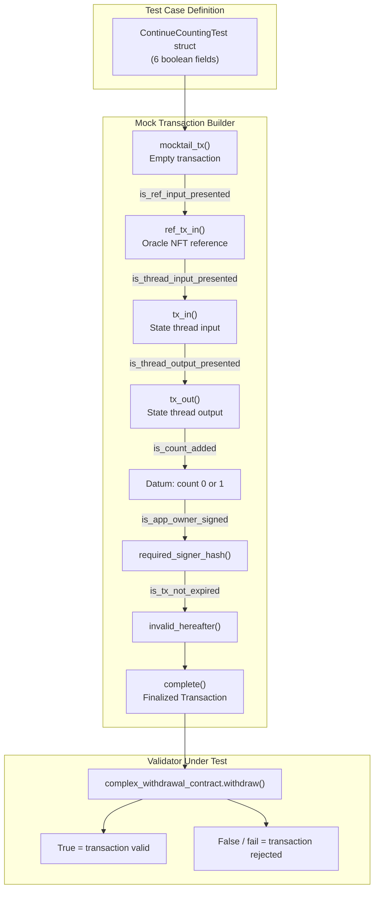

# Lesson #04: Contract Testing

Testing Aiken contracts ensures they behave as expected before deployment. This lesson covers:

- Preparing a complex contract for testing
- Building mock transactions in Aiken and running tests with `aiken check`

> Source code: [GitHub](https://github.com/cardanobuilders/cardanobuilders.github.io/tree/main/codes/course-cardano/04-contract-testing)

## Preparing a Complex Contract

Start by enhancing the withdrawal contract from the previous lesson with two user actions: `ContinueCounting` and `StopCounting`.

1. **ContinueCounting**:
   - Verify the transaction is signed by the app owner.
   - Ensure the app is not expired (using a POSIX timestamp).
   - Carry forward the state thread token to the output.
   - Increment the count in the state thread token's datum by 1.

2. **StopCounting**:
   - Verify the transaction is signed by the app owner.
   - Ensure the state thread token is burned (not carried forward to any output).

### Contract Code

```rs
use aiken/crypto.{VerificationKeyHash}
use cardano/address.{Address, Credential}
use cardano/assets.{PolicyId}
use cardano/certificate.{Certificate}
use cardano/transaction.{Transaction}
use cocktail.{input_inline_datum, inputs_with_policy, key_signed, valid_before}

pub type OracleDatum {
  app_owner: VerificationKeyHash,
  app_expiry: Int,
  spending_validator_address: Address,
  state_thread_token_policy_id: PolicyId,
}

pub type MyRedeemer {
  ContinueCounting
  StopCounting
}

validator complex_withdrawal_contract(oracle_nft: PolicyId) {
  withdraw(redeemer: MyRedeemer, _credential: Credential, tx: Transaction) {
    let Transaction {
      reference_inputs,
      mint,
      extra_signatories,
      validity_range,
      ..
    } = tx

    expect [oracle_ref_input] = inputs_with_policy(reference_inputs, oracle_nft)
    expect OracleDatum {
      app_owner,
      app_expiry,
      ..
    } = input_inline_datum(oracle_ref_input)

    let is_app_owner_signed = key_signed(extra_signatories, app_owner)

    when redeemer is {
      ContinueCounting -> {
        let is_app_not_expired = valid_before(validity_range, app_expiry)
        let is_nothing_minted = mint == assets.zero

        is_app_owner_signed? && is_app_not_expired? && is_nothing_minted?
      }
      StopCounting -> todo
    }
  }

  publish(_redeemer: Data, _credential: Certificate, _tx: Transaction) {
    True
  }

  else(_) {
    fail @"unsupported purpose"
  }
}
```

This setup defines two user actions with `MyRedeemer`: `ContinueCounting` and `StopCounting`. The partial logic for `ContinueCounting` applies the validation patterns covered in Lesson 3.

### `expect`

The `expect` keyword enforces an exact pattern match on a variable. In this example, `inputs_with_policy(reference_inputs, oracle_nft)` returns `List<Input>`. Since `oracle_nft` is unique, the list always contains exactly one item, making `expect [oracle_ref_input]` a safe destructuring.

### `?` operator

The `?` operator in the `ContinueCounting` branch is a tracing operator. When a validator fails, it reports which condition evaluated to false. For example, if `is_app_owner_signed` is false, the validator fails with the message `is_app_owner_signed?`, making it easy to identify the root cause.

## Validating Input & Output

We complete the contract by validating inputs and outputs:

```rs
use aiken/crypto.{VerificationKeyHash}
use cardano/address.{Address, Credential}
use cardano/assets.{PolicyId, without_lovelace}
use cardano/certificate.{Certificate}
use cardano/transaction.{Transaction}
use cocktail.{
  input_inline_datum, inputs_at_with_policy, inputs_with_policy, key_signed,
  output_inline_datum, outputs_at_with_policy, valid_before,
}

pub type OracleDatum {
  app_owner: VerificationKeyHash,
  app_expiry: Int,
  spending_validator_address: Address,
  state_thread_token_policy_id: PolicyId,
}

pub type SpendingValidatorDatum {
  count: Int,
}

pub type MyRedeemer {
  ContinueCounting
  StopCounting
}

validator complex_withdrawal_contract(oracle_nft: PolicyId) {
  withdraw(redeemer: MyRedeemer, _credential: Credential, tx: Transaction) {
    let Transaction {
      reference_inputs,
      inputs,
      outputs,
      mint,
      extra_signatories,
      validity_range,
      ..
    } = tx

    expect [oracle_ref_input] = inputs_with_policy(reference_inputs, oracle_nft)
    expect OracleDatum {
      app_owner,
      app_expiry,
      spending_validator_address,
      state_thread_token_policy_id,
    } = input_inline_datum(oracle_ref_input)

    expect [state_thread_input] =
      inputs_at_with_policy(
        inputs,
        spending_validator_address,
        state_thread_token_policy_id,
      )

    let is_app_owner_signed = key_signed(extra_signatories, app_owner)

    when redeemer is {
      ContinueCounting -> {
        expect [state_thread_output] =
          outputs_at_with_policy(
            outputs,
            spending_validator_address,
            state_thread_token_policy_id,
          )
        expect input_datum: SpendingValidatorDatum =
          input_inline_datum(state_thread_input)
        expect output_datum: SpendingValidatorDatum =
          output_inline_datum(state_thread_output)

        let is_app_not_expired = valid_before(validity_range, app_expiry)
        let is_count_added = input_datum.count + 1 == output_datum.count
        let is_nothing_minted = mint == assets.zero

        is_app_owner_signed? && is_app_not_expired? && is_count_added && is_nothing_minted?
      }
      StopCounting -> {
        let state_thread_value =
          state_thread_input.output.value |> without_lovelace()
        let is_thread_token_burned = mint == assets.negate(state_thread_value)
        is_app_owner_signed? && is_thread_token_burned?
      }
    }
  }

  publish(_redeemer: Data, _credential: Certificate, _tx: Transaction) {
    True
  }

  else(_) {
    fail @"unsupported purpose"
  }
}
```

This version introduces several new techniques:

- `input_inline_datum` and `output_inline_datum` extract inline datums from the state thread token's input and output
- `inputs_at_with_policy` and `outputs_at_with_policy` filter inputs and outputs by address and policy ID
- The datum comparison ensures the count increments by exactly 1

For `StopCounting`, the validator ensures the state thread token is burned by checking the `mint` field. The `without_lovelace` function strips the lovelace portion of the value for clean comparison.

## Build mock transaction in Aiken

All Aiken contracts are functions that take parameters and return a boolean. This makes testing straightforward: provide mock data and assert the result.

Define test functions with the `test` keyword, then run `aiken check` from the project root to execute them.

A minimal example:

```rs
test always_true() {
  True
}
```



### Testing always succeed and always fail cases

The complex withdrawal contract has a `publish` function that always returns `True`. Test it like this:

```rs
use mocktail.{complete, mock_utxo_ref, mocktail_tx}

test test_publish() {
  let data = Void
  complex_withdrawal_contract.publish(
    "",
    data,
    RegisterCredential(Script(#""), Never),
    mocktail_tx() |> complete(),
  )
}
```

This test calls `publish` with mock parameters. `mocktail_tx()` creates a mock transaction and `complete()` finalizes it as an empty `Transaction`.

All other script purposes fall through to the `else` branch, which always fails. Test this expected failure:

```rs
test test_else() fail {
  complex_withdrawal_contract.else(
    "",
    ScriptContext(
      mocktail_tx() |> complete(),
      Void,
      Spending(mock_utxo_ref(0, 0), None),
    ),
  )
}
```

The test does not return `False`; the program breaks with `fail`. Adding `fail` after the test name marks the test as expected to fail.



### Testing `withdraw` function

The `withdraw` function validates the `Transaction` structure, so crafting accurate mock data is essential. Building all the required Aiken types manually is tedious, which is where the `vodka` library helps.

The `mocktail` module in `vodka` provides functions for creating mock data. Start with `mocktail_tx()` to create a base `Transaction`, then chain modifier functions to fit your test case:

```rs
const mock_oracle_nft = mock_policy_id(0)

const mock_oracle_address = mock_script_address(0, None)

const mock_oracle_value =
  assets.from_asset(mock_oracle_nft, "", 1) |> assets.add("", "", 2_000_000)

const mock_app_owner = mock_pub_key_hash(0)

const mock_spending_validator_address = mock_script_address(1, None)

const mock_state_thread_token_policy_id = mock_policy_id(1)

const mock_state_thread_value =
  assets.from_asset(mock_state_thread_token_policy_id, "", 1)
    |> assets.add("", "", 2_000_000)

const mock_oracle_datum =
  OracleDatum {
    app_owner: mock_app_owner,
    app_expiry: 1000,
    spending_validator_address: mock_spending_validator_address,
    state_thread_token_policy_id: mock_state_thread_token_policy_id,
  }

fn mock_datum(count: Int) -> SpendingValidatorDatum {
  SpendingValidatorDatum { count }
}

fn mock_continue_counting_tx() -> Transaction {
  mocktail_tx()
    |> ref_tx_in(
        True,
        mock_tx_hash(0),
        0,
        mock_oracle_value,
        mock_oracle_address,
      )
    |> ref_tx_in_inline_datum(True, mock_oracle_datum)
    |> tx_in(
        True,
        mock_tx_hash(1),
        0,
        mock_state_thread_value,
        mock_spending_validator_address,
      )
    |> tx_in_inline_datum(True, mock_datum(0))
    |> tx_out(True, mock_spending_validator_address, mock_state_thread_value)
    |> tx_out_inline_datum(True, mock_datum(1))
    |> required_signer_hash(True, mock_app_owner)
    |> invalid_hereafter(True, 999)
    |> complete()
}
```

The `mock_...` functions from the `mocktail` module build up the required types. This mock transaction for `ContinueCounting` includes the oracle NFT reference input with inline datum, state thread token input and output with inline datums, required signer, and validity range.

Test the `ContinueCounting` action:

```rs
test success_continue_counting() {
  complex_withdrawal_contract.withdraw(
    mock_oracle_nft,
    ContinueCounting,
    Credential.Script(#""),
    mock_continue_counting_tx(),
  )
}
```

### Dynamically Testing Failure Cases



The mocktail builder methods accept a boolean parameter to include or exclude fields. This enables dynamic failure case generation by toggling individual conditions:

```rs
type ContinueCountingTest {
  is_ref_input_presented: Bool,
  is_thread_input_presented: Bool,
  is_thread_output_presented: Bool,
  is_count_added: Bool,
  is_app_owner_signed: Bool,
  is_tx_not_expired: Bool,
}

fn mock_continue_counting_tx(test_case: ContinueCountingTest) -> Transaction {
  let ContinueCountingTest {
    is_ref_input_presented,
    is_thread_input_presented,
    is_thread_output_presented,
    is_count_added,
    is_app_owner_signed,
    is_tx_not_expired,
  } = test_case

  let output_datum =
    if is_count_added {
      mock_datum(1)
    } else {
      mock_datum(0)
    }
  mocktail_tx()
    |> ref_tx_in(
        is_ref_input_presented,
        mock_tx_hash(0),
        0,
        mock_oracle_value,
        mock_oracle_address,
      )
    |> ref_tx_in_inline_datum(is_ref_input_presented, mock_oracle_datum)
    |> tx_in(
        is_thread_input_presented,
        mock_tx_hash(1),
        0,
        mock_state_thread_value,
        mock_spending_validator_address,
      )
    |> tx_in_inline_datum(is_thread_input_presented, mock_datum(0))
    |> tx_out(
        is_thread_output_presented,
        mock_spending_validator_address,
        mock_state_thread_value,
      )
    |> tx_out_inline_datum(is_thread_output_presented, output_datum)
    |> required_signer_hash(is_app_owner_signed, mock_app_owner)
    |> invalid_hereafter(is_tx_not_expired, 999)
    |> complete()
}
```

Update the success test to use the parameterized structure:

```rs
test success_continue_counting() {
  let test_case =
    ContinueCountingTest {
      is_ref_input_presented: True,
      is_thread_input_presented: True,
      is_thread_output_presented: True,
      is_count_added: True,
      is_app_owner_signed: True,
      is_tx_not_expired: True,
    }

  complex_withdrawal_contract.withdraw(
    mock_oracle_nft,
    ContinueCounting,
    Credential.Script(#""),
    mock_continue_counting_tx(test_case),
  )
}
```

Failure cases are now straightforward to create by toggling a single boolean:

```rs
test fail_continue_counting_no_ref_input() fail {
  let test_case =
    ContinueCountingTest {
      is_ref_input_presented: False,
      is_thread_input_presented: True,
      is_thread_output_presented: True,
      is_count_added: True,
      is_app_owner_signed: True,
      is_tx_not_expired: True,
    }

  complex_withdrawal_contract.withdraw(
    mock_oracle_nft,
    ContinueCounting,
    Credential.Script(#""),
    mock_continue_counting_tx(test_case),
  )
}

test fail_continue_counting_no_thread_input() fail {
  let test_case =
    ContinueCountingTest {
      is_ref_input_presented: True,
      is_thread_input_presented: False,
      is_thread_output_presented: True,
      is_count_added: True,
      is_app_owner_signed: True,
      is_tx_not_expired: True,
    }

  complex_withdrawal_contract.withdraw(
    mock_oracle_nft,
    ContinueCounting,
    Credential.Script(#""),
    mock_continue_counting_tx(test_case),
  )
}

test fail_continue_counting_no_thread_output() fail {
  let test_case =
    ContinueCountingTest {
      is_ref_input_presented: True,
      is_thread_input_presented: True,
      is_thread_output_presented: False,
      is_count_added: True,
      is_app_owner_signed: True,
      is_tx_not_expired: True,
    }

  complex_withdrawal_contract.withdraw(
    mock_oracle_nft,
    ContinueCounting,
    Credential.Script(#""),
    mock_continue_counting_tx(test_case),
  )
}

test fail_continue_counting_incorrect_count() {
  let test_case =
    ContinueCountingTest {
      is_ref_input_presented: True,
      is_thread_input_presented: True,
      is_thread_output_presented: True,
      is_count_added: False,
      is_app_owner_signed: True,
      is_tx_not_expired: True,
    }

  !complex_withdrawal_contract.withdraw(
    mock_oracle_nft,
    ContinueCounting,
    Credential.Script(#""),
    mock_continue_counting_tx(test_case),
  )
}

test fail_continue_counting_not_signed_by_owner() {
  let test_case =
    ContinueCountingTest {
      is_ref_input_presented: True,
      is_thread_input_presented: True,
      is_thread_output_presented: True,
      is_count_added: True,
      is_app_owner_signed: False,
      is_tx_not_expired: True,
    }

  !complex_withdrawal_contract.withdraw(
    mock_oracle_nft,
    ContinueCounting,
    Credential.Script(#""),
    mock_continue_counting_tx(test_case),
  )
}

test fail_continue_counting_app_expired() {
  let test_case =
    ContinueCountingTest {
      is_ref_input_presented: True,
      is_thread_input_presented: True,
      is_thread_output_presented: True,
      is_count_added: True,
      is_app_owner_signed: True,
      is_tx_not_expired: False,
    }

  !complex_withdrawal_contract.withdraw(
    mock_oracle_nft,
    ContinueCounting,
    Credential.Script(#""),
    mock_continue_counting_tx(test_case),
  )
}
```



### Exercise

Write tests for the `StopCounting` action using the same pattern. Follow the `ContinueCounting` tests as a reference. Suggested answers are available in the code example.

## Source Code Walkthrough

This section walks through the project structure and testing patterns used in the source code, connecting them to testing practices you already know from web2 development.

### Project Structure

```
04-contract-testing/
├── validators/
│   └── withdraw.ak       # Complex withdrawal contract with all tests
├── aiken.toml             # Project config (like package.json for Aiken)
├── aiken.lock             # Dependency lock file (like package-lock.json)
└── plutus.json            # Compiled blueprint output (build artifact)
```

Compared to Lesson 3's scaffolded project, this is a standalone Aiken project with no `mesh/` folder or `aiken-workspace/` wrapper. Everything lives at the root.

| Aiken File | Web2 Equivalent | Purpose |
|---|---|---|
| `aiken.toml` | `package.json` | Declares the project name, version, and dependencies (e.g., `vodka` for test utilities). |
| `aiken.lock` | `package-lock.json` / `bun.lockb` | Pins exact dependency versions for reproducible builds. |
| `plutus.json` | Compiled build output (e.g., `dist/`) | The compiled Plutus blueprint. Generated by `aiken build` and consumed by off-chain code to interact with the contract. |
| `validators/withdraw.ak` | `src/` + `__tests__/` combined | Contains both the contract logic and its test functions in the same file. Aiken does not separate source and test directories. |

### Test Architecture: The Mock Transaction Builder Pattern

The core testing pattern in this lesson is building mock transactions with configurable boolean toggles. This is the Aiken equivalent of parameterized tests with fixture factories.


```mermaid
flowchart TD
    subgraph TEST_CASE["Test Case Definition"]
        TC["ContinueCountingTest struct\n(6 boolean fields)"]
    end

    subgraph MOCK_BUILDER["Mock Transaction Builder"]
        BASE["mocktail_tx()\nEmpty transaction"]
        BASE -->|"is_ref_input_presented"| REF["ref_tx_in()\nOracle NFT reference"]
        REF -->|"is_thread_input_presented"| TXI["tx_in()\nState thread input"]
        TXI -->|"is_thread_output_presented"| TXO["tx_out()\nState thread output"]
        TXO -->|"is_count_added"| DAT["Datum: count 0 or 1"]
        DAT -->|"is_app_owner_signed"| SIG["required_signer_hash()"]
        SIG -->|"is_tx_not_expired"| EXP["invalid_hereafter()"]
        EXP --> DONE["complete()\nFinalized Transaction"]
    end

    subgraph VALIDATOR["Validator Under Test"]
        DONE --> VAL["complex_withdrawal_contract.withdraw()"]
        VAL --> PASS["True = transaction valid"]
        VAL --> FAIL["False / fail = transaction rejected"]
    end

    TC --> BASE
```

The flow works like this:

1. **Define a test case struct** with boolean fields -- one per validation condition in the contract.
2. **Pass the struct to a builder function** that chains `mocktail` helpers. Each boolean controls whether a particular piece of transaction data is included or excluded.
3. **Call the validator** with the assembled mock transaction and assert the result.

This pattern maps directly to web2 testing concepts:

| Aiken Testing Concept | Web2 Equivalent | Explanation |
|---|---|---|
| `aiken check` | `npm test` / `bun test` | The CLI command that discovers and runs all `test` functions in the project. |
| `mocktail_tx()` + builder chain | Test fixture factory / request builder | Constructs a fake transaction the same way you would build a mock HTTP request with headers, body, and auth tokens. |
| `ContinueCountingTest` struct | Parameterized test config | A struct of booleans that toggles individual conditions, similar to `test.each()` in Jest or table-driven tests in Go. |
| Boolean toggles (`True`/`False`) | Feature flags in test fixtures | Each boolean includes or excludes one piece of the mock transaction, isolating a single failure condition per test. |
| `test ... fail` keyword | `expect(...).toThrow()` | Marks a test as expected to fail. The test passes only if the validator crashes or returns `False`. |
| `expect` keyword | `assert` / runtime type check | Pattern-matches a value and crashes if the shape does not match -- like a runtime schema validation. |
| `?` trace operator | Debug logging on assertion failure | Appends the variable name to the error trace when a condition is `False`, so you immediately see which check failed. |

### Why This Pattern Works Well

In web2 testing, you typically write one test per failure mode: missing auth header, expired token, malformed body, and so on. The boolean toggle pattern achieves the same thing for Cardano validators. The success test has all booleans set to `True`. Each failure test flips exactly one boolean to `False`, isolating the specific validation rule being tested.

This approach scales cleanly: when you add a new validation condition to the contract, you add one boolean to the struct, set it to `True` in the success test, and write one new failure test with that boolean set to `False`.

## Source code

The source code for this lesson is available on [GitHub](https://github.com/cardanobuilders/cardanobuilders.github.io/tree/main/codes/course-cardano/04-contract-testing).
