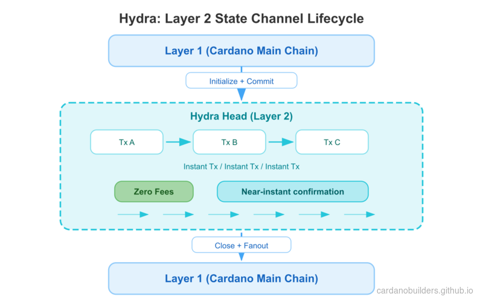
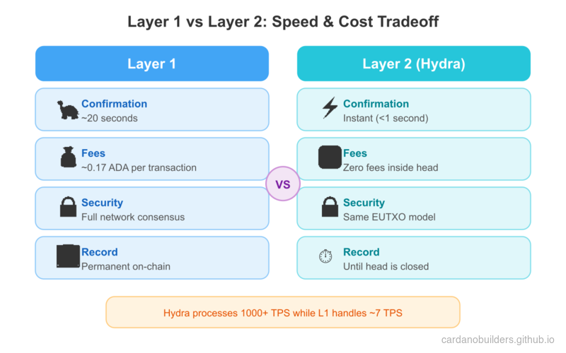
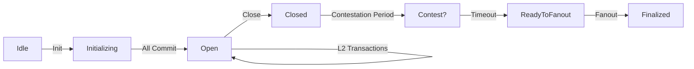

# Lesson #09: End-to-End Hydra Happy Flow

Hydra is a Layer 2 scaling solution for Cardano that enables near-instant, low-cost transactions between participants. It operates as a state channel: a temporary off-chain ledger where multiple parties can transact thousands of times per second while maintaining the security guarantees of the Cardano main chain (Layer 1).

In this lesson, you will:
- Set up and connect to Hydra nodes
- Open a Hydra Head between two participants
- Commit funds from Layer 1 into the Head
- Build and submit instant Layer 2 transactions using MeshJS
- Close the Head and settle the final state back to Layer 1

> Source code: [GitHub](https://github.com/cardanobuilders/cardanobuilders.github.io/tree/main/codes/course-cardano/09-hydra)

## Overview

### How Hydra Works

A Hydra Head is a state channel with a defined lifecycle:

1. **Initialize**: Participants agree to open a Head on Layer 1
2. **Commit**: Each participant locks funds from Layer 1 into the Head
3. **Transact**: Process unlimited transactions instantly off-chain
4. **Close**: Submit the final agreed-upon state back to Layer 1
5. **Fanout**: Distribute funds on Layer 1 according to the final state

Inside the Head, transactions use the same format as Cardano Layer 1. Fees are zero, confirmation is instant (limited only by network latency between participants), and all parties must agree on every state transition.



### When to Use Hydra

Hydra is ideal for:
- **High-frequency transactions**: Gaming, micropayments, real-time applications
- **Cost-sensitive applications**: Batch many transactions off-chain, only pay L1 fees to open and close
- **Private transactions**: Keep transaction details off-chain until settlement
- **Interactive applications**: Multi-party protocols requiring rapid state updates



## System Setup

### Prerequisites

Before starting, you need:
- A Cardano node with `cardano-cli` access (synced to preprod testnet)
- The `hydra-node` binary ([installation guide](https://hydra.family/head-protocol/docs/getting-started/installation))
- Test ADA on preprod (at least 30 tADA per participant for node fees, plus funds to commit)
- Network access between participant machines

### Install Packages

Create a new project directory and install the required MeshJS packages:

```bash
mkdir mesh-hydra && cd mesh-hydra
npm init -y
npm install @meshsdk/hydra @meshsdk/core @meshsdk/wallet
npm install -D typescript tsx
```

### Generate Keys

Each participant needs two key pairs: Cardano keys (for Layer 1 operations) and Hydra keys (for signing snapshots within the Head).

Generate keys for Alice:

```bash
mkdir -p credentials

# Cardano keys (for L1 fees and identity)
cardano-cli address key-gen \
  --verification-key-file credentials/alice-node.vk \
  --signing-key-file credentials/alice-node.sk

cardano-cli address build \
  --payment-verification-key-file credentials/alice-node.vk \
  --out-file credentials/alice-node.addr \
  --testnet-magic 1

# Funds keys (for committing to the Head)
cardano-cli address key-gen \
  --verification-key-file credentials/alice-funds.vk \
  --signing-key-file credentials/alice-funds.sk

cardano-cli address build \
  --payment-verification-key-file credentials/alice-funds.vk \
  --out-file credentials/alice-funds.addr \
  --testnet-magic 1

# Hydra keys (for Head protocol signing)
hydra-node gen-hydra-key --output-file credentials/alice-hydra
```

Repeat the same steps for Bob (replacing `alice` with `bob` in all file names).

Fund the node addresses with at least 30 tADA each from the [Cardano testnet faucet](https://docs.cardano.org/cardano-testnets/tools/faucet/). The funds addresses can hold any amount you want to commit into the Head.

### Configure Protocol Parameters

Create a `protocol-parameters.json` file. Inside a Hydra Head, fees are set to zero:

```json
{
  "txFeeFixed": 0,
  "txFeePerByte": 0,
  "executionUnitPrices": {
    "priceMemory": 0,
    "priceSteps": 0
  }
}
```

Copy your preprod protocol parameters and override the fee-related fields above to zero. All other parameters remain the same as Layer 1.

### Start Hydra Nodes

Start Alice's Hydra node:

```bash
hydra-node \
  --node-id alice-node \
  --api-host 0.0.0.0 \
  --api-port 4001 \
  --listen 0.0.0.0:5001 \
  --peer <BOB_IP>:5001 \
  --hydra-scripts-tx-id <HYDRA_SCRIPTS_TX_ID> \
  --cardano-signing-key credentials/alice-node.sk \
  --cardano-verification-key credentials/bob-node.vk \
  --hydra-signing-key credentials/alice-hydra.sk \
  --hydra-verification-key credentials/bob-hydra.vk \
  --ledger-protocol-parameters protocol-parameters.json \
  --testnet-magic 1 \
  --node-socket "${CARDANO_NODE_SOCKET_PATH}" \
  --contestation-period 300s
```

Start Bob's node similarly with his credentials, API port `4002`, and Alice as the peer.

Key parameters:
- `--api-port`: HTTP/WebSocket API port for MeshJS to connect to
- `--peer`: Other participant's listen address
- `--hydra-scripts-tx-id`: Published Hydra scripts on preprod ([reference](https://hydra.family/head-protocol/docs/getting-started/quickstart))
- `--contestation-period`: Time window to contest the final state (300 seconds here)

## Connect to Hydra

With nodes running, connect to a Hydra node using `HydraProvider`:

```ts
import { HydraProvider, HydraInstance } from "@meshsdk/hydra";
import { BlockfrostProvider } from "@meshsdk/core";

const blockfrost = new BlockfrostProvider("YOUR_BLOCKFROST_KEY");

const hydraProvider = new HydraProvider({
  httpUrl: "http://localhost:4001",
});

const instance = new HydraInstance({
  provider: hydraProvider,
  fetcher: blockfrost,
  submitter: blockfrost,
});

await hydraProvider.connect();
const connected = await hydraProvider.isConnected();
console.log("Connected to Hydra node:", connected);
```

- `HydraProvider` manages the WebSocket connection to the Hydra node API.
- `HydraInstance` provides higher-level methods for committing funds.
- `BlockfrostProvider` is used for Layer 1 operations (fetching UTxOs, submitting commit transactions).

## Initialize the Head

Once connected, any participant can initialize the Head:

```ts
await hydraProvider.init();
```

This sends an `Init` command to the Hydra node. All connected nodes will receive a `HeadIsInitializing` event. The Head moves from `Idle` to `Initializing` status.

## Commit Funds

During the `Initializing` phase, each participant must commit funds (or an empty commit) to the Head. Committed funds become available on Layer 2 once the Head opens.

Create a wallet from CLI keys and commit a UTxO:

```ts
import { MeshCardanoHeadlessWallet, AddressType } from "@meshsdk/wallet";

const wallet = await MeshCardanoHeadlessWallet.fromCliKeys({
  networkId: 0,
  walletAddressType: AddressType.Base,
  fetcher: blockfrost,
  submitter: blockfrost,
  paymentSkey: "credentials/alice-funds.sk",
});

const utxos = await wallet.getUtxosMesh();
const utxo = utxos[0];

const commitTx = await instance.commitFunds(
  utxo.input.txHash,
  utxo.input.outputIndex
);
const signedTx = await wallet.signTx(commitTx, true, false);
const txHash = await wallet.submitTx(signedTx);
console.log("Committed funds:", txHash);
```

- `commitFunds` drafts a Layer 1 transaction that locks the specified UTxO into the Head.
- The transaction requires partial signing (`true` as second argument to `signTx`).
- Both participants must commit before the Head can open. Use `commitEmpty()` if a participant does not want to commit funds.

Listen for the Head to open:

```ts
hydraProvider.onMessage((message) => {
  if (message.tag === "HeadIsOpen") {
    console.log("Head is open! Ready for L2 transactions.");
  }
});
```

## Transact on Layer 2

With the Head open, you can build and submit transactions that settle instantly. Layer 2 transactions use the same `MeshTxBuilder` with the `isHydra` flag set to `true`:

```ts
import { MeshTxBuilder } from "@meshsdk/core";

const protocolParams = await hydraProvider.fetchProtocolParameters();
const aliceAddress = await wallet.getChangeAddressBech32();
const l2Utxos = await hydraProvider.fetchAddressUTxOs(aliceAddress);

const txBuilder = new MeshTxBuilder({
  fetcher: hydraProvider,
  submitter: hydraProvider,
  isHydra: true,
  params: protocolParams,
});

const unsignedTx = await txBuilder
  .txOut(bobAddress, [{ unit: "lovelace", quantity: "5000000" }])
  .changeAddress(aliceAddress)
  .selectUtxosFrom(l2Utxos)
  .setNetwork("preprod")
  .complete();

const signedTx = await wallet.signTx(unsignedTx, false);
const txHash = await hydraProvider.submitTx(signedTx);
console.log("L2 transaction submitted:", txHash);
```

- `fetchProtocolParameters()` returns the Head's protocol parameters (with zero fees).
- `fetchAddressUTxOs()` fetches UTxOs inside the Head for a given address.
- `isHydra: true` tells `MeshTxBuilder` to build for the Hydra environment.
- `submitTx()` submits the transaction to the Head (not to Layer 1).

Listen for transaction confirmation:

```ts
hydraProvider.onMessage((message) => {
  if (message.tag === "TxValid") {
    console.log("Transaction confirmed:", message.transactionId);
  }
  if (message.tag === "TxInvalid") {
    console.log("Transaction rejected:", message.validationError);
  }
  if (message.tag === "SnapshotConfirmed") {
    console.log("New snapshot confirmed by all participants");
  }
});
```

You can submit as many transactions as needed inside the Head. Each confirmed transaction updates the shared state via a new snapshot signed by all participants.

## Close the Head

Any participant can close the Head once transacting is complete:

```ts
await hydraProvider.close();
```

This posts the latest confirmed snapshot to Layer 1. A contestation period begins (300 seconds in our configuration). During this window, any participant can contest if they have a newer snapshot.

After the contestation period ends, fanout the final state to Layer 1:

```ts
hydraProvider.onMessage(async (message) => {
  if (message.tag === "ReadyToFanout") {
    await hydraProvider.fanout();
    console.log("Fanout initiated");
  }
  if (message.tag === "HeadIsFinalized") {
    console.log("Head finalized! Funds are back on Layer 1.");
    await hydraProvider.disconnect();
  }
});
```

- `close()` initiates the closing process and posts the final state on-chain.
- `fanout()` distributes funds on Layer 1 according to the final Head state.
- After `HeadIsFinalized`, all funds are back on Layer 1 at their final addresses.

## Complete Example

The following script runs the complete happy flow: initialize a Head, commit funds, send a transaction, and close.

```ts
import { HydraProvider, HydraInstance } from "@meshsdk/hydra";
import { BlockfrostProvider, MeshTxBuilder } from "@meshsdk/core";
import { MeshCardanoHeadlessWallet, AddressType } from "@meshsdk/wallet";

async function main() {
  const blockfrost = new BlockfrostProvider("YOUR_BLOCKFROST_KEY");

  const hydraProvider = new HydraProvider({
    httpUrl: "http://localhost:4001",
  });

  const instance = new HydraInstance({
    provider: hydraProvider,
    fetcher: blockfrost,
    submitter: blockfrost,
  });

  const wallet = await MeshCardanoHeadlessWallet.fromCliKeys({
    networkId: 0,
    walletAddressType: AddressType.Base,
    fetcher: blockfrost,
    submitter: blockfrost,
    paymentSkey: "credentials/alice-funds.sk",
  });

  const aliceAddress = await wallet.getChangeAddressBech32();
  const bobAddress = "addr_test1..."; // Bob's address

  await hydraProvider.connect();

  hydraProvider.onMessage(async (message) => {
    switch (message.tag) {
      case "HeadIsInitializing": {
        console.log("Head initializing, committing funds...");
        const utxos = await wallet.getUtxosMesh();
        const commitTx = await instance.commitFunds(
          utxos[0].input.txHash,
          utxos[0].input.outputIndex
        );
        const signedCommit = await wallet.signTx(commitTx, true, false);
        await wallet.submitTx(signedCommit);
        break;
      }

      case "HeadIsOpen": {
        console.log("Head is open, sending transaction...");
        const pp = await hydraProvider.fetchProtocolParameters();
        const l2Utxos = await hydraProvider.fetchAddressUTxOs(aliceAddress);

        const txBuilder = new MeshTxBuilder({
          fetcher: hydraProvider,
          submitter: hydraProvider,
          isHydra: true,
          params: pp,
        });

        const unsignedTx = await txBuilder
          .txOut(bobAddress, [{ unit: "lovelace", quantity: "5000000" }])
          .changeAddress(aliceAddress)
          .selectUtxosFrom(l2Utxos)
          .setNetwork("preprod")
          .complete();

        const signedTx = await wallet.signTx(unsignedTx, false);
        await hydraProvider.submitTx(signedTx);
        break;
      }

      case "SnapshotConfirmed": {
        console.log("Transaction confirmed, closing Head...");
        await hydraProvider.close();
        break;
      }

      case "ReadyToFanout": {
        console.log("Contestation period ended, fanning out...");
        await hydraProvider.fanout();
        break;
      }

      case "HeadIsFinalized": {
        console.log("Head finalized! Funds are back on L1.");
        await hydraProvider.disconnect();
        break;
      }
    }
  });

  await hydraProvider.init();
}

main().catch(console.error);
```

## Source Code Walkthrough

This project splits infrastructure setup (shell scripts) from application logic (TypeScript), a pattern similar to how a web2 project might separate Docker/Terraform configs from its Node.js code.

### Project Structure

```
09-hydra/
├── src/                        # TypeScript application logic
│   └── (Hydra flow scripts)    #   Connect, commit, transact, close
├── generate-keys.sh            # Infrastructure: generate Cardano + Hydra key pairs
├── start-node-alice.sh         # Infrastructure: launch Alice's Hydra node
├── start-node-bob.sh           # Infrastructure: launch Bob's Hydra node
├── protocol-parameters.json    # L2 config: zero fees inside the Head
├── package.json                # @meshsdk/hydra, @meshsdk/core, @meshsdk/wallet
└── tsconfig.json
```

**Shell scripts** handle the infrastructure layer: generating cryptographic keys and starting Hydra nodes with the correct peer configuration. Think of these like `docker-compose.yml` or deployment scripts in a typical web2 project. You run them once to stand up the environment.

**TypeScript files in `src/`** contain the application logic that connects to running Hydra nodes, commits funds, builds transactions, and manages the Head lifecycle. This is where MeshJS provides the developer-facing API.

**`protocol-parameters.json`** defines the rules inside the Hydra Head. The key difference from Layer 1 is that all fee fields are set to zero, meaning transactions inside the Head are free. This is like configuring a local cache layer to have no per-query cost.

### Hydra Head Lifecycle

The Hydra Head follows a strict state machine. Every participant must agree on each transition, similar to a consensus protocol within a small group.



- **Idle to Initializing**: Any participant calls `hydraProvider.init()`. A Layer 1 transaction announces the Head on-chain.
- **Initializing to Open**: Every participant commits funds (or an empty commit). Once all commits are collected, the Head opens automatically.
- **Open (L2 loop)**: Participants build and submit transactions freely. Each confirmed transaction creates a new snapshot signed by all parties. Fees are zero and confirmation is near-instant.
- **Close**: Any participant calls `hydraProvider.close()`, posting the latest snapshot to Layer 1.
- **Contestation Period**: A time window (300 seconds in this lesson) where any participant can dispute the posted state if they hold a newer snapshot.
- **Fanout**: After the contestation period passes without dispute, `hydraProvider.fanout()` distributes the final balances back to Layer 1 addresses.

### Web2 Equivalents

If you are coming from a web2 background, these mappings will help you reason about Hydra:

| Hydra Concept | Web2 Equivalent | Why |
|---|---|---|
| Hydra Head | Private database or cache layer | A temporary, fast environment shared by a known set of participants |
| Layer 1 (Cardano) | Main database (PostgreSQL) | The authoritative, durable store of record |
| Layer 2 (inside Head) | In-memory cache (Redis) | Fast reads and writes with no per-operation cost |
| Commit funds | Load data into cache | Move state from the slow durable store into the fast layer |
| Fanout | Flush cache to main DB | Persist the final state back to the authoritative store |
| Contestation period | Conflict resolution window | A grace period to detect and resolve inconsistencies before finalization |
| WebSocket API | Real-time event stream (Socket.io) | The Hydra node pushes events like `HeadIsOpen`, `TxValid`, and `SnapshotConfirmed` over WebSocket |
| Zero fees on L2 | No per-query cost in cache | Once you pay the cost to open the Head, transactions inside are free |
| Snapshots | Cache checkpoints | Periodic agreed-upon states that all participants sign off on |

The key mental model: you pay a Layer 1 cost to open and close the Head (like provisioning and decommissioning a cache cluster), but everything inside is fast and free.

## Source code

The source code for this lesson is available on [GitHub](https://github.com/cardanobuilders/cardanobuilders.github.io/tree/main/codes/course-cardano/09-hydra).

## Challenge

Open a Hydra Head between two participants, commit funds from both sides, and execute multiple transactions back and forth. Then close the Head, fanout, and verify on [preprod.cardanoscan.io](https://preprod.cardanoscan.io) that the final Layer 1 balances reflect all the Layer 2 transactions.
