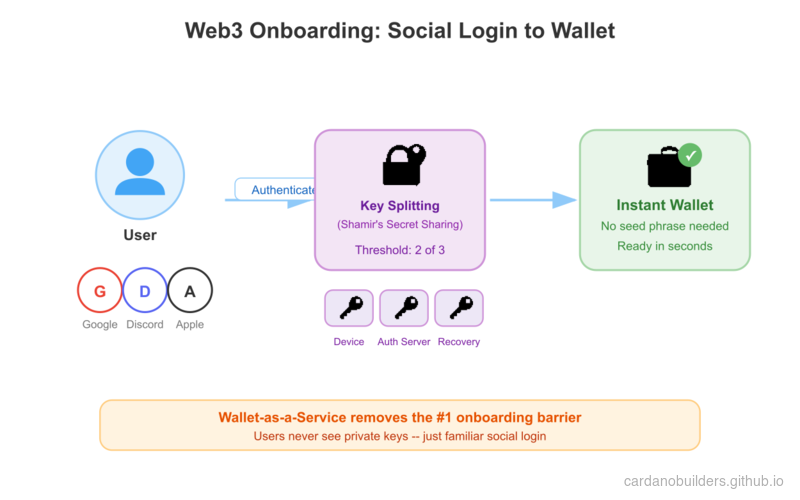
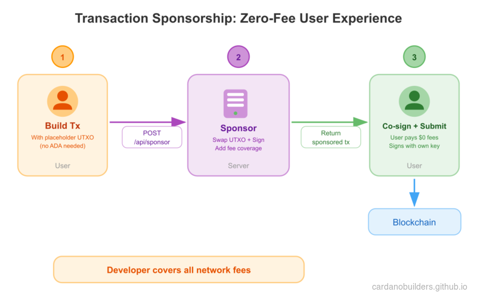
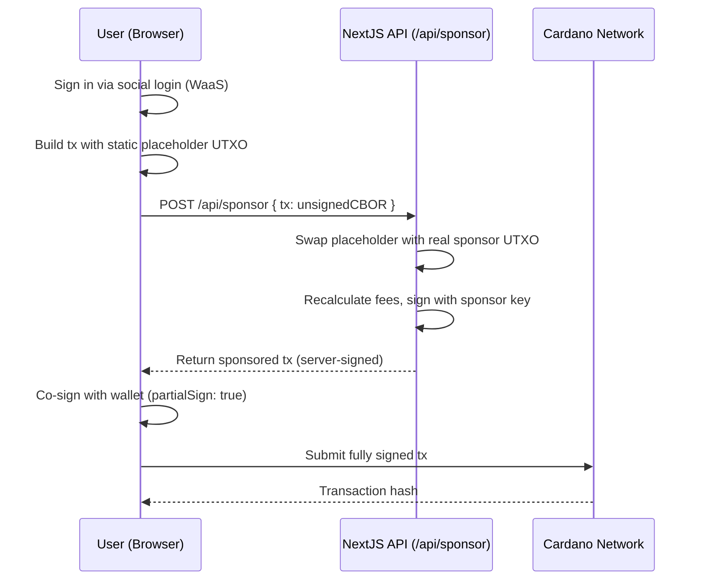

# Lesson #10: Web3 Services for Seamless Onboarding

Web3 Services remove the two biggest barriers to blockchain adoption: wallet setup and transaction fees. Instead of asking users to install browser extensions and buy ADA, your application provides social login wallets and covers network fees on their behalf.

In this lesson, you will:
- Integrate Wallet-as-a-Service (WaaS) so users create wallets with social login
- Set up a Blockfrost proxy to keep API keys server-side
- Build a sponsored transaction where the developer covers network fees
- Submit a fully sponsored send-ADA transaction on Cardano preprod

## How It Works

### Wallet as a Service

Wallet-as-a-Service (WaaS) lets users transact on-chain without managing private keys. Users sign in with Google, Discord, Twitter, or Apple and receive a non-custodial wallet instantly.



The key management system uses Shamir's Secret Sharing to split the private key into three shares stored in separate locations. Neither UTXOS nor the developer's application has access to the complete key. During transaction signing, the key reconstructs only on the user's device inside an isolated iframe, persists in memory, and is destroyed after signing completes.

### Transaction Sponsorship

Network fees on Cardano are paid in ADA. This creates a friction point: end users must hold ADA before they can interact with any application.



Transaction sponsorship removes this barrier. A developer-controlled wallet covers transaction inputs and network fees on behalf of users. The SDK builds the transaction with a static placeholder, swaps in a real UTXO from the sponsor wallet, signs it server-side, and returns the transaction for the user to co-sign.

## System Setup

### Prerequisites

You need the following before starting:

- A UTXOS account and project from [utxos.dev/dashboard](https://utxos.dev/dashboard)
- A [Blockfrost](https://blockfrost.io/) API key (preprod network)
- A sponsorship created in the UTXOS dashboard with a funded wallet
- Node.js 18+ installed

### Create a NextJS Application

Create a new NextJS application:

```bash
npx create-next-app@latest --typescript web3-services-demo
```

Follow the prompts:

```bash
Need to install the following packages:
Ok to proceed? (y)

✔ Would you like to use ESLint? … Yes
✔ Would you like to use Tailwind CSS? … Yes
✔ Would you like your code inside a `src/` directory? … Yes
✔ Would you like to use App Router? … Yes
✔ Would you like to use Turbopack for next dev? … No
✔ Would you like to customize the import alias (@/* by default)? … No
```

Navigate to the project directory:

```bash
cd web3-services-demo
```

### Install Dependencies

Install the UTXOS SDK and Mesh packages:

```bash
npm install @utxos/sdk @meshsdk/core
```

### Configure Environment Variables

Create a `.env` file in the project root:

```bash
# Client-side (safe to expose)
NEXT_PUBLIC_UTXOS_PROJECT_ID=your_project_id
NEXT_PUBLIC_NETWORK_ID=0

# Server-side only (never expose to client)
BLOCKFROST_API_KEY_PREPROD=your_blockfrost_preprod_key
UTXOS_API_KEY=your_utxos_api_key
UTXOS_PRIVATE_KEY=your_entity_secret_private_key
SPONSORSHIP_ID=your_sponsorship_id
```

- `NEXT_PUBLIC_UTXOS_PROJECT_ID`: Your project ID from the UTXOS dashboard.
- `NEXT_PUBLIC_NETWORK_ID`: `0` for preprod, `1` for mainnet.
- `BLOCKFROST_API_KEY_PREPROD`: Your Blockfrost API key for the preprod network.
- `UTXOS_API_KEY`: Your API key from the UTXOS dashboard.
- `UTXOS_PRIVATE_KEY`: Your entity secret private key for signing sponsored transactions.
- `SPONSORSHIP_ID`: The sponsorship ID from the UTXOS dashboard.

## Blockfrost Proxy

Blockfrost API keys must stay server-side. Create a proxy route that forwards requests to Blockfrost while keeping the key hidden from the browser.

Create the file `src/app/api/blockfrost/[...slug]/route.ts`:

```ts
import { NextRequest } from "next/server";

export async function GET(
  request: NextRequest,
  { params }: { params: { slug: string[] } }
) {
  return handleBlockfrostRequest(request, params.slug, "GET");
}

export async function POST(
  request: NextRequest,
  { params }: { params: { slug: string[] } }
) {
  return handleBlockfrostRequest(request, params.slug, "POST");
}

async function handleBlockfrostRequest(
  request: NextRequest,
  slug: string[],
  method: string
) {
  const network = slug[0]; // "preprod" | "mainnet"
  const key =
    network === "mainnet"
      ? process.env.BLOCKFROST_API_KEY_MAINNET
      : process.env.BLOCKFROST_API_KEY_PREPROD;

  const baseUrl =
    network === "mainnet"
      ? "https://cardano-mainnet.blockfrost.io/api/v0"
      : "https://cardano-preprod.blockfrost.io/api/v0";

  if (!key) {
    return Response.json(
      { error: `Missing Blockfrost API key for ${network}` },
      { status: 500 }
    );
  }

  const endpointPath = slug.slice(1).join("/") || "";
  const queryString = request.url.includes("?")
    ? request.url.substring(request.url.indexOf("?"))
    : "";
  const url = `${baseUrl}/${endpointPath}${queryString}`;

  const isCborEndpoint =
    endpointPath === "tx/submit" || endpointPath === "utils/txs/evaluate";

  const response = await fetch(url, {
    method,
    headers: {
      project_id: key,
      "Content-Type": isCborEndpoint
        ? "application/cbor"
        : "application/json",
    },
    body: method !== "GET" ? request.body : undefined,
    // @ts-ignore
    duplex: method !== "GET" ? "half" : undefined,
  });

  if (response.status === 404 && endpointPath.includes("/utxos")) {
    return Response.json([]);
  }

  if (!response.ok) {
    const errorBody = await response.text();
    return Response.json(
      { error: `Blockfrost error: ${response.status}`, details: errorBody },
      { status: response.status }
    );
  }

  if (isCborEndpoint) {
    const data = await response.text();
    return Response.json(data);
  }

  const data = await response.json();
  return Response.json(data);
}
```

This proxy forwards requests like `/api/blockfrost/preprod/addresses/addr_test1...` to the Blockfrost API with the key injected server-side.

## Wallet-as-a-Service Integration

### Initialize the Wallet

The `Web3Wallet.enable()` method opens a popup window where the user authenticates with a social provider. After authentication, the SDK returns a wallet instance with a Cardano wallet that supports address queries, UTxO lookups, transaction signing, and data signing.

Create the file `src/lib/wallet.ts`:

```ts
import { Web3Wallet, EnableWeb3WalletOptions } from "@utxos/sdk";
import { BlockfrostProvider } from "@meshsdk/core";

const provider = new BlockfrostProvider("/api/blockfrost/preprod/");

export async function connectWallet() {
  const options: EnableWeb3WalletOptions = {
    projectId: process.env.NEXT_PUBLIC_UTXOS_PROJECT_ID!,
    networkId: 0,
    fetcher: provider,
    submitter: provider,
  };

  const wallet = await Web3Wallet.enable(options);
  return wallet;
}

export { provider };
```

- `Web3Wallet.enable()`: Opens the authentication popup and returns a wallet instance.
- `projectId`: Identifies your project for whitelisting and analytics.
- `networkId`: `0` for preprod testnet, `1` for mainnet.
- `fetcher` and `submitter`: The Blockfrost provider routes through your proxy.

### Build the Wallet Page

Replace the contents of `src/app/page.tsx`:

```tsx
"use client";

import { useState } from "react";
import { Web3Wallet } from "@utxos/sdk";
import { connectWallet, provider } from "@/lib/wallet";

export default function Home() {
  const [wallet, setWallet] = useState<Web3Wallet | null>(null);
  const [address, setAddress] = useState("");
  const [status, setStatus] = useState("");

  async function handleConnect() {
    try {
      setStatus("Connecting...");
      const w = await connectWallet();
      setWallet(w);
      const addr = await w.cardano.getChangeAddress();
      setAddress(addr);
      setStatus("Connected");
    } catch (error) {
      setStatus("Connection failed");
      console.error(error);
    }
  }

  return (
    <main className="flex min-h-screen flex-col items-center justify-center gap-4 p-8">
      <h1 className="text-2xl font-bold">Web3 Services Demo</h1>

      {!wallet ? (
        <button
          onClick={handleConnect}
          className="rounded bg-blue-600 px-6 py-2 text-white hover:bg-blue-700"
        >
          Connect Wallet
        </button>
      ) : (
        <div className="flex flex-col items-center gap-4">
          <p className="text-sm text-gray-500">
            {address.slice(0, 20)}...{address.slice(-10)}
          </p>
          <p className="text-green-600">{status}</p>
        </div>
      )}
    </main>
  );
}
```

Start the development server:

```bash
npm run dev
```

Visit [http://localhost:3000](http://localhost:3000/) and click "Connect Wallet." A popup opens for social login. After authenticating, your wallet address displays on the page.

## Transaction Sponsorship

### Server-Side Sponsor Endpoint

Sponsorship logic runs server-side because it requires the entity secret private key. Create the file `src/app/api/sponsor/route.ts`:

```ts
import { NextRequest } from "next/server";
import { Web3Sdk } from "@utxos/sdk";
import { BlockfrostProvider } from "@meshsdk/core";

const provider = new BlockfrostProvider(
  process.env.BLOCKFROST_API_KEY_PREPROD!
);

const sdk = new Web3Sdk({
  projectId: process.env.NEXT_PUBLIC_UTXOS_PROJECT_ID!,
  apiKey: process.env.UTXOS_API_KEY!,
  network: "testnet",
  privateKey: process.env.UTXOS_PRIVATE_KEY!,
  fetcher: provider,
  submitter: provider,
});

export async function POST(request: NextRequest) {
  try {
    const { tx } = await request.json();

    const result = await sdk.sponsorship.sponsorTx({
      sponsorshipId: process.env.SPONSORSHIP_ID!,
      tx,
    });

    if (!result.success) {
      return Response.json(
        { error: result.error },
        { status: 400 }
      );
    }

    return Response.json({ tx: result.data });
  } catch (error: any) {
    return Response.json(
      { error: error.message },
      { status: 500 }
    );
  }
}
```

- `Web3Sdk`: The server-side SDK that manages developer-controlled wallets and sponsorship.
- `sponsorTx`: Takes an unsigned CBOR transaction, swaps the static placeholder UTXO with a real one from the sponsor wallet, signs it, and returns the sponsored transaction.

### Build a Sponsored Transaction

The sponsorship flow works in three steps:

1. **Build** the transaction client-side using static placeholder inputs from the SDK
2. **Sponsor** the transaction server-side by calling your `/api/sponsor` endpoint
3. **Sign and submit** the sponsored transaction with the user's wallet

Add the send function to `src/app/page.tsx`:

```tsx
"use client";

import { useState } from "react";
import { Web3Wallet, Web3Sdk } from "@utxos/sdk";
import { MeshTxBuilder } from "@meshsdk/core";
import { connectWallet, provider } from "@/lib/wallet";

// Static sponsorship info for building the transaction
const staticInfo = {
  changeAddress:
    "addr_test1qrsj3xj6q99m4g9tu9mm2lzzdafy04035eya7hjhpus55r204nlu6dmhgpruq7df228h9gpujt0mtnfcnkcaj3wj457q5zv6kz",
  utxo: {
    input: {
      outputIndex: 0,
      txHash:
        "5a1edf7da58eff2059030abd456947a96cb2d16b9d8c3822ffff58d167ed8bfc",
    },
    output: {
      address:
        "addr_test1qrsj3xj6q99m4g9tu9mm2lzzdafy04035eya7hjhpus55r204nlu6dmhgpruq7df228h9gpujt0mtnfcnkcaj3wj457q5zv6kz",
      amount: [{ unit: "lovelace", quantity: "5000000" }],
    },
  },
};

export default function Home() {
  const [wallet, setWallet] = useState<Web3Wallet | null>(null);
  const [address, setAddress] = useState("");
  const [status, setStatus] = useState("");
  const [recipient, setRecipient] = useState("");
  const [txHash, setTxHash] = useState("");

  async function handleConnect() {
    try {
      setStatus("Connecting...");
      const w = await connectWallet();
      setWallet(w);
      const addr = await w.cardano.getChangeAddress();
      setAddress(addr);
      setStatus("Connected");
    } catch (error) {
      setStatus("Connection failed");
      console.error(error);
    }
  }

  async function handleSend() {
    if (!wallet || !recipient) return;

    try {
      setStatus("Building transaction...");

      // Step 1: Build the transaction with static sponsorship placeholders
      const txBuilder = new MeshTxBuilder({ fetcher: provider });

      txBuilder
        .txOut(recipient, [{ unit: "lovelace", quantity: "2000000" }])
        .changeAddress(staticInfo.changeAddress)
        .txIn(
          staticInfo.utxo.input.txHash,
          staticInfo.utxo.input.outputIndex,
          staticInfo.utxo.output.amount,
          staticInfo.utxo.output.address,
          0
        );

      const unsignedTx = await txBuilder.complete();

      // Step 2: Send to server for sponsorship
      setStatus("Requesting sponsorship...");
      const res = await fetch("/api/sponsor", {
        method: "POST",
        headers: { "Content-Type": "application/json" },
        body: JSON.stringify({ tx: unsignedTx }),
      });

      const data = await res.json();
      if (!res.ok) throw new Error(data.error);

      // Step 3: User signs the sponsored transaction
      setStatus("Awaiting signature...");
      const signedTx = await wallet.cardano.signTx(data.tx, true);

      // Step 4: Submit to the network
      setStatus("Submitting...");
      const hash = await provider.submitTx(signedTx);
      setTxHash(hash);
      setStatus("Transaction submitted!");
    } catch (error: any) {
      setStatus(`Error: ${error.message}`);
      console.error(error);
    }
  }

  return (
    <main className="flex min-h-screen flex-col items-center justify-center gap-4 p-8">
      <h1 className="text-2xl font-bold">Web3 Services Demo</h1>

      {!wallet ? (
        <button
          onClick={handleConnect}
          className="rounded bg-blue-600 px-6 py-2 text-white hover:bg-blue-700"
        >
          Connect Wallet
        </button>
      ) : (
        <div className="flex flex-col items-center gap-4 w-full max-w-md">
          <p className="text-sm text-gray-500">
            {address.slice(0, 20)}...{address.slice(-10)}
          </p>

          <input
            type="text"
            placeholder="Recipient address (addr_test1...)"
            value={recipient}
            onChange={(e) => setRecipient(e.target.value)}
            className="w-full rounded border px-4 py-2"
          />

          <button
            onClick={handleSend}
            className="rounded bg-green-600 px-6 py-2 text-white hover:bg-green-700"
          >
            Send 2 ADA (Sponsored)
          </button>

          {status && <p className="text-sm">{status}</p>}

          {txHash && (
            <a
              href={`https://preprod.cardanoscan.io/transaction/${txHash}`}
              target="_blank"
              rel="noopener noreferrer"
              className="text-blue-600 underline text-sm"
            >
              View on Cardanoscan
            </a>
          )}
        </div>
      )}
    </main>
  );
}
```

The transaction sends 2 ADA to a recipient address. The user's wallet never needs to hold ADA for fees because the developer's sponsorship wallet covers everything.

### How the Sponsorship Flow Works

1. **Static placeholders**: `getStaticInfo()` returns a fixed UTXO and change address used as placeholders when building the transaction. These are not real UTXOs; they exist only to produce valid CBOR for the SDK to rewrite.

2. **Server-side rewrite**: `sponsorTx()` parses the CBOR transaction, removes the static placeholder inputs, injects a real UTXO from the sponsor wallet, recalculates the fee, and signs the transaction with the developer-controlled wallet.

3. **User co-signs**: The user signs with `partialSign: true` because the developer wallet already signed. Both signatures combine into the final transaction.

4. **Submission**: The fully signed transaction is submitted to the Cardano network. The user paid zero fees.

## Source Code Walkthrough

This project is a standard NextJS App Router application. If you have built any NextJS app before, the structure will feel familiar. The blockchain-specific parts live in the API routes and a small wallet helper.

### Project Structure

```
10-web3-services/
├── src/
│   ├── app/
│   │   ├── api/
│   │   │   ├── blockfrost/[...slug]/route.ts  # API gateway: proxies Blockfrost, hides key
│   │   │   └── sponsor/route.ts               # Server endpoint: sponsors user transactions
│   │   └── page.tsx                            # Client UI: connect wallet + send ADA
│   └── lib/
│       └── wallet.ts                           # Wallet connection helper (WaaS init)
├── eslint.config.mjs
├── next.config.ts
├── package.json      # NextJS + @utxos/sdk + @meshsdk/core
├── postcss.config.mjs
└── tsconfig.json
```

**`api/blockfrost/[...slug]/route.ts`** is an API gateway. It works exactly like a backend-for-frontend proxy in web2: the browser calls your NextJS route, and the route forwards the request to Blockfrost with the API key injected server-side. This is the same pattern you would use to hide a Stripe secret key or any third-party API credential behind your own endpoint.

**`api/sponsor/route.ts`** is the sponsorship endpoint. It receives an unsigned transaction from the client, swaps in a real UTXO from the developer's wallet, signs it, and returns the sponsored transaction. Think of this like a payment processing endpoint where the merchant (developer) covers the cost instead of the customer (user).

**`lib/wallet.ts`** initializes the Wallet-as-a-Service connection. It configures `Web3Wallet.enable()` with the project ID and network, pointing the fetcher and submitter through the Blockfrost proxy. This is the equivalent of initializing an OAuth client in web2.

**`page.tsx`** is a standard React client component with `useState` hooks for wallet state, address display, and transaction status. The blockchain interaction is abstracted behind `connectWallet()` and `MeshTxBuilder`, so the component reads like any form-based React page.

### Sponsorship Flow

The sponsored transaction flow involves coordination between the client (browser), your server (NextJS API route), and the blockchain network. This is similar to how a payment gateway works: the client initiates, the server authorizes and funds, and the client confirms.



**Step 1 - Social Login**: The user clicks "Connect Wallet" and authenticates through a social provider popup (Google, Discord, etc.). Behind the scenes, `Web3Wallet.enable()` creates a non-custodial wallet using Shamir's Secret Sharing. No seed phrase, no browser extension.

**Step 2 - Build with Placeholder**: The client builds a transaction using `MeshTxBuilder` with a static placeholder UTXO and change address. These are not real on-chain values. They exist solely to produce valid CBOR that the server can rewrite. Think of this like building a form with mock data that gets replaced server-side before processing.

**Step 3 - Server Sponsors**: The `/api/sponsor` endpoint calls `sdk.sponsorship.sponsorTx()`, which parses the CBOR, removes the placeholder inputs, injects a real UTXO from the developer's funded wallet, recalculates the fee, and signs. This is analogous to a payment processor that swaps a tokenized card with a real charge.

**Step 4 - User Co-signs**: The sponsored transaction comes back with the server's signature already attached. The user signs with `partialSign: true`, adding their authorization. Both signatures are now present. This is multi-party authorization, like requiring both an employee badge and a manager's approval to process a refund.

**Step 5 - Submit**: The fully signed transaction goes to the Cardano network. The user paid zero fees. The developer's sponsorship wallet covered everything.

### Web2 Equivalents

| Web3 Concept | Web2 Equivalent | Why |
|---|---|---|
| Wallet-as-a-Service (WaaS) | OAuth / social login (Auth0, Firebase Auth) | Users authenticate with familiar providers, no crypto-specific setup |
| Blockfrost proxy route | API gateway (nginx proxy, BFF pattern) | Hides third-party API keys server-side, exposes a clean internal endpoint |
| Transaction sponsorship | Stripe/payment processing where merchant pays | The developer covers network fees so the user pays nothing |
| Static placeholder UTXO | Mock/stub for testing | A fake input used to build valid structure that gets replaced with real data |
| Partial signing (`partialSign: true`) | Multi-party authorization (2FA, co-signing) | Multiple parties must approve before the action finalizes |
| Shamir's Secret Sharing | Distributed key management (HSM, vault sharding) | The private key is split across locations so no single party holds the complete key |
| `Web3Sdk` (server-side) | Admin SDK (Firebase Admin, Stripe server SDK) | Server-side SDK with elevated privileges for operations that require secret keys |
| CBOR transaction format | Protocol Buffers / binary serialization | A compact binary encoding for structured blockchain data |

The overall pattern is familiar to any web2 developer who has built a payment flow: the client initiates, the server authorizes and funds, the client confirms, and the result is submitted to the network.

## Source Code

The complete source code for this lesson is available on [GitHub](https://github.com/cardanobuilders/cardanobuilders.github.io/tree/main/codes/course-cardano/10-web3-services).

## Challenge

Build a sponsored NFT minting application. The user connects via social login, provides metadata for their NFT, and the developer's wallet sponsors the minting transaction. The user signs to authorize the mint, but pays no fees.

Hints:
- Use `ForgeScript.withOneSignature(userAddress)` to create a minting policy tied to the user's address
- Add `.mint("1", policyId, tokenNameHex)` and `.mintingScript(forgingScript)` to the transaction builder
- Include `.metadataValue(721, metadata)` for CIP-25 NFT metadata
- The static sponsorship info includes a collateral UTXO for script transactions
