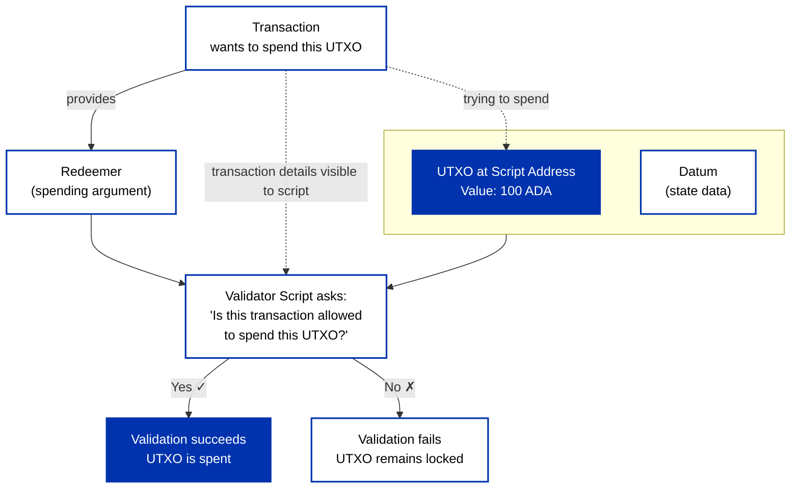
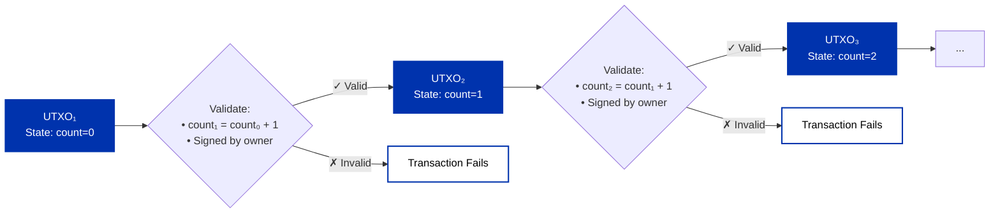
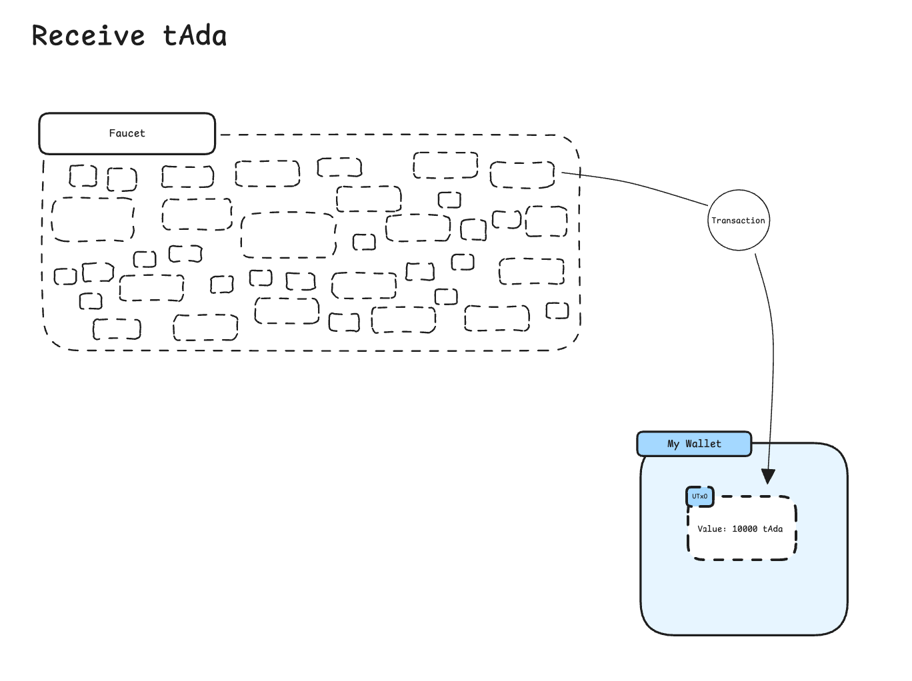
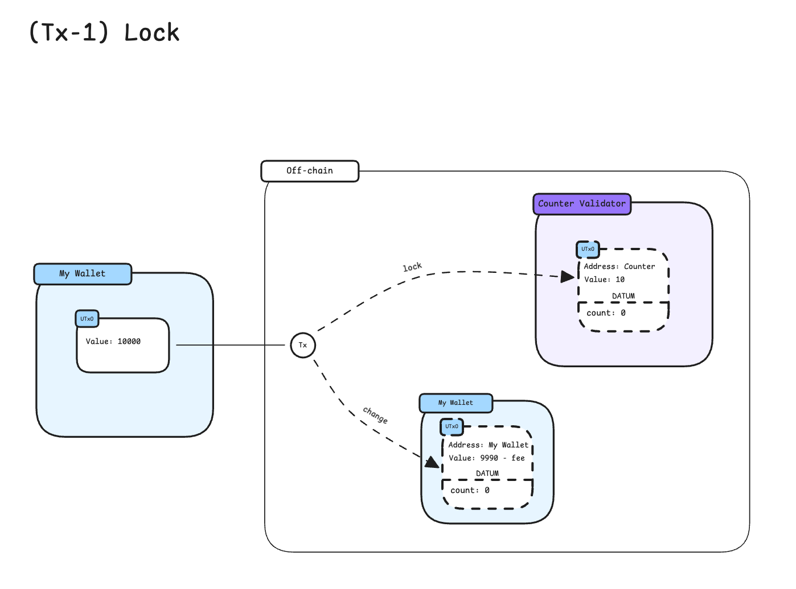

## What are smart contracts?

Smart contracts are digital agreements defined in code that automate and enforce the terms of a contract without the need for intermediaries, enabling secure and transparent transactions on a blockchain. By leveraging predetermined conditions defined within the smart contract code, the state of a contract can only be updated in a way that follows the rules defined in that contract.

## Introduction

Smart contracts on Cardano work a bit differently from how they do on other blockchains. The key to understanding smart contracts is to first understand the [eUTXO](/docs/learn/core-concepts/eutxo) model.

Smart contracts are validator scripts that you write to validate the movement of UTXOs locked in your contract's address. You will lock UTXOs at the address of your script and then the UTXOs can only ever be spent/moved if your script allows the transaction spending it to do so.

## Conceptual overview

### Smart Contracts Are Validators, Not Actors

:::tip Mental Model Shift
The most important mental shift when coming to Cardano from other blockchains: **smart contracts cannot take actions**. They can only approve or deny proposed transactions.
:::

A Cardano smart contract cannot:

- "Send tokens" to another address
- "Call another contract"
- Initiate any action on its own

Instead, smart contracts **validate** that transactions do the things you want them to do. Users propose transactions, and contracts either approve or reject them based on the validation logic you define.

### Components

Smart contracts consist of on-chain and off-chain components:

- **On-chain component (validator-script)**: Validates that transactions spending from the contract address follow the contract's rules. This is the immutable logic that runs on every Cardano node.
- **Off-chain component**: Applications that construct valid transactions according to the contract rules. These can be built in any language and handle user interfaces, data fetching, and transaction building.

The off-chain component is equally critical - it's responsible for creating transactions that the on-chain validator will approve.

### On-Chain (Validator scripts)

Validator scripts are executed automatically when a UTXO residing at the address of the script is attempted to be moved by a transaction. These scripts take a transaction as its input and then outputs either true or false depending on whether the transaction is valid or not according to your rules/logic as defined in the script - thus blocking or allowing a transaction to succeed. If you are moving multiple UTXOs residing on the same script address, the validator-script will run once for each UTXO. This script execution happens on the Cardano node validating your transaction. Validator scripts run once per script input in the transaction.

This means that in order for the validator script to execute, a transaction must first move a UTXO to the address of the contract; the address is derived from the contract mathematically. Normally, only the script hash is stored on-chain. With CIP-33 reference scripts, you can include the full script in a UTXO so later transactions can reference it without including the full script code.

### Off-Chain

You might think of this initial transaction where you move a UTXO to the script address to be the initialisation of a contract instance. Each UTXO residing on the address of the contract can thus be seen as an instance of the contract. Note that there is no restriction on the UTXOs being sent to the script address: anyone can send a UTXO containing no datum, or an arbitrary datum.

The off-chain part is needed in order to locate UTXOs that are locked in your contract and generate transactions that are valid for moving them.

## Technical overview

Smart contracts on Cardano are validator scripts that enforce custom logic when interacting with UTXOs "owned" by a script (owned meaning the UTxO sits at the script address). Think of them as parameterized mathematical functions that return true or false to determine transaction validity.

### Understanding Validators: The Mathematical Model

Validators work like mathematical functions with three inputs:

```text title="Validator Function Signature"
Script: f(datum, redeemer, context) = success | failure
```

Conceptually, you can think of validators as returning true/false, though under the hood they either succeed (returning unit `()`) or fail (throwing an error).



Consider the analogy of a simple function: `f(x) = x * a + b`

- **Script** is the function definition (`x * a + b`) - your validation logic
- **Datum** contains the parameters (`a` and `b`) - configuration data set when the UTXO is created
- **Redeemer** provides the argument (`x`) - user input provided when spending
- **Context** gives access to transaction details for validation

### The Three Script Arguments

#### Datum: Contract State

Data attached to UTXOs and is immutable. Datums carry contract state between transactions, enabling complex state machines by preserving information that subsequent transactions can read and modify. When someone sends UTxOs to a script address, they attach the datum to define the conditions under which the UTxO can be spent. Datum are the extension to the UTxO model and, in a way, stand for the "e" in eUTxO. Unlike the Bitcoin UTxO model, which lacks datums and thus has limited capabilities, the extended UTxO model provides capabilities comparable to an account-based model while maintaining a safer approach to transactions by avoiding global state mutations.

#### Redeemer: User Input

Data provided by users with the transaction for script execution when spending UTXOs that "unlocks" funds by satisfying the script's conditions. Redeemers drive state transitions by supplying the inputs needed to transform the current state (datum) into a new state. The redeemer must meet the validation logic specified by the script to successfully spend the locked funds.

> Recap: The datum is set when the UTxO is created, whereas the redeemer is provided only when spending the UTxO.

#### Script Context: Transaction Information

Logic in smart contracts involves making validations about certain properties of the transaction, including inputs, outputs, signatures, fees, and other transaction properties. This allows scripts to make assertions about transaction structure, participants, timing, and other properties.

**Available Context Properties:**

| Property                                                                                 | Description                                                                                                                             |
| ---------------------------------------------------------------------------------------- | --------------------------------------------------------------------------------------------------------------------------------------- |
| **inputs**                                                                               | List of transaction inputs being spent in the transaction. In the UTXO model, every transaction produces outputs, which in turn become inputs for future transactions. |
| **reference_inputs**                                                                     | Inputs used for reference only, not spent                                                                                               |
| **outputs**                                                                              | New outputs created by the transaction. These are the new UTXOs created by the transaction                                              |
| **fee**                                                                                  | Transaction fee in Lovelace. This value is predictable and depends on the transaction size. Fees can often be optimized.                                                                                  |
| **minted value**                                                                         | This is the value of tokens being minted or burned in the transaction                                                                   |
| **certificates**                                                                         | Certificates for delegation, pool operations (register/deregister stake key), governance roles, etc.                                    |
| **withdrawals**                                                                          | Stake reward withdrawals as credential-lovelace pairs                                                                                   |
| **validity_range**                                                                       | Time range in which the transaction is valid.                                                                                           |
| **signatories**                                                                          | A list of hashes representing who signed the transaction.                                                                               |
| **redeemers**                                                                            | Script purpose and redeemer pairs for script execution. These are a list of redeemers used by the contracts executed in the transaction |
| **datums**                                                                               | Dictionary mapping data hashes to datum data                                                                                            |
| **id**                                                                                   | Transaction identification (hash) that is unique for each transaction                                                                   |
| **votes**                                                                                | Governance votes as voter-vote pairs (Conway era)                                                                                       |
| **proposal_procedures**                                                                  | Governance proposals (Conway era)                                                                                                       |
| **current_treasury_amount**                                                              | Current treasury amount (optional)                                                                                                      |
| **treasury_donation**                                                                    | Treasury donation amount (optional)                                                                                                     |

:::note Transaction Context Representation
This is a representation of a transaction as seen by on-chain scripts, and not the 1:1 translation of the transaction as seen by the ledger. The underlying ledger uses a different structure with numeric field keys as defined in the [Conway CDDL specification](https://github.com/IntersectMBO/cardano-ledger/blob/master/eras/conway/impl/cddl-files/conway.cddl). In particular, on-chain scripts can't see inputs locked by bootstrap addresses, outputs to bootstrap addresses, or transaction metadata.
:::

### Script Addresses

**Script Address**: A unique address derived from the hash of a smart contract (Plutus script binary). UTXOs sent to script addresses can only be spent when the originating script validates the spending transaction successfully.

**Script Hash Details**: Script addresses are derived from a 28-byte script hash that includes a language tag (`0x01` for PlutusV1, `0x02` for PlutusV2, `0x03` for PlutusV3). This means identical bytecode under different Plutus versions yields different addresses.

:::caution Address Collision
**Important insight**: The same contract code always produces the same address within the same Plutus version. If you deploy the exact same smart contract code that someone else has already deployed, you'll get the same address - and there may already be transaction history there! This is because the address is mathematically derived from the contract code itself.
:::

Unlike regular addresses controlled by private keys, script addresses are controlled by the logic defined in the smart contract code. This means:

- Anyone can send funds to a script address
- Only transactions that satisfy the script's validation logic can spend those funds
- The script executes automatically whenever someone attempts to spend UTXOs from its address
- Multiple developers deploying identical code will interact with the same contract address

### Script Purposes and Types

Scripts validate different operations depending on their purpose, as defined in the [Conway era ledger specification](https://github.com/IntersectMBO/cardano-ledger/blob/master/eras/conway/impl/cddl-files/conway.cddl):

| Script Type          | Description                                                                                                                                                                                                                                  |
| -------------------- | -------------------------------------------------------------------------------------------------------------------------------------------------------------------------------------------------------------------------------------------- |
| **Spend Scripts**    | Validate UTXO consumption. These are the most common scripts and the only ones that receive datum information.                                                                                                                               |
| **Mint Scripts**     | Control token creation and destruction through minting policies.                                                                                                                                                                             |
| **Publish Scripts**  | Validate certificates including stake delegation, pool registration/retirement, DRep registration, committee changes, and other governance roles.                                                                                            |
| **Withdraw Scripts** | Control stake reward withdrawals.                                                                                                                                                                                                            |
| **Vote Scripts**     | Validate governance votes (introduced in Conway era).                                                                                                                                                                                        |
| **Propose Scripts**  | Validate governance proposals (introduced in Conway era).                                                                                                                                                                                    |
| **Native Scripts**   | Cardano's "original" scripting language that predates Plutus, providing simple multisig and time-lock functionality through a minimal domain-specific language with constructs like "all-of", "any-of", and "after/before" time constraints. |

### Collateral and Script Execution

**Collateral**: UTXOs that must be provided when executing Plutus scripts to cover potential execution costs if the script fails during validation.

#### Transaction Validation Phases

When a transaction includes script execution:

- **Phase 1 Validation**: Basic transaction structure validation (inputs exist, signatures valid, etc.)
- **Phase 2 Validation**: Script execution and validation
- If Phase 2 fails, collateral UTXOs are consumed instead of regular transaction fees

#### Collateral Requirements

- Must contain only ADA (no native tokens)
- Should be sufficient to cover script execution costs
- Collateral amount is determined by the total balance of UTXOs marked as collateral inputs
- With Vasil upgrade: can specify change address to return excess collateral

#### Purpose and Protection

Collateral serves as a monetary guarantee that encourages careful design and testing of smart contracts. Without collateral, malicious actors could exploit the network by flooding it with invalid transactions at little cost. Key protections include:

- **Network Security**: Makes Denial of Service (DoS) attacks prohibitively expensive
- **Node Compensation**: Ensures nodes are compensated for their work if Phase 2 validation fails
- **User Safety**: Collateral is not collected if a transaction succeeds or is invalid at Phase 1
- **Deterministic Costs**: Unlike Ethereum where gas costs vary based on network activity, Cardano's deterministic design allows users to calculate execution costs and collateral requirements in advance

#### Technical Implementation

Phase 2 scripts require a budget of execution units (ExUnits) to quantify resource usage for metrics like memory usage and execution steps. This budget is included in the transaction fee calculation, with collateral providing additional safeguards for script execution failures.

### Deterministic Validation

Validators are fully deterministic - their execution depends only on the transaction context. This predictability allows you to verify transaction outcomes before submission, unlike systems where network conditions can affect execution.

## Contract Workflows

Understanding how scripts work in practice helps bridge the unique UTxO model with a basic example. Let's trace through a simple counter contract that demonstrates the datum/redeemer relationship:

### Step 1: Create the Validator

Write a script that validates state transitions by checking that the redeemer (user action) correctly transforms the current datum (contract state) into the new datum AND that all contract rules are met. For example, a counter validator ensures the count increments by exactly one & that the transaction is signed by the authorized owner to spend the UTxO.

### Step 2: Lock Funds (Initialize State)

Create a transaction that sends a UTxO value to the script address with a datum containing the initial state (e.g., `count: 0`) and any access control information (e.g., the owner's public key hash). This locks the funds under your validation logic and establishes both the contract's starting state and who can interact with it.

### Step 3: Unlock and Update State

To spend the locked UTXO, provide a redeemer that specifies the desired action (e.g., "increment"). The validator compares the input datum (`count: 0`) with the redeemer ("increment") and the output datum (`count: 1`), allowing the transaction only if the state transition is valid (meets all validator requirements, like being transaction being signed by the authorized owner and following the correct state transition - incrementing the count only by 1). This creates a new UTXO with updated state while the old one is consumed/spent.



### Workflow Diagrams





This pattern - spending a UTXO and recreating it with new state - is how Cardano handles stateful contracts. Each transaction in the chain validates that the state evolution follows your contract's rules, creating an auditable history of state changes.

## Modern Smart Contract Features

Cardano provides several powerful features that make smart contract development more efficient and flexible:

### Reference Inputs ([CIP-31](https://cips.cardano.org/cip/CIP-31))

You can read UTXO data without spending it. This is great for:

- **Oracle feeds**: Multiple contracts can read the same price data simultaneously
- **State queries**: Check contract state without modifying it
- **Shared resources**: Multiple users can access the same data without conflicts

Instead of the old spend-and-recreate pattern, just reference the UTXO you want to read from.

### Inline Datums ([CIP-32](https://cips.cardano.org/cip/CIP-32))

Store your datum data directly in outputs instead of dealing with hashes. This means:

- No datum hash calculations
- No need to provide separate datum data when spending

Your datum is right there in the output - much simpler to work with.

### Reference Scripts ([CIP-33](https://cips.cardano.org/cip/CIP-33))

Deploy your script once, then reference it from multiple transactions. You get:

- **Smaller transactions**: No need to include full script code every time
- **Lower fees**: Pay for the script once, not per transaction
- **Better throughput**: More transactions fit in each block

:::important Key Characteristics
On Cardano, typically only the **hash** of a validator script is stored on-chain. Optionally, the full script can be included via a **reference script** (CIP-33), allowing later transactions to reference it without resubmitting the code. It is not possible to modify the rules of an existing smart contract, nor is it possible to decompile the stored smart contract code from its compiled state into the original source code.
:::

### Collateral Output ([CIP-40](https://cips.cardano.org/cip/CIP-40))

Transactions that call Plutus smart contracts are required to put up collateral to cover the potential cost of smart contract execution failure.

These features work together to make Cardano smart contracts more practical and cost-effective to deploy and use.

## Programming languages

Cardano introduced smart contracts in 2021 and supports the development and deployment of smart contracts using multiple different languages.

:::tip
Writing well-designed smart contracts requires you to have a solid understanding of how Cardano works in general. So, make sure that everything on this page makes sense before you start creating contracts. Many topics are described in more detail on the [Technical Concepts](/docs/learn/core-concepts/) page as well.
:::

- [Aiken](languages/aiken/overview) - Most popular smart contract language on Cardano written in Rust like syntax. Specifically designed for on-chain validators only and embraces/treats UTxO model as a first citizen: a language & toolchain favouring developer experience.
- [Plutarch](https://github.com/Plutonomicon/plutarch-plutus) - With Plutarch, you have much more fine gained control of the Plutus Core you generate, without giving up any type information. Not for the faint hearted as it is close to writing UPLC by hand, but will almost always yield highest performance.
- [OpShin](languages/opshin) - Pythonic programming language used for smart contracts.
- [Scalus](languages/scalus) - a modern unified development platform for building Cardano DApps using Scala 3 for both on-chain smart contracts and off-chain logic. Scalus works with JVM and JavaScript too.
- [Plinth](languages/plinth) - "Canonical" smart contract language of Cardano written in Haskell with advanced tooling. Can be used for both on-chain and off-chain.
- [Plu-ts](languages/plu-ts) - Typescript-embedded smart contract programming language and a transaction creation library.

---

## Explore Smart Contract Topics

import DocCardList from '@theme/DocCardList';

<DocCardList />
