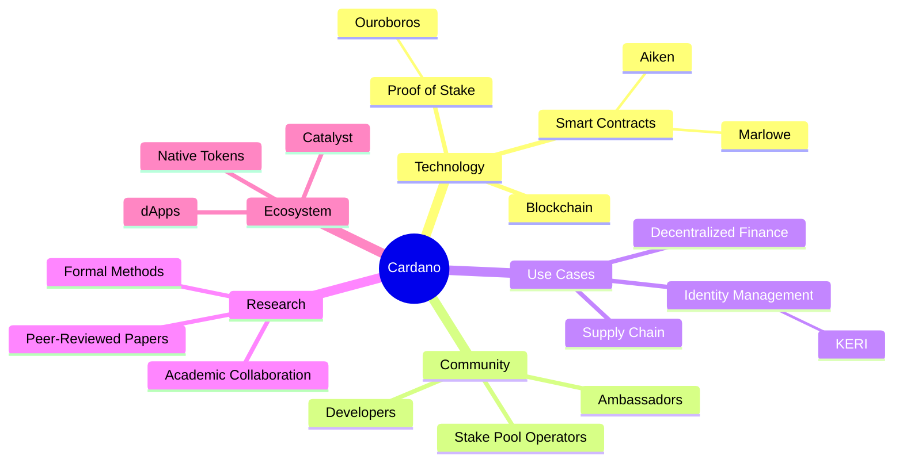
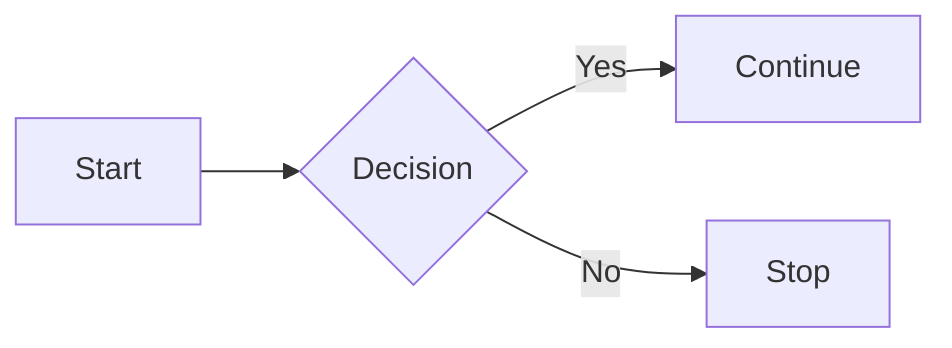
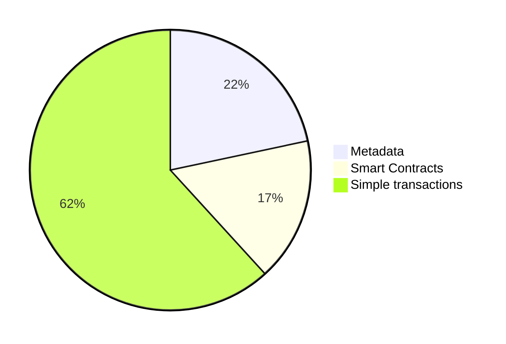

You can write content using [GitHub-flavored Markdown syntax](https://github.github.com/gfm/). [Markdown](https://github.github.com/gfm/) is a way to style text on the web. You control the display of the document; formatting words as bold or italic, adding images, and creating lists are just a few of the things we can do with Markdown. Mostly, Markdown is just regular text with a few non-alphabetic characters thrown in, like `#` or `*`.

## Front matter

Every docs page starts with a front matter block between two `---` lines. The portal uses these fields:

| Field           | Required    | Purpose                                                                    |
| --------------- | ----------- | -------------------------------------------------------------------------- |
| `id`            | yes         | The page identifier used in URLs and sidebar references.                    |
| `title`         | yes         | The page title. It renders as the top heading and names the browser tab.    |
| `description`   | yes         | One or two sentences for search engines and link previews.                  |
| `sidebar_label` | recommended | A shorter name for the sidebar. Falls back to `title` if omitted.           |
| `slug`          | optional    | Overrides the URL path when it needs to differ from `id`.                   |
| `keywords`      | optional    | Extra terms for search engines.                                             |

```md
---
id: my-page
title: My Page Title
sidebar_label: My Page
description: One sentence saying what this page covers.
---
```

Internal links are checked at build time. A link that points to a page or file that does not exist fails the build, so run `yarn build` before opening a pull request.

## Markdown Examples

This page will help you learn about the Markdown used in the Cardano Developer Portal, but the list is not intended to be exhaustive. Read the [docusaurus Markdown features](https://docusaurus.io/docs/next/markdown-features) for more examples.

Let's start with the basics:

import Tabs from '@theme/Tabs';
import TabItem from '@theme/TabItem';

<Tabs>
  <TabItem value="text" label="Text" default>

```text
Emphasis, aka italics, with *asterisks* 
or _underscores_.

Strong emphasis, aka bold, with **asterisks** 
or __underscores__.

Combined emphasis with **asterisks and _underscores_**.

Strikethrough uses two tildes. ~~Scratch this.~~

You can even [link to the Forum!](https://forum.cardano.org)
```

Emphasis, aka italics, with *asterisks*
or _underscores_.

Strong emphasis, aka bold, with **asterisks**
or __underscores__.

Combined emphasis with **asterisks and _underscores_**.

Strikethrough uses two tildes. ~~Scratch this.~~

You can even [link to the Forum!](https://forum.cardano.org)

  </TabItem>
  <TabItem value="headers" label="Headers">

:::note Avoid top-level headings

`#Level 1` headings are rendered automatically from the `title` property of your `frontmatter`. <br /> Therefore use `## Level 2` headings as the top most heading in the docs.

:::

```md
## Structured documents

Start a row with `##` to create a heading. Adding more
`#` characters creates deeper, smaller headings.

### This is a level 3 heading

#### This is a level 4 heading

Heading levels go down to `######` (level 6).
```

The rendered headings are not shown live here because they would land in this page's own table of contents. The block between the `---` lines at the top of a page is covered in the [Front matter](#front-matter) section.

  </TabItem>
  <TabItem value="links" label="Links">

```text
[I'm an inline-style link](https://forum.cardano.org)

[I'm an inline-style link with title](https://forum.cardano.org "Cardano Forum")

[I'm a reference-style link][arbitrary case-insensitive reference text]

[You can use numbers for reference-style link definitions][1]

Or leave it empty and use the [link text itself].

URLs and URLs in angle brackets will automatically get turned into links. http://www.cardano.org or <http://www.cardano.org>.

Some text to show that the reference links can follow later.

[arbitrary case-insensitive reference text]: https://www.cardano.org
[1]: https://forum.cardano.org
[link text itself]: https://www.cardano.org
```

[I'm an inline-style link](https://forum.cardano.org)

[I'm an inline-style link with title](https://forum.cardano.org "Cardano Forum")

[I'm a reference-style link][arbitrary case-insensitive reference text]

[You can use numbers for reference-style link definitions][1]

Or leave it empty and use the [link text itself].

URLs will automatically get turned into links. Example: https://www.cardano.org

Some text to show that the reference links can follow later.

[arbitrary case-insensitive reference text]: https://www.cardano.org
[1]: https://forum.cardano.org
[link text itself]: https://www.cardano.org

  </TabItem>
  <TabItem value="quotes" label="Quotes">

```text
If you'd like to quote someone, use the > character 
before the line:

> It’s not about who’s first to market or how quickly 
we can upgrade something. It’s about what’s fit for 
purpose. - **Charles Hoskinson**
```

If you'd like to quote someone, use the > character before the line:

> It’s not about who’s first to market or how quickly we can upgrade something. It’s about what’s fit for purpose. - **Charles Hoskinson**

  </TabItem>
  <TabItem value="images" label="Images">

```text
Here's is the Plutus logo (hover to see the title text):
Inline-style: 

Reference-style: ![alt text][logo]
[logo]: https://raw.githubusercontent.com/adam-p/markdown-here/master/src/common/images/icon48.png 'This is a logo reference-style'

Images from any folder can be used by providing path to file. Path should be relative to Markdown file:

```

Here's is the Plutus logo (hover to see the title text):
Inline-style: 

Reference-style: ![alt text][logo]
[logo]: https://raw.githubusercontent.com/adam-p/markdown-here/master/src/common/images/icon48.png 'This is a logo reference-style'

Images from any folder can be used by providing path to file. Path should be relative to Markdown file:


  </TabItem>
  <TabItem value="lists" label="Lists">

```text
1. First ordered list item
2. Another item
   - Unordered sub-list.
3. Actual numbers don't matter, just that it's a number
   1. Ordered sub-list
4. And another item.

* Unordered list can use asterisks

- Or minuses

+ Or pluses
```

1. First ordered list item
1. Another item
   - Unordered sub-list.
1. Actual numbers don't matter, just that it's a number
   1. Ordered sub-list
1. And another item.

<!-- -->

* Unordered list can use asterisks

- Or minuses

+ Or pluses

<!-- -->
  </TabItem>

</Tabs>

---

## Code

In the developer portal, you will often have to display code. You can display code with different syntax highlighting:
<Tabs>
<TabItem value="js" label="JavaScript" default>

    ```javascript
    var s = 'JavaScript syntax highlighting';
    alert(s);
    ```

```javascript
var s = 'JavaScript syntax highlighting';
alert(s);
```

</TabItem>
<TabItem value="py" label="Python">

    ```python
    s = "Python syntax highlighting"
    print(s)
    ```

```python
s = "Python syntax highlighting"
print(s)
```

</TabItem>
<TabItem value="aiken" label="Aiken">

    ```aiken
    fn add_one(n: Int) -> Int {
      n + 1
    }
    ```

```aiken
fn add_one(n: Int) -> Int {
  n + 1
}
```

</TabItem>
<TabItem value="cs" label="C#">

    ```csharp
    using System;
    var s = "c# syntax highlighting";
    Console.WriteLine(s);
    ```

```csharp
using System;
var s = "c# syntax highlighting";
Console.WriteLine(s);
```

</TabItem>
<TabItem value="json" label="JSON">

    ```json
    {
      "json_number": 225,
      "json_boolean": true,
      "json_string": "JSON syntax highlighting"
    }
    ```

```json
{
  "json_number": 225,
  "json_boolean": true,
  "json_string": "JSON syntax highlighting"
}
```

</TabItem>
<TabItem value="sh" label="Shell">

    ```shell
    ls 
    echo "Shell syntax highlighting"
    sudo dmesg
    top
    ```

```shell
ls 
echo "Shell syntax highlighting"
sudo dmesg
top
```

</TabItem>
<TabItem value="diff" label="Diff">

    ```diff
     fn add_one(n: Int) -> Int {
    -  n + 2
    +  n + 1
     }
    ```

```diff
 fn add_one(n: Int) -> Int {
-  n + 2
+  n + 1
 }
```

</TabItem>
<TabItem value="txt" label="Text">

    ```
    No language indicated, so no syntax highlighting.
    But let's throw in a <b>tag</b>.
    ```

<!-- markdownlint-disable MD040-->
```
No language indicated, so no syntax highlighting.
But let's throw in a <b>tag</b>.
```
<!-- markdownlint-enable MD040-->

</TabItem>
</Tabs>

### Supported languages

Syntax highlighting works out of the box for common web languages such as `javascript`, `typescript`, `jsx`, `python`, `rust`, `go`, `css`, and `markdown`. The portal additionally enables `aiken`, `bash` (also usable as `sh` or `shell`), `csharp`, `diff`, `haskell`, `java`, `json`, `php`, and `yaml`. If your language is not in either list, ask in your pull request; adding one is a one-line config change.

### Code block titles

You can add a title to the code block by adding a `title` key after the language (leave a space between them). Use it when the reader needs to know which file the code belongs in.

    ```jsx title="/src/components/HelloCodeTitle.js"
    function HelloCodeTitle(props) {
      return <h1>Hello, {props.name}</h1>;
    }
    ```

```jsx title="/src/components/HelloCodeTitle.js"
function HelloCodeTitle(props) {
  return <h1>Hello, {props.name}</h1>;
}
```

### Highlighting lines

Highlighting draws the reader's eye to the lines that matter, which makes it ideal for step-by-step tutorials. The preferred way is a highlight comment in the code itself. The comment is removed from the rendered output and the line after it gets a highlight:

    ```javascript
    function highlightMe() {
      // highlight-next-line
      console.log('This line gets highlighted');
    }
    ```

```javascript
function highlightMe() {
  // highlight-next-line
  console.log('This line gets highlighted');
}
```

For a block of lines, wrap them in `highlight-start` and `highlight-end` comments:

    ```javascript
    function highlightRange() {
      // highlight-start
      console.log('These lines');
      console.log('are all highlighted');
      // highlight-end
    }
    ```

```javascript
function highlightRange() {
  // highlight-start
  console.log('These lines');
  console.log('are all highlighted');
  // highlight-end
}
```

You can also highlight by line number in the code fence, for example ` ```javascript {2,3} `. Prefer the comment form: line numbers silently point at the wrong lines after the snippet is edited, while comments move with the code.

```javascript {2,3}
function highlightMe() {
  console.log('This line can be highlighted!');
  console.log('You can also highlight multiple lines');
}
```

### Line numbers

Add `showLineNumbers` to the fence when prose refers to specific lines, for example ` ```javascript showLineNumbers `:

```javascript showLineNumbers
function numberedLines() {
  console.log('This block');
  console.log('shows line numbers');
}
```

---

## Tabs

You can use tabs to display code examples in different languages. Import the two components once, below your front matter, then wrap each variant in a `TabItem`:

````jsx
import Tabs from '@theme/Tabs';
import TabItem from '@theme/TabItem';

<Tabs>
  <TabItem value="js" label="JavaScript" default>

```js
function helloWorld() {
  console.log('Hello, world!');
}
```

  </TabItem>
  <TabItem value="php" label="PHP">

```php
<?php echo '<p>Hello, world!</p>'; ?>
```

  </TabItem>
  <TabItem value="py" label="Python">

```py
def hello_world():
  print('Hello, world!')
```

  </TabItem>
</Tabs>
````

This renders as:

<Tabs>
  <TabItem value="js" label="JavaScript" default>

```js
function helloWorld() {
  console.log('Hello, world!');
}
```

  </TabItem>
  <TabItem value="php" label="PHP">

```php
<?php echo '<p>Hello, world!</p>'; ?>
```

  </TabItem>
  <TabItem value="py" label="Python">

```py
def hello_world():
  print('Hello, world!')
```

  </TabItem>
</Tabs>

:::note
Note that the empty lines above and below each language block (in the *md file) is intentional.
:::

---

## Syncing tab choices

You can also switch multiple tabs at the same time based on user input. Give the tab groups the same `groupId` and the same `value`s, and the reader's choice syncs across them (and persists across pages):

```jsx
<Tabs groupId="operating-systems">
<TabItem value="win" label="Windows" default>Use Ctrl + C to copy.</TabItem>
<TabItem value="mac" label="macOS">Use Command + C to copy.</TabItem>
<TabItem value="linux" label="Linux">Use Ctrl + C to copy.</TabItem>
</Tabs>

<Tabs groupId="operating-systems">
<TabItem value="win" label="Windows" default>Use Ctrl + V to paste.</TabItem>
<TabItem value="mac" label="macOS">Use Command + V to paste.</TabItem>
<TabItem value="linux" label="Linux">Use Ctrl + V to paste.</TabItem>
</Tabs>
```

<Tabs groupId="operating-systems">
<TabItem value="win" label="Windows" default>Use Ctrl + C to copy.</TabItem>
<TabItem value="mac" label="macOS">Use Command + C to copy.</TabItem>
<TabItem value="linux" label="Linux">Use Ctrl + C to copy.</TabItem>
</Tabs>

<Tabs groupId="operating-systems">
<TabItem value="win" label="Windows" default>Use Ctrl + V to paste.</TabItem>
<TabItem value="mac" label="macOS">Use Command + V to paste.</TabItem>
<TabItem value="linux" label="Linux">Use Ctrl + V to paste.</TabItem>
</Tabs>

The portal standardizes on a few shared group ids so choices carry across the whole site. Use `groupId="sdk"` for SDK and CLI variants and `groupId="operating-systems"` for platform instructions.

## Components

Beyond tabs, two theme components are worth knowing.

### DocCardList

`DocCardList` renders a card grid of all pages in the current sidebar category. Use it on overview pages so they stay current without hand-maintained link lists; the curriculum overview pages use this pattern.

```jsx
import DocCardList from '@theme/DocCardList';

<DocCardList />
```

import DocCardList from '@theme/DocCardList';

<DocCardList />

### Optimized images

For large images, `IdealImage` generates responsive sizes at build time and lazy-loads them with a low-quality placeholder. Import the image as a module and pass it to the component:

```jsx
import Image from '@theme/IdealImage';
import plutusLogo from './img/logo-plutus.png';

<Image img={plutusLogo} />
```

import Image from '@theme/IdealImage';
import plutusLogo from './img/logo-plutus.png';

<Image img={plutusLogo} />

Plain Markdown images stay fine for icons and small screenshots.

## Concepts, code, and tools

Most pages teach a concept and then show it in code. Keep those two jobs separate, and in that order.

**Explain the concept tool-agnostically first.** A reader should grasp what something is and why it works that way with zero knowledge of any SDK or CLI. Never teach a concept *through* a tool: walking the reader through one SDK's method calls explains that SDK, not the concept. If the only material you have is tool-specific (a single SDK's API surface), extract the general truth from it and write *that* as the concept.

**Then show code as illustration, baked in beneath.** Code is welcome and valued; it shows the reader what touching the network actually looks like. But it sits under the explanation as an example, not as the teaching itself. The concept should still stand if you mentally delete every code block.

**Keep the prose lean.** Don't announce code ("here's how you do it in the SDK:"). The heading, the `import` line, and the tab label already say what it is. Don't add balancer asides ("the other SDK also exposes equivalent helpers...") to even things out. Let the code and the tabs speak.

**Show only the examples you're confident in.** When the same operation appears in more than one tool (two SDKs, or an SDK versus the CLI), put the variants in a `<Tabs groupId="sdk">` block so the reader's choice persists across the page. Present only the tools you can show well, with a clean, copy-runnable example. Don't pad a tab in for symmetry, and don't keep a link-only stub ("see the other tool's docs") sitting beside two full examples. A page may stay single-tool, and that is fine. A missing tool is an honest gap for a contributor to fill, not something to paper over.

Parallel alternatives belong in tabs, never in a stray blockquote or a bolted-on "with the CLI" section. Use a shared `groupId="sdk"` and the same tab `value`s on every page so a reader's pick syncs across the whole portal:

```jsx
<Tabs groupId="sdk">
<TabItem value="evolution" label="Evolution" default>
  // first SDK example
</TabItem>
<TabItem value="mesh" label="Mesh">
  // second SDK example
</TabItem>
<TabItem value="cardano-cli" label="cardano-cli">
  // CLI example
</TabItem>
</Tabs>
```

## Explaining a system or component

When a page maps a system, a protocol, or a multi-part component, a few habits keep it readable as the content gets dense:

- **Lead with a diagram.** Show the shape before the prose, so the reader has a frame to hang the details on.
- **Keep sections the same weight.** A predictable rhythm makes dense material scannable; avoid a twenty-line section sitting next to a two-line one.
- **For each part, say what it is, why it matters, and where it sits**, in that order. Position in the system is as important as the definition.
- **Name the concrete component, but separate the concept from its implementation.** "The consensus layer, implemented by `ouroboros-consensus`" is clearer than treating the package as the concept, and it stays true across implementations.
- **Define a part by what it does NOT do.** "The ledger does not know about the network" draws the boundary, which is often exactly what a reader is unsure about.

## Video embedding

Use this code to embed YouTube videos:

```html
<iframe width="100%" height="325" src="https://www.youtube.com/embed/U92Ks8rucDQ" frameborder="0" allow="accelerometer; autoplay; clipboard-write; encrypted-media; gyroscope; picture-in-picture fullscreen"></iframe>
```

<iframe width="100%" height="325" src="https://www.youtube.com/embed/U92Ks8rucDQ" frameborder="0" allow="accelerometer; autoplay; clipboard-write; encrypted-media; gyroscope; picture-in-picture fullscreen"></iframe>

---

## Tables

### When to use a table

Use a table only as a lookup: something a reader scans to find a specific value (CLI flags, parameters, endpoints, protocol versions, thresholds, key inventories). If a reader would read it top to bottom like a paragraph, write a paragraph.

Do not put these in a table:

- Analogy or "in Web2 this is X" concept maps. One useful analogy belongs in a sentence.
- Comparisons that need caveats to be true. A grid hides the nuance and tends to overclaim; explain the trade-off in prose.
- Anything that just restates the text next to it.

### Formatting

Colons can be used to align columns:

```text
| Tables        |      Are      |   Cool |
| ------------- | :-----------: | -----: |
| col 3 is      | right-aligned |  $1600 |
| col 2 is      |   centered    |    $12 |
| zebra stripes |   are neat    |     $1 |
```

| Tables        |      Are      |   Cool |
| ------------- | :-----------: | -----: |
| col 3 is      | right-aligned |  $1600 |
| col 2 is      |   centered    |    $12 |
| zebra stripes |   are neat    |     $1 |

There must be at least 3 dashes separating each header cell. The outer pipes (|) are optional, and you don't need to make the raw Markdown line up prettily. You can also use inline Markdown.

```text
| Markdown | Less      | Pretty     |
| -------- | --------- | ---------- |
| _Still_  | `renders` | **nicely** |
| 1        | 2         | 3          |
```

| Markdown | Less      | Pretty     |
| -------- | --------- | ---------- |
| _Still_  | `renders` | **nicely** |
| 1        | 2         | 3          |

---

## Inline HTML

Inline HTML is basically possible, but should be avoided for various reasons.

```html
<dl>
  <dt>Definition list</dt>
  <dd>Is something people use sometimes.</dd>

  <dt>Markdown in HTML</dt>
  <dd>Does *not* work **very** well. Use HTML <em>tags</em>.</dd>
</dl>
```

<dl>
  <dt>Definition list</dt>
  <dd>Is something people use sometimes.</dd>

  <dt>Markdown in HTML</dt>
  <dd>Does *not* work **very** well. Use HTML <em>tags</em>.</dd>
</dl>

---

## Line Breaks

```text
Here's a line for us to start with.

This line is separated from the one above by two newlines, so it will be a _separate paragraph_.  
This line is a separate line in the _same paragraph_, created either by two blank spaces or explicit <br /> tag at the end of the previous line.
```

Here's a line for us to start with.

This line is separated from the one above by two newlines, so it will be a _separate paragraph_.  
This line is a separate line in the _same paragraph_, created either by two blank spaces or explicit `<br />` tag at the end of the previous line.

---

## Admonitions

Admonitions are the callout boxes of the portal. These are the available types. As a general rule: don't overdo it and avoid using admonitions in a row.

<Tabs>
  <TabItem value="note" label="Note" default>

```text
:::note

This is a note

:::
```

:::note

This is a note

:::

  </TabItem>
  <TabItem value="tip" label="Tip">

```text
:::tip

This is a tip

:::
```

:::tip

This is a tip

:::

  </TabItem>
  <TabItem value="info" label="Info">

```text
:::info

This is background information

:::
```

:::info

This is background information

:::

  </TabItem>
  <TabItem value="caution" label="Caution">

```text
:::caution

This is a caution

:::
```

:::caution

This is a caution

:::

  </TabItem>
  <TabItem value="warning" label="Warning">

```text
:::warning

This is a warning

:::
```

:::warning

This is a warning

:::

  </TabItem>
  <TabItem value="danger" label="Danger">

```text
:::danger

This action is irreversible

:::
```

:::danger

This action is irreversible

:::

  </TabItem>
  <TabItem value="custom" label="Custom title">

```text
:::tip[Custom Title]

This is a tip admonition with a custom title

:::
```

:::tip[Custom Title]

This is a tip admonition with a custom title

:::

The older form without brackets (`:::tip Custom Title`) also works.

  </TabItem>
</Tabs>

Two aliases exist: `:::caution` is an alias of `warning`, and `:::important` renders in the info family. Both are fine to use when the wording fits better. Reserve `danger` for real hazards such as loss of funds or keys.

### Collapsible details

Long optional content, such as full command output or a deep dive, can sit in a collapsible block so it does not break the reading flow. The portal uses the HTML `details` element for this:

```html
<details>
<summary>Show the full output</summary>

The content is hidden until the reader expands it.
It supports regular Markdown, including `code` and **emphasis**.

</details>
```

<details>
<summary>Show the full output</summary>

The content is hidden until the reader expands it.
It supports regular Markdown, including `code` and **emphasis**.

</details>

## Mermaid

To use Mermaid diagram, add a code block with language `mermaid`. See the [Mermaid syntax documentation](https://mermaid-js.github.io/mermaid/#/./n00b-syntaxReference) for more information on the Mermaid syntax and the different diagrams. Some examples:







## Other style elements
Please try to avoid other style elements, and always keep in mind that people with visual handicaps should also be able to cope with your content.

## Editor extensions and configurations

Last but not least, let's talk about editors, extensions and configurations.

You can use any text editor you like to write Markdown. [Visual Studio Code](https://code.visualstudio.com/), [Sublime](https://www.sublimetext.com/) and others have plugins that help you adhere to style guides by displaying warnings if you break the rules.

Below are some extensions for these editors that help you write clean guides for the developer portal. All of them are optional local helpers; the repository does not ship a Markdown linter configuration and the build does not run one.

### markdownlint

Displays configurable warnings for invalid Markdown formatting.

<Tabs>
  <TabItem value="vscode" label="Visual Studio Code" default>

* Install the extension via *Command Palette (Ctrl+P)* using `ext install DavidAnson.vscode-markdownlint`

* If you want to tune it for this project, add a local `.markdownlint.json` (it is not tracked in the repository) with a configuration like this:

```json
{
    "line-length": false,
    "MD004" : false,
    "MD033":{
        "allowed_elements": ["Tabs", "TabItem", "DocCardList", "Image", "details", "summary", "br", "iframe", "dl", "dt", "dd", "em"]
    },
    "MD034" : false,
    "MD046" : false
}
```

  </TabItem>
  <TabItem value="sublime" label="Sublime">

1. Install SublimeLinter as described [here](http://www.sublimelinter.com/en/stable/)
2. Install [Node.js](https://nodejs.org)
3. Install `markdownlint` by using `npm install -g markdownlint-cli`
4. Within Sublime Text's *Command Palette (Ctrl+Shift+P)* type `install` and select `Package Control: Install Package`.
5. When the plug-in list appears, type `markdownlint` and select `SublimeLinter-contrib-markdownlint`.
6. If you want to tune it for this project, add a local `.markdownlint.json` (it is gitignored) with the same configuration as shown in the Visual Studio Code tab.

  </TabItem>
</Tabs>

### markdowntables

Helps you work with tables

<Tabs>
  <TabItem value="vscode" label="Visual Studio Code" default>

* Install the extension via *Command Palette (Ctrl+P)* using `ext install pharndt.vscode-markdown-table`

| Keybindings     |                            |
| --------------- | -------------------------- |
| `Ctrl+Q Ctrl+F` | format table under cursor. |
| `Ctrl+Q Space`  | clear cell under cursor.   |
| `Ctrl+Q Ctrl+Q` | toggle table mode          |

* In table mode

| Keybindings    |                                                |
| -------------- | ---------------------------------------------- |
| `Tab`          | navigate to the next cell in table             |
| `Shift+Tab`    | navigate to the previous cell in table         |
| `Alt+Numpad +` | Create new column left to the current position |
| `Alt+Numpad -` | delete current column                          |

  </TabItem>
</Tabs>

### rest-book

When you write guides for `cardano-wallet` or other components with an API, you might want to include the response for a certain request in your guide. It can be useful not to leave the environment of your editor as to not lose focus or get distracted. `rest-book` allows you to execute HTTP requests within your editor.

<Tabs>

<TabItem value="vscode" label="Visual Studio Code" default>

* Install the extension via *Command Palette (Ctrl+P)* using `ext install tanhakabir.rest-book`
* Open or create a `.restbook` file to use the extension.
  
</TabItem>

</Tabs>

## Editorial Style Guide
To make everything consistent we should agree on spellings and terms here.

|  Spelling/Term   | Comment                    |
| ---------------- | -------------------------- |
| `ada`            | When talking about the cryptocurrency, do not capitalize, unless at the beginning of a sentence. The idea behind this is to treat it like dollars or euros. If you are in doubt, in English, prefer ada over ADA. Capitalised ADA stands for the ticker symbol only. |
| `ADA`           | The ticker symbol for ada, like EUR or USD. |
| `tAda`           | Test ada is tAda, not tADA or TADA. See `ada`. |
| `Basho`           | The fourth era of the Cardano development focused on performance. Named after Matsuo Basho, a Japanese poet and the master of haiku. |
| `Byron`           | First era in Cardano development. Named after the Romantic poet who was the father of Ada Lovelace. |
| `the Cardano Foundation`           | Always use **the** Cardano Foundation. |
| `DApp` | Note the capitalization: Decentralized Application. |
| `dcSpark` | Creators of Flint Wallet and Milkomeda. Capitalized S, everything else lower case. |
| `DRep` | Note the capitalization: Delegated Representative. `DRep` as an abbreviation for Delegated Representative follows standard practices for abbreviations in English: taking the first letter of each word. This makes it intuitive and clear in most contexts. It is also in line with the `DApp` abbreviation. In crypto, the lowercase “d“ is often used to signify “decentralized,” as in dApp (decentralized application) or dGov (decentralized governance). Using “dRep” might imply “decentralized representative”.|
| `EMURGO` | All caps in line with EMURGO’s branding. |
| `the Foundation` | Interchangeable with `the Cardano Foundation`, the is not capitalized, but Foundation should be. |
| `GitHub` | Note the capitalized H. |
| `Goguen` | The third era of the Cardano development focused on smart contracts. Named in honour of Joseph Goguen, an US computer scientist. |
| `hard fork` | Two words. |
| `IOHK` | IOHK is now IOG. |
| `IOG` | IOG was IOHK. |
| `Mainnet`    | One word.  Capitalise when it's a noun (the _Mainnet_) but not when it's an adjective (_mainnet_ functionality), qualified by another proper name (the Cardano _mainnet_), or used as a symbol (e.g. enable Marlowe on `mainnet`). |
| `Ouroboros`           | Ouroboros is a family of Cardano's consensus protocols. There are different flavors: Classic, Praos, Genesis, Chronos |
| `sidechains` | One word. |
| `stake pool` | Two words. |
| `staking`    | Try to avoid term `staking` without context as it is ambiguous. `staking` refers to the whole process of both delegating and setting up a pool but many people confuse this with the actual process of creating blocks. `delegating` means that people delegate their stake to a stake pool. |
| `Strica` | Creators of Typhon Wallet, Cardanoscan and Flac Finance. Capitalized S, everything else lower case. |
| `proof of stake` | Lower case. Hyphenate when followed by a noun: proof-of-stake systems. |
| `proof of work` | Lower case. Hyphenate when followed by a noun: proof-of-work systems. |
| `Testnet`    | One word.  Capitalise when it's a particular testnet (e.g. Preview _testnet_) but not when it's an adjective (e.g. _testnet_ functionality) or referring to more than one (e.g. new iterations of the _testnets_). |
| `use case` | Not use-case. |
| `Voltaire` | The fifth era of the Cardano development focused on governance and treasury. Named after the French philosopher who prized criticism and argued for the separation of church and state. |
| `white paper` | Two words. |
