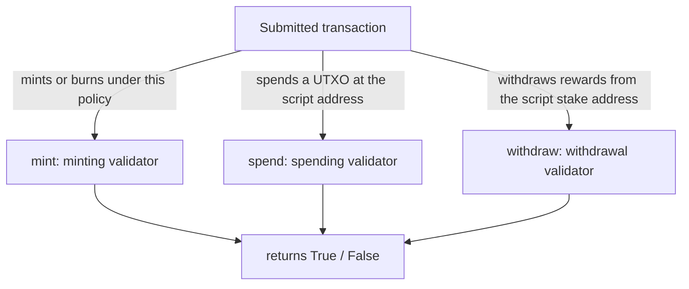

import Tabs from '@theme/Tabs';
import TabItem from '@theme/TabItem';

You've [picked a language](/docs/developers/curriculum/smart-contracts/choose-a-language) (Aiken, for most people). Now you write the on-chain code: the validator. Remember the mental model: a validator is a **gatekeeper** that receives a transaction and returns `True` or `False`. It never moves funds or mutates state; it only decides whether a transaction is allowed.

This page covers writing validators in Aiken, the simpler native-script alternative for multisig and time-locks, and the blueprint that connects your validator to off-chain code. The deep treatment of the three arguments a validator receives is in [Datum, redeemer & context](/docs/developers/curriculum/smart-contracts/datum-redeemer-context); here we focus on authoring.

If you have written web middleware, this is familiar: a validator is like route middleware or an auth guard, a pure function that returns allow or deny without mutating state. The redeemer is the request body it branches on (`MintToken` vs `BurnToken`), and the blueprint (`plutus.json`) is the contract's OpenAPI spec that tools read to generate a typed client.

> Runnable source: [examples/bootcamp/03-aiken-contracts](https://github.com/cardano-foundation/developer-portal/tree/staging/examples/bootcamp/03-aiken-contracts). Install Aiken from [aiken-lang.org](https://aiken-lang.org/installation-instructions); scaffold a project with `npx meshjs <name>` and pick the Aiken template.

## What a validator sees

Building validators means reasoning about transactions. A validator can inspect the whole `Transaction` it's validating (the full type is in the [Aiken stdlib](https://aiken-lang.github.io/stdlib/cardano/transaction.html)): its `inputs` and `outputs`, `reference_inputs`, `mint`, `extra_signatories`, and `validity_range`. For what each field means, see the [field breakdown in Datum, redeemer & context](/docs/developers/curriculum/smart-contracts/datum-redeemer-context#the-transaction-as-the-validator-sees-it); the examples below show how you read them in Aiken.

## The three validator types

Most validators are one of three types, distinguished by what triggers them:



### Minting validator

Runs when a transaction mints or burns tokens under the validator's policy. The simplest possible one:

```aiken
use cardano/assets.{PolicyId}
use cardano/transaction.{Transaction, placeholder}

validator always_succeed {
  mint(_redeemer: Data, _policy_id: PolicyId, _tx: Transaction) {
    True
  }

  else(_) {
    fail @"unsupported purpose"
  }
}

test test_always_succeed_minting_policy() {
  always_succeed.mint(Void, #"", placeholder)
}
```

The validator's hash is the **policy ID** of the tokens it controls. Make it useful by adding a parameter (the owner's key) and a redeemer (which action), so minting requires the owner's signature before a deadline, and burning is always allowed:

```aiken
pub type MyRedeemer {
  MintToken
  BurnToken
}

validator minting_policy(owner_vkey: VerificationKeyHash, minting_deadline: Int) {
  mint(redeemer: MyRedeemer, policy_id: PolicyId, tx: Transaction) {
    when redeemer is {
      MintToken -> {
        let before_deadline = valid_before(tx.validity_range, minting_deadline)
        let is_owner_signed = key_signed(tx.extra_signatories, owner_vkey)
        before_deadline? && is_owner_signed?
      }
      BurnToken -> check_policy_only_burn(tx.mint, policy_id)
    }
  }

  else(_) {
    fail @"unsupported purpose"
  }
}
```

Helpers like `key_signed`, `valid_before`, and `check_policy_only_burn` come from the [vodka](https://github.com/sidan-lab/vodka) library. Minting policies are also covered, with off-chain minting, in [Native tokens > Minting policies](/docs/developers/curriculum/native-tokens/minting-policies).

### Spending validator

Runs when a transaction spends a UTXO sitting at the validator's script address. It receives the UTXO's **datum**, a **redeemer**, the output reference, and the transaction. This one only allows a spend when a specific oracle token is present in the reference inputs (the state-thread / beacon-token pattern):

```aiken
pub type Datum {
  oracle_nft: PolicyId,
}

validator hello_world {
  spend(datum_opt: Option<Datum>, _redeemer: Data, _input: OutputReference, tx: Transaction) {
    when datum_opt is {
      Some(datum) ->
        when inputs_with_policy(tx.reference_inputs, datum.oracle_nft) is {
          [_ref_input] -> True
          _ -> False
        }
      None -> False
    }
  }

  else(_) {
    fail @"unsupported purpose"
  }
}
```

### Withdrawal validator

Runs when a transaction withdraws from the script's reward account. Withdrawal validators must be **registered** on-chain first (the `publish` handler validates registration/deregistration). Their main use isn't staking. It's the **withdraw-zero trick**, where a spending validator delegates its logic to a withdrawal validator that runs once for the whole transaction instead of once per input. That optimization is the [Stake Validator](/docs/developers/curriculum/smart-contracts/advanced/design-patterns/stake-validator) pattern.

```aiken
validator always_succeed(_key_hash: VerificationKeyHash) {
  withdraw(_redeemer: Data, _credential: Credential, _tx: Transaction) {
    True
  }

  publish(_redeemer: Data, _certificate: Certificate, _tx: Transaction) {
    True
  }

  else(_) {
    fail @"unsupported purpose"
  }
}
```

## Native scripts: multisig and time-locks without Plutus

Not every rule needs a Plutus validator. **Native scripts** are Cardano's simpler, non-Turing-complete scripting, perfect for **multi-signature** and **time-locks**, and they cost no script-execution fees. They combine a few primitives: `sig` (a required key), `before` / `after` (slot bounds), and `all` / `any` / `atLeast` (logical combinations).

A native script that requires the owner's signature and only allows minting before a slot:

<Tabs groupId="sdk">
<TabItem value="mesh" label="Mesh" default>

```ts
import { ForgeScript, NativeScript } from "@meshsdk/core"

const nativeScript: NativeScript = {
  type: "all",
  scripts: [
    { type: "before", slot: "99999999" },
    { type: "sig", keyHash },
  ],
}
const forgingScript = ForgeScript.fromNativeScript(nativeScript)
```

**Multisig** is just a native script with multiple `sig` entries under `all` (everyone must sign) or `atLeast` (k-of-n). Each required party signs the *same* transaction with a **partial signature** (`wallet.signTx(tx, true)`); once all required signatures are attached, the transaction is valid. A common shape: a backend wallet partially signs, then the user's browser wallet partially signs, then it's submitted.

</TabItem>
<TabItem value="cardano-cli" label="cardano-cli">

The script is the same JSON, `{"type":"all","scripts":[{"type":"sig","keyHash":"..."},{"type":"after","slot":1000}]}`, supporting `sig`, `before`, `after`, `all`, `any`, and `atLeast`. Build its address with `cardano-cli address build --payment-script-file policy.json`, then spend by collecting one witness per signer plus the script witness and assembling them:

```bash
cardano-cli latest transaction witness --tx-body-file tx.body --script-file policy.json --out-file script.wit
cardano-cli latest transaction witness --tx-body-file tx.body --signing-key-file key1.skey --out-file key1.wit
cardano-cli latest transaction assemble --tx-body-file tx.body --witness-file script.wit --witness-file key1.wit --out-file tx.signed
```

</TabItem>
</Tabs>

A time-locked script must be paired with a matching validity interval: an `after: N` script needs `--invalid-before` ≥ N, a `before: N` script needs `--invalid-hereafter` ≤ N (funds left past a `before` slot are locked forever).

For attaching native scripts off-chain, see [Lock and spend](/docs/developers/curriculum/smart-contracts/lock-and-spend) and the [Mesh smart contracts guide](https://meshjs.dev/apis/txbuilder/smart-contract).

## From validator to blueprint

When you run `aiken build`, the compiler produces a **[CIP-57](https://cips.cardano.org/cip/CIP-57) blueprint** at `plutus.json`, the bridge between your on-chain code and off-chain applications. Think of it as the OpenAPI spec for your contract. It has three parts:

- **`preamble`**: metadata, including the `plutusVersion` (e.g. `v3`) that off-chain libraries must target.
- **`validators`**: each validator's `title`, datum/redeemer/parameter schemas, `compiledCode` (hex CBOR), and `hash` (its on-chain address identifier).
- **`definitions`**: reusable type schemas referenced by validators (via `$ref`, exactly like JSON Schema).

```json
{
  "preamble": { "title": "my/contract", "plutusVersion": "v3", "compiler": { "name": "Aiken" } },
  "validators": [
    { "title": "mint.minting_policy.mint",
      "redeemer": { "schema": { "$ref": "#/definitions/MyRedeemer" } },
      "compiledCode": "59...", "hash": "9c9666..." }
  ],
  "definitions": { "MyRedeemer": { "anyOf": [ { "title": "MintToken", "index": 0, "fields": [] } ] } }
}
```

From the blueprint, tools generate type-safe off-chain code, the same way you'd generate an API client from an OpenAPI spec. Evolution's blueprint codegen and Mesh both read `plutus.json` to produce a typed client. See the blueprint section of [Choose a language](/docs/developers/curriculum/smart-contracts/choose-a-language#blueprints-the-contracts-interface).

## Key takeaway

Every validator is a **pure function**: it receives transaction context and returns `True` or `False`. No side effects, no storage writes, no network calls. The runtime only applies state changes if the validator approves, fundamentally different from a web2 backend that both validates and mutates.

## Next steps

- [Lock and spend](/docs/developers/curriculum/smart-contracts/lock-and-spend): interact with your validator from off-chain code
- [Testing](/docs/developers/curriculum/smart-contracts/testing): test validators with mock transactions before deploying
- [Security](/docs/developers/curriculum/smart-contracts/security): the vulnerability classes to guard against
- [Example contracts](/docs/developers/curriculum/smart-contracts/example-contracts): full validators to read, including the oracle-NFT minting machine
