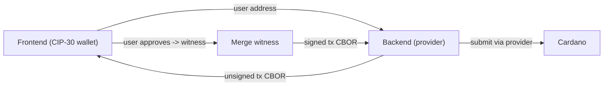

import Tabs from '@theme/Tabs';
import TabItem from '@theme/TabItem';

Connecting a wallet is the front door to almost every dApp: a swap, an NFT mint, a vote, or signing in all start here. On Cardano, browser wallets expose a standard interface called **[CIP-30](https://cips.cardano.org/cip/CIP-0030)**, the dApp-wallet connector. Your app requests access, then asks the wallet for the user's addresses, UTXOs, and signatures. **The keys never leave the user's device**; the wallet prompts the user to approve each signature.

This page is about the **browser wallet** (the user's CIP-30 extension or hardware wallet). To create a wallet from a mnemonic or private key in backend code, see [Keys & Wallets › working with wallets in code](/docs/developers/curriculum/fundamentals/core-concepts/wallets-and-keys#working-with-wallets-in-code).

## What CIP-30 gives you

Once a user grants access, the wallet API lets you:

- Read the user's **addresses** (used, unused, change, and reward/stake address)
- List the wallet's **UTXOs** and **balance**
- Request a **transaction signature** (the user approves in their wallet)
- Request a **data signature** ([CIP-8](https://cips.cardano.org/cip/CIP-0008)) to prove ownership, the basis of [sign-in with wallet](/docs/developers/curriculum/dapps/wallet-authentication)

Most Cardano browser wallets implement CIP-30, and hardware wallets work through them via a browser extension. The extension talks to the device, and your code is identical either way. For the current set of wallets, see [cardano.org/apps](https://cardano.org/apps).

## Connect

Pick your SDK. Both wrap the raw CIP-30 API; the choice follows [your tools](/docs/developers/curriculum/start-building/choose-your-tools).

<Tabs groupId="sdk">
<TabItem value="evolution" label="Evolution" default>

```typescript
import { Address, mainnet, Client } from "@evolution-sdk/evolution"

declare const cardano: any // window.cardano

// 1. Discover installed CIP-30 wallets
const available = Object.keys(cardano).filter((k) => cardano[k]?.enable)

// 2. User picks one; request access (prompts the user)
const walletApi = await cardano["eternl"].enable()

// 3. Wrap it in a signing client
const client = Client.make(mainnet).withCip30(walletApi)

// 4. Read the user's address
const address = Address.toBech32(await client.address())
console.log("Connected:", address)
```

`.withCip30()` gives you signing capability without provider-backed submission on its own. Frontend flows still rely on a backend (or a provider-backed client) to broadcast the signed transaction. That's the architecture below.

</TabItem>
<TabItem value="mesh" label="Mesh">

```typescript
import { BrowserWallet } from "@meshsdk/core"

// 1. Discover installed CIP-30 wallets
const wallets = BrowserWallet.getInstalledWallets()

// 2. User picks one; request access (prompts the user)
const wallet = await BrowserWallet.enable("eternl")

// 3. Read state
const changeAddress = await wallet.getChangeAddress()
const balance = await wallet.getBalance()
const utxos = await wallet.getUtxos()
```

In React, Mesh also ships a ready-made `<CardanoWallet />` connect button and a `useWallet` hook; see [Mesh React](https://meshjs.dev/react).

</TabItem>
</Tabs>

## Frontend signs, backend builds and submits

The most important architectural rule for dApps: **the frontend should only sign**. Build and submit transactions on a backend that holds the provider connection, using a read-only view of the user's address. This keeps provider keys off the client and gives you one place to validate what you're asking users to sign.



1. Frontend connects the wallet (above) and sends the **user's address** to your backend.
2. Backend builds the transaction (it has the provider) and returns the **unsigned CBOR**.
3. Frontend calls `signTx` (the wallet prompts the user) and merges the witness into the transaction.
4. Frontend hands the **signed CBOR** back to the backend, which submits it through the provider.

The frontend half, end to end:

<Tabs groupId="sdk">
<TabItem value="evolution" label="Evolution" default>

```typescript
import { Transaction, TransactionWitnessSet, mainnet, Client } from "@evolution-sdk/evolution"

declare const cardano: any

async function signOnFrontend(unsignedTxCbor: string) {
  // Connect (signing only, no provider on the client)
  const walletApi = await cardano.eternl.enable()
  const client = Client.make(mainnet).withCip30(walletApi)

  // User approves; the wallet returns just its witness set
  const witnessSet = await client.signTx(unsignedTxCbor)

  // Merge the witness into the unsigned transaction
  const signedTxCbor = Transaction.addVKeyWitnessesHex(
    unsignedTxCbor,
    TransactionWitnessSet.toCBORHex(witnessSet)
  )

  // Hand the signed CBOR back to the backend to submit through its provider
  const { txHash } = await fetch("/api/submit-tx", {
    method: "POST",
    headers: { "Content-Type": "application/json" },
    body: JSON.stringify({ signedTxCbor })
  }).then((r) => r.json()) as { txHash: string }

  return txHash
}
```

</TabItem>
</Tabs>

For the backend (building and submitting with a provider), see [your first transaction](/docs/developers/curriculum/start-building/your-first-transaction) and [lock and spend](/docs/developers/curriculum/smart-contracts/lock-and-spend).

:::tip Wallet UX
Always show a wallet-selection UI, handle user rejection gracefully, and display transaction details before requesting a signature. Cache the user's wallet choice, but never auto-connect without an explicit user action, and never cache signatures.
:::

## Handling errors and edge cases

`enable()` rejects with a CIP-30 error code you should handle:

```typescript
declare const cardano: any

async function connect(walletName: string) {
  if (!cardano[walletName]) throw new Error(`${walletName} not installed`)
  try {
    return await cardano[walletName].enable()
  } catch (error: any) {
    if (error.code === 2) console.error("User rejected the connection")
    else if (error.code === 3) console.error("Account not found")
    else console.error("Connection failed:", error)
    throw error
  }
}
```

## Derivation paths

Wallets and hardware devices follow Cardano's [BIP-32 / CIP-1852](/docs/developers/curriculum/fundamentals/core-concepts/wallets-and-keys) derivation paths. You rarely set these yourself (the wallet manages them) but it helps to recognize the shape:

| Path | Account | Role | Use |
|---|---|---|---|
| `m/1852'/1815'/0'/0/0` | 0 | external | First payment address |
| `m/1852'/1815'/0'/0/1` | 0 | external | Second address, same account |
| `m/1852'/1815'/1'/0/0` | 1 | external | Second account, first address |
| `m/1852'/1815'/0'/2/0` | 0 | staking | Staking key |

`1852'` = Cardano purpose, `1815'` = ADA coin type, then account / role (`0` external, `1` change, `2` staking) / index.

## No browser extension? Wallet as a Service

Not every user has a browser wallet installed. **Wallet-as-a-Service (WaaS)** lets users create a non-custodial wallet via social login, removing the install step entirely (keys are split with Shamir's Secret Sharing and reconstructed only on the user's device at signing time). See [UTXOS Web3 Services](/docs/developers/curriculum/dapps/wallet-authentication#hosted-sign-in-as-a-service), which also supports [transaction sponsorship](https://docs.utxos.dev/sponsor) so users can transact without holding ADA for fees first.

## Next steps

- [Sign in with wallet](/docs/developers/curriculum/dapps/wallet-authentication): passwordless authentication with CIP-8 message signing
- [Keys & Wallets](/docs/developers/curriculum/fundamentals/core-concepts/wallets-and-keys): the key model behind wallets, and creating wallets in backend code
- [Detect incoming payments](/docs/developers/integrations/payments/listening-for-payments/overview): confirm ADA payments to an address
- [DeFi on Cardano](/docs/developers/curriculum/dapps/defi): what users do once they're connected
