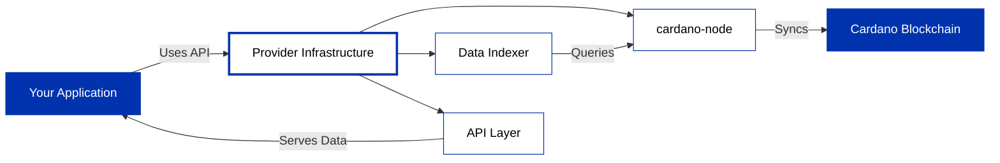

API providers run cardano-node infrastructure and expose blockchain data through developer-friendly APIs, letting you query data and submit transactions without managing servers.

## How API providers work

## Choosing a provider

You reach the chain either through a **managed provider** that runs the node and indexer for you, or by **self-hosting** and querying your own node directly.

| Provider | API | Access |
|---|---|---|
| **[Blockfrost](/docs/developers/curriculum/production/api-providers/blockfrost/overview)** | REST | Managed, API key (free tier) |
| **[Koios](/docs/developers/curriculum/production/api-providers/koios)** | REST, GraphQL | Community-run, key optional |
| **[Ogmios](/docs/developers/curriculum/production/api-providers/ogmios)** | WebSocket, JSON-RPC | Self-hosted, needs your own node |

Blockfrost is the quickest way to start. Koios is a community-run alternative that needs no key for basic use. Ogmios isn't a hosted service: it's a lightweight bridge to a cardano-node you run yourself, usually paired with Kupo for indexing (the "Kupmios" stack) or available hosted through [Demeter](/docs/developers/curriculum/production/demeter), for low-level real-time access and full data sovereignty. For the wider managed-versus-self-hosted picture, including Maestro, see [production infrastructure](/docs/developers/curriculum/production/infrastructure).

## Next steps

- **Get started quickly**: [Set up Blockfrost](/docs/developers/curriculum/production/api-providers/blockfrost/get-started) for immediate API access
- **Explore alternatives**: [Try Koios](/docs/developers/curriculum/production/api-providers/koios) for community-driven infrastructure
- **Advanced access**: [Use Ogmios](/docs/developers/curriculum/production/api-providers/ogmios) for protocol-level queries
- **Compare options**: [View all infrastructure approaches](/docs/developers/curriculum/production/infrastructure)
