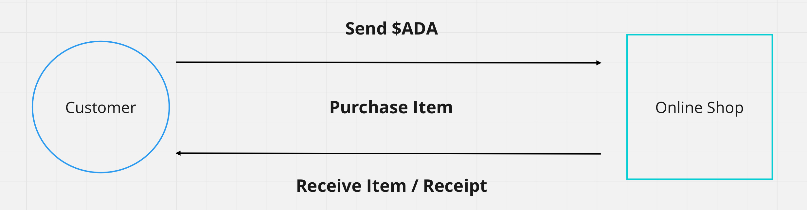

import Tabs from '@theme/Tabs';
import TabItem from '@theme/TabItem';

Detecting incoming payments is a core need for shops, payment gateways, donations, subscriptions, ticketing, and vending or IoT machines: you need to know reliably when ada arrives at an address.

## How it works

Every method follows the same loop:

1. **Generate a payment address** for the order (often shown as a [CIP-13 QR code](#as-a-uri-or-qr-code-cip-13)).
2. **Display it** to the customer.
3. **Poll the address** for incoming transactions.
4. **Compare the received amount** against what you expect.
5. **Fulfill** once the payment confirms.



The only thing that differs between methods is *how you read the chain*: a hosted API, your own node via cardano-cli, or a cardano-wallet service. Start with Blockfrost unless you already run your own infrastructure.

Cardano's read APIs don't push events, so every method here **polls** on an interval. In production you can replace the loop with a provider **webhook** (for example [Blockfrost webhooks](https://blockfrost.dev/docs/start-building/webhooks/)) that calls your backend when a matching transaction lands.

## Detecting a payment

Generate a fresh payment address per order, then poll it: read the address's UTXOs, sum the lovelace, and compare to what you expect. The same loop works through either SDK's provider, or with cardano-cli against your own node.

<Tabs groupId="sdk">
<TabItem value="evolution" label="Evolution" default>

```typescript
import { Address, Client, preprod } from "@evolution-sdk/evolution"

const client = Client.make(preprod).withBlockfrost({
  baseUrl: "https://cardano-preprod.blockfrost.io/api/v0",
  projectId: process.env.BLOCKFROST_API_KEY!,
})
const expectedLovelace = 1_000_000n

async function receivedLovelace(address: string) {
  const utxos = await client.getUtxos(Address.fromBech32(address))
  return utxos.reduce((sum, utxo) => sum + (utxo.assets.lovelace ?? 0n), 0n)
}

// poll every few seconds until paid
const timer = setInterval(async () => {
  if ((await receivedLovelace(address)) >= expectedLovelace) {
    clearInterval(timer)
    // payment confirmed: fulfill the order
  }
}, 3000)
```

</TabItem>
<TabItem value="mesh" label="Mesh">

```typescript
import { BlockfrostProvider } from "@meshsdk/core"

const provider = new BlockfrostProvider(process.env.BLOCKFROST_API_KEY!)
const expectedLovelace = 1_000_000n

async function receivedLovelace(address: string) {
  const utxos = await provider.fetchAddressUTxOs(address)
  return utxos.reduce((sum, u) => {
    const lovelace = u.output.amount.find((a) => a.unit === "lovelace")?.quantity ?? "0"
    return sum + BigInt(lovelace)
  }, 0n)
}

const timer = setInterval(async () => {
  if ((await receivedLovelace(address)) >= expectedLovelace) {
    clearInterval(timer)
    // payment confirmed: fulfill the order
  }
}, 3000)
```

</TabItem>
<TabItem value="cardano-cli" label="cardano-cli">

If you run your own [node](/docs/operators/node/installing-cardano-node), query the address UTXOs directly and sum their lovelace, no third-party API involved:

```bash
cardano-cli query utxo --address "$(cat payment.addr)" --testnet-magic 1 --output-json
```

```js
import { execSync } from "node:child_process"

const expectedLovelace = 1_000_000n

function receivedLovelace(addr) {
  const out = execSync(`cardano-cli query utxo --address ${addr} --testnet-magic 1 --output-json`)
  const utxos = JSON.parse(out.toString())
  return Object.values(utxos).reduce((sum, u) => sum + BigInt(u.value.lovelace), 0n)
}
// poll receivedLovelace(addr) on an interval and compare to expectedLovelace
```

</TabItem>
</Tabs>

For a complete point-of-sale app with a React UI, QR codes, and live USD/ADA conversion, fork the [Cardano POS starter](https://github.com/fill-the-fill/cardano-pos-starting-point).

:::tip Wait for confirmations
A transaction in a recent block can still be [rolled back](/docs/developers/curriculum/fundamentals/consensus-and-ouroboros#how-does-finality-work). Cardano produces a block roughly every 20 seconds, so for anything valuable, wait 10-20 blocks (a few minutes) before treating a payment as final; the larger the amount, the deeper you should wait. Track deposits by transaction id and credit each one exactly once, only after your chosen depth, so a rollback that replays the same transaction cannot double-credit.
:::

## Requesting a payment

Detection is the receiver's half. The sender's half is **requesting the payment**: from your dApp, the user's connected wallet builds a transfer to your address, signs it, and submits it. Together they close the loop, the user pays and you detect it.

The simplest case is a plain transfer, where the user pays out of their own wallet with no app key or logic involved. Once they have [connected a wallet](/docs/developers/curriculum/dapps/connect-a-wallet), a "pay" button builds a single `payToAddress`, the wallet prompts for a signature, and you submit:

<Tabs groupId="sdk">
<TabItem value="evolution" label="Evolution" default>

```typescript
import { Assets, Client, preprod } from "@evolution-sdk/evolution"

// walletApi = await window.cardano.<name>.enable() from connecting the wallet
declare const walletApi: any

// A Signing Client: a provider for params + submission, the connected wallet for signing
const client = Client.make(preprod)
  .withBlockfrost({ baseUrl: "https://cardano-preprod.blockfrost.io/api/v0", projectId: process.env.BLOCKFROST_API_KEY! })
  .withCip30(walletApi)

const tx = await client
  .newTx()
  .payToAddress({ address: "addr_test1...", assets: Assets.fromLovelace(10_000_000n) })  // pay 10 ADA
  .build()
const txHash = await (await tx.sign()).submit()   // wallet prompts the user, then submit
```

</TabItem>
<TabItem value="mesh" label="Mesh">

```tsx
import { useWallet } from "@meshsdk/react"
import { MeshTxBuilder } from "@meshsdk/core"

function PayButton({ recipient, lovelace }) {
  const { wallet, connected } = useWallet()

  async function pay() {
    const unsignedTx = await new MeshTxBuilder()
      .txOut(recipient, [{ unit: "lovelace", quantity: lovelace }])
      .changeAddress(await wallet.getChangeAddress())   // browser wallet: bech32 string
      .selectUtxosFrom(await wallet.getUtxos())          // browser wallet: UTxO list
      .complete()
    const signedTx = await wallet.signTx(unsignedTx)     // wallet prompts the user
    await wallet.submitTx(signedTx)                       // submits through the wallet, no API key
  }

  return <button onClick={pay} disabled={!connected}>Pay {Number(lovelace) / 1_000_000} ADA</button>
}
```

</TabItem>
</Tabs>

Show the amount and recipient before prompting, and handle the wallet's rejection and loading states. Two things decide where the build belongs:

- **Provider keys.** The Evolution flow submits through a provider, so its key lives wherever the client runs; in the browser that key is exposed. Mesh's browser wallet submits through the wallet itself, so a plain transfer needs no key client-side. For anything beyond a trivial transfer, prefer building server-side.
- **App-controlled transactions.** The moment your app contributes its own inputs, a minting policy, or a co-signature, the build moves to the backend and the user only partial-signs. That is the [sponsored and multi-party](/docs/developers/curriculum/dapps/sponsored-transactions) pattern, and the reason [connecting a wallet](/docs/developers/curriculum/dapps/connect-a-wallet) recommends the frontend only sign.

### As a URI or QR code (CIP-13)

The connected-wallet path assumes the payer is already in your dApp with a browser wallet. The other way to request a payment needs no connection at all: encode the request as a [CIP-13](https://cips.cardano.org/cip/CIP-0013) `web+cardano:` URI, a link or QR code the payer opens or scans with a compatible mobile wallet, which opens pre-filled with your address and the amount for them to confirm and sign. This is the phone-first case with no dApp connector involved: a point-of-sale terminal, a code shown on a screen or printed on an invoice, a donation link.

The format is `web+cardano:{address}?amount={ada}`, with the amount in decimal ada. Treat it as send-side convenience only. Wallet support for the amount varies, so it may or may not arrive pre-filled, and nothing tells you the payer scanned the code or what they will actually send. The URI improves the payer's experience but is never the source of truth: you still confirm exactly as [above](#detecting-a-payment), by polling the address for the lovelace you expect. To match a specific incoming payment to a specific request when you can't attach a memo, make the requested amount unique per request; a proper payment identifier on the URI is proposed in a follow-up (CIP-157, still in draft).

For a full device-hosted build of this, a QR payment terminal running on hardware, see [IoT Workshop 05: CIP-13 Integration](/docs/developers/curriculum/dapps/iot/qr-code-payments/02-cip13-integration).

## Use cases

E-commerce checkout, payment gateways, donation platforms, subscription billing, event ticketing, in-app purchases, and vending or IoT machines: anywhere you fulfill something only after ada arrives.
