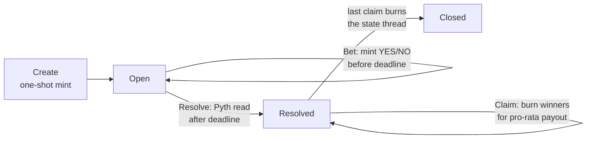

Pyth is the production price oracle this curriculum recommends. If oracles are new to you, [Oracles](/docs/developers/curriculum/dapps/oracles/overview) covers the general problem of getting off-chain data on-chain and the pull-based model Cardano contracts use to read it.

## What is Pyth?

[Pyth](https://pyth.network) is a high-frequency oracle network that delivers real-time price data across multiple blockchains. [Pyth Pro (Lazer)](https://docs.pyth.network/price-feeds/pro) provides sub-second price feeds using a pull-based model: consumers fetch signed updates off-chain and verify them on-chain.

On Cardano, price updates are verified through a **zero-withdrawal** from the Pyth withdraw script. Your validator calls `pyth.get_updates` to read verified updates directly from the transaction being validated. The Pyth script handles signature verification so your contract doesn't have to.

## What Pyth provides

**Pyth Pro (Lazer)**: Sub-second, high-frequency price feeds via a pull-based model. You subscribe to a websocket or fetch the latest price and include the signed update in your transaction.

**On-chain Aiken Library**: The [`pyth-lazer-cardano`](https://github.com/pyth-network/pyth-crosschain/tree/main/lazer/contracts/cardano) library handles signature verification and exposes parsed price data including price, confidence, EMA price, bid/ask, and exponent.

**Off-chain TypeScript SDK**: The [`@pythnetwork/pyth-lazer-sdk`](https://www.npmjs.com/package/@pythnetwork/pyth-lazer-sdk) provides websocket streaming and one-shot fetching of signed price updates.

## Integration guide

Integrating Pyth Pro into a Cardano smart contract is a three-step process:

### Step 1: Use the Aiken library on-chain

Add the Pyth Lazer Cardano library to your `aiken.toml`:

```toml
[[dependencies]]
name = "pyth-network/pyth-lazer-cardano"
version = "main"
source = "github"
```

Your contract reads verified updates from the transaction via `pyth.get_updates`. This function reads the Pyth state from `reference_inputs` and the verified update bytes from the Pyth withdraw script's redeemer.

The following example reads the `ADA/USD` feed (Pyth Pro feed ID `16`) and converts the result into Aiken's `Rational` type:

```aiken
use aiken/collection/list
use aiken/math/rational.{Rational}
use cardano/assets.{PolicyId}
use cardano/transaction.{Transaction}
use pyth
use types/u32

fn read_ada_usd_price(pyth_id: PolicyId, self: Transaction) -> Rational {
  expect [update] = pyth.get_updates(pyth_id, self)
  expect Some(feed) = list.find(update.feeds, fn(feed) {
    u32.as_int(feed.feed_id) == 16
  })
  expect Some(Some(price)) = feed.price
  expect Some(exponent) = feed.exponent
  expect Some(multiplier) = rational.from_int(10) |> rational.pow(exponent)

  rational.from_int(price) |> rational.mul(multiplier)
}
```

Each `PriceUpdate` includes `timestamp_us`, `channel_id`, and a list of `feeds`. Each `Feed` includes fields such as `feed_id`, `price`, `best_bid_price`, `best_ask_price`, `exponent`, `confidence`, `ema_price`, and `feed_update_timestamp`.

:::warning
The Pyth withdraw script verifies signature validity but does **not** enforce freshness. A valid signature proves the price is genuinely Pyth's (integrity); it does not prove the update is recent, or that one was posted at all (liveness). If your contract requires a validity window, enforce it directly by checking the `timestamp_us` field. See [who publishes, and what that guarantees](/docs/developers/curriculum/dapps/oracles/overview#who-publishes-and-what-that-guarantees) for the trust model behind this.
:::

:::warning
`pyth.get_updates` requires the Pyth state UTxO to be present as a reference input. If you omit it, your validator will fail when it tries to locate the Pyth State NFT and withdraw-script hash.
:::

### Step 2: Fetch signed price updates off-chain

Use the TypeScript SDK to fetch a signed update. You need to request the `solana` format, which is the little-endian Ed25519-signed binary format used for both Cardano and Solana integrations.

:::tip Getting an access token
Fetching updates requires a Pyth Pro access token. Projects building on Cardano can currently get a year of full access for free: see the [Intersect announcement](https://intersectmbo.org/news/pyth-pro-on-cardano-subscription-offer) for how to request an API key.
:::

```typescript
import { PythLazerClient } from "@pythnetwork/pyth-lazer-sdk";

const lazer = await PythLazerClient.create({ token: LAZER_TOKEN });
const latestPrice = await lazer.getLatestPrice({
  channel: "fixed_rate@200ms",
  formats: ["solana"],
  jsonBinaryEncoding: "hex",
  priceFeedIds: [16],
  properties: ["price", "exponent"],
});

if (!latestPrice.solana?.data) {
  throw new Error("Missing update payload");
}

const update = Buffer.from(latestPrice.solana.data, "hex");
```

If you need streaming integration instead of a one-shot fetch, see the [Pyth Pro subscription guide](https://docs.pyth.network/price-feeds/pro/subscribe-to-prices).

### Step 3: Include the update in a Cardano transaction

Build a transaction that performs a zero-withdrawal from the Pyth withdraw script, passing the signed update as the redeemer. The `pyth_id` is the Pyth deployment policy ID for your network.

```typescript
import { Client, preprod, ScriptHash } from "@evolution-sdk/evolution";
import {
  getPythScriptHash,
  getPythState,
} from "@pythnetwork/pyth-lazer-cardano-js";

const client = Client.make(preprod).withKoios({
  baseUrl: "https://preprod.koios.rest/api/v1",
});

const pythState = await getPythState(POLICY_ID, client);
const pythScript = getPythScriptHash(pythState);

const wallet = client.withSeed({ mnemonic: CARDANO_MNEMONIC });

const now = BigInt(Date.now());
const tx = wallet
  .newTx()
  .setValidity({ from: now - 60_000n, to: now + 60_000n })
  .readFrom({ referenceInputs: [pythState] })
  .withdraw({
    amount: 0n,
    redeemer: [update],
    stakeCredential: ScriptHash.fromHex(pythScript),
  });

// Add your own scripts and transaction data, then sign and submit:
const builtTx = await tx.build();
const digest = await builtTx.signAndSubmit();
```

:::warning
The zero-withdrawal and your consuming validator must be in the **same transaction**. `pyth.get_updates` reads the withdrawal redeemer directly from the transaction being validated.
:::

### Verify the integration

Before wiring Pyth into a real contract, deploy a minimal validator that does nothing but read the feed. If this works, the whole pipeline works: the fetch, the zero-withdrawal, the reference input, and `pyth.get_updates`. Any failure after this point is in your own logic, not the integration.

```aiken
use aiken/collection/list
use cardano/address.{Credential}
use cardano/assets.{PolicyId}
use cardano/certificate.{Certificate, RegisterCredential}
use cardano/transaction.{Transaction}
use pyth
use types/u32

/// Minimal test validator to verify the Pyth integration works.
/// Parameterized with the Pyth deployment policy ID.
validator pyth_test(pyth_id: PolicyId) {
  withdraw(_redeemer: Data, _account: Credential, self: Transaction) {
    expect [update] = pyth.get_updates(pyth_id, self)

    // Find BTC/USD (feed ID 1) and assert a price exists
    expect Some(btc_feed) =
      list.find(update.feeds, fn(f) { u32.as_int(f.feed_id) == 1 })
    expect Some(Some(_price)) = btc_feed.price

    True
  }

  publish(_redeemer: Data, certificate: Certificate, _self: Transaction) {
    when certificate is {
      RegisterCredential { .. } -> True
      _ -> fail
    }
  }

  else(_) {
    fail
  }
}
```

This test consumer is itself a [withdrawal validator](/docs/developers/curriculum/smart-contracts/write-a-validator#withdrawal-validator), and a withdrawal validator's stake credential must be **registered on-chain before its first use**. That is what the `publish` handler is for: it allows the registration certificate and nothing else. Register the credential once, then run a transaction with two zero-withdrawals, the Pyth one carrying the signed update and this one running the check.

## Validator patterns

The steps above get a verified price into your validator. What follows are the recurring shapes for actually using it, written against the current library types. Two unit conventions matter throughout: transaction validity bounds are POSIX **milliseconds**, while `timestamp_us` is **microseconds**. Feed fields are also double-optional: the outer `Option` tells you whether you requested that property in the off-chain fetch (Step 2's `properties` array), the inner whether Pyth has a value for it right now.

### Enforce a freshness window

The signature check proves integrity, not recency, so bound the age yourself. Anchor the check to the validity **upper** bound: then no matter when inside its validity window the transaction lands on-chain, the update is at most `max_age_ms` old.

```aiken
use aiken/interval.{Finite}
use cardano/transaction.{Transaction}
use pyth.{PriceUpdate}
use types/u64

const max_age_ms: Int = 60_000

fn is_fresh(update: PriceUpdate, self: Transaction) -> Bool {
  expect Finite(upper) = self.validity_range.upper_bound.bound_type
  let age_us = upper * 1_000 - u64.as_int(update.timestamp_us)
  age_us >= 0 && age_us <= max_age_ms * 1_000
}
```

The two-sided check rejects both stale updates and updates timestamped after the validity window, since either one means the transaction was assembled inconsistently. It also forces the transaction to have a finite validity interval: an unbounded transaction fails the `expect`.

### Settle an outcome at a deadline

In the settlement shape, the datum stores the question (which feed, what threshold, by when) and the oracle answers it exactly once, after the deadline. The deadline is enforced through the validity interval, so the ledger itself refuses a transaction that tries to settle early.

```aiken
use aiken/collection/list
use aiken/interval.{Finite}
use cardano/assets.{PolicyId}
use cardano/transaction.{Transaction}
use pyth
use types/u32

pub type Terms {
  pyth_id: PolicyId,
  feed_id: Int,
  target_price: Int,
  deadline: Int,
}

fn settles_above_target(terms: Terms, self: Transaction) -> Bool {
  // The transaction cannot be valid before the deadline
  expect Finite(lower) = self.validity_range.lower_bound.bound_type
  expect lower >= terms.deadline

  expect [update] = pyth.get_updates(terms.pyth_id, self)
  expect Some(feed) =
    list.find(update.feeds, fn(f) { u32.as_int(f.feed_id) == terms.feed_id })
  expect Some(Some(price)) = feed.price

  price > terms.target_price
}
```

Two details make this cheap and safe:

- **Store the target in raw feed units.** ADA/USD publishes with exponent `-8`, so a target of $0.45 is stored as `45_000_000`. Comparing two integers avoids rational arithmetic on-chain entirely; the conversion example in Step 1 is only needed when you must combine feeds with different exponents.
- **Mirror the bound for the other side of the deadline.** Any action that must happen *before* it, such as placing a bet or adjusting a position, requires the validity **upper** bound at or below `terms.deadline`. Between the two rules, the state machine cannot accept positions after expiry or settle before it, and none of that depends on off-chain code behaving.
- **Let anyone settle.** The oracle signature already fixes the outcome, so the resolving transaction needs no privileged signer. Requiring one (say, the market creator) reintroduces exactly the liveness dependency the signature model warns about: settlement then happens only when that party chooses to act. Keep resolution permissionless and let the deadline plus the verified price decide.

This is the core of a prediction market, an option expiry, or a parametric insurance payout. The surrounding contract only adds how positions are entered and how the pot is paid out.

### Refuse to act in a dislocated market

The bid–ask spread is a live uncertainty measure. A settlement or liquidation that fires during a momentary dislocation is technically correct and practically wrong, so let the contract demand an orderly market:

```aiken
fn spread_within(feed: Feed, max_spread: Int) -> Bool {
  expect Some(Some(bid)) = feed.best_bid_price
  expect Some(Some(ask)) = feed.best_ask_price
  ask - bid <= max_spread
}
```

The same idea extends to the other payload fields: `ema_price` against `price` gives a momentum signal with no on-chain history, and two feeds fetched in one update give a cross-asset ratio. When you compare a ratio against bounds, cross-multiply instead of dividing (`min_num * price_b <= price_a * min_den`) so everything stays in integers. The design-space view of these options is in [Designing with a price feed](/docs/developers/curriculum/dapps/oracles/overview#designing-with-a-price-feed).

The complete example below composes all three of these shapes into one working contract.

## A complete example: a price-settled prediction market

Everything so far has been pieces. This section assembles them into a full dApp: a binary prediction market, "will BTC be above this price at this time?", where the Pyth feed is the judge. The contract is adapted from the [winning entry](https://github.com/SAIB-Inc/cardano-pyth-prediction-market) of the recent Cardano x Pyth hackathon.

The market's lifecycle:



### The market lives in one UTxO

The whole market, its question, its pot, its accounting, is a single UTxO carrying an inline datum and a **[state-thread token](https://aiken-lang.org/fundamentals/common-design-patterns#state-thread-tokens-aka-stt)** that proves it is the genuine market and not a look-alike someone paid into the script address:

```aiken
use cardano/assets.{PolicyId}
use cardano/transaction.{OutputReference}

pub type MarketDatum {
  creator: ByteArray,
  pyth_id: PolicyId,
  feed_id: Int,
  target_price: Int,
  resolution_time: Int,
  token_policy: PolicyId,
  yes_reserve: Int,
  no_reserve: Int,
  k: Int,
  total_yes_minted: Int,
  total_no_minted: Int,
  total_ada: Int,
  resolved: Bool,
  winning_side: Option<BetDirection>,
}

pub type BetDirection {
  Yes
  No
}

pub type MarketAction {
  Bet { direction: BetDirection, amount: Int }
  Resolve
  Claim { burn_amount: Int }
}

pub type MintAction {
  MintTokens
  BurnTokens
}

/// Parameter for the market validator (makes each market's policy ID unique)
pub type MarketParams {
  one_shot: OutputReference,
}
```

Four groups of fields:

- **The question**: `pyth_id`, `feed_id`, `target_price`, `resolution_time`. Which Pyth deployment, which feed, what threshold, by when. `target_price` is stored in raw feed units, exactly as the [settlement pattern](#settle-an-outcome-at-a-deadline) above prescribes.
- **Position pricing**: `yes_reserve`, `no_reserve`, `k`. A constant-product curve (the same `x * y = k` idea AMMs use) prices YES and NO positions dynamically, so betting on the side the market already favors buys you fewer tokens.
- **Accounting**: `total_yes_minted`, `total_no_minted`, `total_ada`. What claims will be paid from and divided by.
- **Lifecycle**: `resolved`, `winning_side`. Flipped exactly once, by the oracle.

The `one_shot` parameter is an output reference the creating transaction must consume, a [one-shot minting policy](https://aiken-lang.org/fundamentals/common-design-patterns#one-shot-minting-policies). Since no UTxO can be spent twice, each market instantiates a unique script, and therefore a unique policy ID and address.

### One script, three identities

The validator is a single Aiken `validator` block with both a spend and a mint handler. That means the same script hash is simultaneously the **spending validator** guarding the market UTxO, the **minting policy** of the YES/NO position tokens, and the **identity** of the state-thread token. This identity trick is the backbone of the design: any check against `market_policy_id` is a check against all three at once.

```aiken
use cardano/assets.{PolicyId}
use cardano/transaction.{OutputReference, Transaction}
use prediction_market/market_validation.{
  validate_bet, validate_burn_tokens, validate_claim, validate_mint_tokens,
  validate_resolve,
}
use prediction_market/types.{
  Bet, BurnTokens, Claim, MarketAction, MarketDatum, MarketParams, MintAction,
  MintTokens, Resolve,
}

validator market(params: MarketParams) {
  spend(
    datum: Option<MarketDatum>,
    redeemer: MarketAction,
    spend_out_ref: OutputReference,
    self: Transaction,
  ) {
    expect Some(market_datum) = datum

    when redeemer is {
      Bet { direction, amount } ->
        validate_bet(market_datum, direction, amount, spend_out_ref, self)
      Resolve -> validate_resolve(market_datum, spend_out_ref, self)
      Claim { burn_amount } ->
        validate_claim(market_datum, burn_amount, spend_out_ref, self)
    }
  }

  mint(redeemer: MintAction, policy_id: PolicyId, self: Transaction) {
    when redeemer is {
      MintTokens -> validate_mint_tokens(params.one_shot, policy_id, self)
      BurnTokens -> validate_burn_tokens(policy_id, self)
    }
  }

  else(_) {
    fail
  }
}
```

The logic lives in a library module (`prediction_market/market_validation.ak`, with the types above in `prediction_market/types.ak`). Three token names are fixed: `"YES"`, `"NO"`, and `""` (the empty name) for the state thread:

```aiken
use aiken/collection/dict
use aiken/collection/list
use aiken/interval.{Finite}
use cardano/address.{Script}
use cardano/assets
use cardano/transaction.{InlineDatum, OutputReference, Transaction, find_input}
use prediction_market/types.{MarketDatum, No, Yes}
use pyth
use types/u32

pub const yes_token: ByteArray = "YES"
pub const no_token: ByteArray = "NO"
pub const state_thread_token: ByteArray = ""

fn has_state_thread(value: assets.Value, policy_id: assets.PolicyId) -> Bool {
  assets.quantity_of(value, policy_id, state_thread_token) == 1
}
```

<details>
<summary>Mint-policing helpers used below</summary>

These enforce that a transaction's mint field contains exactly what the action allows, so nothing extra can ride along under the market's policy:

```aiken
fn has_no_market_policy_mint(
  policy_id: assets.PolicyId,
  tx: Transaction,
) -> Bool {
  let mint_dict = tx.mint |> assets.tokens(policy_id)
  dict.foldl(mint_dict, True, fn(_asset_name, _qty, _acc) { False })
}

fn only_mints_market_token(
  policy_id: assets.PolicyId,
  token_name: ByteArray,
  amount: Int,
  tx: Transaction,
) -> Bool {
  let mint_dict = tx.mint |> assets.tokens(policy_id)

  assets.quantity_of(tx.mint, policy_id, token_name) == amount && dict.foldl(
    mint_dict,
    True,
    fn(asset_name, qty, acc) {
      acc && asset_name == token_name && qty == amount
    },
  )
}

fn only_burns_market_token(
  policy_id: assets.PolicyId,
  token_name: ByteArray,
  amount: Int,
  burn_state_thread: Bool,
  tx: Transaction,
) -> Bool {
  let mint_dict = tx.mint |> assets.tokens(policy_id)

  assets.quantity_of(tx.mint, policy_id, token_name) == amount && if burn_state_thread {
    assets.quantity_of(tx.mint, policy_id, state_thread_token) == -1
  } else {
    assets.quantity_of(tx.mint, policy_id, state_thread_token) == 0
  } && dict.foldl(
    mint_dict,
    True,
    fn(asset_name, qty, acc) {
      acc && if asset_name == token_name {
        qty == amount
      } else {
        burn_state_thread && asset_name == state_thread_token && qty == -1
      }
    },
  )
}
```

</details>

### Bet

A bet spends the market UTxO and recreates it with the pot grown, the reserves shifted, and the bettor's position tokens minted. Note the [mirror rule](#settle-an-outcome-at-a-deadline) in action: the validity **upper** bound must sit at or below the deadline.

```aiken
pub fn validate_bet(
  datum: MarketDatum,
  direction: types.BetDirection,
  amount: Int,
  spend_out_ref: OutputReference,
  tx: Transaction,
) -> Bool {
  expect !datum.resolved
  expect amount > 0

  // Must be before resolution time
  expect Finite(upper) = tx.validity_range.upper_bound.bound_type
  expect upper <= datum.resolution_time

  // Tokens out via the constant product formula
  let (tokens_out, new_datum) =
    when direction is {
      Yes -> {
        let tokens = datum.yes_reserve - datum.k / ( datum.no_reserve + amount )
        expect tokens > 0
        let new =
          MarketDatum {
            ..datum,
            yes_reserve: datum.yes_reserve - tokens,
            no_reserve: datum.no_reserve + amount,
            total_yes_minted: datum.total_yes_minted + tokens,
            total_ada: datum.total_ada + amount,
          }
        (tokens, new)
      }
      No -> {
        let tokens = datum.no_reserve - datum.k / ( datum.yes_reserve + amount )
        expect tokens > 0
        let new =
          MarketDatum {
            ..datum,
            yes_reserve: datum.yes_reserve + amount,
            no_reserve: datum.no_reserve - tokens,
            total_no_minted: datum.total_no_minted + tokens,
            total_ada: datum.total_ada + amount,
          }
        (tokens, new)
      }
    }

  // The market must continue: same address, state thread intact, new datum
  expect Some(spend_input) = find_input(tx.inputs, spend_out_ref)
  expect Script(market_policy_id) =
    spend_input.output.address.payment_credential
  let script_address = spend_input.output.address
  expect has_state_thread(spend_input.output.value, market_policy_id)

  expect Some(continuing_output) =
    tx.outputs
      |> list.find(fn(output) { output.address == script_address })

  expect InlineDatum(out_datum) = continuing_output.datum
  expect output_market_datum: MarketDatum = out_datum
  expect output_market_datum == new_datum
  expect has_state_thread(continuing_output.value, market_policy_id)

  // Exactly the earned position tokens are minted, nothing else
  let expected_token_name =
    when direction is {
      Yes -> yes_token
      No -> no_token
    }

  expect
    only_mints_market_token(
      market_policy_id,
      expected_token_name,
      tokens_out,
      tx,
    )

  // The pot must actually grow by the bet
  let input_lovelace = assets.lovelace_of(spend_input.output.value)
  let output_lovelace = assets.lovelace_of(continuing_output.value)
  expect output_lovelace >= input_lovelace + amount

  True
}
```

The validator recomputes the CPMM math itself and demands the continuing datum match exactly. The off-chain code proposes the new state; the validator verifies it.

### Resolve

Resolve is where the oracle comes in, and it is exactly the [settle-at-a-deadline pattern](#settle-an-outcome-at-a-deadline): validity lower bound at or past the deadline, one `pyth.get_updates` read, one integer comparison.

```aiken
pub fn validate_resolve(
  datum: MarketDatum,
  spend_out_ref: OutputReference,
  tx: Transaction,
) -> Bool {
  expect !datum.resolved

  // Must be after resolution time
  expect Finite(lower) = tx.validity_range.lower_bound.bound_type
  expect lower >= datum.resolution_time

  // The verified Pyth price decides the winner
  expect [update] = pyth.get_updates(datum.pyth_id, tx)
  expect Some(feed) =
    list.find(update.feeds, fn(f) { u32.as_int(f.feed_id) == datum.feed_id })
  expect Some(Some(oracle_price)) = feed.price

  let winning_side =
    if oracle_price > datum.target_price {
      Yes
    } else {
      No
    }

  // Creator must sign (hackathon simplification, see below)
  expect tx.extra_signatories |> list.has(datum.creator)

  // Continuing output: same value, datum flipped to resolved
  expect Some(spend_input) = find_input(tx.inputs, spend_out_ref)
  expect Script(market_policy_id) =
    spend_input.output.address.payment_credential
  let script_address = spend_input.output.address
  expect has_state_thread(spend_input.output.value, market_policy_id)

  let expected_datum =
    MarketDatum { ..datum, resolved: True, winning_side: Some(winning_side) }

  expect Some(continuing_output) =
    tx.outputs
      |> list.find(fn(output) { output.address == script_address })

  expect InlineDatum(out_datum) = continuing_output.datum
  expect output_market_datum: MarketDatum = out_datum
  expect output_market_datum == expected_datum
  expect has_state_thread(continuing_output.value, market_policy_id)
  expect has_no_market_policy_mint(market_policy_id, tx)

  // No ADA may leave during resolve
  let input_lovelace = assets.lovelace_of(spend_input.output.value)
  let output_lovelace = assets.lovelace_of(continuing_output.value)
  expect output_lovelace >= input_lovelace

  True
}
```

:::caution Hackathon simplifications to harden for production
Two corners were cut here, both flagged by the original authors. First, resolution requires the **creator's signature**; as [Let anyone settle](#settle-an-outcome-at-a-deadline) explains, that reintroduces a liveness dependency. Drop the `extra_signatories` check and let the deadline plus the verified price decide. Second, there is **no freshness check** on the update; add the [`is_fresh`](#enforce-a-freshness-window) guard so a resolver cannot settle with an old price that happened to suit them.
:::

### Claim

After resolution, winners burn their tokens for a pro-rata share of the pot. The arithmetic is one line: `payout = burn_amount * total_ada / total_winning_minted`. Note the ending: when the last winning token is burned, the state thread burns with it and the market UTxO disappears. The contract cleans up after itself.

```aiken
pub fn validate_claim(
  datum: MarketDatum,
  burn_amount: Int,
  spend_out_ref: OutputReference,
  tx: Transaction,
) -> Bool {
  expect datum.resolved
  expect Some(winning_side) = datum.winning_side
  expect burn_amount > 0

  let (winning_token, total_winning_minted) =
    when winning_side is {
      Yes -> (yes_token, datum.total_yes_minted)
      No -> (no_token, datum.total_no_minted)
    }

  let payout = burn_amount * datum.total_ada / total_winning_minted

  expect Some(spend_input) = find_input(tx.inputs, spend_out_ref)
  expect Script(market_policy_id) =
    spend_input.output.address.payment_credential
  let script_address = spend_input.output.address
  expect has_state_thread(spend_input.output.value, market_policy_id)

  let expected_datum =
    when winning_side is {
      Yes ->
        MarketDatum {
          ..datum,
          total_ada: datum.total_ada - payout,
          total_yes_minted: datum.total_yes_minted - burn_amount,
        }
      No ->
        MarketDatum {
          ..datum,
          total_ada: datum.total_ada - payout,
          total_no_minted: datum.total_no_minted - burn_amount,
        }
    }

  if total_winning_minted == burn_amount {
    // Last claimer takes what remains, burns the state thread, market closes
    expect
      only_burns_market_token(
        market_policy_id,
        winning_token,
        -burn_amount,
        True,
        tx,
      )
    True
  } else {
    expect Some(continuing_output) =
      tx.outputs
        |> list.find(fn(output) { output.address == script_address })

    expect InlineDatum(out_datum) = continuing_output.datum
    expect output_market_datum: MarketDatum = out_datum
    expect output_market_datum == expected_datum
    expect has_state_thread(continuing_output.value, market_policy_id)
    expect
      only_burns_market_token(
        market_policy_id,
        winning_token,
        -burn_amount,
        False,
        tx,
      )

    // ADA may decrease by at most the payout
    let input_lovelace = assets.lovelace_of(spend_input.output.value)
    let output_lovelace = assets.lovelace_of(continuing_output.value)
    expect output_lovelace >= input_lovelace - payout

    True
  }
}
```

### The mint policy

The mint handler enforces the lifecycle from the token side. The state thread can only ever mint in the transaction that consumes the one-shot input, which happens once in the market's existence. After that, position tokens mint only alongside a legitimate market spend (whose `validate_bet` polices the amounts), and burns are always allowed since burning your own tokens harms no one:

```aiken
pub fn validate_mint_tokens(
  one_shot: OutputReference,
  policy_id: assets.PolicyId,
  tx: Transaction,
) -> Bool {
  let one_shot_consumed =
    tx.inputs
      |> list.any(fn(input) { input.output_reference == one_shot })

  let has_market_spend =
    tx.inputs
      |> list.any(
          fn(input) {
            input.output.address.payment_credential == Script(policy_id) && has_state_thread(
              input.output.value,
              policy_id,
            )
          },
        )

  let minted_state_thread_qty =
    assets.quantity_of(tx.mint, policy_id, state_thread_token)

  let mint_dict = tx.mint |> assets.tokens(policy_id)
  let all_market_mints_are_positive =
    dict.foldl(mint_dict, True, fn(_asset_name, qty, acc) { acc && qty > 0 })

  expect all_market_mints_are_positive

  if one_shot_consumed {
    expect minted_state_thread_qty == 1
    True
  } else {
    expect minted_state_thread_qty == 0
    has_market_spend
  }
}

pub fn validate_burn_tokens(policy_id: assets.PolicyId, tx: Transaction) -> Bool {
  let mint_dict = tx.mint |> assets.tokens(policy_id)
  dict.foldl(mint_dict, True, fn(_key, qty, acc) { acc && qty < 0 })
}
```

### Off-chain: placing a bet

The market UTxO is found by its state-thread token (empty asset name, so its unit is just the policy ID). The off-chain code computes the same CPMM math the validator will recompute, and proposes the continuing state:

```typescript
import { Address, Assets, Data, InlineDatum } from "@evolution-sdk/evolution";

// client and wallet from Step 3

const marketAddress = Address.fromBech32(MARKET_ADDRESS);
const [marketUtxo] = await client.getUtxosWithUnit(marketAddress, MARKET_POLICY_ID);

const betAmount = 50_000_000n; // 50 ADA on YES

// Same formula the validator checks: yes_reserve - k / (no_reserve + amount)
const tokensOut = yesReserve - k / (noReserve + betAmount);

// The continuing datum: reserves shifted, totals grown, all other fields unchanged
const newDatum = Data.constr(0n, [
  /* ...same fields, with yes_reserve - tokensOut, no_reserve + betAmount,
     total_yes_minted + tokensOut, total_ada + betAmount */
]);

let position = Assets.fromLovelace(0n);
position = Assets.addByHex(position, MARKET_POLICY_ID, "594553", tokensOut); // "YES"

let marketValue = Assets.fromLovelace(potLovelace + betAmount);
marketValue = Assets.addByHex(marketValue, MARKET_POLICY_ID, "", 1n); // state thread

const tx = await wallet
  .newTx()
  .collectFrom({
    inputs: [marketUtxo],
    redeemer: Data.constr(0n, [Data.constr(0n, []), betAmount]), // Bet { Yes, amount }
  })
  .payToAddress({
    address: marketAddress,
    assets: marketValue,
    datum: new InlineDatum.InlineDatum({ data: newDatum }),
  })
  .mintAssets({ assets: position, redeemer: Data.constr(0n, []) }) // MintTokens
  .attachScript({ script: marketScript })
  .setValidity({ to: resolutionTime }) // upper bound at or below the deadline
  .build();

await (await tx.sign()).submit();
```

### Off-chain: resolving the market

This transaction ties the whole page together. It spends the market UTxO with the `Resolve` redeemer and performs the Pyth zero-withdrawal from Step 3 in the same transaction, so when `validate_resolve` calls `pyth.get_updates`, the verified update is right there in the withdrawal redeemer of the transaction being validated:

```typescript
import { Data, InlineDatum, ScriptHash } from "@evolution-sdk/evolution";
import {
  getPythScriptHash,
  getPythState,
} from "@pythnetwork/pyth-lazer-cardano-js";

// `update` is the signed payload fetched exactly as in Step 2

const pythState = await getPythState(PYTH_POLICY_ID, client);
const pythScript = getPythScriptHash(pythState);

// The datum the validator will demand: resolved, winner recorded
const resolvedDatum = Data.constr(0n, [
  /* ...same fields, with resolved = True and winning_side = Some(Yes | No),
     computed from the fetched price vs target_price */
]);

const tx = await wallet
  .newTx()
  .collectFrom({
    inputs: [marketUtxo],
    redeemer: Data.constr(1n, []), // Resolve
  })
  .readFrom({ referenceInputs: [pythState] })
  .withdraw({
    amount: 0n,
    redeemer: [update],
    stakeCredential: ScriptHash.fromHex(pythScript),
  })
  .payToAddress({
    address: marketAddress,
    assets: marketValue, // unchanged pot + state thread
    datum: new InlineDatum.InlineDatum({ data: resolvedDatum }),
  })
  .attachScript({ script: marketScript })
  .addSigner({ keyHash: creatorKeyHash }) // creator gate, see the caution above
  .setValidity({ from: resolutionTime, to: resolutionTime + 300_000n })
  .build();

await (await tx.sign()).submit();
```

Two validators run here: the market script (checking the state transition and reading the price through `pyth.get_updates`) and the Pyth withdraw script (verifying the update's signature). The reference input supplies the Pyth state, the withdrawal carries the update bytes, and the validity window proves the deadline has passed. That is the whole integration.

:::caution
This is a teaching adaptation of a hackathon entry: unaudited, with the simplifications flagged above. Read it to understand how an oracle-consuming dApp fits together, but do not deploy it with real funds as-is.
:::

## Network support

Pyth deployments are per-network: each network has its own `pyth_id` policy ID, which your validator and off-chain code use to locate the Pyth state and withdraw script. The examples above target preprod. For the deployment on your target network, see the [Pyth documentation](https://docs.pyth.network/price-feeds/pro/integrate-as-consumer/cardano).

## Additional resources

- [Pyth Pro Price Feed IDs](https://docs.pyth.network/price-feeds/pro/price-feed-ids): complete list of supported feeds
- [Contract sources](https://github.com/pyth-network/pyth-crosschain/tree/main/lazer/contracts/cardano): Aiken contracts and off-chain SDK
- [fetch-and-verify.ts](https://github.com/pyth-network/pyth-crosschain/blob/main/lazer/contracts/cardano/sdk/js/src/examples/fetch-and-verify.ts): full off-chain example
