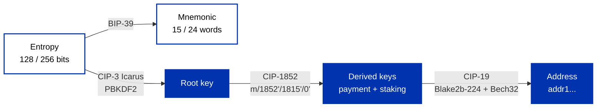

import Tabs from '@theme/Tabs';
import TabItem from '@theme/TabItem';

Keys and wallets are the identity and access layer of Cardano. A seed phrase generates a tree of key pairs, public keys are hashed into the [address](/docs/developers/curriculum/fundamentals/core-concepts/addresses) credentials that lock UTXOs, and wallet software manages it all so users can send, receive, and stake. Whoever holds the private key controls the funds, there is no password reset.

If you have used SSH, the model will feel familiar: you already generate an `ed25519` key pair, keep the private key local, share the public key, and prove possession by signing. Cardano keys work the same way, except you authenticate to the whole network and can move value, so losing the key costs more than losing server access. A CIP-30 wallet connector, meanwhile, is like "Sign in with Google" (OAuth): the dApp receives the signatures it asks for but never sees your raw private key.

## What is a key pair?

A key pair is a private key (32 bytes of entropy) and its public key (derived via Ed25519, the same algorithm as SSH `ed25519` keys).

```
private_key = random_256_bits()
public_key  = ed25519_derive(private_key)

private -> public:  easy
public -> private:  infeasible
sign(msg, private) -> 64-byte signature
verify(msg, sig, public) -> true/false
```

- **The private key is your identity.** Whoever holds it can spend the funds.
- **The public key is your verifiable identity.** Share it freely; others verify your signatures and derive your address from it.

## Why not use raw key pairs?

One key per address creates real problems: transactions become trivially linkable, managing hundreds of unrelated keys is error-prone, backups are impractical, and a compromised key cannot be rotated. The fix is **Hierarchical Deterministic (HD) wallets**.

The next two sections walk the pipeline an HD wallet runs when it is created: random entropy is encoded as a mnemonic you back up, stretched into a root key, grown into a tree of derived keys, and hashed into addresses.



Note that the mnemonic is a branch, not a step: both the words and the root key are derived from the same entropy, which is why the phrase alone can always rebuild the whole tree.

## Seed phrases (BIP-39)

A mnemonic seed phrase is a human-readable encoding of random entropy as words from a standard 2048-word list (Cardano wallets use 15 or 24 words). A checksum is folded into the words, so a mistyped or misplaced word is caught at recovery instead of silently restoring the wrong wallet. This single phrase deterministically regenerates your entire key tree, so it is the only backup you need.

```
24 words = 256 bits of entropy = 2^256 possible phrases (~10^77)
```

Brute-forcing that is not merely impractical, it is physically impossible.

Cardano wallets follow the Icarus standard ([CIP-3](https://cips.cardano.org/cip/CIP-3)): the phrase's underlying entropy runs through PBKDF2-HMAC-SHA512 (4,096 rounds, deliberately slow to make brute-forcing expensive) to produce a 96-byte Ed25519 extended root key. An optional passphrase (a "25th word") produces a completely different wallet from the same words.

## One seed, many keys

A wallet does not keep a pile of unrelated keys. It derives them on demand from the root key, walking down a tree, and every branch is reproducible from the seed phrase. That is why the phrase alone restores a wallet, and why your wallet can hand you a fresh receive address forever without going back to the seed: it takes the next number along one branch.

Two consequences matter when you write code.

**An account has many payment keys and exactly one staking key.** Payment keys control spending, one per address, so you can hand out a new address whenever you like. The staking key controls delegation and reward withdrawal, and there is a single one for the whole account. Every address in that account shares it. This is why delegating once covers all your addresses, and why you can delegate stake to a pool without giving anyone the ability to spend your funds.

**The path names which key you mean.** Cardano's layout is [CIP-1852](https://cips.cardano.org/cip/CIP-1852), which uses the same five-level shape as the rest of the industry (BIP-44) with numbers of its own:

```
m / 1852' / 1815' / account' / role / index
    |       |       |          |      |
    |       |       |          |      +- which address, counting up from 0
    |       |       |          +- 0 receive, 1 change, 2 staking
    |       |       +- which account, almost always 0
    |       +- ADA, 1815, the year Ada Lovelace was born
    +- Shelley-era layout, 1852, the year she died
```

You almost never type this. The SDK derives it for you, and the only level you normally set is the account, which shows up as `accountIndex` in the code further down this page. The full path becomes relevant when you run several accounts from one seed, when you are reconciling an address your wallet displays against one you derived yourself, or when a hardware wallet asks you to confirm a path on its screen.

The last two levels are not hardened, which has a practical payoff: you can give a service the account's *public* key and it can derive every address to watch balances, while remaining unable to sign anything.

## What is a wallet, really?

A wallet is software that stores your keys, scans the chain for UTXOs at your addresses, computes your balance, and builds and signs transactions. Your funds live on-chain as UTXOs; they are not "inside" the app.

| Wallet type | Examples | Trade-off |
|---|---|---|
| **Full-node** | Daedalus | Maximum trustlessness; downloads the whole chain |
| **Light** | Browser and mobile wallets | Fast; relies on a backend for chain data (signing stays local) |
| **Hardware** | Ledger, Trezor | Keys never leave a secure device; strongest theft protection |
| **Browser extension** | (implements CIP-30) | The standard way dApps connect to users |

## How dApps connect: CIP-30

CIP-30 is the dApp connector standard. The wallet exposes an API; it signs only what the user approves and never exposes private keys, much like "Sign in with Google" hands an app a token, not your password.

<Tabs>
<TabItem value="browser" label="Browser API" default>

```typescript
// No library: the standard as the wallet exposes it, on window.cardano
const wallet = await window.cardano.eternl.enable()
const utxos = await wallet.getUtxos()
const signed = await wallet.signTx(unsignedTx)   // user approves in the wallet
```

</TabItem>
<TabItem value="evolution" label="Evolution">

```typescript
import { mainnet, Client } from "@evolution-sdk/evolution"

const walletApi = await window.cardano.eternl.enable()
const client = Client.make(mainnet).withCip30(walletApi)
```

</TabItem>
<TabItem value="mesh" label="Mesh">

```typescript
import { MeshCardanoBrowserWallet } from "@meshsdk/wallet"

const wallet = await MeshCardanoBrowserWallet.enable("eternl")
const utxos = await wallet.getUtxosMesh()
```

</TabItem>
</Tabs>

CIP-30 is a standard, not a library. Every SDK and connect-button package is a wrapper over the same browser API, and the wallet holds the keys whichever one you pick. [Connect a wallet](/docs/developers/curriculum/dapps/connect-a-wallet) covers discovery, the sign-then-submit split, and the framework options.

Wallets can also sign arbitrary messages (CIP-8 / COSE) to prove address ownership without submitting a transaction, the basis for wallet login. For implementations, see [Wallet authentication](/docs/developers/curriculum/dapps/wallet-authentication).

## Working with wallets in code

For a **browser dApp**, you don't manage keys at all: you connect the user's CIP-30 wallet (above), covered in [Connect a wallet](/docs/developers/curriculum/dapps/connect-a-wallet). For **backend services, scripts, and tests**, you create a wallet from a mnemonic, a private key, or just an address (read-only). The SDK handles the BIP-32/CIP-1852 derivation described above.

<Tabs groupId="sdk">
<TabItem value="evolution" label="Evolution" default>

In Evolution, a wallet is one capability of a client. Add it with `.withSeed()`, `.withPrivateKey()`, or `.withAddress()` (a wallet on its own can sign and derive addresses; add a provider to also query and submit):

```typescript
import { preprod, Client } from "@evolution-sdk/evolution"

// From a 24-word mnemonic (dev, testing, multi-account via accountIndex)
const seedClient = Client.make(preprod)
  .withSeed({ mnemonic: process.env.WALLET_MNEMONIC!, accountIndex: 0 })

// From an extended private key (backend automation; load from a vault)
const keyClient = Client.make(preprod)
  .withPrivateKey({ paymentKey: process.env.PAYMENT_SIGNING_KEY! })

// Read-only, observe an address, no signing (backend tx-building, monitoring)
const watchClient = Client.make(preprod)
  .withAddress({ address: "addr1..." })

const address = await seedClient.address()
```

Generate a fresh mnemonic with `PrivateKey.generateMnemonic()`. Switch networks by changing the network parameter (`preprod` → `mainnet`); use a different mnemonic per environment.

</TabItem>
<TabItem value="mesh" label="Mesh">

Mesh's `MeshCardanoHeadlessWallet` loads from a mnemonic, a root key, or explicit credential sources:

```typescript
import { MeshCardanoHeadlessWallet, AddressType } from "@meshsdk/wallet"

// Generate a fresh mnemonic
const mnemonic = MeshCardanoHeadlessWallet.brew()

const wallet = await MeshCardanoHeadlessWallet.fromMnemonic({
  networkId: 0,                        // 0 = testnet, 1 = mainnet
  walletAddressType: AddressType.Base,
  fetcher: blockchainProvider,
  submitter: blockchainProvider,
  mnemonic: process.env.WALLET_MNEMONIC!.split(" "),
})
// other factories: fromBip32Root (bech32 xprv), fromBip32RootHex, fromCredentialSources (read-only / advanced)
```

</TabItem>
</Tabs>

These four map to four security models. Pick the one with the least capability that still does the job:

| Type | Holds keys | Can sign | Where the key belongs | Use for |
|---|---|---|---|---|
| **Seed phrase** | Yes, in your process | Yes | A local `.env`, never committed and never in production | Development and tests |
| **Private key** | Yes, in your process | Yes | A secret manager, read at startup, never on disk | Backend automation |
| **CIP-30 (browser)** | No, the wallet does | The user does | The user's wallet or hardware device | Frontend dApps |
| **Read-only** | No key at all | No | Nothing to store, only an address | Backend transaction building, monitoring |

:::warning Backend key handling
Never bundle a mnemonic or private key into frontend code, and never commit one. On a backend, load keys from a secret manager (AWS Secrets Manager, Azure Key Vault, HashiCorp Vault), use a **read-only** wallet wherever you only need to build transactions, and keep separate keys per environment. Production key handling is covered in [going to production](/docs/developers/curriculum/production/going-to-production).
:::

## Security: it all reduces to key management

- **Seed phrase**: never store digitally (no photos, cloud, or text files); write on durable material; consider the optional passphrase.
- **Key isolation**: hardware wallets keep keys in a secure element; extensions encrypt with a spending password.
- **Address hygiene**: let the wallet generate fresh addresses; reuse links your history.
- **Verify on-device**: confirm transaction details on the hardware wallet screen, not just the app.
- **Cold-key custody**: for keys that sign high-value or governance transactions, keep them off internet-connected machines. See the operator guides on [air-gapped signing](/docs/operators/security/air-gap) and the [secure transaction workflow](/docs/operators/security/secure-workflow).

## Key takeaways

- A 24-word seed phrase is the root of your whole identity; the CIP-1852 derivation tree grows every key the wallet will ever use from it.
- An account has many payment keys and one staking key, so you can delegate without exposing spending control.
- A wallet is software that manages keys and builds transactions; funds live on-chain as UTXOs.
- CIP-30 lets dApps request signatures without ever seeing private keys; security reduces to protecting the seed phrase and isolating keys.

## Next steps

- [Addresses](/docs/developers/curriculum/fundamentals/core-concepts/addresses): how these keys become the credentials that lock funds
- [Transactions](/docs/developers/curriculum/fundamentals/core-concepts/transactions): how wallets build, sign, and submit
