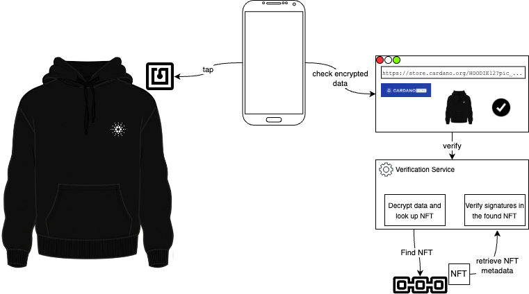

Pairing a physical product with an on-chain NFT lets anyone verify the product is genuine. An [NFT](/docs/developers/curriculum/native-tokens/overview#fungible-non-fungible-and-semi-fungible) is a natural fit: it is unique, permanent, and public, so a physical item linked to one carries a certificate of authenticity nobody can forge without the minting key.

Cardano's [POC Hoodie](https://store.cardano.org/products/hoodie), sold through the [Cardano Store](https://store.cardano.org/), is a worked example. An NFC chip knitted into the hoodie links it to an NFT on Cardano, and tapping the chip verifies authenticity. It builds on an earlier [Lacrosse World Cup Jersey](https://cardanofoundation.org/en/news/technical-collaboration-with-epoch-sports-merchandise/) showcase with a stronger security model. The design is a proof of concept, not a finished product. This page walks through how it works, how a holder verifies it, and where it is headed.

## How a holder verifies it

For the owner, verification is one tap. The NFC tag opens a website that shows the verification status, with no tools or blockchain knowledge required.

That convenience carries a trust assumption: the website is centrally hosted, so a holder who takes its answer at face value is trusting whoever runs it. Anyone who wants to check for themselves can. The URL from the NFC tag carries the NFT's asset name; look that asset up in any [explorer](https://cardano.org/apps/?tags=explorer) and confirm its policy ID is `e886a328333c28bf3e8fc527206b02dc9ff65fb04cf569ec71983330`, the hash of the hoodie collection's minting policy. Every hoodie NFT sits under that one policy ([pool.pm](https://pool.pm/policy/e886a328333c28bf3e8fc527206b02dc9ff65fb04cf569ec71983330)).

## What happens under the hood

Tapping the tag hands the phone a URL containing encrypted data that identifies the NFT. Following it lands on the verification website, which forwards the encrypted payload to a validation service. The service decrypts it, reads the asset ID inside, and looks up the matching NFT on Cardano. If it finds one, it compares the [NFT's metadata](https://adastat.net/tokens/e886a328333c28bf3e8fc527206b02dc9ff65fb04cf569ec71983330484f4f44494532) against the data read from the chip.

The check rests on [digital signatures](/docs/developers/curriculum/fundamentals/cryptographic-primitives#how-do-digital-signatures-prove-identity): a signature produced when the NFT was minted is verified against the key material carried in the encrypted payload. A match proves the chip and the on-chain asset belong together.

## The chip: shared secret and replay protection

The data on the chip is protected with symmetric encryption, so a secret is shared between the chip (written while it is prepared) and the validation service. The chip also holds a counter that increments on every tap. Because the backend sees the counter, it can reject a URL that has already been used, closing off replay attacks where someone copies a valid tap URL and reuses it.

:::tip Build it yourself
The chip model, the flashing process, and the tooling are in the [Cardano Store POC Hoodies repository](https://github.com/cardano-foundation/cardano-store-poc-hoodies). You need an NFC reader/writer to program the chips.
:::

## Limitations and where it is headed

Two things keep this a proof of concept rather than a trust-minimized product.

**The validation service is centralized.** Authenticity cannot be confirmed without it, so the trust the blockchain removes at the data layer reappears at the service layer.

**The NFTs use [CIP-25](/docs/developers/curriculum/native-tokens/metadata-registry#cip-25-nft-metadata-in-the-minting-transaction).** CIP-25 records metadata in the minting transaction, where a smart contract can neither read nor update it. A [CIP-68](/docs/developers/curriculum/native-tokens/metadata-registry#cip-68-datum-metadata-updatable-on-chain)-style design would let a contract manage ownership instead: the holder keeps a token that points at the contract, and ownership counts only when an inline datum listing the current owners points back to the asset. That turns the physical-to-digital link into a transferable, trustless one.

The larger step is the chip itself. [Signing NFC chips](https://www.azuki.com/blog/pbt) can sign a challenge with their own private key, so no secret has to be shared with the backend at all. Removing that last shared secret opens the door to multi-signature ownership transfer, where handing over the physical good and its NFT becomes a signed, on-chain event.
