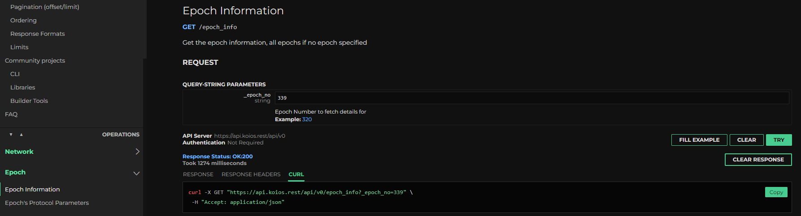

[Koios](https://koios.rest) is a **provider** your SDK can target: a decentralized, open-source API layer for querying Cardano across mainnet, the testnets, and guildnet. Unlike a single hosted service, it is served by a community-run cluster of nodes, so there is no single point of failure, and you can self-host your own instance with custom endpoints and automatic failover. For where it sits among the alternatives, see [Choosing a provider](/docs/developers/curriculum/start-building/query-the-chain#choosing-a-provider).

## Using the API

Koios is documented at [api.koios.rest](https://api.koios.rest). It is built on [PostgREST](https://postgrest.org/), so endpoints support vertical and horizontal filtering with built-in ordering and paging; the [API usage guide](https://api.koios.rest/#overview--api-usage) covers the query syntax. Each endpoint page includes a sample curl command you can run straight from the browser to test it.



Usage through the community cluster carries rate limits that guard against spam and accidental denial-of-service, so review the [limits](https://api.koios.rest/#overview--limits) before you integrate.

## Run your own instance

Self-hosting removes the shared rate limits, lowers latency, lets you add custom endpoints, and contributes capacity back to the network. The [guild-operators suite](https://cardano-community.github.io/guild-operators/) provides scripts to deploy a gRest instance with full API compatibility.

:::note
Keep `cardano-db-sync` and `postgres` on the same host. Splitting them without careful tuning hurts performance. PostgREST and HAProxy can run as separate services once you are comfortable with the deployment.
:::

### Setup steps

1. **Prepare the system.** Install dependencies and create the folder structure with the [prereqs script](https://cardano-community.github.io/guild-operators/basics/#pre-requisites).
2. **Install PostgreSQL.** Set up the server with infrastructure-appropriate tuning ([PostgreSQL guide](https://cardano-community.github.io/guild-operators/Appendix/postgres/)).
3. **Set up cardano-node.** Install and sync the node to the current epoch ([node installation guide](https://cardano-community.github.io/guild-operators/Build/node-cli/)). Optionally add `cardano-submit-api` for transaction submission.
4. **Deploy cardano-db-sync.** Set up the dbsync instance from a snapshot rather than syncing from scratch, and run it as a systemd service ([dbsync guide](https://cardano-community.github.io/guild-operators/Build/dbsync/)).
5. **Install gRest.** Run `setup-grest.sh` as detailed in the [gRest setup guide](https://cardano-community.github.io/guild-operators/Build/grest/#setup). For a mainnet deployment:
   ```bash
   ./setup-grest.sh -f -i prmcd -q -b <branch/tag>
   ```
6. **(Optional) Add Ogmios.** Install [Ogmios](https://ogmios.dev) for WebSocket access (it requires advanced session management).

### Service configuration

Default configuration files, ports, and service names:

| Component | Config | Port | Service Name |
|-----------|--------|------|--------------|
| PostgreSQL | `/etc/postgresql/14/main/postgresql.conf` | 5432 | postgresql |
| Cardano-Node | `/opt/cardano/cnode/files/config.json` | 6000 | cnode |
| Cardano-Submit-API | `/opt/cardano/cnode/files/config.json` | 8090 | cnode-submit-api |
| Cardano-DB-Sync | `/opt/cardano/cnode/files/dbsync.json` | N/A | cnode-dbsync |
| PostgREST | `/opt/cardano/cnode/priv/grest.conf` | 8050 | cnode-postgrest |
| HAProxy | `/opt/cardano/cnode/files/haproxy.cfg` | 8053 | cnode-haproxy |
| Prometheus Exporter | `/opt/cardano/cnode/scripts/getmetrics.sh` | 8059 | cnode-grest_exporter |

Queries enter through the HAProxy port (enable SSL as described in the [TLS guide](https://cardano-community.github.io/guild-operators/Build/grest/#tls)). Adjust firewall rules to expose only that port.

### Join the Koios cluster

To contribute your instance to the community cluster:

1. Submit a PR to the [koios-artifacts topology](https://github.com/cardano-community/koios-artifacts/tree/main/topology) with your connectivity information.
2. Open the Prometheus Exporter, HAProxy, and Cardano-Submit-API ports to the monitoring instances.
3. Commit to following version releases (typically Saturday 08:00 UTC, with advance notice).

## Support and community

Report issues or request features on the [Koios Artifacts](https://github.com/cardano-community/koios-artifacts) repository, and discuss in the [Koios Telegram group](https://t.me/+zE4Lce_QUepiY2U1). The community holds open meetings on the second and fourth Thursday of each month.

:::note
For Koios client libraries and tools, see [Builder Tools > Koios](/tools?tags=koios).
:::
