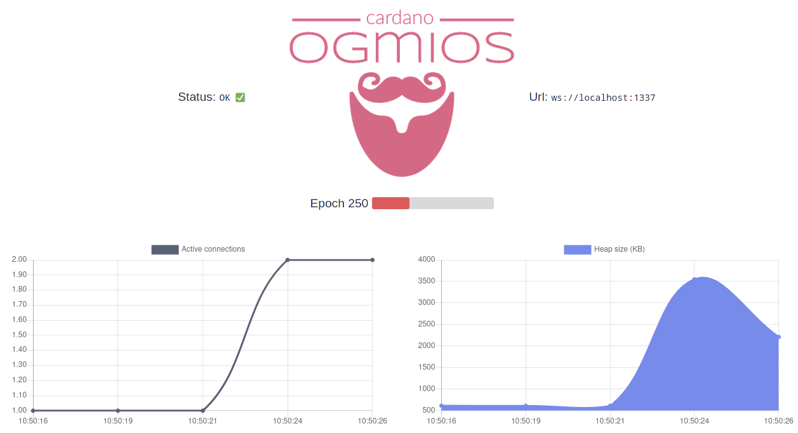

import Tabs from '@theme/Tabs';
import TabItem from '@theme/TabItem';

[Ogmios](https://ogmios.dev) is a lightweight WebSocket bridge interface for cardano-node, providing JSON/RPC access to [Ouroboros mini-protocols](https://github.com/IntersectMBO/ouroboros-network/tree/master/docs/network-spec).

Because Ogmios speaks the node's low-level protocols rather than a high-level REST API, an SDK usually pairs it with [Kupo](https://github.com/CardanoSolutions/kupo) for indexing. Together they form the **Kupmios** stack: the self-hosted backend an SDK targets when you run your own node. You run it yourself, or use it hosted through [Demeter](/docs/developers/curriculum/production/demeter).

:::note
For a higher-level, hosted alternative, consider [Blockfrost](/docs/developers/curriculum/production/api-providers/blockfrost) or [Koios](/docs/developers/curriculum/production/api-providers/koios).
:::

## Installation

The easiest way to run Ogmios is with [Docker](https://www.docker.com). Because Ogmios needs a Cardano node alongside it, use Docker Compose to orchestrate both services. A compose file is available in the Ogmios repository:

```sh
git clone --depth 1 https://github.com/CardanoSolutions/ogmios.git
cd ogmios
docker compose up
```

For source builds or non-Docker installation, see [ogmios.dev/getting-started](https://ogmios.dev/getting-started).

## Dashboard

Access the dashboard at [localhost:1337](http://localhost:1337) for real-time runtime metrics visualization.



## Query metrics

The dashboard uses JSON responses from the health endpoint:

<Tabs groupId="tool">
<TabItem value="curl" label="curl" default>

```sh
curl -H 'Accept: application/json' http://localhost:1337/health
```

  </TabItem>
  <TabItem value="wget" label="wget">

```sh
wget --header='Accept: application/json' -qO- http://localhost:1337/health
```

  </TabItem>
</Tabs>

**Example response:**

```json
{
    "metrics": {
        "totalUnrouted": 1,
        "totalMessages": 30029,
        "runtimeStats": {
            "gcCpuTime": 1233009354,
            "cpuTime": 81064672549,
            "maxHeapSize": 41630,
            "currentHeapSize": 1014
        },
        "totalConnections": 10,
        "sessionDurations": {
            "max": 57385,
            "mean": 7057,
            "min": 0
        },
        "activeConnections": 0
    },
    "startTime": "2021-03-15T16:16:41.470782977Z",
    "lastTipUpdate": "2021-03-15T16:28:36.853115034Z",
    "lastKnownTip": {
        "hash": "c29428f386c701c1d1ba1fd259d4be78921ee9ee6c174eac898245ceb55e8061",
        "blockNo": 5034297,
        "slot": 15520688
    },
    "networkSynchronization": 0.99,
    "currentEra": "Mary"
}
```

## Next steps

Learn how to interact with Ouroboros mini-protocols at [ogmios.dev/mini-protocols](https://ogmios.dev/mini-protocols).
