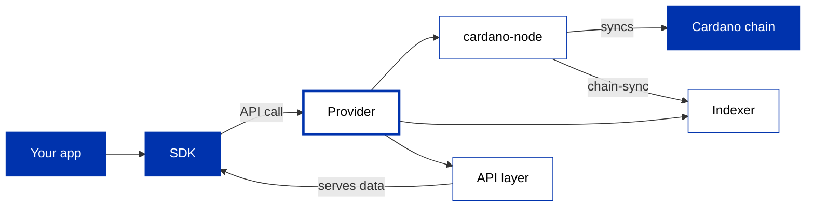
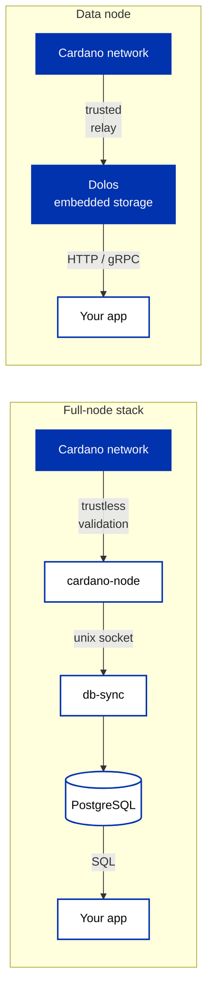

Every application does exactly two things against the chain: **read state** (UTXOs, balances, datums, protocol parameters) and **submit transactions**. Every piece of infrastructure on this page exists to serve those two workflows. The tools differ in *where the work runs* and *whom you trust to run it*, not in what they ultimately do.

You have used both workflows since Module 2, always through a **provider** ([Query the chain](/docs/developers/curriculum/start-building/query-the-chain), [Transaction building](/docs/developers/curriculum/start-building/transaction-building)). This page is the map behind that word: what actually serves your SDK, what the categories of infrastructure are, and which of them are genuine alternatives to each other. Two practice pages then set them up: [Use a provider](/docs/developers/curriculum/production/use-a-provider) for the hosted path, [Self-hosting](/docs/developers/curriculum/production/self-hosting) for running your own.

If you have run web infrastructure, the categories map onto things you know:

- A **query API** (Blockfrost, Koios, Maestro) is a managed database service, the Cardano equivalent of RDS or Supabase: trade some control for zero operations.
- **cardano-node** is running your own database server: full control, full operational commitment (storage, updates, monitoring).
- **Ogmios** is a database driver: it translates the node's wire protocol into a developer-friendly interface, like `pg` for PostgreSQL.
- **Indexers** are materialized views and read replicas: db-sync is a full materialized view of the chain; Kupo is a targeted one for the UTXOs you care about.
- A **data node** (Dolos) is a single-binary read replica: one process that syncs and serves.
- A **managed platform** (Demeter) is someone else hosting your components: the stack you would self-host, run as a service.

## A provider is an interface, not just a service



On the service side, a provider runs a node (which syncs the chain), an indexer (which makes the node's data queryable), and an API layer that serves it to your SDK over HTTP or WebSocket. Everything below is a different answer to who runs those three boxes.

Inside your SDK, a provider is also an **interface**: a small contract the SDK calls, with two halves.

- A **read** side: fetch a UTXO set, protocol parameters, and account or asset info (Mesh names this `IFetcher`; Evolution exposes the same reads through its provider).
- A **write** side: submit a signed transaction (Mesh's `ISubmitter`).

Because the SDK only depends on that contract, anything that implements it is a valid provider: a hosted service, your own stack, a private indexer, even an in-memory fixture. Two pages already use this: the [failover and cache wrapper](/docs/developers/curriculum/production/going-to-production#harden-your-provider) that composes several providers behind one interface, and the [in-memory emulator](/docs/developers/curriculum/start-building/local-testing#the-in-memory-emulator) that serves a simulated ledger to a test suite with no network at all.

## The categories

The landscape looks crowded until you sort it by what each thing conceptually is. Six categories cover all of it, and only some of them are alternatives to each other.

### Query APIs

**Blockfrost, Koios, Maestro.** A complete data service behind one HTTP API: someone else runs the node, the indexer, and the API layer, and you get a base URL and usually a key. They are operated commercially (Blockfrost, Maestro) or by a community cluster with no single operator (Koios, which you can also self-host). This is the category most applications start with, and many never need anything else. [Use a provider](/docs/developers/curriculum/production/use-a-provider) sets up all three with one skeleton, and [Builder Tools](/tools/?tags=api) has the rest, including narrower services built for one kind of data.

### Node interfaces

**Ogmios, cardano-submit-api.** Translators for a node you already run, not data services. A cardano-node speaks its own binary [wire protocol](/docs/developers/curriculum/production/network-protocol), so two small bridges translate it: **Ogmios** exposes the node's mini-protocols as WebSocket JSON (stream blocks, submit transactions, query state, watch the mempool), and **cardano-submit-api** accepts a serialized transaction over plain HTTP and hands it to the node. On their own they serve nothing: without a node there is no data to translate. An SDK typically pairs Ogmios with the indexer Kupo to get both halves of the provider contract, a combination known as the **Kupmios** stack.

```text
Transaction submission options:
  cardano-cli           local, CLI:        cardano-cli transaction submit --tx-file signed.tx
  cardano-submit-api    local, HTTP:       POST /api/submit/tx  (application/cbor)
  Ogmios                local, WebSocket:  { "method": "submitTransaction", ... }
  Blockfrost/Koios/...  remote, HTTP:      POST /tx/submit  (application/cbor)
```

### Indexers

**db-sync, Kupo, Oura, Adder, Yaci Store.** The node holds the whole chain, but not in a form an application can query: there is no "UTXOs at this address" lookup inside cardano-node. An **indexer** follows the chain and stores what it sees in a queryable shape. The shapes differ, and picking by shape is the whole game: a full SQL copy (db-sync), a filtered UTXO set (Kupo), an event stream (Oura, Adder), or modular per-table stores (Yaci Store). What they share is the hard part, which is that the chain can take blocks back, so an index has to be able to unwind. [Custom indexing & analytics](/docs/developers/curriculum/production/indexing-and-analytics) covers the shapes, that problem, and builds one out.

### The full node

**cardano-node.** The foundation everything above sits on: it validates every block and transaction itself, maintains the UTXO set, and is the only category that trusts nobody. The cost is operational: a machine that stays synced and running, with real storage and memory requirements. Run one when you cannot afford to trust a third party, when you operate an indexer that needs a local node, or when you [operate a stake pool](/docs/operators/); most application developers never need to.

### Data nodes

**Dolos.** The classic self-hosted read stack runs three components and stores the ledger twice (once in the node, once in the database). A **data node** collapses node, indexer, and API layer into one lightweight process with embedded storage, built for exactly one job: serving chain data to applications.



The trade is explicit: a data node syncs from relay nodes you configure and trusts them, rather than validating trustlessly, and it cannot produce blocks. In exchange, a few GB of RAM and one copy of the ledger serve your SDK a Blockfrost-compatible API from your own machine.

### Managed platforms

**Demeter.** A managed platform hosts the *self-hosted* categories for you: node access, indexers (db-sync, Kupo), and node interfaces (Ogmios, submit API) provisioned as cloud services. You get the architecture of the self-hosted stack without operating it, at the price of reintroducing an operator you trust.

## What is not comparable to what

The most common confusion in this landscape is comparing across categories. Three cases come up constantly:

- **Ogmios is not an alternative to Blockfrost or Koios.** A query API is a complete data service; Ogmios is a protocol translator that is inert without a node behind it. The real comparison is between complete shapes: *hosted query API* versus *your node + Ogmios + Kupo*.
- **Dolos is not an indexer.** It does not sit next to Kupo or db-sync in a stack; it replaces the node + indexer + API combination for read-and-submit workloads. Compare a data node to that whole stack, not to any single component.
- **Demeter is not another query API.** It does not offer one unified chain API of its own; it hosts the components of the self-hosted shape. Compare it to running db-sync, Kupo, and Ogmios yourself, not to Blockfrost.

Koios is the one product that legitimately appears twice: used through the community cluster it is a query API; deployed from the [guild-operators stack](https://cardano-community.github.io/guild-operators/) it is a self-hosted stack serving the same API.

## Choosing: the axes

Only complete shapes are alternatives, and four axes separate them: **what you operate**, **whom you trust**, **what it can do**, and **what it costs**.

| Shape | You operate | Trust model | Ops burden | Cost shape |
| --- | --- | --- | --- | --- |
| Hosted query API | Nothing | The operator's data, uptime, and rate limits | None | Free tier, then subscription |
| Managed platform | Configuration only | The platform operator | Minimal | Usage-based |
| Data node | One process | The relays it syncs from | Low: one binary, a few GB of RAM | Your server |
| Node + interface + indexer | Several processes and a database | Nobody: trustless validation | High: sync, storage, monitoring | Your servers |

Two axes deserve a sentence each. **Trust** is about data integrity and privacy both: a hosted API sees every address you query and every transaction you submit, along with your IP. **Capability** mostly follows the indexer you (or your operator) run: full history needs a full-copy indexer wherever it lives; a filtered UTXO set is enough for a dApp backend.

## Common stacks

| Use case | Stack | Why |
|---|---|---|
| Hobby / learning | Hosted query API free tier + Preview | Zero infrastructure to manage, fast iteration |
| Production dApp backend | Kupo + Ogmios + cardano-node, or a hosted query API + Preprod staging | Fast UTXO queries at your script addresses; full control or managed reliability |
| Self-hosted backend, minimal ops | Data node | One process serving a local Blockfrost-compatible API |
| Block explorer / analytics | db-sync + PostgreSQL + node | Full historical chain data in SQL |
| Event-driven app | Oura + Kafka/Redis + a query API | React to on-chain events in near real time |
| Enterprise / high-throughput | Dedicated managed infrastructure, or multiple nodes + custom indexing | SLAs and throughput beyond shared free tiers |

Most teams combine approaches: a hosted query API while developing, self-hosted or dedicated infrastructure in production, with the [provider interface](#a-provider-is-an-interface-not-just-a-service) making the switch a configuration change.

## Next steps

- [Use a provider](/docs/developers/curriculum/production/use-a-provider): set up Blockfrost, Koios, or Maestro, one skeleton for all three
- [Self-hosting](/docs/developers/curriculum/production/self-hosting): run a data node, a Kupmios stack, or a full node, with Demeter as the managed variant
- [Custom indexing & analytics](/docs/developers/curriculum/production/indexing-and-analytics): the indexer shapes, and building an index of your own
