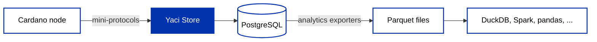

Most applications never need their own indexer. A [hosted provider](/docs/developers/curriculum/production/use-a-provider) runs one for you, and [self-hosting](/docs/developers/curriculum/production/self-hosting) gets you a private copy of the same thing. You end up here when neither answers your question:

- You want one narrow slice of the chain in a database you control, say every transaction carrying a given metadata label, without storing the other 99% of it.
- You want to **react** to something on-chain rather than poll for it.
- You want to ask questions across the chain's *full history* without keeping infrastructure alive to answer them.

An [indexer](/docs/developers/curriculum/production/connecting-to-the-chain#indexers) is what makes any of those possible. It follows the chain and stores what it sees in a form your application can query, because the node itself has no "UTXOs at this address" lookup. The landscape sorts by the **shape** of what gets stored, and picking by shape is the whole game:

- **Full copy**: [cardano-db-sync](https://github.com/IntersectMBO/cardano-db-sync) writes the whole chain into PostgreSQL for full historical SQL. Heavy, hundreds of GB and growing, with an initial sync measured in days, and the backbone of explorers and analytics platforms.
- **Filtered UTXO set**: [Kupo](https://cardanosolutions.github.io/kupo/) tracks only UTXOs matching patterns you configure (by address, policy ID, and more), with fast sync and low resource use. Ideal for dApp backends, and the indexer half of the [Kupmios stack](/docs/developers/curriculum/production/self-hosting).
- **Event stream**: a pipeline that tails the chain and forwards each block and transaction somewhere else, a queue, a webhook, a file, without keeping a queryable copy itself. [Oura](https://docs.txpipe.io/oura/v2) and [Adder](https://docs.blinklabs.io/guides/adder/001-adder/) are the two to look at.
- **Modular stores**: per-table stores you enable selectively, with filtering hooked into the pipeline; this is Yaci Store, the rest of this page.

Browse the full set in [Builder Tools](/tools/?tags=indexer), which shelves indexers, data nodes and pipelines together because they answer one question: what do I self-host to get queryable data. This page draws a finer line and treats a [data node](/docs/developers/curriculum/production/connecting-to-the-chain#data-nodes) as its own category.

## What the indexer handles, and what stays yours

Those four shapes split on one question: **does it keep state?**

A full copy, a filtered UTXO set and modular stores all persist something you query later, so the problems below are theirs and your reads stay consistent. An **event stream** persists nothing. It emits and forgets, which is what makes it cheap and immediate, and it hands you a rollback signal and nothing else. Choose a stream and they all become yours. So does anything you derive on top of a stateful indexer, your own running totals included.

**The chain takes blocks back.** When your peer switches to a longer fork, blocks you already applied are no longer on the chain, and anything you derived from them is wrong. [Settlement is probabilistic](/docs/developers/curriculum/fundamentals/consensus-and-ouroboros#how-does-finality-work), so near the tip this is ordinary behavior rather than an exception, and the [rollback arrives as a point](/docs/developers/curriculum/production/network-protocol#addressing-a-block-chain-points) rather than a list of things to undo. Three rules turn that into a single delete: tag every row with the slot that produced it, never update a row in place, and undo by deleting everything above the rollback point. Running totals are the trap, because a balance held as one mutable number no longer remembers which blocks produced it. Aggregate at read time and rollbacks correct themselves for free.

**You have to know where to resume.** A follower starts from genesis, from the current tip, or from an explicit **chain point**, and only the third resumes anything. That needs a durable **cursor**, which is easy to get wrong. Advance it from the consumer once the write lands, never when the block arrives, or a restart silently skips blocks. Keep a short trail of recent points rather than a single one, since the point you saved may itself have been orphaned while you were down. And a stored cursor overrides configuration: once one exists, changing the configured start point does nothing until you delete it.

**The same block can arrive twice.** Reconnects and replays redeliver blocks, and a cursor flushed on a timer guarantees some overlap after a crash. Nothing upstream promises exactly-once delivery, so key writes on something the chain provides, a transaction hash or an output reference, never an insertion counter. [Confirming a payment](/docs/developers/curriculum/dapps/listen-for-payments#detecting-a-payment) applies the same rule one level up.

## A modular indexer

[Yaci Store](https://store.yaci.xyz/) is the worked example for the rest of this page: an open-source (MIT) modular indexer in Java from the [BloxBean project](https://github.com/bloxbean/yaci-store).

:::info The Yaci family
Three related projects share the name: [yaci](https://github.com/bloxbean/yaci) is the underlying Java implementation of the [Ouroboros mini-protocols](https://ouroboros-network.cardano.intersectmbo.org/pdfs/network-spec/network-spec.pdf); **Yaci Store** is the indexer built on it, covered here; [Yaci DevKit](https://devkit.yaci.xyz/introduction) is the local devnet tool that bundles a Store instance, covered in [Local testing](/docs/developers/curriculum/start-building/local-testing#yaci-devkit).
:::

Most indexers make the sizing decision for you: db-sync stores everything, Kupo stores only UTXOs. Yaci Store is assembled from **stores** you enable per use case: blocks, transactions, UTXOs, metadata, assets, scripts, staking, and governance each ship as separate modules, plus aggregation modules that derive account balances, rewards, and ledger state independently, without a db-sync instance behind them.

It syncs directly from any Cardano node over the node-to-node protocol, so it can follow a remote relay without you operating a node, and writes to PostgreSQL, MySQL, or H2. A local node is optional and does a different job: node-to-client is used for live protocol parameters, governance state, and transaction submission, never for indexing.

It also ships **Blockfrost-compatible REST APIs**, behind a profile you switch on, so an SDK configured for Blockfrost can point at your own index unchanged. That is the same property [Yaci DevKit](/docs/developers/curriculum/start-building/local-testing#yaci-devkit) uses to serve a local devnet. The next section switches it on.

Rollback is its problem rather than yours: tables are slot-tagged and append-only, so an unwind is one delete.

## Run one

The [Docker distribution](https://store.yaci.xyz/docs/v2/getting-started/installation/docker) is the shortest path, because it brings PostgreSQL with it. Everything up to starting it goes in `config/application.properties`.

Point it at a public relay, and no local node is involved:

```properties
store.cardano.host=preprod-node.play.dev.cardano.org
store.cardano.port=3001
store.cardano.protocol-magic=1
```

Any synced relay works. If that one stops answering, current public relays for each network ship with the [environment configs](https://book.play.dev.cardano.org/environments/preprod/topology.json).

Every store is on by default, so a focused index is mostly a list of what you switch off:

```properties
# keep the UTXO store, drop the rest
store.utxo.enabled=true
store.assets.enabled=false
store.blocks.enabled=false
store.epoch.enabled=false
store.metadata.enabled=false
store.mir.enabled=false
store.script.enabled=false
store.staking.enabled=false
store.transaction.enabled=false
store.governance.enabled=false
```

Disabling a store means its processors never register, so the work is never done rather than done and thrown away. That is where the sync time and the disk savings come from. The aggregation modules that derive balances, rewards, and ledger state are off by default and switch on with the `ledger-state` profile. Profiles are how every optional module here is enabled, including the two the rest of this page uses.

Then decide where to begin, the [cursor question](#what-the-indexer-handles-and-what-stays-yours) from above. Syncing an application-shaped index from genesis is usually waste, so take a `(slot, hash)` pair from any explorer for a point before the data you care about:

```properties
store.cardano.sync-start-slot=<slot>
store.cardano.sync-start-blockhash=<block hash>
```

**Start it.** Switch on the Blockfrost-compatible API at the same time: it is off by default, and enabling the extension without also setting its URL prefix stops the application from starting, so use the profile that sets both. In `config/env`:

```properties
SPRING_PROFILES_ACTIVE=blockfrost
```

```bash
./yaci-store.sh start
```

**Check it.** Your own index now answers Blockfrost-shaped requests on port 8080, with no API key involved:

```sh
curl -s localhost:8080/api/v1/blockfrost/blocks/latest | jq
```

**Point your SDK at it.** `http://localhost:8080/api/v1/blockfrost` is the base URL you hand an SDK already configured for Blockfrost, exactly as in [Query the chain](/docs/developers/curriculum/start-building/query-the-chain#choosing-a-provider). The provider changes, your query code does not.

## Index exactly what you need: plugins

A common request, near verbatim from builders: *index every transaction carrying a given metadata label, cheaply and reliably*. A full indexer means storing the whole chain to use a sliver of it. A provider means polling, inside their API shapes and rate limits.

Yaci Store's **plugin system** solves it with filter-before-persist: a predicate evaluated on each item before it is written, so cost scales with what matches rather than with the size of the chain. Filters attach to an extension point per store operation, named `<store>.<table>.save`, and are written in **MVEL** or **SpEL** directly in configuration, with no Java and no fork of the indexer. JavaScript and Python are supported too, currently as preview.

Keeping one NFT collection's mints is a single predicate, in `config/application-plugins.yml`:

```yaml
store:
  plugins:
    enabled: true
    filters:
      asset.save:
        - name: "Keep one policy's mints"
          lang: mvel
          expression: 'policy == "<your policy id>" && mintType.name() == "MINT"'
```

That moves the predicate from query time to write time. Nothing else was ever stored, so the queries that follow carry no `WHERE policy` clause and the database stays small enough to be uninteresting. When one expression is not enough, the same extension point takes a script that receives the whole batch and returns the list to keep. Yaci Store's tutorials work the pattern end to end for [addresses](https://store.yaci.xyz/docs/v2/tutorials/tracking-address-utxos), [NFT mints](https://store.yaci.xyz/docs/v2/tutorials/tracking-nft-mints), and [governance](https://store.yaci.xyz/docs/v2/tutorials/governance-watch).

The governance tutorial is worth reading for one decision in particular: it filters proposals but computes vote tallies from the stored rows rather than keeping a running count in the plugin. That is the [read-time aggregation rule](#what-the-indexer-handles-and-what-stays-yours) above: a tally computed on demand reflects rollbacks for free.

The [IntersectMBO administration-data indexer](https://github.com/IntersectMBO/administration-data/tree/main/indexer) does exactly this, filtering on metadata label `1694` for treasury administration data, a few lines of configuration standing in for a bespoke indexer.

Filtering is one of five plugin kinds. Plugins can also reshape a record before it is saved, act on one after it is saved, run on a schedule, or handle chain events directly, and they are given an HTTP client. That is what answers the **react** case from the top of this page without standing up a second pipeline: filter down to what you care about, then call your own service when it lands. [Write your first plugin](https://store.yaci.xyz/docs/v2/plugins/write-first-plugin) covers the kinds and the expression languages.

If you don't want to run anything, the hosted alternative remains: Blockfrost serves [transactions by metadata label](/docs/developers/curriculum/start-building/transaction-building#transaction-metadata) over REST. The plugin route earns its keep when you need your own database, your own filtering logic, or independence from a third party.

## Analytics without running infrastructure

Answering *historical* questions has traditionally required the full stack: node + indexer + database, days of sync, and a server bill that outlives the question. Yaci Store's **Analytics Store** module changes the economics: it continuously exports every table to **[Parquet](https://parquet.apache.org/) files**, the columnar format the wider data industry standardizes on. Once the files exist, the infrastructure has done its job; the dataset is a folder you can copy, share, archive, and query on a laptop.



There is one exporter per table, and partitioning follows the data: continuous tables (transactions, UTXOs, blocks, address activity) by day (`date=2026-06-01/`), tables tied to Cardano's ~5-day epochs (stake snapshots, rewards, the ada pots) by epoch (`epoch=450/`). Query engines then skip straight to the slices they need.

Two properties matter for research and reporting:

- **Finalized data only.** Exports deliberately lag the chain tip (two days by default, `yaci.store.analytics.finalization-lag-days`), so the files never change retroactively; a rollback can't rewrite your dataset. Two people querying the same files get the same answers.
- **Open format, no lock-in.** By default the export runs in [DuckLake](https://ducklake.select/) mode, a catalog layer adding ACID transactions and named tables (`analytics.block`); set `yaci.store.analytics.storage.type=parquet` for plain partitioned files. Either way the output is standard Parquet that DuckDB, Spark, Polars, pandas, ClickHouse, Athena, and BigQuery all read natively.

### Enabling the export

The Analytics Store is a Spring profile on a running Yaci Store; add `ledger-state` if you want rewards and stake snapshots in the export:

```bash
# Docker: in config/env
SPRING_PROFILES_ACTIVE=ledger-state,analytics

# Zip distribution: pass to the start script
./bin/start.sh ledger-state,analytics
```

Files land in `./data/analytics` by default (`yaci.store.analytics.export-path`), and on mainnet the export starts automatically once the initial sync reaches the tip.

### Querying with DuckDB

[DuckDB](https://duckdb.org/) is the natural first tool: a free analytics engine that runs in-process on your machine and reads Parquet directly. Transaction statistics per epoch, over the full exported history:

```sql
SELECT epoch,
       COUNT(*) AS tx_count,
       SUM(fee) AS total_fees,
       AVG(fee) AS avg_fee
FROM read_parquet('data/analytics/main/transaction/**/*.parquet',
                  hive_partitioning = true)
GROUP BY epoch
ORDER BY epoch;
```

(`main` in the path is the source schema name; adjust to your export location.) Because partition-aware queries read only the files they need, questions like this return in seconds even against full-history exports.

The built-in exporters mirror tables one to one, but real questions often span tables. For those, **custom exporters** are defined entirely in YAML: give the module SQL with joins, a name, and a partition strategy, and it produces a fresh Parquet dataset on the same schedule, filling in `{source}`, `{start_slot}`, `{end_slot}` and `{epoch}` per partition. Enable them with the `custom-exporters` profile alongside `analytics`; the [Analytics Store docs](https://store.yaci.xyz/docs/v2/analytics/overview) carry the full configuration surface.

:::info Beta, and you produce the files yourself
The Analytics Store ships in the 3.0.0 beta line rather than the current stable releases, and there is no public dataset mirror yet, so you run Yaci Store once to produce the export. The output is the stable part: standard Parquet files that remain useful regardless of what produced them.
:::

## Choosing your approach

db-sync remains the answer when you need the entire chain in SQL continuously. Reach for Yaci Store when you want an index shaped like your application: modular stores, plugin filters, and a Blockfrost-compatible API against your own database. Reach for the Analytics Store when the goal is a portable, reproducible dataset rather than a running service.

Reach for an event stream when the trigger matters more than the history, when you want to act on something within a block or two of it happening and have somewhere else to put the result. Just remember which side of the [state question](#what-the-indexer-handles-and-what-stays-yours) that puts you on.
