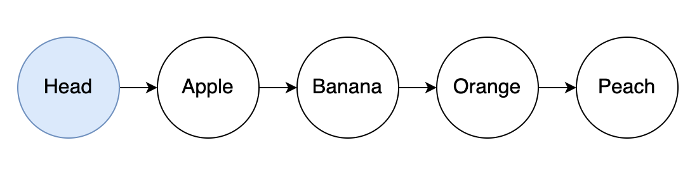
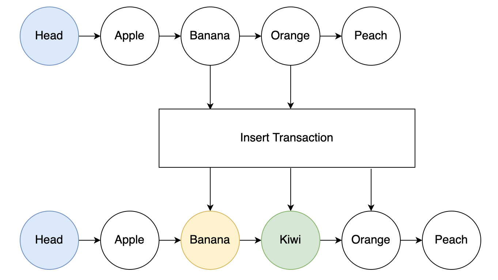
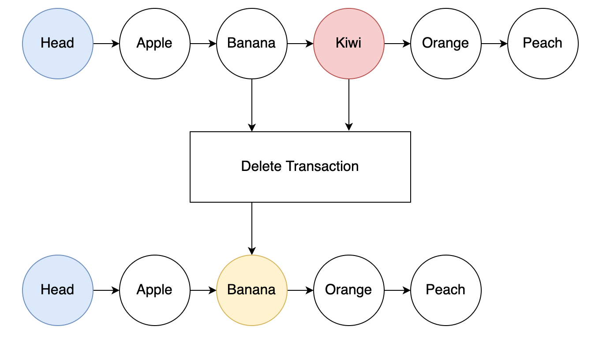

## Introduction

Storing lists in datums is generally impractical, as their growth can lead to unspendable UTxOs due to limited resources available on-chain. A linked list is a construct for storing an infinitely large array of elements on-chain, such that each element is represented with a UTxO that points to its immediate successor.

Linked list structures leverage the EUTXO model to enhance scalability and throughput significantly. By linking multiple UTxOs together through a series of minting policies and validators, they improve the user experience when interacting with smart contracts concurrently.

### Structure

Each element in the list is stored as a separate UTxO containing:

- **NFT**: A unique authentication token identifying the element
- **Datum**: An `Element` containing the element's data and a link (pointer) to the next element



The list distinguishes between two kinds of elements:

- **Root**: The first element of the linked list, holding `root_data`
- **Node**: Any other element, holding `node_data`

Each element's NFT asset name encodes its identity, the root uses a configurable `RootKey`, while nodes use a `NodeKeyPrefix` concatenated with their unique `NodeKey`.

### Insertion



Inserting involves spending an existing anchor element and producing two UTxOs:

- The anchor element, updated to point to the new node
- The new node, pointing to what the anchor previously linked to

For ordered lists, the new key must also sit between the anchor's key and the anchor's old link.

### Removal



Removing a node requires spending both the node and its predecessor (anchor):

- The anchor element is updated to point to what the removed node was pointing to
- The removed node's NFT is burnt

### NFTs as Pointers

NFTs serve as robust and unique pointers within the list. Their uniqueness is ensured by minting policies tied to the list's authentication policy. Each node's NFT asset name is derived from a prefix concatenated with its unique key.

### Key Considerations

- **Efficiency**: On-chain lookups are inefficient; off-chain structures are recommended for indexing
- **Security**: List integrity is maintained through minting policies, datum validation, and NFT authentication
- **No reference scripts**: The default module rejects element UTxOs that carry a reference script; `linked_list/advanced` allows them
- **Address flexibility**: While continued anchor nodes are validated to go to the same address, new/removed nodes only validate that payment credentials match, allowing customization of staking parts

### Membership and non-membership proofs

Sorting the list by key turns it into a proof structure. Because every node points to the next and keys only increase, a single node answers a membership question without traversing anything. To prove a key K **is** present, exhibit the node whose key equals K. To prove K is **absent**, exhibit the one node whose key is smaller than K while its link is larger: the two adjacent keys straddle K, so no node for K can sit between them. Either way the proof is one UTxO, read as a reference input, not a walk over the whole list. This is the reason to reach for the ordered `insert_ascending`/`insert_descending` over `append_unordered`: only a sorted list supports these proofs, and `get_element_info` is the primitive that reads a node's key and link so another script can check the straddle.

That absence proof is what makes the list a uniqueness-enforcing set or a live registry. Ordered insertion can never place a duplicate key, so a policy that inserts a node for every asset it mints guarantees no asset is minted twice. And because a proof is a single node read as a reference input, an unrelated contract can attest that some party is, or is not, already in a directory of registered participants without spending or scanning the list.

## Aiken Implementation

The [aiken-design-patterns](../overview#design-patterns-library) library implements the pattern in three modules, each with generated API docs:

- [`linked_list`](https://anastasia-labs.github.io/aiken-design-patterns/aiken_design_patterns/linked_list.html): the default list of a root and nodes.
- [`linked_list/advanced`](https://anastasia-labs.github.io/aiken-design-patterns/aiken_design_patterns/linked_list/advanced.html): the same list, plus element UTxOs with reference scripts and other mints under the list policy in the same transaction.
- [`linked_list/nested`](https://anastasia-labs.github.io/aiken-design-patterns/aiken_design_patterns/linked_list/nested.html): two-level lists.

Every element UTxO carries an `Element` as its inline datum. Define yours from your own root and node types:

```aiken
use aiken_design_patterns/linked_list

pub type RootState {
  version: Int,
}

pub type NodeState {
  label: ByteArray,
}

/// The inline datum on every element UTxO: a `Root` or `Node` payload,
/// plus the key of the next node (`None` at the end of the list)
pub type ListDatum =
  linked_list.Element<RootState, NodeState>
```

The default module has one function per list operation:

| Operation | Functions |
|---|---|
| Create or destroy the list | `init`, `deinit` |
| Add a node | `insert_ascending`, `insert_descending`, `append_unordered`, `prepend_unordered` |
| Remove a node | `remove`, or `fold_from_root` to fold its data into the root |
| Update an element's data | `spend_for_updating_elements_data` |
| Allow a structural spend | `spend_for_adding_or_removing_an_element` |
| Read an element from another script | `get_element_info`, `get_root_element_info`, `get_node_element_info` |

Most functions check the list structure and pass the element data to a callback that holds your application's checks. They return a function of the list's constants, which you run with `run_element_with` (policy ID, root key, node key prefix and its length). Root-only operations use `run_root_with`, and `get_node_element_info` uses `run_node_with`.

The library checks the list structure, not how your contract wires it. The module's [usage guideline](https://anastasia-labs.github.io/aiken-design-patterns/aiken_design_patterns/linked_list.html) lists what the calling contract must guarantee, including:

- Membership is proven by the list NFT, never by the address: anyone can create a UTxO at the list's script address.
- One spend script and one minting policy control every element. Structural spends pass only through `spend_for_adding_or_removing_an_element`, and the policy mints and burns only through the matching operation.
- Every helper receives the transaction's complete, unmodified `inputs`, and every `Output` passed in comes from the transaction's outputs, never from redeemer data.

## Example Code

Library implementation: [linked_list module](https://github.com/Anastasia-Labs/aiken-design-patterns/blob/v1.8.0/lib/aiken-design-patterns/linked-list.ak)

Example validator: [linked_list example](https://github.com/Anastasia-Labs/aiken-design-patterns/blob/v1.8.0/validators/examples/linked-list.ak)

Test suite: [linked_list tests](https://github.com/Anastasia-Labs/aiken-design-patterns/blob/v1.8.0/lib/tests/linked-list.ak)

## Acknowledgments

This documentation and the linked list implementation draw inspiration from original ideas presented in the Plutonomicon. For further details on the foundational concepts, see the [Plutonomicon's Associative Data Structures Overview](https://github.com/Plutonomicon/plutonomicon/blob/main/assoc.md#overview).
