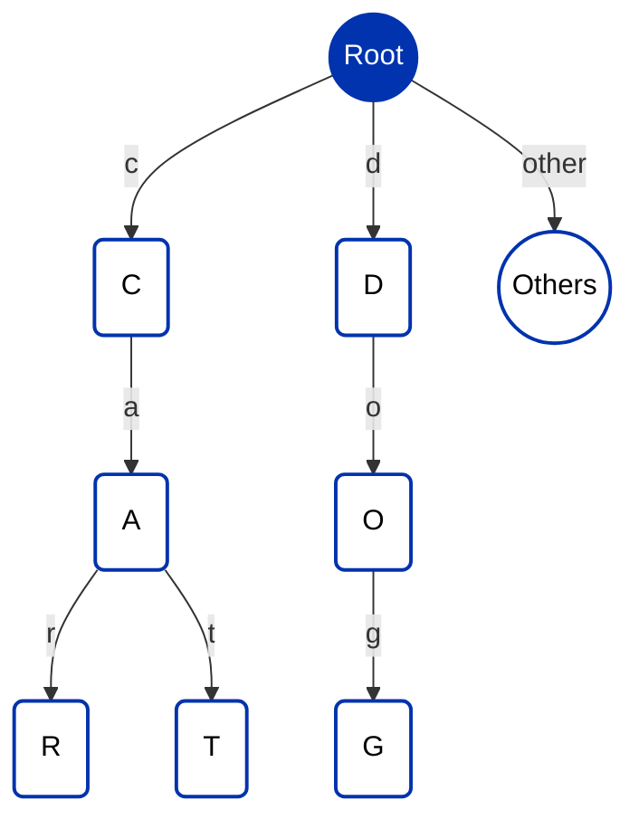

A **trie** (prefix tree) stores a set of keys by their shared prefixes. Each node is one step along a key, and a key's value sits at the node where its path ends, so keys that begin the same way share the same branch. That makes a trie space-efficient for large sets of similar keys, with lookups, inserts, and deletes proportional to the length of the key rather than the size of the set.

On Cardano, the [aiken-trie](https://github.com/Anastasia-Labs/aiken-trie) library distributes a trie across many UTXOs, so different parts of the structure can be updated in parallel while staying verifiable on-chain.

## Structure

- **Root**: the (usually empty) node every key descends from.
- **Intermediate nodes**: the shared prefixes of the keys, narrowing the search at each step.
- **Leaf nodes**: where a key's path ends and its value is held.

A key is encoded as a path: each byte is a step down from the root toward a leaf. Inserting a key walks that path, creating nodes where none exist. Because keys share prefixes, a common beginning is stored once.

Example with the keys `car`, `cat`, and `dog`:

`car` and `cat` share the `ca` branch and split at the final character; `dog` descends its own path. Storing that shared prefix once is where a trie saves space over keeping each key independently, and the saving grows with the number of keys that share prefixes.

## On-chain design

The library keeps each part of the trie in its own UTXO and validates changes through a staking script rather than per-node spend logic: a spend defers to a withdrawal validator that runs **once for the whole transaction** and checks the trie operation. This is the [withdraw-zero coordinator](/docs/developers/curriculum/smart-contracts/advanced/design-patterns/stake-validator) shape applied to a data structure, and it keeps updates cheap as the trie grows. For the validator code and an off-chain transaction-builder guide, see the [aiken-trie repository](https://github.com/Anastasia-Labs/aiken-trie).

## Related

- [Linked list](/docs/developers/curriculum/smart-contracts/advanced/design-patterns/linked-list): the other on-chain associative structure, ordered by key, with membership and non-membership proofs.
- [Merkle tree](/docs/developers/curriculum/smart-contracts/advanced/design-patterns/merkle-tree): commit to a large set behind a single root hash.
