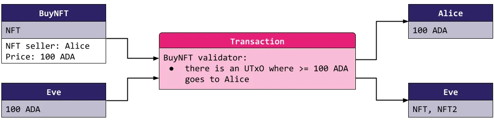
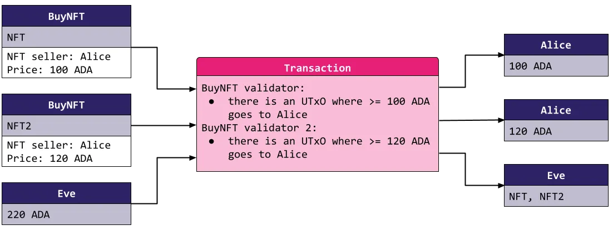
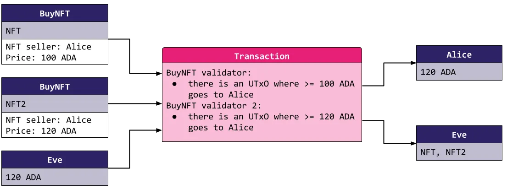
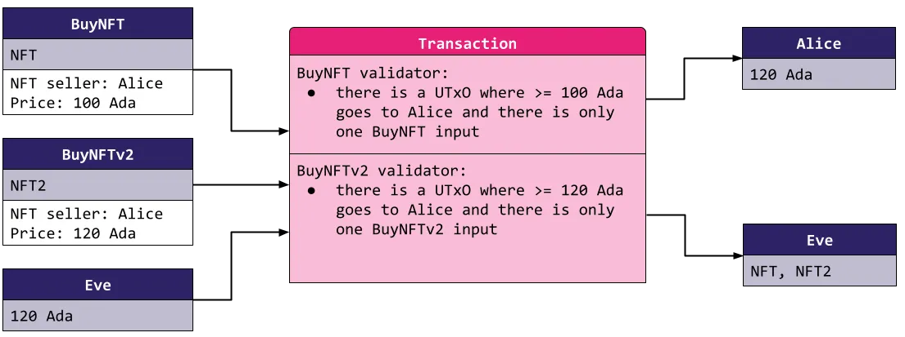
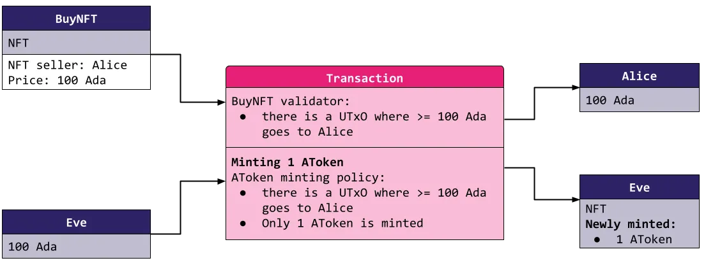
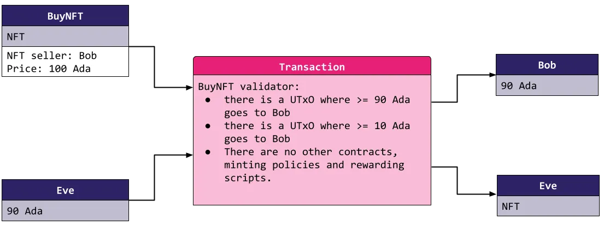
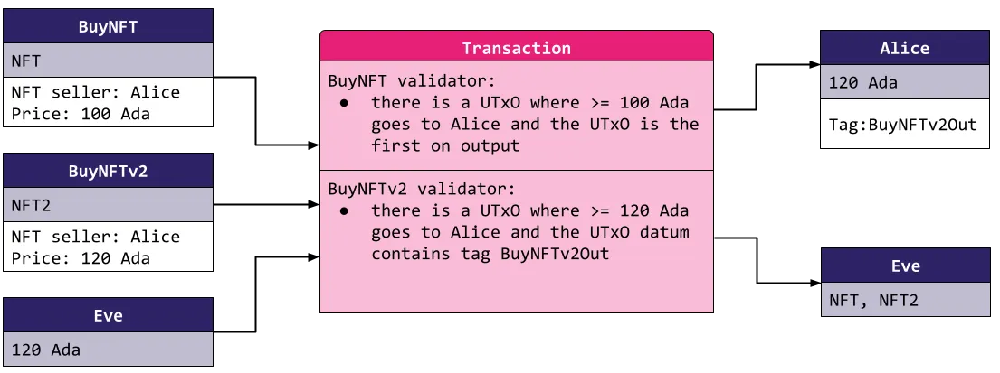

> Adapted from [Invariant0's Cardano vulnerabilities series](https://medium.com/@invariant0/cardano-vulnerabilities-1-double-satisfaction-219f1bc9665e).

Cardano validates a transaction against the rules of *every* input independently, and every validator sees the same transaction. Double satisfaction is the bug that follows: when two validators each look for "an output that pays me", one output can satisfy both, so an attacker meets two obligations while paying for one.

## A payment contract

Take a `BuyNFT` contract that sells an NFT to whoever pays the seller. Its datum holds two fields:

- **seller**: the address the buyer must pay.
- **price**: how much the buyer must pay.

The rule is one line: the spending transaction contains an output to `seller` worth at least `price`.



The contract deliberately says nothing about the NFT itself. Alice only cares that she is paid, and what Eve does with the NFT afterward is her business. (If Alice locks no NFT in the contract, Eve simply sees an empty offer and does not spend it.)

## The attack

Alice lists two NFTs as two separate `BuyNFT` UTXOs. Buying both should mean paying both sellers:



But each validator checks the transaction on its own, and both see the same outputs. So Eve consumes both offers and pays Alice once:



Both validators find an output paying Alice at least the price, both pass, and Eve buys two NFTs for the price of one. She satisfied two conditions where she should have satisfied one.

## Escalating defenses, and why they fall short

**Forbid a second copy of the same script.** A first fix makes each `BuyNFT` validator reject any transaction that spends another UTXO under the same validator hash. That stops two `BuyNFT` offers colliding. But when the contract is later updated to `BuyNFTv2`, the new hash differs from the old, and Eve can pair an old offer with a new one:



**Forbid every other script.** So each validator must reject *any* other script among the inputs, not just its own. Stronger, but still not enough, because minting policies and staking scripts are validators too:

- A **minting policy** that lets anyone mint `AToken` by paying Alice 100 ADA is satisfied by the very same payment that satisfies a `BuyNFT` offer.



- A **staking script** that releases rewards to Alice's address is satisfied the same way: Eve withdraws the rewards and uses that payment to buy the NFT.

**Double satisfaction within one script.** Even a single contract can double-satisfy itself. Suppose a 10% fee is added: 90% of the price to the seller, 10% to the operator, Bob. When Bob himself sells an NFT, he should receive both the fee and the price, but Eve can pay him just the price and let it count for both:



The fix for this last case is to compute how much each address is owed by summing the relevant datum fields, then check the actual total paid to each. Here that requires 100 ADA to Bob, and Eve's underpayment fails.

## Remediation

A script that expects a payment can, in the strict form:

- ban all other scripts from the transaction inputs,
- ban all staking withdrawals, and
- ban minting of any tokens.

That is very restrictive, and many protocols genuinely need several scripts to interact. The looser options each pair an output to its obligation explicitly:

- **Ordering.** Match inputs to outputs by position: the first input's validator checks the first output, the second the second, and so on. Each script owns one output.
- **Tagging.** Tag each output with a unique marker (an output datum, or an input-to-output map passed in the redeemer) so a validator checks *its* output, not just *some* output.
- **Transaction-level validation.** Offload the whole check to the minting policy of a single token, so one script pairs every input to its output. This is the [transaction-level minter](/docs/developers/curriculum/smart-contracts/advanced/design-patterns/tx-level-minter) pattern.

No approach fully protects a script against interacting with *other* scripts that do not know about it: script A might defend by ordering while script B defends by tagging, and an attacker can tag the first output and fool both at once:



Until an approach is standardized, treat any interaction between mutually unaware scripts as either forbidden or potentially vulnerable. Users can help too: a script deployed at a unique address per usage cannot collide with another expecting payment to the same address, though that is not always possible, for example when chaining one script's output into another.

## Formal framework

> From [MLabs Common Plutus Vulnerabilities](https://www.mlabs.city/blog/common-plutus-security-vulnerabilities)

**Identifier:** `multiple-satisfaction`

**Property statement:**
All scripts consider the totality of inputs to the transaction, as well as the totality of minted value and value withdrawn from staking validators, when allowing spending, minting, or withdrawing value.

**Test:**
A transaction consumes multiple UTXOs, spending the value of each individual UTXO while respecting each individual UTXO's conditions, but without respecting the intended *aggregate* condition under which the total value could be spent. More general variants draw the extra value from minted value or staking withdrawals rather than from inputs.

**Impact:**

- Leaking protocol tokens.
- Unauthorised protocol actions.

**A common vulnerable pattern:**

```haskell
vulnValidator __ ctx =
  traceIfFalse "Must continue tokens" (txOutValue ownInput == txOutValue ownOutput)
  where
    ownInput = txInInfoResolved $ findOwnInput ctx
    [ownOutput] = getContinuingOutputs ctx
```

This checks that a consumed UTXO's value continues to an output locked back at the validator ("own input" to "own output"). The logic is correct for one UTXO in isolation, but breaks when two outputs at the validator hold the same value. Consider two of them:

```text
Output A - TxOut ($FOO x 1 + $ADA x 2)
Output B - TxOut ($FOO x 1 + $ADA x 2)
```

A transaction that spends both can steal the value of one. It pays `$FOO x 1 + $ADA x 2` back to the validator's address, which satisfies both validator runs (each finds a continuing output holding the expected value), and sends the other `$FOO x 1 + $ADA x 2` to an arbitrary address. The fix is to account for *all* inputs, not only that the desired input is present but that no undesired ones are, and, for full protection, to check that no minting policies or staking validators are also executing.

## Code examples

- [Mesh: Double Satisfaction Example](https://github.com/MeshJS/mesh/tree/main/packages/mesh-contract/src/swap/double-satisfaction)
