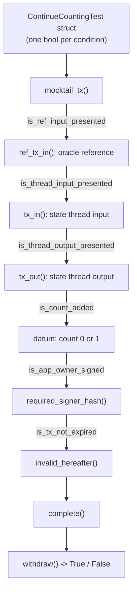

Because a Cardano validator is a [pure function](/docs/developers/curriculum/smart-contracts/overview#smart-contracts-are-validators-not-actors), `f(datum, redeemer, context) -> Bool`, it is unusually easy to test. There is no network, no global state, no deployment required: you hand the function some mock data and assert the result. And because deployed validators are immutable and guard real value, testing is not optional.

This page covers on-chain testing in [Aiken](/docs/developers/curriculum/smart-contracts/choose-a-language), which ships a test runner in the toolchain. The same ideas apply to other languages.

## The test runner

Define test functions with the `test` keyword, then run `aiken check` from the project root to execute every test it finds. A test passes when it returns `True`:

```aiken
test always_true() {
  True
}
```

`aiken check` is the Aiken equivalent of `npm test`: it discovers and runs all `test` functions in the project.

Three keywords do most of the work:

- **`expect`** enforces an exact pattern match on a value and crashes if the shape doesn't match, like a runtime schema check. For example, if `inputs_with_policy(reference_inputs, oracle_nft)` returns a list that should contain exactly one item, `expect [oracle_ref_input] = ...` safely destructures it.
- **The `?` operator** is a tracing operator: when a validator fails, it reports which condition was `False`. Writing `is_app_owner_signed?` means a failure prints `is_app_owner_signed?`, pointing you straight at the broken check.
- **`test ... fail`** marks a test as *expected to fail*. It passes only if the validator crashes or returns `False`, the equivalent of `expect(...).toThrow()`.

## A contract to test

Take a withdrawal validator with two user actions, `ContinueCounting` (verify the owner signed, the app hasn't expired, and the count incremented by one) and `StopCounting` (verify the owner signed and the state-thread token is burned):

```aiken
use aiken/crypto.{VerificationKeyHash}
use cardano/address.{Address, Credential}
use cardano/assets.{PolicyId, without_lovelace}
use cardano/certificate.{Certificate}
use cardano/transaction.{Transaction}
use cocktail.{
  input_inline_datum, inputs_at_with_policy, inputs_with_policy, key_signed,
  output_inline_datum, outputs_at_with_policy, valid_before,
}

pub type OracleDatum {
  app_owner: VerificationKeyHash,
  app_expiry: Int,
  spending_validator_address: Address,
  state_thread_token_policy_id: PolicyId,
}

pub type SpendingValidatorDatum {
  count: Int,
}

pub type MyRedeemer {
  ContinueCounting
  StopCounting
}

validator complex_withdrawal_contract(oracle_nft: PolicyId) {
  withdraw(redeemer: MyRedeemer, _credential: Credential, tx: Transaction) {
    let Transaction {
      reference_inputs, inputs, outputs, mint, extra_signatories, validity_range, ..
    } = tx

    expect [oracle_ref_input] = inputs_with_policy(reference_inputs, oracle_nft)
    expect OracleDatum { app_owner, app_expiry, spending_validator_address, state_thread_token_policy_id } =
      input_inline_datum(oracle_ref_input)

    expect [state_thread_input] =
      inputs_at_with_policy(inputs, spending_validator_address, state_thread_token_policy_id)

    let is_app_owner_signed = key_signed(extra_signatories, app_owner)

    when redeemer is {
      ContinueCounting -> {
        expect [state_thread_output] =
          outputs_at_with_policy(outputs, spending_validator_address, state_thread_token_policy_id)
        expect input_datum: SpendingValidatorDatum = input_inline_datum(state_thread_input)
        expect output_datum: SpendingValidatorDatum = output_inline_datum(state_thread_output)

        let is_app_not_expired = valid_before(validity_range, app_expiry)
        let is_count_added = input_datum.count + 1 == output_datum.count
        let is_nothing_minted = mint == assets.zero

        is_app_owner_signed? && is_app_not_expired? && is_count_added && is_nothing_minted?
      }
      StopCounting -> {
        let state_thread_value = state_thread_input.output.value |> without_lovelace()
        let is_thread_token_burned = mint == assets.negate(state_thread_value)
        is_app_owner_signed? && is_thread_token_burned?
      }
    }
  }
}
```

The validator reads the oracle config from a reference input, finds the state-thread token's input and output, and checks the state transition. To test it, we need to construct realistic mock transactions.

## Building mock transactions with mocktail

Building all the required Aiken types by hand is tedious. The `mocktail` module (from the `vodka` library) provides builders: start with `mocktail_tx()` for an empty transaction, chain modifier functions to add the pieces your test needs, and finish with `complete()`.

```aiken
fn mock_continue_counting_tx() -> Transaction {
  mocktail_tx()
    |> ref_tx_in(True, mock_tx_hash(0), 0, mock_oracle_value, mock_oracle_address)
    |> ref_tx_in_inline_datum(True, mock_oracle_datum)
    |> tx_in(True, mock_tx_hash(1), 0, mock_state_thread_value, mock_spending_validator_address)
    |> tx_in_inline_datum(True, mock_datum(0))
    |> tx_out(True, mock_spending_validator_address, mock_state_thread_value)
    |> tx_out_inline_datum(True, mock_datum(1))
    |> required_signer_hash(True, mock_app_owner)
    |> invalid_hereafter(True, 999)
    |> complete()
}

test success_continue_counting() {
  complex_withdrawal_contract.withdraw(
    mock_oracle_nft,
    ContinueCounting,
    Credential.Script(#""),
    mock_continue_counting_tx(),
  )
}
```

This is a test fixture factory: you build a fake transaction the same way you'd build a mock HTTP request with headers, body, and auth.

## The boolean-toggle pattern

The real power comes from the boolean parameter on each builder method, which includes or excludes a piece of the transaction. Define a struct of booleans, one per validation condition, and the success test sets them all `True`, while each failure test flips exactly one to `False`. This isolates a single failure mode per test, the way you'd write one web2 test each for "missing auth header", "expired token", "malformed body".



```aiken
type ContinueCountingTest {
  is_ref_input_presented: Bool,
  is_thread_input_presented: Bool,
  is_thread_output_presented: Bool,
  is_count_added: Bool,
  is_app_owner_signed: Bool,
  is_tx_not_expired: Bool,
}

fn mock_continue_counting_tx(test_case: ContinueCountingTest) -> Transaction {
  let ContinueCountingTest { is_ref_input_presented, is_thread_input_presented,
    is_thread_output_presented, is_count_added, is_app_owner_signed, is_tx_not_expired } = test_case

  let output_datum = if is_count_added { mock_datum(1) } else { mock_datum(0) }
  mocktail_tx()
    |> ref_tx_in(is_ref_input_presented, mock_tx_hash(0), 0, mock_oracle_value, mock_oracle_address)
    |> ref_tx_in_inline_datum(is_ref_input_presented, mock_oracle_datum)
    |> tx_in(is_thread_input_presented, mock_tx_hash(1), 0, mock_state_thread_value, mock_spending_validator_address)
    |> tx_in_inline_datum(is_thread_input_presented, mock_datum(0))
    |> tx_out(is_thread_output_presented, mock_spending_validator_address, mock_state_thread_value)
    |> tx_out_inline_datum(is_thread_output_presented, output_datum)
    |> required_signer_hash(is_app_owner_signed, mock_app_owner)
    |> invalid_hereafter(is_tx_not_expired, 999)
    |> complete()
}
```

The success test sets every field `True`. Each failure test flips one:

```aiken
test fail_continue_counting_no_ref_input() fail {
  let test_case = ContinueCountingTest {
    is_ref_input_presented: False,   // the only difference
    is_thread_input_presented: True, is_thread_output_presented: True,
    is_count_added: True, is_app_owner_signed: True, is_tx_not_expired: True,
  }
  complex_withdrawal_contract.withdraw(
    mock_oracle_nft, ContinueCounting, Credential.Script(#""), mock_continue_counting_tx(test_case),
  )
}
```

The pattern scales cleanly: when you add a validation condition to the contract, you add one boolean to the struct, set it `True` in the success test, and write one new failure test with it `False`.

If you have written web2 tests, the workflow is familiar. `aiken check` discovers and runs every `test` function the way `npm test` or `bun test` does. You build a fake transaction with `mocktail_tx()` and a builder chain, much like assembling a request from a fixture factory. A `test ... fail` marks a test you expect to fail, like `expect(...).toThrow()`, and the boolean-toggle struct shown above plays the role of `test.each()` or table-driven tests, flipping one condition at a time so each test isolates a single failure.

Production suites push the same idea past booleans: an **options record** whose fields are all `Option` types, a `default_options()` giving one canonical happy-path transaction, and each negative test overriding exactly one field with `Some(bad_value)` via record spread, `Options { ..default_options(), edit_fee: Some(0) }`. The default builder is written once, every test documents one invariant, and a new validator check costs one field plus one `fail` test. A second production idiom is **golden vectors**: tests whose only job is to `trace` the canonical CBOR of each datum and redeemer (`cbor.serialise` piped through `bytearray.to_hex`), so off-chain integrations and third parties can pin the exact bytes your contract expects rather than re-deriving them from source.

## Property-based testing

The boolean-toggle pattern tests the failure cases you already thought of: every test names one condition you knew to check. Property-based testing inverts that. Instead of listing cases, you state an invariant that must hold for *every* input, then let the test runner generate hundreds of random inputs trying to break it. A unit test asks "does this specific transaction pass?"; a property asks "is there *any* input that violates this rule?". Good invariants read like the contract's real guarantees: no transaction releases more value than it locks, only the owner can withdraw, a counter only ever moves up by one. This is how you catch the boundary and double-satisfaction bugs you never wrote a case for, the classes catalogued in [Security](/docs/developers/curriculum/smart-contracts/security/vulnerabilities/overview).

Aiken's runner has this built in. A `test` whose argument is drawn `via` a fuzzer runs many times over, each with a fresh generated value, and when it finds a counterexample it *shrinks* it to the smallest input that still fails before reporting:

```aiken
use aiken/fuzz

// A vault's rule: withdraw a positive amount, never more than the locked balance.
fn may_withdraw(locked: Int, amount: Int) -> Bool {
  amount > 0 && amount <= locked
}

// Property: for any amount the fuzzer generates, negative, zero, or larger than
// the balance, an authorized withdrawal never leaves the vault overdrawn.
test prop_never_overdraws(amount via fuzz.int()) {
  let locked = 1_000_000
  if may_withdraw(locked, amount) {
    locked - amount >= 0
  } else {
    True
  }
}
```

`fuzz.int()` feeds every kind of integer through the rule, including the negatives and off-by-one boundaries a hand-picked case tends to skip. If a change let `may_withdraw` accept an amount above the balance, the runner shrinks the failure to the minimal breaking value (`1_000_001`) rather than a random large one, pointing you straight at the boundary. You build fuzzers for whole transactions the same way, composing the `aiken/fuzz` and `cardano/fuzz` primitives. The same fuzzer has a second, distinct use: [Optimization](/docs/developers/curriculum/smart-contracts/advanced/optimization#using-fuzzer) uses it to generate *fixtures*, arbitrary-but-valid transaction parts to stand a test up. The difference is what you do with the generated value: a fixture is scaffolding for one case, a property is an assertion checked across thousands.

## Testing your off-chain code

Your validator isn't the only thing that needs tests. The transaction-building code that locks, spends, and mints deserves them too, and it splits into two kinds of test, both covered in Module 2.

**Unit tests** exercise the pure parts, datum and schema encoding, address parsing, and the shape of the transaction you build, with no chain at all. [Offline testing](/docs/developers/curriculum/start-building/offline-testing) covers the in-memory tools for that: `OfflineFetcher`, `OfflineEvaluator`, and `TxTester`.

**Integration tests** drive the whole build → sign → submit → confirm lifecycle against [a devnet your tests start and stop](/docs/developers/curriculum/start-building/networks-and-test-ada#a-devnet-your-tests-start-and-stop): fund a wallet from genesis, submit, and assert on confirmation, with millisecond confirmations and fresh isolated state per run, offline and with no faucet.

## Audits

Testing finds the bugs you thought of; audits find the ones you didn't. For any contract holding significant value, a professional audit is standard practice. See [Audits](/docs/developers/curriculum/smart-contracts/security#audits) for the process and how to prepare for one.

## Next steps

- [Security](/docs/developers/curriculum/smart-contracts/security/vulnerabilities/overview): the vulnerability classes your tests should target
- [Lock and spend](/docs/developers/curriculum/smart-contracts/lock-and-spend): exercise the validator end to end
- [Contract library](/templates/contracts): read tested, production-grade validators
