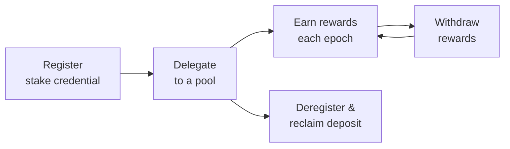

Staking is how ADA holders earn rewards by backing the network's security: they delegate their stake to a pool, and the pool produces blocks proportional to the stake delegated to it. From a developer's point of view, this is something your wallet or dApp can offer with a few certificate types on top of an ordinary transaction.

This page is the concept: what makes Cardano's model different, how rewards and timing work, and the lifecycle every integration follows. Two practice pages then build it: [Delegate and withdraw](/docs/developers/curriculum/staking-governance/delegate-and-withdraw) for the certificate flows and [Manage stake](/docs/developers/curriculum/staking-governance/manage-stake) for queries, deregistration, and combining stake with vote delegation. Running a pool as infrastructure (relays, block producers, KES keys, monitoring) is a separate discipline with its own section: [Operate a Stake Pool](/docs/operators/).


## What makes Cardano staking different

Cardano's delegation is **non-custodial**, which is a strong selling point to surface in your UI:

- **Your ADA never leaves your wallet.** You issue an on-chain certificate that counts your stake toward a pool; you keep full spending control.
- **No lock-up.** Your ADA stays liquid, spendable at any time.
- **No minimum to delegate.** Any amount counts toward the pool. Registering your stake key the first time costs a refundable deposit (`stakeAddressDeposit`, currently 2 ADA), returned when you deregister.
- **No slashing.** Delegated ADA is never at risk. If a pool underperforms, you simply miss rewards for that epoch. You never lose principal. (Contrast Ethereum, where validators can be slashed.)
- **Automatic re-delegation.** Add more ADA to the wallet and it's included from the next snapshot.

The stake credential is separate from the payment credential. Delegating doesn't move funds, it just assigns the staking rights attached to your address. See [Addresses](/docs/developers/curriculum/fundamentals/core-concepts/addresses) for how payment and delegation credentials combine.

## How rewards and timing work

Rewards don't arrive instantly. Because of how Ouroboros calculates slot leadership from a stake snapshot, there's a built-in delay before a fresh delegation starts earning:

```text
Epoch N      you delegate
Epoch N+1    snapshot taken at the epoch boundary
Epoch N+2    the pool produces blocks using your stake
Epoch N+3    rewards calculated
Epoch N+4    rewards distributed to your reward address
```

After this initial delay (~15 to 20 days), rewards arrive every epoch (~5 days) as long as the pool produces blocks. Two things worth showing users:

- **Saturation.** Each pool has a saturation point (total stake ÷ `k0`, the [target number of pools](/docs/developers/curriculum/fundamentals/consensus-and-ouroboros#how-do-rewards-and-incentives-drive-decentralization), currently 500). Past it, rewards *per ADA* drop, a built-in nudge toward smaller pools and decentralization. Do not confuse `k0` with the security parameter `k` (2160), which bounds rollback depth.
- **Performance.** A pool that misses assigned blocks earns fewer rewards, which flows through to delegators.

The deeper consensus mechanics (epochs, slots, VRF leader selection, the reward formula) are in [Consensus & Ouroboros](/docs/developers/curriculum/fundamentals/consensus-and-ouroboros).

## The staking lifecycle

Every staking integration is some subset of the same five steps:



1. **Register**: create the stake credential on-chain (a small refundable deposit).
2. **Delegate**: assign the stake to a pool (and, separately, [a DRep for voting](/docs/developers/curriculum/staking-governance/drep-and-delegation#delegate-your-vote)).
3. **Earn**: rewards accrue to the reward address each epoch.
4. **Withdraw**: claim accumulated rewards into the wallet.
5. **Deregister**: optional; remove the credential and reclaim the deposit.

## Beyond keys and pools

Two directions the practice pages point at when you need them:

- **Script-controlled stake.** A stake credential can be a Plutus script instead of a key, which is how DeFi protocols run one validation for a whole transaction (the withdraw-zero trigger). The pattern, its off-chain submission, and the on-chain handlers live in the [Stake Validator design pattern](/docs/developers/curriculum/smart-contracts/advanced/design-patterns/stake-validator) and [Write a validator](/docs/developers/curriculum/smart-contracts/write-a-validator#certificate-validator).
- **Pool tooling.** If you build pool-management tooling, pools can be registered, updated, and retired from code (Evolution's `registerPool` and `retirePool`, with [CIP-6](https://cips.cardano.org/cip/CIP-0006) metadata); Mesh has no pool helpers. Running a pool itself is the [Operate a Stake Pool](/docs/operators/) discipline.

## Next steps

- [Delegate and withdraw](/docs/developers/curriculum/staking-governance/delegate-and-withdraw): register, delegate, and withdraw rewards in code
- [Manage stake](/docs/developers/curriculum/staking-governance/manage-stake): query status, deregister, and delegate stake and vote together
