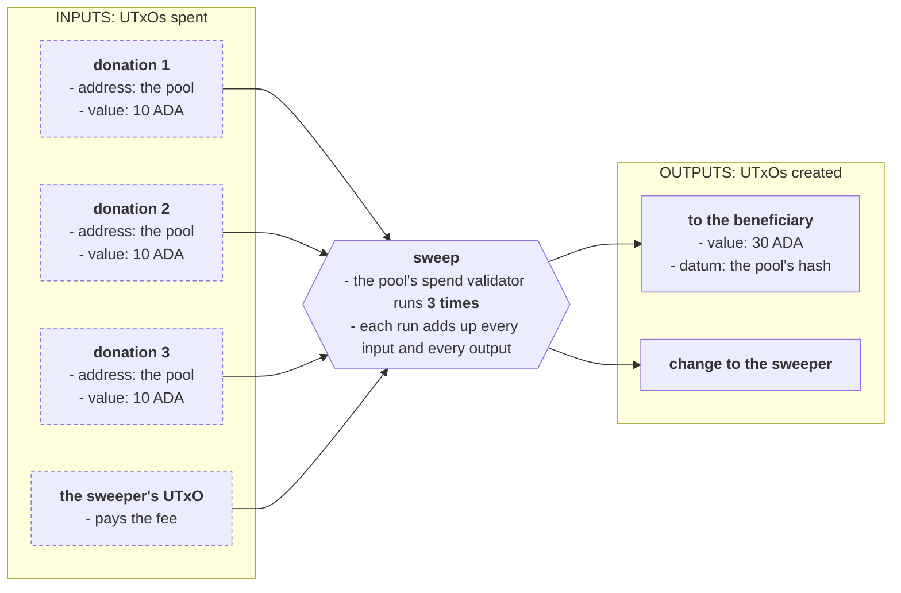
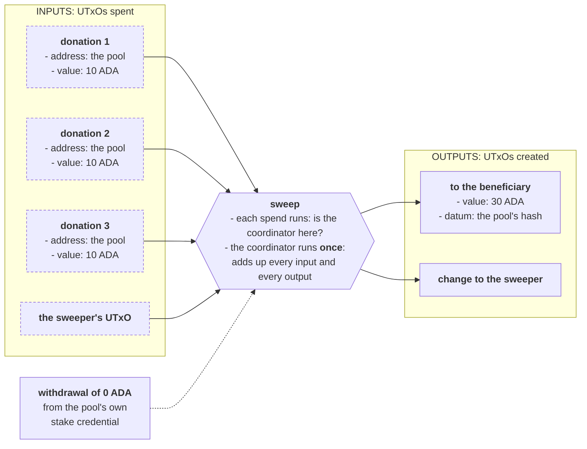

import Tabs from "@theme/Tabs";
import TabItem from "@theme/TabItem";
import CodeBlock from "@theme/CodeBlock";
import extractRegion from "@site/src/utils/extractRegion";
import validatorHash from "@site/src/utils/validatorHash";
import costFigure, { costSaving } from "@site/src/utils/costFigure";
import SweepAiken from "!!raw-loader!@site/examples/onboarding/design-patterns/tx-level-validation/on-chain/aiken/lib/sweep.ak";
import NaiveAiken from "!!raw-loader!@site/examples/onboarding/design-patterns/tx-level-validation/on-chain/aiken/validators/naive.ak";
import ByHandAiken from "!!raw-loader!@site/examples/onboarding/design-patterns/tx-level-validation/on-chain/aiken/validators/by_hand.ak";
import WithLibraryAiken from "!!raw-loader!@site/examples/onboarding/design-patterns/tx-level-validation/on-chain/aiken/validators/with_library.ak";
import SweepMesh from "!!raw-loader!@site/examples/onboarding/design-patterns/tx-level-validation/off-chain/mesh/src/lib/sweep.ts";
import BlueprintMesh from "!!raw-loader!@site/examples/onboarding/design-patterns/tx-level-validation/off-chain/mesh/src/lib/blueprint.ts";
import Blueprint from "@site/examples/onboarding/design-patterns/tx-level-validation/on-chain/aiken/plutus.json";
import Costs from "@site/examples/onboarding/design-patterns/tx-level-validation/off-chain/mesh/costs.json";

# Transaction-level validation

When a transaction spends several UTxOs locked by the same script, the script runs once for each of them. If what it checks is about the whole transaction, every run repeats the same work and reaches the same answer. This pattern moves that work into a **coordinator** that **runs once per transaction**, and leaves each input with a check that costs almost nothing. This is a very popular pattern.

There are two ways to build the coordinator: a **withdraw-zero** stake validator, and a **minting policy**. This page writes both, by hand and with the [`aiken-design-patterns`](https://github.com/Anastasia-Labs/aiken-design-patterns) library, and measures them against the contract they replace.

## The protocol

A **donation pool**: In this protocol, anyone can send ADA to the pool (a script address) as a donation to a beneficiary. The script is compiled around one beneficiary's address. **Anyone** may sweep the pool, whether the beneficiary, a bot, or a passer-by, because the contract only cares that **everything taken from the pool goes to the beneficiary**.

Donations can arrive one at a time or many in parralel, so there could be hunderds of donations (UTxOs). We don't want to consume one by one, it would be expensive and time-consuming, so we sweep many of them at once:

The check, shared by every version of the pool on this page is: We add up what the transaction takes from the pool and what it pays to the beneficiary, and we check that every asset taken is paid in at least the same amount. It counts tokens as well as ADA, so a sweeper cannot keep a token someone donated:




## The naive contract (the problem)

The naive version of this contract is to implement that check in the UTxO's spending validator. The problem with this, is that **the check is always the same (they compute the same totals and give the same answer) but it still runs once per donation UTxO consumed** in the transaction. With _N_ donations the check runs _N_ times, and each run walks all _N_ inputs, so the work grows with _N²_.

<CodeBlock language="aiken" title="lib/sweep.ak">
  {extractRegion(SweepAiken, "check")}
</CodeBlock>

Overall, it adds up what the transaction takes from the pool and what it pays the beneficiary, and checks that every asset taken is paid in at least the same amount. Besides that, other checks/details are:

- **Tokens count as well as ADA**, so a sweeper cannot keep a token someone donated.
- **The beneficiary's address must match exactly**, stake credential included. Matching only the key would let a sweeper pay the beneficiary's key under a stake credential of their own, and collect the staking rewards on the funds.
- **Each payment carries the pool's hash as its datum**, and only payments tagged with this pool's hash count. Without the tag, two different pools for the same beneficiary could be swept in one transaction with a single payment satisfying both, and the sweeper would keep the rest. This is [double satisfaction](/docs/developers/curriculum/smart-contracts/security/vulnerabilities/double-satisfaction).
- **Rewards withdrawn from the pool's own stake credential count as taken.** That balance is normally zero, but anyone can pay rewards into a stake account, for example as a governance proposal's deposit refund. Whoever withdraws them must pass them on.

The obvious pool runs the check from its spend handler. The handler first finds the donation it is guarding, because that is where it learns the pool's own hash, and then checks the whole transaction:

<CodeBlock language="aiken" title="validators/naive.ak">
  {extractRegion(NaiveAiken, "naive")}
</CodeBlock>

It is correct, and it is expensive. Sweeping 10 donations uses {costFigure(Costs, "pools.naive.sweeps.10.mem")} memory units, against {costFigure(Costs, "pools.naive.sweeps.1.mem")} for one. A transaction may use at most {costFigure(Costs, "limits.mem")}, so this pool can sweep at most **{costFigure(Costs, "pools.naive.largestSweep")} donations** at a time.

## The pattern (the solution)

Avoid repeated work. The check is about the whole transaction, which is the same for all UTxOs, so it should run only **once**. Each donation only needs to know that it ran.

So, we need a script that runs once per transaction, which we'll call the **coordinator**. Two script purposes run once per transaction no matter how many inputs there are, and any transaction can trigger them:

- **withdraw**: a withdrawal from a script's stake credential runs that script once. A withdrawal takes the credential's whole reward balance, and a credential that was never delegated normally has a balance of zero. Withdrawing that zero moves nothing, **however, the script still runs!** This is why, when using the withdrawal script, we call this pattern the **withdraw-zero trick**.
- **mint**: minting or burning under a script's policy runs that policy once, independent on the amount of tokens or inputs.

By moving the logic to either one of these purposes, each donation's spend handler shrinks to one question: **is the coordinator in this transaction?** If it is, we allow the spend, if it isn't, the whole transaction fails. By doing this, we move the expensive computation to a validator that runs only once, and, even if each spending validtor still has to run, there will each be many times cheaper (we'll see cost comparision at the end).



**Where the coordinator lives:** The spend handler has to recognize _its_ coordinator, and the coordinator has to know which inputs are the pool's. As two separate scripts, each would need the other's hash as a parameter, and neither hash exists until the other one does. Put both handlers in **one validator** instead, and they share one hash: the pool's address, its stake credential and its policy ID are the same script. The spend handler reads that hash off the donation it guards and looks for it among the withdrawals, or the mint. The coordinator is handed it directly.

## Design

The four questions from the Intermediate track:

1. **Requirements.** Everything taken from the pool reaches the beneficiary. Anyone may sweep. Sweeping many donations should cost as little as possible.
2. **Actions.** Sweep, carried out by two handlers: one `spend` per donation, and one coordinator per transaction. The withdraw version adds the actions its stake credential needs: registering it, and deregistering it to recover the deposit.
3. **What must be true.** For each `spend`: the pool's own coordinator runs in this transaction. For the coordinator: the beneficiary's exact address receives, in outputs tagged with the pool's hash, at least what the transaction takes from the pool, asset by asset. For deregistration: the beneficiary signs.
4. **What must be remembered.** Only the beneficiary's address, and it is a **parameter**, fixed when the pool's address is derived. Donations carry an empty datum.

## Write it by hand

<Tabs groupId="onchain">
<TabItem value="aiken" label="Aiken" default>

### With a withdrawal as the coordinator

The `withdraw` handler runs once and does the check. It is handed the credential being withdrawn from, which is the pool's own, so it knows which inputs to add up:

<CodeBlock language="aiken" title="validators/by_hand.ak">
  {extractRegion(ByHandAiken, "withdraw")}
</CodeBlock>

The `spend` handler still finds its own input, as the naive one did, and from there it does one lookup in `withdrawals`, which usually holds a single entry. `pairs.has_key` only asks whether the pool's own credential is present. The amount does not matter here: the ledger has already checked that it is the credential's whole balance, and the coordinator counts it as taken.

The `publish` handler controls the stake credential, because certificates for a script credential run that script:

- **Registering** is open to anyone. It only costs whoever pays the 2 ADA deposit, and it is what makes the credential usable.
- **Deregistering** needs the beneficiary's signature. It stops sweeps until someone registers the credential again, and it hands the deposit back to the transaction, so only the beneficiary may do it:

<CodeBlock language="aiken" title="lib/sweep.ak">
  {extractRegion(SweepAiken, "signed")}
</CodeBlock>

- **Everything else**, delegation included, is refused. A credential nobody can delegate earns no staking rewards.

All three handlers compile into one script. Open `plutus.json` and the `spend`, `withdraw` and `publish` entries carry the same hash:

<CodeBlock>{`by_hand.pool_withdraw.spend     ${validatorHash(Blueprint, "by_hand.pool_withdraw.spend")}
by_hand.pool_withdraw.withdraw  ${validatorHash(Blueprint, "by_hand.pool_withdraw.withdraw")}
by_hand.pool_withdraw.publish   ${validatorHash(Blueprint, "by_hand.pool_withdraw.publish")}`}</CodeBlock>

That is the script with its `beneficiary` parameter still blank. Applying a real address gives a different hash, and the pool's address, stake credential and policy ID all move together, as in **[parameters](/docs/developers/onboarding/lectures/intermediate/parameters)**.

### With a minting policy as the coordinator

The same shape, with `mint` in place of `withdraw`:

<CodeBlock language="aiken" title="validators/by_hand.ak">
  {extractRegion(ByHandAiken, "sweep-token")}
</CodeBlock>

<CodeBlock language="aiken" title="validators/by_hand.ak">
  {extractRegion(ByHandAiken, "mint")}
</CodeBlock>

The `spend` handler asks whether anything is minted or burned under its own policy. The `mint` handler is handed its policy ID, which is the pool's hash, and runs the check on every mint and every burn, so neither is a way around it.

The policy has to mint _something_, because the ledger does not allow a mint of zero, so each sweep mints one `SWEEP` token. The token proves nothing: nothing in the pool reads it, and no other contract should treat it as evidence of anything. The policy only limits it to one per transaction, under one name. Anyone may mint one, even without sweeping, and anyone holding `SWEEP` tokens may burn them. That is harmless: every mint and every burn still runs the check, so none of them can take a donation without paying the beneficiary. The token is not sent anywhere in particular, so it ends up in the sweeper's change: forcing it onto the beneficiary would only fill their wallet with tokens they did not ask for.

**Test each handler on its own.** The ledger runs them separately, so the tests do too. The spend tests set only `withdrawals` or `mint` and never run the check, the coordinator tests run nothing else, and every attack described above has a test that expects a refusal. They are at the bottom of each file:

```bash
aiken check
```

</TabItem>
<TabItem value="scalus" label="Scalus">

A [Scalus](https://scalus.org/) version is coming soon. The idea is identical, only the language differs.

</TabItem>
</Tabs>

## The same with the library

<Tabs groupId="onchain">
<TabItem value="aiken" label="Aiken" default>

[`aiken-design-patterns`](https://github.com/Anastasia-Labs/aiken-design-patterns) ships the spend side of both coordinators: [`stake_validator`](https://github.com/Anastasia-Labs/aiken-design-patterns/blob/v1.9.0/lib/aiken-design-patterns/stake-validator.ak) for withdrawals and [`tx_level_minter`](https://github.com/Anastasia-Labs/aiken-design-patterns/blob/v1.9.0/lib/aiken-design-patterns/tx-level-minter.ak) for minting. Version v1.9.0 builds with stdlib v4.0.0 on Aiken v1.1.24, the toolchain every onboarding project uses, and brings two dependencies of its own:

```toml title="aiken.toml"
[[dependencies]]
name = "anastasia-labs/aiken-design-patterns"
version = "v1.9.0"
source = "github"

[[dependencies]]
name = "aiken-lang/fuzz"
version = "v3.0.0"
source = "github"

[[dependencies]]
name = "keyan-m/aiken-scott-utils"
version = "v1.5.0"
source = "github"
```

The withdraw pool, with the library's check in its `spend` handler:

<CodeBlock language="aiken" title="validators/with_library.ak">
  {extractRegion(WithLibraryAiken, "withdraw")}
</CodeBlock>

The minting version changes only its `spend` handler, to `tx_level_minter.validate_mint_minimal(own_hash, self.mint)`. Its `mint` handler is the same as in `by_hand.ak`.

**What the library does differently.**

- `validate_withdraw_minimal` does not search. The spend redeemer says where in `withdrawals` the coordinator sits, and the library reads that one entry and checks it belongs to this script. The index is checked, not trusted: a test in `with_library.ak` points it at another script's withdrawal and the spend fails.
- `validate_mint_minimal` is the same check you wrote by hand. It compiles to the same cost.
- The fuller variants, `validate_withdraw`, `validate_withdraw_with_amount` and `validate_mint`, also hand the spend handler the coordinator's redeemer (and the withdrawal amount). Use them when a coordinator has several actions and the spend has to know which one ran.

The library supplies the check that the coordinator ran. The coordinator itself, and the `publish` handler that guards its stake credential, are still yours to write.

</TabItem>
<TabItem value="scalus" label="Scalus">

A [Scalus](https://scalus.org/) version is coming soon. The idea is identical, only the language differs.

</TabItem>
</Tabs>

## Build the transaction

<Tabs groupId="offchain">
<TabItem value="mesh" label="Mesh" default>

Every sweep starts the same way, with each donation as a script input:

<CodeBlock language="ts" title="src/lib/sweep.ts">
  {extractRegion(SweepMesh, "spend-donations")}
</CodeBlock>

The script is attached to every input, and Mesh puts a single copy of it in the transaction. Every sweep ends the same way too, with one payment to the beneficiary, tagged with the pool's hash:

<CodeBlock language="ts" title="src/lib/sweep.ts">
  {extractRegion(SweepMesh, "pay-out")}
</CodeBlock>

The naive sweep needs nothing between the two.

**The withdraw-zero sweep** adds a withdrawal from the pool's reward address, carrying the same compiled script. The amount is whatever the account holds, normally zero, and whatever it is goes to the beneficiary with the donations:

<CodeBlock language="ts" title="src/lib/sweep.ts">
  {extractRegion(SweepMesh, "withdraw-sweep")}
</CodeBlock>

The reward address is the pool's hash used as a stake credential:

<CodeBlock language="ts" title="src/lib/blueprint.ts">
  {extractRegion(BlueprintMesh, "reward-address")}
</CodeBlock>

A withdrawal is only accepted from a **registered** stake credential, so each pool needs one registration before its first sweep. Anyone can send it, and it locks a 2 ADA deposit:

<CodeBlock language="ts" title="src/lib/sweep.ts">
  {extractRegion(SweepMesh, "register")}
</CodeBlock>

The beneficiary can take the deposit back by deregistering, which runs the pool under `publish` and needs their signature:

<CodeBlock language="ts" title="src/lib/sweep.ts">
  {extractRegion(SweepMesh, "deregister")}
</CodeBlock>

**The minting sweep** needs no registration. It mints one `SWEEP` token under the pool's policy instead, and the token lands in the sweeper's change:

<CodeBlock language="ts" title="src/lib/sweep.ts">
  {extractRegion(SweepMesh, "mint-sweep")}
</CodeBlock>

</TabItem>
<TabItem value="evolution" label="Evolution">

An [Evolution](https://github.com/IntersectMBO/evolution-sdk) version is coming soon. The idea is identical, only the library calls differ.

</TabItem>
</Tabs>

## The numbers

Every figure below is measured, not estimated. `npm run bench` builds each sweep on an in-memory chain with a fixed wallet and fixed donations of 10 ADA each, runs every script in it with Mesh's `OfflineEvaluator`, and writes the totals to `costs.json`. This page reads that file. `npm test` measures again and fails if the file is out of date. The limits and fees come from Mesh's default protocol parameters. The live network's are protocol parameters too, so check the current values before you rely on an exact maximum.

**Memory units used by one sweep**, all scripts added up:

| Donations | Naive | Withdraw-zero | Minting policy |
|---|--:|--:|--:|
| 1 | {costFigure(Costs, "pools.naive.sweeps.1.mem")} | {costFigure(Costs, "pools.withdrawByHand.sweeps.1.mem")} | {costFigure(Costs, "pools.mintByHand.sweeps.1.mem")} |
| 5 | {costFigure(Costs, "pools.naive.sweeps.5.mem")} | {costFigure(Costs, "pools.withdrawByHand.sweeps.5.mem")} | {costFigure(Costs, "pools.mintByHand.sweeps.5.mem")} |
| 10 | {costFigure(Costs, "pools.naive.sweeps.10.mem")} | {costFigure(Costs, "pools.withdrawByHand.sweeps.10.mem")} | {costFigure(Costs, "pools.mintByHand.sweeps.10.mem")} |
| 20 | {costFigure(Costs, "pools.naive.sweeps.20.mem")} (over the limit) | {costFigure(Costs, "pools.withdrawByHand.sweeps.20.mem")} | {costFigure(Costs, "pools.mintByHand.sweeps.20.mem")} |

**The fee**, in ADA:

| Donations | Naive | Withdraw-zero | Minting policy |
|---|--:|--:|--:|
| 1 | {costFigure(Costs, "pools.naive.sweeps.1.fee", "ada")} | {costFigure(Costs, "pools.withdrawByHand.sweeps.1.fee", "ada")} | {costFigure(Costs, "pools.mintByHand.sweeps.1.fee", "ada")} |
| 5 | {costFigure(Costs, "pools.naive.sweeps.5.fee", "ada")} | {costFigure(Costs, "pools.withdrawByHand.sweeps.5.fee", "ada")} | {costFigure(Costs, "pools.mintByHand.sweeps.5.fee", "ada")} |
| 10 | {costFigure(Costs, "pools.naive.sweeps.10.fee", "ada")} | {costFigure(Costs, "pools.withdrawByHand.sweeps.10.fee", "ada")} | {costFigure(Costs, "pools.mintByHand.sweeps.10.fee", "ada")} |
| 20 | {costFigure(Costs, "pools.naive.sweeps.20.fee", "ada")} (over the limit) | {costFigure(Costs, "pools.withdrawByHand.sweeps.20.fee", "ada")} | {costFigure(Costs, "pools.mintByHand.sweeps.20.fee", "ada")} |

**The most donations one transaction can sweep**: {costFigure(Costs, "pools.naive.largestSweep")} for the naive pool, {costFigure(Costs, "pools.withdrawByHand.largestSweep")} with withdraw-zero, {costFigure(Costs, "pools.mintByHand.largestSweep")} with a minting policy. Memory is the limit that binds first.

What the tables say:

- **For a single donation, the naive pool is cheaper.** The pattern adds a second script run, and with one input there is nothing to share.
- **From a handful of donations on, the pattern wins, and the gap widens.** At 10 donations withdraw-zero uses {costSaving(Costs, "pools.naive.sweeps.10.mem", "pools.withdrawByHand.sweeps.10.mem")} less memory and pays a {costSaving(Costs, "pools.naive.sweeps.10.fee", "pools.withdrawByHand.sweeps.10.fee")} lower fee.
- **The pattern's cost still grows faster than the number of donations.** Each spend still searches the inputs for its own, and that search is what remains of the _N²_. The [UTxO indexers](/docs/developers/curriculum/smart-contracts/advanced/design-patterns/utxo-indexers) pattern removes it by passing each input's position in the redeemer.
- **Withdraw-zero is slightly cheaper than minting.** The minting policy also checks the token it mints.

The library versions cost the same as the hand-written minting pool ({costFigure(Costs, "pools.mintLibrary.sweeps.10.mem")} at 10 donations) and slightly more than the hand-written withdraw pool ({costFigure(Costs, "pools.withdrawLibrary.sweeps.10.mem")} against {costFigure(Costs, "pools.withdrawByHand.sweeps.10.mem")}). A search through a single withdrawal ends at the first step, so the index only adds work here: decoding the redeemer and checking the entry. It helps a transaction that carries several withdrawals.

## When to use it, and when not

**Use it** when a script's UTxOs are regularly spent together and the check is about the transaction as a whole: totals, conservation of value, anything that adds up or compares across inputs and outputs.

**Skip it** when:

- **UTxOs are almost always spent one at a time.** The 1-donation row above: the pattern costs more.
- **The check is about the input alone**, such as its own datum or its own owner's signature. Nothing is repeated between inputs, so there is nothing to share.

**Withdraw-zero or minting policy?**

| | Withdraw-zero | Minting policy |
|---|---|---|
| Setup | Register the stake credential once, for a 2 ADA deposit that the beneficiary can recover by deregistering. | None. |
| Extra code | A `publish` handler to guard the stake credential. | Checks on the token: which name, how many, when. |
| Per transaction | A withdrawal of the account's balance, normally zero. Nothing is left behind. | One token minted, which ends up in somebody's wallet until they burn it. |
| Cost here | Slightly lower. | Slightly higher. |

Choose minting when the protocol already mints a token in the same transaction, such as a receipt or a state token: the coordinator then comes for free. Otherwise withdraw-zero leaves less behind.

### Security

What makes these pools safe, each item with a test that expects the attack to be refused:

- **The spend looks for its own coordinator.** A spend that accepted _any_ withdrawal or mint would let a sweeper attach an always-true script of their own and skip the check. Sharing one hash leaves the spend nothing else to point at.
- **The coordinator finds the inputs it is responsible for itself**: every input under its own hash. A coordinator that took that list from a redeemer could be handed one that leaves some donations out.
- **Payments are matched on the full address and tagged with the pool's hash**, which closes the staking redirection and double satisfaction described in [the naive contract](#the-naive-contract).
- **Rewards withdrawn from the pool's account are owed to the beneficiary.** A coordinator that insisted on a zero withdrawal instead would be worse: one reward payment into the account, and no transaction could ever satisfy it again, freezing every donation.
- **Only the beneficiary can switch the coordinator off, and nobody can delegate it.** See [Staking and certificate control](/docs/developers/curriculum/smart-contracts/security/vulnerabilities/staking-and-certificates).
- **The `SWEEP` token is meaningless.** Anyone can mint one, one per transaction, sweep or not. Never treat a token minted by a transaction-level coordinator as evidence of anything, unless its policy was written to make it so.

What the pools leave to you:

- **The beneficiary should be a key address.** Only a key can sign a deregistration, and payments carry the pool's hash as their datum, which a script beneficiary may not accept.
- **A sweeper chooses which donations to take.** Somebody can donate a UTxO full of worthless tokens, which makes it expensive to sweep. It cannot block the others: leave it out.
- **Offline tests do not check registration.** `OfflineEvaluator` runs scripts, not every ledger rule. On the live network, a withdraw-zero sweep fails until the credential is registered.

## Run it

The whole example is one self-contained project. See the **[introduction](/docs/developers/onboarding/design-patterns/introduction#the-playground)** for the layout.

```bash
npx giget@latest gh:cardano-foundation/developer-portal/examples/onboarding/design-patterns/tx-level-validation tx-level-validation
cd tx-level-validation/on-chain/aiken
aiken check                      # the validators' own tests, attacks included
cd ../../off-chain/mesh
npm install
npm test                         # every transaction and attack, run through the real scripts, and the costs.json check
npm run bench                    # measure again and rewrite costs.json
```

## Go deeper

- [Stake validator](/docs/developers/curriculum/smart-contracts/advanced/design-patterns/stake-validator): the withdraw-zero trick in reference form, and the credential's registration as one bit of global state.
- [Transaction-level minter](/docs/developers/curriculum/smart-contracts/advanced/design-patterns/tx-level-minter): the minting-policy coordinator.
- [UTxO indexers](/docs/developers/curriculum/smart-contracts/advanced/design-patterns/utxo-indexers): remove the search each spend still does.
- [Double satisfaction](/docs/developers/curriculum/smart-contracts/security/vulnerabilities/double-satisfaction) and [Staking and certificate control](/docs/developers/curriculum/smart-contracts/security/vulnerabilities/staking-and-certificates): the attacks above, in full.
- [`aiken-design-patterns` v1.9.0](https://github.com/Anastasia-Labs/aiken-design-patterns/tree/v1.9.0): the library's source and its own examples.
