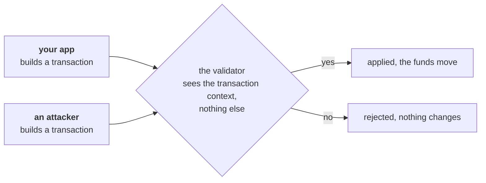
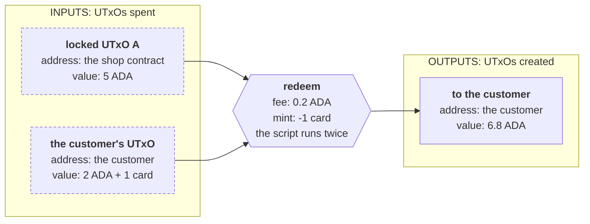
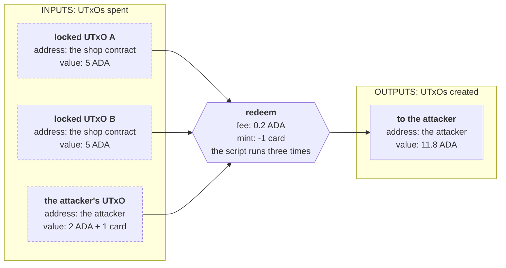
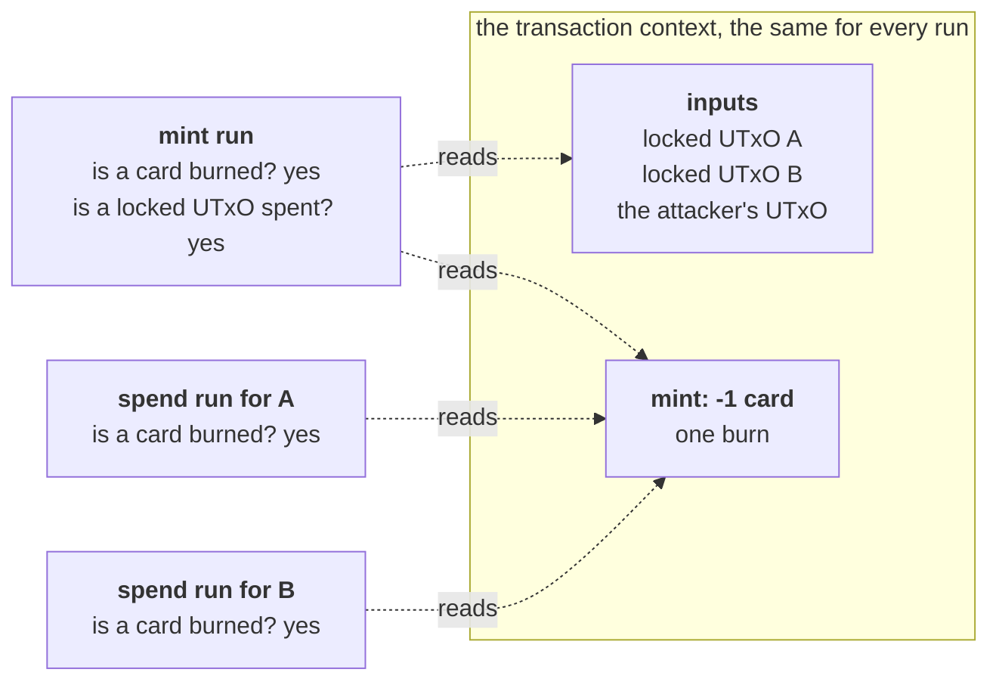
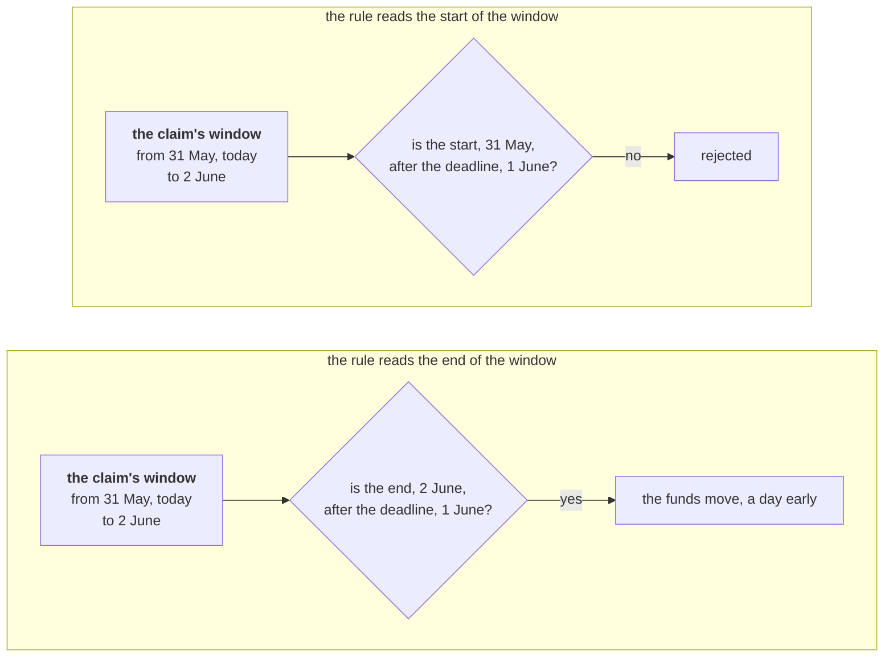
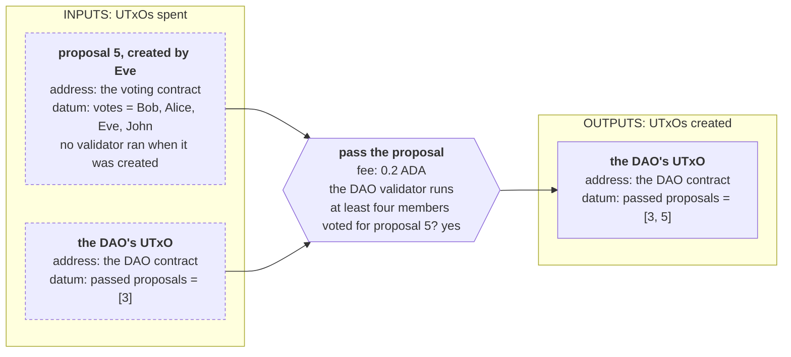
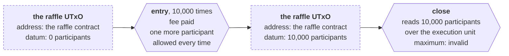
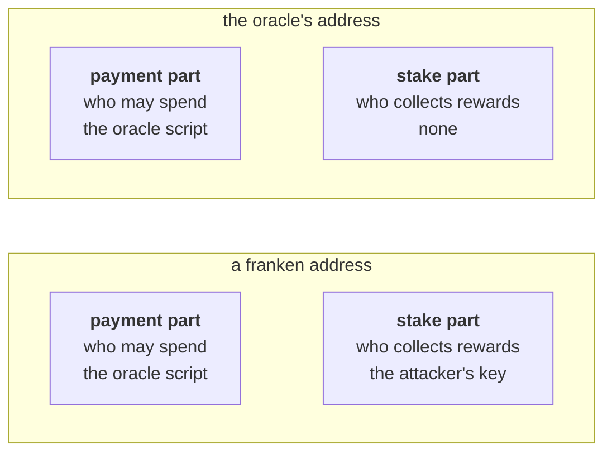
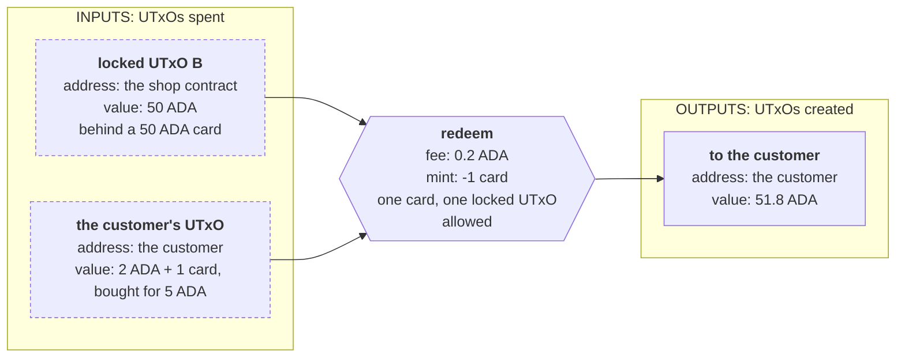

import Tabs from "@theme/Tabs";
import TabItem from "@theme/TabItem";
import CodeBlock from "@theme/CodeBlock";
import extractRegion from "@site/src/utils/extractRegion";
import ShopOpen from "!!raw-loader!@site/examples/onboarding/lectures/advanced/giftcard-shop/on-chain/aiken/validators/giftcard_shop_open.ak";
import ShopClosed from "!!raw-loader!@site/examples/onboarding/lectures/advanced/giftcard-shop/on-chain/aiken/validators/giftcard_shop.ak";
import ShopNamed from "!!raw-loader!@site/examples/onboarding/lectures/advanced/giftcard-shop/on-chain/aiken/validators/giftcard_shop_named.ak";

# Detecting vulnerabilities

Every contract you wrote in the Intermediate track answers one question: does this transaction follow my rules? An attacker asks a second one: what can I do with these rules that the author never intended?

A validator cannot tell an honest user from an attacker. Anyone in the world can build a transaction and send it to your contract.



Some attacks cannot happen on Cardano at all: a second contract cannot be called in the middle of running the first, a UTxO cannot be spent twice, etc. The handbook's **[security](/docs/developers/curriculum/smart-contracts/security)** page lists what the ledger protects you from. However, protocols can still be attacked in many ways.

## Think as an attacker

An attacker could try to do much more than just steal tokens. Here are the five most common. Ask each one about every contract you write.

1. **Steal tokens.** Take value that the rules meant for somebody else. The vault's funds are for the owner who signs. Can anybody else end up with them?
2. **Block others from getting their tokens.** The funds stay where they are, and the person they are for cannot take them. Your gift card refuses to let a card be burned on its own, because a burned card with the funds still locked leaves them locked forever.
3. **Halt the protocol.** No action is possible again, for anyone. A rule that can never be satisfied again is a halt. For example, the only available transaction has grown too big to run.
4. **Block people from using the protocol.** Some users cannot act, or cannot act now, while others can.
5. **Slow the protocol down.** Every action costs more, or fewer actions fit in a block.

Most of the time, an attacker will perform several of these actions to exploit the protocol itself or exploit another process that depends on the protocol functioning correctly.

**What an attacker can do.** Everything your own app does, with any transaction they like. They can run your validator offline first to see what it accepts, exactly as your SDK does before it sends anything. They can send any UTxO with any datum to your script's address, and [nothing checks it on the way in](/docs/developers/onboarding/lectures/intermediate/what-is-a-validator#locking-is-just-a-payment). They can send several transactions, one after another, each one built on what the last one left on the chain. They can read your contract. The compiled script is on the chain for anyone to take, and most projects publish the source as well.

**What an attacker cannot do.** Sign with a key they do not hold, or break or change the validator's logic.

The [first design question](/docs/developers/onboarding/lectures/intermediate/handling-time#from-idea-to-architecture) wrote down what the contract must guarantee, and the third wrote down what it checks. Those two lists are meant to be the same list. An attack is a transaction, or a sequence of them, that passes every check and still breaks a guarantee. For each action of the contract, take the five goals and look for the gap between the checks and the guarantee.

## Single-step attacks

A single-step attack fits in one transaction. That transaction is the whole attack, and the attacker builds it from what is already on the chain.

### Double satisfaction

Take the gift card from **[multi validators](/docs/developers/onboarding/lectures/intermediate/multi-validators)** and grow it into a shop. The shop signs to create as many cards as it likes, every card is backed by its own 5 ADA UTxO at the script's address, and burning a card releases the funds behind it. The rule guarding each locked UTxO is the one you already wrote: a card is being burned in this transaction.

The redeem the shop expected:



The customer spends two UTxOs: locked UTxO A, which holds the 5 ADA behind their card, and their own UTxO, which holds the card. The transaction burns the card, so the mint field is minus one. The script runs twice, because two things in this transaction depend on it: the burn, since the script is the card's minting policy, and the spending of locked UTxO A, since that UTxO sits at the script's address. The mint handler checks the burn. The spend handler asks its one question, whether a card is being burned in this transaction. Both say yes, and the customer receives the 5 ADA and their own 2 ADA back, minus the fee.

The rule also accepts a second redeem. The attacker bought one card, like the customer, and the shop's address holds many locked UTxOs, one behind every card the shop has sold:



The attacker also holds one card and burns it. The difference is in the inputs: locked UTxO B is there too, and it belongs to a card the attacker never bought. Nothing stops them from adding it, since a UTxO at a script address can be spent by anyone whose transaction the script accepts. The script now runs three times, once as the policy for the burn and once as the spend handler for each locked input:



Three runs, three questions, and one burn answers all of them. One card has released two UTxOs, and with twenty it is the same. One burn satisfies two spend rules, and that is the reason it is called double satisfaction.

The spend rule checks that a burn **exists** in the transaction, without checking that it belongs to **this** input. The fix is to say which one: count the locked inputs, or tie each burn to the UTxO it releases. The handbook's **[double satisfaction](/docs/developers/curriculum/smart-contracts/security/vulnerabilities/double-satisfaction)** page follows the same attack across two different scripts, a minting policy and a fee, and shows why each obvious fix is not enough.

### The wrong end of the window

A second single-step attack, this one on time. Your vesting contract keeps the deadline in the datum, and the claim declares a validity window with a start and an end. The ledger applies a transaction only while the current time is inside its window, so the validator can trust that the claim is happening somewhere between the two ends. The rule you wrote reads the start: if the window starts after the deadline, every moment inside it is after the deadline, including now.

A rule that reads the end instead proves nothing about now. The end can be after the deadline while the start is today. The beneficiary declares a window from today until the day after the deadline and sends the claim. The ledger accepts it, because today is inside the window. The validator sees an end after the deadline and says yes.



The node limits how far ahead the end of a window may be, about a day and a half at the time of writing, so this rule lets the beneficiary claim up to a day and a half early. The limit is a network parameter setting that can change, so a contract cannot count on it to keep the damage small. The handbook's **[lending example](/docs/developers/curriculum/smart-contracts/security/vulnerabilities/time-handling)** shows the same mistake from both sides. The borrower must write the loan's end date into the datum, and the contract computes it by adding the loan's duration to the end of the window. A borrower who moves that end later gets a longer loan. The lender may take the collateral only after the loan ends, and the contract checks that by reading the end of the window too. A lender who moves it past the loan's end date takes the collateral early.

## Multi-step attacks

A multi-step attack is a sequence of transactions. The validator accepts every one of them, and the damage only appears once the last one is applied. These are harder to find, because you have to imagine the sequence. They are harder to run, because every transaction before the last one costs a fee, and the attacker has to wait for each one to be applied. And every test you have written so far checks one transaction at a time, so none of them would have caught one.

### Trust no UTxO

Imagine a contract where the members of a group vote on proposals. A proposal is a UTxO at the voting contract's address, and its datum is the list of members who voted for it. Each vote is a transaction that spends the proposal and puts it back with one more member in the list, and the voting contract checks that this member signed the transaction. A second contract, the DAO, has one UTxO whose datum is the list of proposals that passed, and so far that list holds only proposal 3. The DAO adds a proposal when the proposal's UTxO is spent together with the DAO's own UTxO and the list in the datum holds at least four members.

Eve is a member who wants proposal 5 to pass, and nobody else does. She does not vote. Her first transaction sends a new UTxO to the voting contract's address, with a datum that already lists four members. Sending a UTxO to a script address is an ordinary payment, so no validator runs and nothing checks what the datum says. Her second transaction spends that UTxO together with the DAO's UTxO. The DAO validator counts the members in the list, finds four, and passes the proposal:



Your oracle has the same problem. Anyone can send a UTxO to the oracle's address with any rate in the datum, and a consumer that trusted the address alone would read that rate. It already has the answer: the consumer looks for the beacon token, the beacon can only be created once, and a UTxO without it is ignored. A token used this way is called a validity token. The full explanation of the vote, and how a validity token can be stolen when the contract has more than one action, is in the handbook's **[missing UTxO authentication](/docs/developers/curriculum/smart-contracts/security/vulnerabilities/missing-utxo-authentication)** page.

### Spam until it breaks

Imagine a raffle. The list of participants is kept in the datum of one UTxO at the raffle's address. An entry is a transaction that spends that UTxO and puts it back with one more participant in the list and the entry fee added to the value, and the validator checks exactly that. The rule does not limit how long the list may grow. At the end, one closing transaction reads the whole list to pick the winner. An attacker sends the entry transaction 10,000 times, each one spending the UTxO the previous one created:



Running a validator costs **[execution units](/docs/developers/curriculum/fundamentals/core-concepts/fees#script-execution-fees)**, the CPU and memory measure you met when the backend evaluated the unlock, and a protocol parameter sets a maximum per transaction. A transaction whose scripts need more than that maximum is invalid, whatever fee it offers. Reading 10,000 participants needs more, so nobody can close the raffle, and the fees are locked with it. The protocol has halted and every participant is blocked from their money, two of the five goals in one attack, and no single step broke a rule. The handbook lists this family under **[resource exhaustion](/docs/developers/curriculum/smart-contracts/security/vulnerabilities/resource-exhaustion)**: an unbounded datum, unbounded inputs and cheap spam are three ways to grow something until it no longer fits.

### Dust tokens

The same attack, with tokens. A treasury whose rule is "the value only grows" accepts anything, so an attacker sends thousands of worthless tokens, a few per transaction, until the withdrawal no longer fits in a transaction's limits. The handbook's **[token security](/docs/developers/curriculum/smart-contracts/security/vulnerabilities/token-security#value-size-and-execution-limits)** page has the treasury and the limits.

### Reward stealing

A Cardano address has two parts. The payment part says who may spend the UTxO, and a script address is one whose payment part is the script's hash. The stake part says who is paid the staking rewards for the ADA in the UTxO, and the ledger pays them once per epoch, about every five days. Any stake part can sit beside the script's payment part, and the result is still an address the script guards. So a contract that puts funds back at its own address on every update, as your oracle does, has to say what "its own address" means.



A rule that compares only the payment part accepts both, so an ordinary update can send the funds to the second one. It is called a franken address, because it is built from the parts of two other addresses. The funds are still locked by the same validator, every later update still works, and nobody notices. Every epoch, the attacker collects the rewards on money that was never theirs. Three steps: one transaction to move the funds, a wait, and a withdrawal. Your oracle compares the whole address of the continuing output, so it is safe from this. The full explanation is in the handbook's **[staking and certificates](/docs/developers/curriculum/smart-contracts/security/vulnerabilities/staking-and-certificates)** page.

### A handler that says yes to everything

Every contract you wrote ends with a handler that refuses any purpose it was not written for. Imagine a protocol whose fallback handler says yes instead. Its checks live under the withdraw purpose from **[validator purposes](/docs/developers/onboarding/lectures/intermediate/validator-purposes)**, so that is the only handler written, and the fallback approves everything else. Everything else includes certificates. A certificate is a request to the ledger about staking: one kind registers a stake credential and pays a deposit of 2 ADA, another deregisters it and refunds the deposit to whoever sent the transaction. The script runs for those too, and its fallback says yes. Anyone can deregister the protocol's credential. The protocol stops until somebody registers it again and pays the deposit, and the attacker keeps the refund each time: cheap, repeatable, and a small profit per round. The full explanation, and the mirror attack that registers and delegates the credential instead, is in the handbook's **[unconstrained certificate operations](/docs/developers/curriculum/smart-contracts/security/vulnerabilities/staking-and-certificates#unconstrained-certificate-operations)** section.

### One UTxO everybody needs

An exchange that keeps its whole pool of tokens in one UTxO: every swap spends it, a UTxO can be spent once, so one swap per block is applied and every other one fails and has to be rebuilt. An attacker does not need to win. Sending many cheap transactions at that one UTxO keeps everybody else out. Your oracle avoids this: the consumer in **[reference inputs and scripts](/docs/developers/onboarding/lectures/intermediate/reference-inputs-and-scripts)** reads it through a reference input, so any number of transactions can read it in the same block. This is **[UTxO contention](/docs/developers/curriculum/smart-contracts/security/vulnerabilities/resource-exhaustion#utxo-contention)**.

The tests you wrote in **[testing](/docs/developers/onboarding/lectures/intermediate/testing)** build one transaction and ask one validator about it. They catch a single-step attack the moment you write it down as a test. They cannot catch a sequence unless you write the sequence first: the steps, who sends each one, and what the chain looks like after the last. Do that on paper, for each of the five goals, before you decide a contract is finished.

## Try it

<Tabs groupId="onchain">
<TabItem value="aiken" label="Aiken" default>

### Write the shop

The shop is the gift card from **[multi validators](/docs/developers/onboarding/lectures/intermediate/multi-validators)** with one difference: it issues many cards. Start a new Aiken project for it:

```bash
aiken new my-name/giftcard-shop
cd giftcard-shop
rm validators/placeholder.ak
```

Create `validators/giftcard_shop.ak`. The imports first:

<CodeBlock language="aiken" title="validators/giftcard_shop.ak">
  {extractRegion(ShopOpen, "shop-imports")}
</CodeBlock>

Then the token name, the two actions, and the two handlers:

<CodeBlock language="aiken" title="validators/giftcard_shop.ak">
  {extractRegion(ShopOpen, "shop")}
</CodeBlock>

Three things differ from the gift card:

- **The parameter is the shop's key hash.** In the Intermediate gift card, the seed UTxO was the parameter: it can be spent once, so the policy could mint once, and that made the one card unique. A shop issues many cards, so its policy is tied to the shop's key instead, and the import list gains `VerificationKeyHash`.
- **`Create` asks for the shop's signature** and allows any positive quantity, so the shop can issue several cards in one transaction. The cards are not NFTs: every one of them is the same policy and the same name, GIFT, minted many times over. For every card it sells, the shop locks one 5 ADA UTxO at the script's address.
- **`Burn` allows any negative quantity**, and asks that at least one input sits at the script's address. A card is only destroyed when the funds behind it are released.

The spend handler is the gift card's, unchanged: the locked UTxO may be spent when this transaction burns one card.

Then the tests. The constants are the gift card's with one change: the shop's key replaces the seed.

<CodeBlock language="aiken" title="validators/giftcard_shop.ak">
  {extractRegion(ShopOpen, "shop-tests")}
</CodeBlock>

```bash
aiken check
```

Five tests, five passes.

### Attack it

Take the shop's actions and go through the five goals. Create is guarded by the shop's signature, and nobody else holds that key. Burn asks for a card and for a locked UTxO. Redeem, the spend handler, asks for a burn. Stop at the first goal, stealing, and ask the attacker's question about the redeem rule: what else fits "a card is being burned"? A transaction that spends two locked UTxOs fits it. Write that transaction as a test, below the others. It needs a second locked UTxO, `locked_b`, so that constant comes with it:

<CodeBlock language="aiken" title="validators/giftcard_shop.ak">
  {extractRegion(ShopOpen, "attack-test")}
</CodeBlock>

The test calls every handler the transaction would run: the policy once, for the burn, and the spend handler once for each locked input. Run `aiken check` again. Six passes. A passing test is the proof that the attack works.

### Close the door

The rule has to say how many cards, and the number is the number of locked UTxOs this transaction spends. Replace the spend handler:

<CodeBlock language="aiken" title="validators/giftcard_shop.ak">
  {extractRegion(ShopClosed, "spend-closed")}
</CodeBlock>

`list.count` goes through the inputs and counts the ones at this script's address. Then mark the attack test `fail`, and add the honest transaction beside it, two cards for two UTxOs:

<CodeBlock language="aiken" title="validators/giftcard_shop.ak">
  {extractRegion(ShopClosed, "attack-test-closed")}
</CodeBlock>

Run `aiken check` once more. Seven passes: the attack is refused and the honest transaction goes through. The open rule would have refused that honest transaction, because it asked for exactly one burned card and the mint field says minus two.

### A card releases any UTxO

Say the shop starts selling two kinds of card, one for 5 ADA and one for 50 ADA, each with its own locked UTxO. Both are the same GIFT token. The closed rule releases one locked UTxO for one burned card, and never says which one. A customer who bought a 5 ADA card burns it while spending the UTxO behind a 50 ADA card:



Write it as a test, below the others. The locked UTxO holds 50 ADA this time, so the test builds the input in place:

<CodeBlock language="aiken" title="validators/giftcard_shop.ak">
  {extractRegion(ShopClosed, "attack-any-utxo")}
</CodeBlock>

Run `aiken check`. Eight passes.

### Close it too

A card has to name the UTxO it releases. In the Intermediate gift card the seed UTxO was the parameter, so every card had its own policy ID and the name GIFT could be shared. The shop's parameter is the shop's key, so all of its cards share one policy ID, and with one name they are interchangeable. The only part of a token's identity left is the asset name, so each card gets its own.

The rule in words: when the shop creates a card, it gives the card a name and locks the UTxO with that name in the datum. When a locked UTxO is spent, the spend handler reads the name in its own datum and asks whether a card with that name is burned in this transaction. The 5 ADA customer's card is named card-1, the 50 ADA UTxO's datum says card-2, and no burn of card-1 satisfies a UTxO that asks for card-2.

Three blocks change, the imports, the contract and the tests, and the file does not compile until all three are in, because the old tests still use `NoDatum` and the GIFT constant. The imports first, since the spend handler now reads inline datums:

<CodeBlock language="aiken" title="validators/giftcard_shop.ak">
  {extractRegion(ShopNamed, "named-imports")}
</CodeBlock>

Replace the types and the handlers:

<CodeBlock language="aiken" title="validators/giftcard_shop.ak">
  {extractRegion(ShopNamed, "named")}
</CodeBlock>

- `CardDatum` is the datum of a locked UTxO, and it holds one thing: the name of the card that releases it.
- The mint handler no longer expects a single name. `Create` lets the shop mint any names it likes, each with a positive quantity, and `Burn` requires every quantity to be negative. The cards are still not NFTs: nothing stops the shop minting a name with quantity two, or minting it again next week.
- The spend handler reads its datum for the first time, and the datums of the other inputs too. `assets.quantity_of` is how many cards with this name the transaction burns, and `locks_card` picks out the inputs at this address whose datum names the same card. The count stays, per name: as many burned cards with this name as locked UTxOs named for it.

Then replace everything from the constants to the end of the file with the new tests. The datum is now part of every locked input, so the helper takes the card's name and the amount, and every spend call passes the datum. Both attacks are marked `fail`, and one more test checks that the count still holds per name:

<CodeBlock language="aiken" title="validators/giftcard_shop.ak">
  {extractRegion(ShopNamed, "named-tests")}
</CodeBlock>

Run `aiken check`. Eight passes: the two attacks are refused, and two cards still release their two UTxOs at once.

### The other four goals

No code for this part. For the vault, the vesting contract, the oracle and the shop, take each action and each remaining goal, and write down one sequence of transactions you cannot rule out. Then open the contract and check. Two to start with:

- **Can a stranger stop the vesting beneficiary from ever claiming?** The claim needs the beneficiary's signature and a window after the date. Neither depends on anything a stranger can change, so a stranger cannot.
- **Can the shop take the funds behind a customer's card?** Yes, in two steps. The shop signs to create a second card with the same name as a customer's card, then burns it while spending that customer's locked UTxO. The count per name is satisfied, one card of that name for one UTxO of that name. The guarantee the shop breaks is one the checks never wrote down: every card name is created once. The check belongs in the `Create` branch: a name may only be created together with the UTxO it locks, and it has to be a name the shop cannot repeat, such as the hash of an input spent in the same transaction. Write it if you like, with the test that proves it, and then ask what the shop can do next.

Stuck? All three versions of the shop are in the example project. See the **[introduction](/docs/developers/onboarding/lectures/advanced/introduction#the-example-project)**.

</TabItem>
<TabItem value="scalus" label="Scalus">

A [Scalus](https://scalus.org/) version is coming soon. The idea is identical, only the language differs.

</TabItem>
</Tabs>

## Go deeper

- [Vulnerability reference](/docs/developers/curriculum/smart-contracts/security/vulnerabilities/overview): every vulnerability the handbook covers, each with the property a safe contract keeps and the test that shows it broken.
- [Double satisfaction](/docs/developers/curriculum/smart-contracts/security/vulnerabilities/double-satisfaction): the attack above across two scripts, a minting policy and a fee, and the fixes that are not enough.
- [Time handling](/docs/developers/curriculum/smart-contracts/security/vulnerabilities/time-handling): the validity window, and which end of it to read.
- [Missing UTxO authentication](/docs/developers/curriculum/smart-contracts/security/vulnerabilities/missing-utxo-authentication): validity tokens, and how they get stolen.
- [Resource exhaustion](/docs/developers/curriculum/smart-contracts/security/vulnerabilities/resource-exhaustion): unbounded value, datum and inputs, cheap spam, and UTxO contention.
- [Token security](/docs/developers/curriculum/smart-contracts/security/vulnerabilities/token-security): value size limits, dust tokens, and validation tokens.
- [Staking and certificates](/docs/developers/curriculum/smart-contracts/security/vulnerabilities/staking-and-certificates): the stake part of an address, and the certificates that register it.
- [Cardano CTF](/docs/developers/curriculum/smart-contracts/security/ctf): deliberately vulnerable contracts to attack, with a guided series to start on.

The handbook's **[security](/docs/developers/curriculum/smart-contracts/security#common-security-patterns)** page continues with the patterns that close these doors and with how to prepare a contract for an audit.
