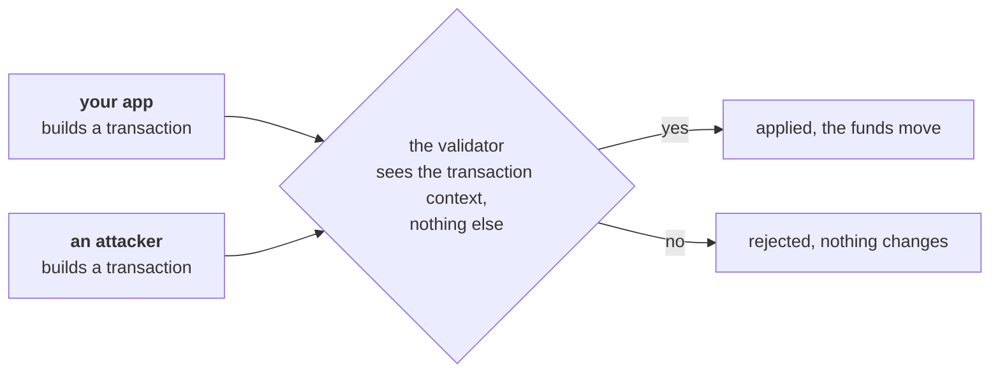
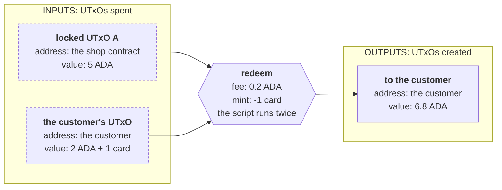
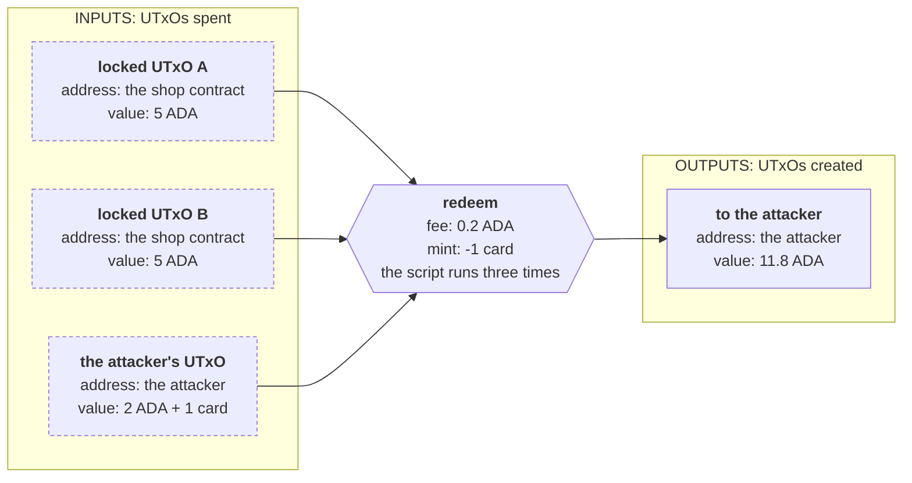
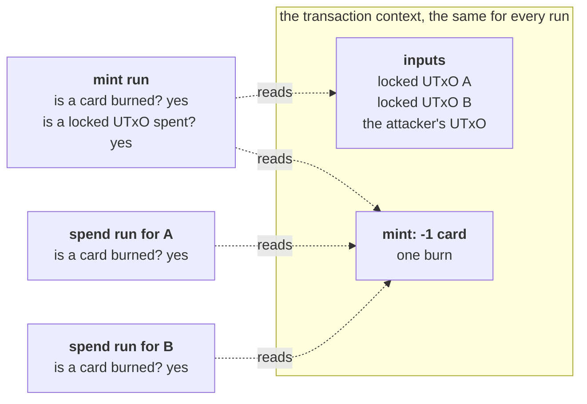
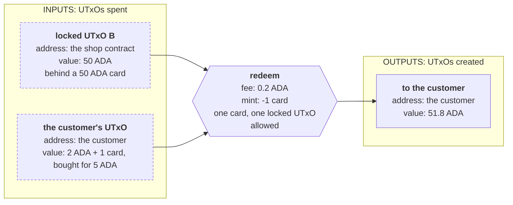
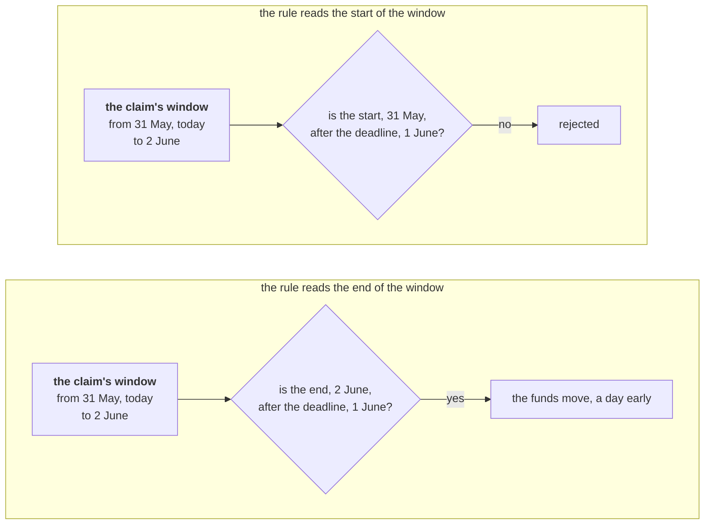
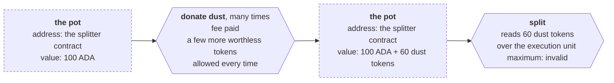
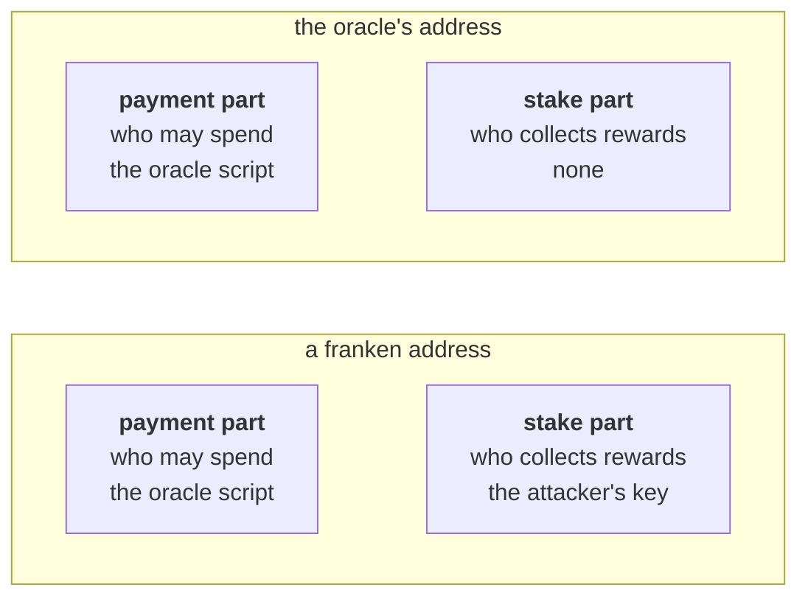

import Tabs from "@theme/Tabs";
import TabItem from "@theme/TabItem";
import CodeBlock from "@theme/CodeBlock";
import extractRegion from "@site/src/utils/extractRegion";
import ShopOpen from "!!raw-loader!@site/examples/onboarding/lectures/advanced/giftcard-shop/on-chain/aiken/validators/giftcard_shop_open.ak";
import ShopClosed from "!!raw-loader!@site/examples/onboarding/lectures/advanced/giftcard-shop/on-chain/aiken/validators/giftcard_shop.ak";
import ShopNamed from "!!raw-loader!@site/examples/onboarding/lectures/advanced/giftcard-shop/on-chain/aiken/validators/giftcard_shop_named.ak";
import SplitterOpen from "!!raw-loader!@site/examples/onboarding/lectures/advanced/splitter/on-chain/aiken/validators/splitter_open.ak";
import SplitterClosed from "!!raw-loader!@site/examples/onboarding/lectures/advanced/splitter/on-chain/aiken/validators/splitter.ak";
import VaultOpen from "!!raw-loader!@site/examples/onboarding/lectures/advanced/vault/on-chain/aiken/validators/vault_open.ak";
import VaultClosed from "!!raw-loader!@site/examples/onboarding/lectures/advanced/vault/on-chain/aiken/validators/vault.ak";

# Detecting vulnerabilities

Every contract you wrote in the Intermediate track answers one question: does this transaction follow my rules? An attacker asks a second one: what can I do with these rules that the author never intended?

A validator cannot tell an honest user from an attacker. Anyone in the world can build a transaction and send it to your contract.


```mermaid
flowchart LR
    A["`**your app**
    builds a transaction`"] --> V{"the validator<br/>sees the transaction context,<br/>nothing else"}
    E["`**an attacker**
    builds a transaction`"] --> V
    V -->|yes| OK["applied, the funds move"]
    V -->|no| NO["rejected, nothing changes"]
```

Some attacks cannot happen on Cardano at all: a second contract cannot be called in the middle of running the first, a UTxO cannot be spent twice, etc. The handbook's **[security](/docs/developers/curriculum/smart-contracts/security)** page lists what the ledger protects you from. However, protocols can still be attacked in many ways.

## Think as an attacker

An attacker could try to do much more than just steal tokens. Here are the five most common. Ask each one about every contract you write.

1. **Steal tokens.** Take value that the rules meant for somebody else. The vault's funds are for the owner who signs. Can anybody else end up with them?
2. **Block others from getting their tokens.** The funds stay where they are, and the person they are for cannot take them. Your gift card refuses to let a card be burned on its own, because a burned card with the funds still locked leaves them locked forever.
3. **Halt the protocol.** No action is possible again, for anyone. A rule that can never be satisfied again is a halt. For example, the only available transaction has grown too big to run.
4. **Block people from using the protocol.** Some users cannot act, or cannot act now, while others can.
5. **Slow the protocol down.** Every action costs more, or fewer actions fit in a block.

Most of the time, an attacker will perform several of these actions to exploit the protocol itself or exploit another process that depends on the protocol functioning correctly.

**What an attacker can do.** Everything your own app does, with any transaction they like. They can run your validator offline first to see what it accepts, exactly as your SDK does before it sends anything. They can send any UTxO with any datum to your script's address, and [nothing checks it on the way in](/docs/developers/onboarding/lectures/intermediate/what-is-a-validator#locking-is-just-a-payment). They can send several transactions, one after another, each one built on what the last one left on the chain. They can read your contract. The compiled script is on the chain for anyone to take, and most projects publish the source as well.

**What an attacker cannot do.** Sign with a key they do not hold, or break or change the validator's logic.

The [first design question](/docs/developers/onboarding/lectures/intermediate/handling-time#from-idea-to-architecture) wrote down what the contract must guarantee, and the third wrote down what it checks. Those two lists are meant to be the same list. An attack is a transaction, or a sequence of them, that passes every check and still breaks a guarantee. For each action of the contract, take the five goals and look for the gap between the checks and the guarantee.

## Single-step attacks

A single-step attack fits in one transaction. That transaction is the whole attack, and the attacker builds it from what is already on the chain.

### Double satisfaction

Take the gift card from **[multi validators](/docs/developers/onboarding/lectures/intermediate/multi-validators)** and grow it into a shop. The gift card's parameter was a seed UTxO. A UTxO can be spent only once, so the policy could mint only once, and the one card it made was an NFT. A shop issues many cards, so its parameter is the shop's key instead, and the shop signs to create as many cards as it likes. Every card has the same policy ID and the same name, GIFT. The cards are fungible tokens: they are all identical, and the ledger cannot tell one from another. Every card is backed by its own 5 ADA UTxO at the script's address, and burning a card releases the funds behind it. The rule guarding each locked UTxO is the one you already wrote: a card is being burned in this transaction.

The redeem the shop expected:


```mermaid
flowchart LR
    subgraph IN["INPUTS: UTxOs spent"]
        I1["`**locked UTxO A**
        address: the shop contract
        value: 5 ADA`"]
        I2["`**the customer's UTxO**
        address: the customer
        value: 2 ADA + 1 card`"]
    end

    TX{{"`**redeem**
    fee: 0.2 ADA
    mint: -1 card
    the script runs twice`"}}

    subgraph OUT["OUTPUTS: UTxOs created"]
        O["`**to the customer**
        address: the customer
        value: 6.8 ADA`"]
    end

    I1 --> TX --> O
    I2 --> TX

    style I1 stroke-dasharray:4 3
    style I2 stroke-dasharray:4 3
```

The customer spends two UTxOs: locked UTxO A, which holds the 5 ADA behind their card, and their own UTxO, which holds the card. The transaction burns the card, so the mint field is minus one. The script runs twice, because two things in this transaction depend on it: the burn, since the script is the card's minting policy, and the spending of locked UTxO A, since that UTxO sits at the script's address. The mint handler checks the burn. The spend handler asks its one question, whether a card is being burned in this transaction. Both say yes, and the customer receives the 5 ADA and their own 2 ADA back, minus the fee.

The rule also accepts a second redeem. The attacker bought one card, like the customer, and the shop's address holds many locked UTxOs, one behind every card the shop has sold:


```mermaid
flowchart LR
    subgraph IN["INPUTS: UTxOs spent"]
        I1["`**locked UTxO A**
        address: the shop contract
        value: 5 ADA`"]
        I2["`**locked UTxO B**
        address: the shop contract
        value: 5 ADA`"]
        I3["`**the attacker's UTxO**
        address: the attacker
        value: 2 ADA + 1 card`"]
    end

    TX{{"`**redeem**
    fee: 0.2 ADA
    mint: -1 card
    the script runs three times`"}}

    subgraph OUT["OUTPUTS: UTxOs created"]
        O["`**to the attacker**
        address: the attacker
        value: 11.8 ADA`"]
    end

    I1 --> TX --> O
    I2 --> TX
    I3 --> TX

    style I1 stroke-dasharray:4 3
    style I2 stroke-dasharray:4 3
    style I3 stroke-dasharray:4 3
```

The attacker also holds one card and burns it. The difference is in the inputs: locked UTxO B is there too, and it belongs to a card the attacker never bought. Nothing stops them from adding it, since a UTxO at a script address can be spent by anyone whose transaction the script accepts. The script now runs three times, once as the policy for the burn and once as the spend handler for each locked input:


```mermaid
flowchart LR
    R1["`**mint run**
    is a card burned? yes
    is a locked UTxO spent? yes`"]
    R2["`**spend run for A**
    is a card burned? yes`"]
    R3["`**spend run for B**
    is a card burned? yes`"]

    subgraph CTX["the transaction context, the same for every run"]
        INS["`**inputs**
        locked UTxO A
        locked UTxO B
        the attacker's UTxO`"]
        M["`**mint: -1 card**
        one burn`"]
    end

    R1 -.->|reads| INS
    R1 -.->|reads| M
    R2 -.->|reads| M
    R3 -.->|reads| M
```

Three runs, three questions, and one burn answers all of them. One card has released two UTxOs, and with twenty it is the same. One burn satisfies two spend rules, and that is the reason it is called double satisfaction.

The spend rule checks that a burn **exists** in the transaction, without checking that it belongs to **this** input. The first fix is to count: as many burned cards as locked UTxOs spent.

Counting is not enough once the shop sells two kinds of card, one for 5 ADA and one for 50 ADA, each with its own locked UTxO. Both kinds are the same GIFT token. A customer who bought a 5 ADA card burns it while spending the UTxO behind a 50 ADA card:


```mermaid
flowchart LR
    subgraph IN["INPUTS: UTxOs spent"]
        I1["`**locked UTxO B**
        address: the shop contract
        value: 50 ADA
        behind a 50 ADA card`"]
        I2["`**the customer's UTxO**
        address: the customer
        value: 2 ADA + 1 card, bought for 5 ADA`"]
    end

    TX{{"`**redeem**
    fee: 0.2 ADA
    mint: -1 card
    one card, one locked UTxO
    allowed`"}}

    subgraph OUT["OUTPUTS: UTxOs created"]
        O["`**to the customer**
        address: the customer
        value: 51.8 ADA`"]
    end

    I1 --> TX --> O
    I2 --> TX

    style I1 stroke-dasharray:4 3
    style I2 stroke-dasharray:4 3
```

One card for one UTxO, so the count is satisfied. The card cannot say which UTxO it was sold with. Its policy ID is the same for every card, because the shop's key is the parameter, and so is its name. The asset name is the only part of a token's identity left to change, so the second fix gives each card its own name, and the locked UTxO carries that name in its datum. The 5 ADA customer's card is named card-1, the 50 ADA UTxO's datum says card-2, and no burn of card-1 satisfies a UTxO that asks for card-2.

The handbook's **[double satisfaction](/docs/developers/curriculum/smart-contracts/security/vulnerabilities/double-satisfaction)** page follows the same attack across two different scripts, a minting policy and a fee, and shows why each obvious fix is not enough.

### The wrong end of the window

A second single-step attack, this one on time. Your vesting contract keeps the deadline in the datum, and the claim declares a validity window with a start and an end. The ledger applies a transaction only while the current time is inside its window, so the validator can trust that the claim is happening somewhere between the two ends. The rule you wrote reads the start: if the window starts after the deadline, every moment inside it is after the deadline, including now.

A rule that reads the end instead proves nothing about now. The end can be after the deadline while the start is today. The beneficiary declares a window from today until the day after the deadline and sends the claim. The ledger accepts it, because today is inside the window. The validator sees an end after the deadline and says yes.


```mermaid
flowchart TB
    subgraph A["the rule reads the start of the window"]
        direction LR
        W1["`**the claim's window**
        from 31 May, today
        to 2 June`"] --> R1{"is the start, 31 May,<br/>after the deadline, 1 June?"} -->|no| N1["rejected"]
    end
    subgraph B["the rule reads the end of the window"]
        direction LR
        W2["`**the claim's window**
        from 31 May, today
        to 2 June`"] --> R2{"is the end, 2 June,<br/>after the deadline, 1 June?"} -->|yes| N2["the funds move, a day early"]
    end
    A ~~~ B
```

The node limits how far ahead the end of a window may be, about a day and a half at the time of writing, so this rule lets the beneficiary claim up to a day and a half early. The limit is a network parameter setting that can change, so a contract cannot count on it to keep the damage small. The handbook's **[time handling](/docs/developers/curriculum/smart-contracts/security/vulnerabilities/time-handling)** page shows the same mistake in a lending contract, where the borrower and the lender can each move the window to their own advantage.

## Multi-step attacks

A multi-step attack is a sequence of transactions. The validator accepts every one of them, and the damage only appears once the last one is applied. These are harder to find, because you have to imagine the sequence. They are harder to run, because every transaction before the last one costs a fee, and the attacker has to wait for each one to be applied.

### Resource limit

Take a shared pot, the splitter. The pot is one UTxO at the splitter's address. Anyone may donate to it, and the rule for a donation is that the pot comes back holding at least as much of every asset as before. Anyone may also split it: every benefactor named in the contract receives an equal share of everything in the pot. To compute that share, the validator reads every asset the pot holds.

The donation rule accepts any token. An attacker mints worthless tokens under their own policy, called dust, and donates a few of them in each transaction. Every donation is allowed, and every one makes the next split more expensive:


```mermaid
flowchart LR
    U0["`**the pot**
    address: the splitter contract
    value: 100 ADA`"]
    E{{"`**donate dust**, many times
    fee paid
    a few more worthless tokens
    allowed every time`"}}
    UN["`**the pot**
    address: the splitter contract
    value: 100 ADA + 60 dust tokens`"]
    C{{"`**split**
    reads 60 dust tokens
    over the execution unit maximum: invalid`"}}

    U0 --> E --> UN --> C

    style U0 stroke-dasharray:4 3
    style UN stroke-dasharray:4 3
```

A transaction may only use so much memory and CPU to run its scripts, and one that needs more is invalid, whatever fee it offers. **[Optimization](/docs/developers/onboarding/lectures/advanced/optimization#three-limits-on-a-transaction)** has the limits. Reading 60 dust tokens needs more, so nobody can split the pot, and the ADA is locked in it. The protocol has halted and every benefactor is blocked from their money, two of the five goals in one attack, and no single step broke a rule.

A list in a datum grows in the same way, one entry per transaction, until the transaction that reads it no longer fits. The handbook lists this family under **[resource exhaustion](/docs/developers/curriculum/smart-contracts/security/vulnerabilities/resource-exhaustion)**: an unbounded datum, unbounded inputs and cheap spam are three ways to grow something until it no longer fits. Its **[token security](/docs/developers/curriculum/smart-contracts/security/vulnerabilities/token-security#value-size-and-execution-limits)** page has the limits on the size of a value.

### Reward stealing

A Cardano address has two parts. The payment part says who may spend the UTxO, and a script address is one whose payment part is the script's hash. The stake part says who is paid the staking rewards for the ADA in the UTxO, and the ledger pays them once per epoch, about every five days. Any stake part can sit beside the script's payment part, and the result is still an address the script guards. So a contract that puts funds back at its own address on every update, as your oracle does, has to say what "its own address" means.


```mermaid
flowchart TB
    subgraph A1["the oracle's address"]
        direction LR
        P1["`**payment part**
        who may spend
        the oracle script`"] ~~~ S1["`**stake part**
        who collects rewards
        none`"]
    end
    subgraph A2["a franken address"]
        direction LR
        P2["`**payment part**
        who may spend
        the oracle script`"] ~~~ S2["`**stake part**
        who collects rewards
        the attacker's key`"]
    end
    A1 ~~~ A2
```

A rule that compares only the payment part accepts both, so an ordinary update can send the funds to the second one. It is called a franken address, because it is built from the parts of two other addresses. The funds are still locked by the same validator, every later update still works, and nobody notices. Every epoch, the attacker collects the rewards on money that was never theirs. Three steps: one transaction to move the funds, a wait, and a withdrawal. Your oracle compares the whole address of the continuing output, so it is safe from this. The full explanation is in the handbook's **[staking and certificates](/docs/developers/curriculum/smart-contracts/security/vulnerabilities/staking-and-certificates)** page.

The tests you wrote in **[testing](/docs/developers/onboarding/lectures/intermediate/testing)** build one transaction and ask one validator about it. They catch a single-step attack the moment you write it down as a test. A sequence needs one more thing written down first: the state of the chain after the last step, so a test can build the next transaction on top of it. Do that on paper, for each of the five goals, before you decide a contract is finished.

## Try it

<Tabs groupId="onchain">
<TabItem value="aiken" label="Aiken" default>

In each exercise you write a contract, write the attack as a test that passes, and then close the door so the same test fails.

### One card, two UTxOs

#### Write the shop

The shop from **[double satisfaction](#double-satisfaction)**, as first written. Start a new Aiken project for it:

```bash
aiken new my-name/giftcard-shop
cd giftcard-shop
rm validators/placeholder.ak
```

Create `validators/giftcard_shop.ak`. The imports first:

<CodeBlock language="aiken" title="validators/giftcard_shop.ak">
  {extractRegion(ShopOpen, "shop-imports")}
</CodeBlock>

Then the token name, the two actions, and the two handlers:

<CodeBlock language="aiken" title="validators/giftcard_shop.ak">
  {extractRegion(ShopOpen, "shop")}
</CodeBlock>

The mint handler differs from the gift card's in two places. `Create` asks for the shop's signature and allows any positive quantity, so the shop can issue several cards in one transaction. `Burn` allows any negative quantity, and asks that at least one input sits at the script's address, so a card is only destroyed when the funds behind it are released. The spend handler is the gift card's, unchanged.

Then the tests. The constants are the gift card's with one change: the shop's key replaces the seed.

<CodeBlock language="aiken" title="validators/giftcard_shop.ak">
  {extractRegion(ShopOpen, "shop-tests")}
</CodeBlock>

```bash
aiken check
```

Five tests, five passes.

#### Attack the shop

Take the shop's actions and go through the five goals, starting with stealing. Create is guarded by the shop's signature, and nobody else holds that key. Burn asks for a card and for a locked UTxO. Redeem, the spend handler, asks for a burn. What else fits "a card is being burned"? A transaction that spends two locked UTxOs fits it. Write that transaction as a test, below the others. It needs a second locked UTxO, `locked_b`, so that constant comes with it:

<CodeBlock language="aiken" title="validators/giftcard_shop.ak">
  {extractRegion(ShopOpen, "attack-test")}
</CodeBlock>

The test calls every handler the transaction would run: the policy once, for the burn, and the spend handler once for each locked input. Run `aiken check` again. Six passes, and a passing test proves the attack works.

#### Count the cards

The rule has to say how many cards, and the number is the number of locked UTxOs this transaction spends. Replace the spend handler:

<CodeBlock language="aiken" title="validators/giftcard_shop.ak">
  {extractRegion(ShopClosed, "spend-closed")}
</CodeBlock>

`list.count` goes through the inputs and counts the ones at this script's address. Every spend run does that count again, so a transaction that redeems twenty cards walks its inputs twenty times. **[Optimization](/docs/developers/onboarding/lectures/advanced/optimization)** makes rules of this shape cheaper. Then mark the attack test `fail`, and add the honest transaction beside it, two cards for two UTxOs:

<CodeBlock language="aiken" title="validators/giftcard_shop.ak">
  {extractRegion(ShopClosed, "attack-test-closed")}
</CodeBlock>

Run `aiken check` once more. Seven passes: the attack is refused and the honest transaction goes through. The open rule would have refused that honest transaction, because it asked for exactly one burned card and the mint field says minus two.

### A card releases any UTxO

#### Attack the count

The 5 ADA card that releases a 50 ADA UTxO, from **[double satisfaction](#double-satisfaction)**. Write it as a test, below the others. The locked UTxO holds 50 ADA this time, so the test builds the input in place:

<CodeBlock language="aiken" title="validators/giftcard_shop.ak">
  {extractRegion(ShopClosed, "attack-any-utxo")}
</CodeBlock>

Run `aiken check`. Eight passes.

#### Name the cards

When the shop creates a card, it gives the card a name and locks the UTxO with that name in the datum. When a locked UTxO is spent, the spend handler reads the name in its own datum and asks whether a card with that name is burned in this transaction.

Three blocks change, the imports, the contract and the tests, and the file does not compile until all three are in, because the old tests still use `NoDatum` and the GIFT constant. The imports first, since the spend handler now reads inline datums:

<CodeBlock language="aiken" title="validators/giftcard_shop.ak">
  {extractRegion(ShopNamed, "named-imports")}
</CodeBlock>

Replace the types and the handlers:

<CodeBlock language="aiken" title="validators/giftcard_shop.ak">
  {extractRegion(ShopNamed, "named")}
</CodeBlock>

- `CardDatum` is the datum of a locked UTxO, and it holds one thing: the name of the card that releases it.
- The mint handler no longer expects a single name. `Create` lets the shop mint any names it likes, each with a positive quantity, and `Burn` requires every quantity to be negative.
- The spend handler reads its datum for the first time, and the datums of the other inputs too. `assets.quantity_of` is how many cards with this name the transaction burns, and `locks_card` picks out the inputs at this address whose datum names the same card. The count stays, per name: as many burned cards with this name as locked UTxOs named for it.

Then replace everything from the constants to the end of the file with the new tests. The datum is now part of every locked input, so the helper takes the card's name and the amount, and every spend call passes the datum. Both attacks are marked `fail`, and one more test checks that the count still holds per name:

<CodeBlock language="aiken" title="validators/giftcard_shop.ak">
  {extractRegion(ShopNamed, "named-tests")}
</CodeBlock>

Run `aiken check`. Eight passes: the two attacks are refused, and two cards still release their two UTxOs at once.

### Dust in the splitter

#### Write the splitter

The splitter from **[resource limit](#resource-limit)**, as first written. The benefactors are the contract's parameter. The pot is the one UTxO at the script's address that holds a beacon NFT, so a UTxO somebody else sends to the address is ignored, as in your oracle. Start a new project:

```bash
aiken new my-name/splitter
cd splitter
rm validators/placeholder.ak
```

Create `validators/splitter.ak`. The imports first:

<CodeBlock language="aiken" title="validators/splitter.ak">
  {extractRegion(SplitterOpen, "splitter-imports", "attack-import")}
</CodeBlock>

Then the types, a helper and the handler:

<CodeBlock language="aiken" title="validators/splitter.ak">
  {extractRegion(SplitterOpen, "splitter")}
</CodeBlock>

- `value_geq` is true when the first value holds at least as much of every asset as the second, ADA included.
- `Donate` asks that the pot comes back at the same address, with the beacon, holding at least as much of every asset as before.
- `Split` divides every asset except the beacon by the number of benefactors, and asks that each benefactor receives an output holding at least that share. What does not divide evenly stays in the pot.

Then the tests:

<CodeBlock language="aiken" title="validators/splitter.ak">
  {extractRegion(SplitterOpen, "splitter-tests")}
</CodeBlock>

Run `aiken check`. Four passes.

#### Donate dust

Write the attack from **[resource limit](#resource-limit)** as tests. The test helper names each dust token with a number, so add one line to the imports, below `use aiken/collection/list`:

<CodeBlock language="aiken" title="validators/splitter.ak">
  {extractRegion(SplitterOpen, "attack-import")}
</CodeBlock>

Then two tests, below the others. The first is one step of the sequence, a donation of five dust tokens. The second is the pot the sequence leaves behind, holding 60 of them, and the split that has to read them all:

<CodeBlock language="aiken" title="validators/splitter.ak">
  {extractRegion(SplitterOpen, "attack-dust")}
</CodeBlock>

Run `aiken check`. Six passes. The line for the last test shows what the split costs, `mem: 21.62 M, cpu: 6.30 B` with the compiler and stdlib this lecture uses. A transaction may use at most 16,500,000 memory units and 10,000,000,000 CPU units at the time of writing, so the memory is over the maximum, and no split can ever be built. At 50 dust tokens the split still fits, at 15.72 M. The pot's value at 60 tokens is about 300 bytes, far below the 5,000 bytes a single output may hold, so the ledger's size limit does not stop the attacker first.

#### Accept only ADA

The pot has to decide which tokens it accepts. The benefactors are paid in ADA, so a donation may add ADA and nothing else. Replace the `Donate` branch:

<CodeBlock language="aiken" title="validators/splitter.ak">
  {extractRegion(SplitterClosed, "donate-closed")}
</CodeBlock>

`assets.match` requires every token in the two values to be exactly equal, and compares the ADA with the function you pass, here `>=`. Mark `donate_dust_ok` as `fail` and run `aiken check`. Six passes: the dust donation is refused. The split test still goes over the maximum, because it builds the dusty pot directly, and no donation can build that pot now.

### The vault's stake part

#### Write the vault

The vault belongs to one owner, whose key hash is the datum. The owner may take everything with a signature. Anybody else may donate: spend the vault and put it back with more ADA in it. A beacon NFT marks the vault's UTxO, as it marks the splitter's pot. Start a new project:

```bash
aiken new my-name/vault
cd vault
rm validators/placeholder.ak
```

Create `validators/vault.ak`. The imports first:

<CodeBlock language="aiken" title="validators/vault.ak">
  {extractRegion(VaultOpen, "vault-imports")}
</CodeBlock>

Then the types and the handler:

<CodeBlock language="aiken" title="validators/vault.ak">
  {extractRegion(VaultOpen, "vault")}
</CodeBlock>

`Consume` asks for the owner's signature. `Donate` finds the output whose payment part is the script, and checks three things about it: it holds the beacon, its datum names the same owner, and it holds the same tokens and at least as much ADA. The datum check matters: without it, a donor could write their own key as the owner and then take everything with `Consume`.

Then the tests:

<CodeBlock language="aiken" title="validators/vault.ak">
  {extractRegion(VaultOpen, "vault-tests")}
</CodeBlock>

Run `aiken check`. Five passes.

#### Move the stake part

Anyone may donate, so `Donate` has no signature to check. The funds cannot leave the script, and the owner cannot change. Ask about the address instead: what else fits "the script as its payment part"? The franken address from **[reward stealing](#reward-stealing)** fits it. Write the donation that moves the vault there, with nothing added, as a test below the others:

<CodeBlock language="aiken" title="validators/vault.ak">
  {extractRegion(VaultOpen, "attack-stake")}
</CodeBlock>

`address.Inline` and `address.VerificationKey` are written with the module name, so the imports stay as they are. Run `aiken check`. Six passes. This test is the first of the three steps. After it, the vault is still locked by the same validator and every later donation works. Once the attacker has registered their stake key and delegated it to a pool, the ledger pays the rewards on the vault's ADA to them every epoch.

#### Compare the whole address

Replace the search for the vault's output:

<CodeBlock language="aiken" title="validators/vault.ak">
  {extractRegion(VaultClosed, "find-closed")}
</CodeBlock>

Mark `donate_moves_the_stake_part` as `fail` and run `aiken check`. Six passes: the franken address is not the vault's address, so the donation finds no output to check and is refused.

Stuck? The three contracts are in the example project, each as first written and closed. See the **[introduction](/docs/developers/onboarding/lectures/advanced/introduction#the-example-project)**.

</TabItem>
<TabItem value="scalus" label="Scalus">

A [Scalus](https://scalus.org/) version is coming soon. The idea is identical, only the language differs.

</TabItem>
</Tabs>

## Go deeper

- [Vulnerability reference](/docs/developers/curriculum/smart-contracts/security/vulnerabilities/overview): every vulnerability the handbook covers, each with the property a safe contract keeps and the test that shows it broken.
- [Double satisfaction](/docs/developers/curriculum/smart-contracts/security/vulnerabilities/double-satisfaction): the attack above across two scripts, a minting policy and a fee, and the fixes that are not enough.
- [Time handling](/docs/developers/curriculum/smart-contracts/security/vulnerabilities/time-handling): the validity window, and which end of it to read.
- [Missing UTxO authentication](/docs/developers/curriculum/smart-contracts/security/vulnerabilities/missing-utxo-authentication): validity tokens, and how they get stolen.
- [Resource exhaustion](/docs/developers/curriculum/smart-contracts/security/vulnerabilities/resource-exhaustion): unbounded value, datum and inputs, cheap spam, and UTxO contention.
- [Token security](/docs/developers/curriculum/smart-contracts/security/vulnerabilities/token-security): value size limits, dust tokens, and validation tokens.
- [Staking and certificates](/docs/developers/curriculum/smart-contracts/security/vulnerabilities/staking-and-certificates): the stake part of an address, and the certificates that register it.
- [Cardano CTF](/docs/developers/curriculum/smart-contracts/security/ctf): deliberately vulnerable contracts to attack, with a guided series to start on.

The handbook's **[security](/docs/developers/curriculum/smart-contracts/security#common-security-patterns)** page continues with the patterns that close these doors and with how to prepare a contract for an audit.

Next: **[Optimization](/docs/developers/onboarding/lectures/advanced/optimization)**.
