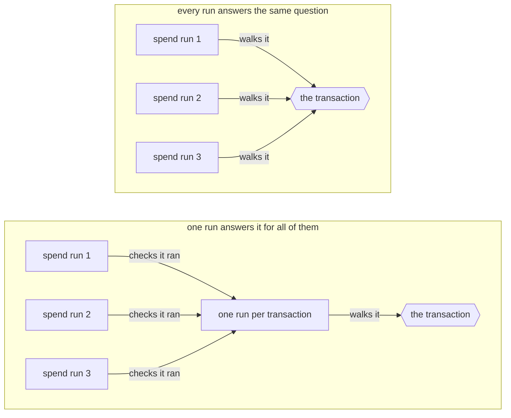
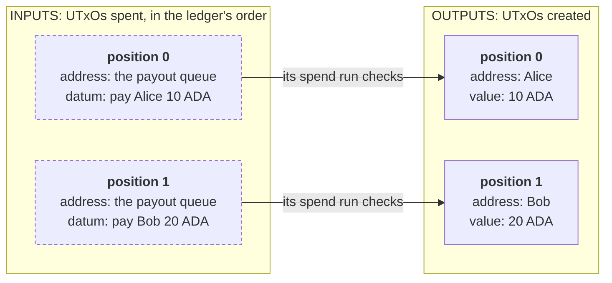
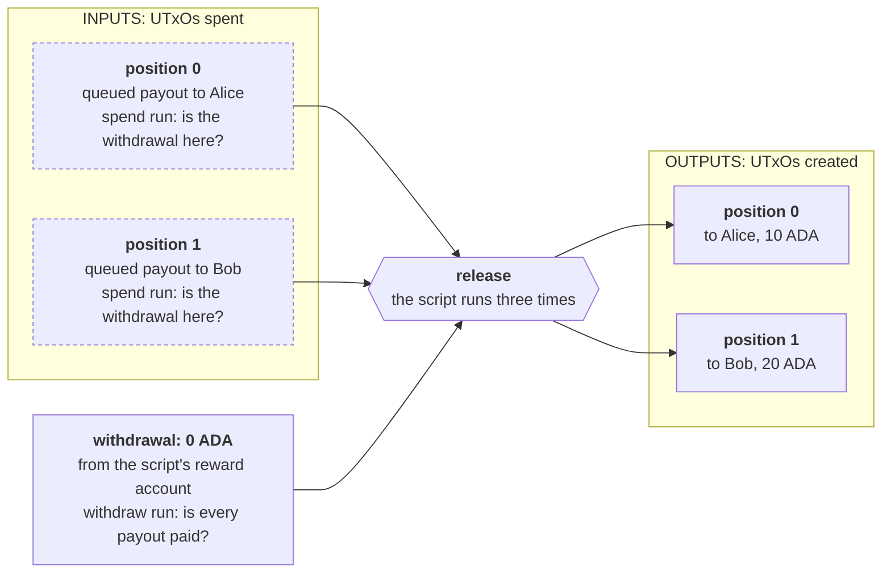

import Tabs from "@theme/Tabs";
import TabItem from "@theme/TabItem";
import CodeBlock from "@theme/CodeBlock";
import extractRegion from "@site/src/utils/extractRegion";
import Queue from "!!raw-loader!@site/examples/onboarding/lectures/advanced/payout-queue/on-chain/aiken/validators/payout_queue.ak";
import QueueIndexed from "!!raw-loader!@site/examples/onboarding/lectures/advanced/payout-queue/on-chain/aiken/validators/payout_queue_indexed.ak";
import QueueBatch from "!!raw-loader!@site/examples/onboarding/lectures/advanced/payout-queue/on-chain/aiken/validators/payout_queue_batch.ak";
import QueueLean from "!!raw-loader!@site/examples/onboarding/lectures/advanced/payout-queue/on-chain/aiken/validators/payout_queue_lean.ak";

# Optimization

A validator can be correct and still be useless. In [resource limit](/docs/developers/onboarding/lectures/advanced/detecting-vulnerabilities#resource-limit) an attacker filled the splitter's pot with dust until the split needed more than a transaction is allowed to use, and the funds stayed locked. A contract reaches the same limit without any attacker: a treasury that pays ten people in one transaction is cheap, and the same treasury paying sixty is refused by the chain.

## Three limits on a transaction

Every transaction has three maximums to fit under. A transaction over any one of them is invalid, whatever fee it offers.

| limit on one transaction | mainnet |
| --- | --- |
| memory units | 16,500,000 |
| CPU units | 10,000,000,000 |
| size in bytes | 16,384 |

Memory and CPU units are the **[execution units](/docs/developers/curriculum/fundamentals/core-concepts/fees#script-execution-fees)** your backend reported when it evaluated an unlock in [frontend integration](/docs/developers/onboarding/lectures/intermediate/frontend-integration). The bytes are the size of the transaction your app signs and sends. All three are protocol parameters, so governance can change them. A test network does not have to match mainnet.

The fee grows with all three. There is a price per byte, and a price per unit for memory and for CPU, and the handbook's **[fee formula](/docs/developers/curriculum/fundamentals/core-concepts/fees#the-fee-formula)** adds them up.

### Memory and CPU

Every operation a script performs has a memory price and a CPU price, both taken from the cost model in the protocol parameters. Memory counts the values the script builds, and CPU counts the steps it takes. Neither depends on the machine the script runs on. Most changes move the two together.

You can also spend one to save the other. Keeping a computed value and reading it later spends memory and saves CPU, and computing it again every time does the opposite. That exchange matters when a contract is close to one limit and far from the other. The handbook has both directions, in [replace expensive computations with lookups](/docs/developers/curriculum/smart-contracts/advanced/optimization#replace-expensive-computations-with-lookups) and [build local caches](/docs/developers/curriculum/smart-contracts/advanced/optimization#build-local-caches).

### Transaction size

The limit is on the whole serialized transaction, which means the signatures and any script inside it count as much as the inputs and the outputs. A script inside the transaction is usually the largest single part of it.

The rest grows with the work. Each input, spent or referenced, adds an output reference, which is a transaction id with an index. A transaction can carry one redeemer per validator run, with the execution units that run expects. Each output is written out in full, with its address, its value and its datum.

The datum of a UTxO you spend stays on the chain where it already is, so spending one costs the same few bytes whatever it holds. The datums a transaction creates are new bytes, and nothing limits how large a datum can be, so its outputs can grow until it no longer fits. A contract that keeps a lot of state in its datums spends more bytes on them than on its script. An output that pays ADA to an ordinary wallet address takes about 67 bytes.

A reference input takes the compiled script out of every transaction that points at it, which is what [reference scripts](/docs/developers/onboarding/lectures/intermediate/reference-inputs-and-scripts#reference-scripts) are for.

## Measure before you change anything

Three measurements answer three different questions, and none of them needs a network.

A test reports the memory and CPU of one run at one size. It measures everything the test does, including the transaction it builds first. Read it as a comparison between two versions of a contract rather than as the chain's bill.

A benchmark runs the same code at a series of sizes and plots memory and CPU against the size. A straight line means every extra item costs what the last one cost. A line that bends upward means each item costs more than the one before it, and a contract with that shape stops fitting at some size.

The blueprint your compiler writes holds the compiled script. Its length in bytes is what every transaction carrying that script pays for.

Then change the part the measurement points at, and measure again. The handbook's optimization page starts with the same advice, in [before optimizing](/docs/developers/curriculum/smart-contracts/advanced/optimization#before-optimizing).

## Three places to optimize

A **local** change stays inside one function, and nothing outside it can see a difference: a cheaper representation, one walk over a list where there were two, the cheap check before the expensive one. The handbook groups these under [choose cheaper representations](/docs/developers/curriculum/smart-contracts/advanced/optimization#choose-cheaper-representations) and [traverse once](/docs/developers/curriculum/smart-contracts/advanced/optimization#traverse-once).

A **validator-level** change moves work from the validator to the app that builds the transaction. Searching a list for one element is work, and the app already knows where that element sits, so it can put the position in the redeemer. The validator reads the position and checks that the input it finds there is the one being spent. That check has to stay, because anyone can put any number in a redeemer. The handbook calls the principle [don't compute, verify](/docs/developers/curriculum/smart-contracts/advanced/optimization#dont-compute-verify), and its [UTxO indexers](/docs/developers/curriculum/smart-contracts/advanced/design-patterns/utxo-indexers) page has the pattern in four shapes.

A **transaction-level** change is about how the runs inside one transaction share their work. Some facts belong to the whole transaction, and every run that works one out gets the same answer.



A minting policy runs once per transaction whatever it mints. A contract with nothing to mint can use the withdraw purpose from [validator purposes](/docs/developers/onboarding/lectures/intermediate/validator-purposes). A transaction that withdraws zero ADA from the script's own reward account makes the script run one more time, as a withdrawal validator, and that run can carry the check for everything else. This is called the **withdraw zero trick**. The handbook explains it on its [stake validator](/docs/developers/curriculum/smart-contracts/advanced/design-patterns/stake-validator) page, and the minting version on [transaction-level minting](/docs/developers/curriculum/smart-contracts/advanced/design-patterns/tx-level-minter).

## Optimize before you deploy

Each of these changes produces a different compiled script, and [the hash is the address](/docs/developers/onboarding/lectures/intermediate/parameters#why-a-parameter-changes-the-address). A contract that already holds funds cannot be made cheaper at the same address. Those funds stay under the old rules where they are, and the cheaper contract is a new contract with an empty address of its own. So measuring belongs before the first deployment, and the handbook's [going to production](/docs/developers/curriculum/production/going-to-production#4-optimize) page lists it as a step before launch. Afterwards it is a migration, with a plan for everything the old address holds.

## Try it

<Tabs groupId="onchain">
<TabItem value="aiken" label="Aiken" default>

### Write the payout queue

A treasury owes money to many people. Each debt is one UTxO locked at the script's address, and its datum says who is owed and how much. Anyone may release the queue: one transaction spends some of those UTxOs, and each one has to pay the person its datum names.

Start a new project:

```bash
aiken new my-name/payout-queue
cd payout-queue
rm validators/placeholder.ak
```

Create `validators/payout_queue.ak`, starting with the imports:

<CodeBlock language="aiken" title="validators/payout_queue.ak">
  {extractRegion(Queue, "imports")}
</CodeBlock>

Then the datum, the validator, and the function that walks the inputs:

<CodeBlock language="aiken" title="validators/payout_queue.ak">
  {extractRegion(Queue, "queue")}
</CodeBlock>

The payment for a queued payout is the output at the same position as its input:



Two payouts cannot be released by one payment, because two inputs cannot sit at the same position. The ledger sorts the inputs of a transaction before any validator sees them, so the app has to put each payment at the position its input will have after sorting.

`position_of` is where the cost is. It walks the inputs until it reaches the UTxO being spent, and it does that once for every payout the transaction releases. The gift card shop's count in [count the cards](/docs/developers/onboarding/lectures/advanced/detecting-vulnerabilities#count-the-cards) has the same shape.

Then the tests:

<CodeBlock language="aiken" title="validators/payout_queue.ak">
  {extractRegion(Queue, "tests")}
</CodeBlock>

```bash
aiken check
```

Five passes.

### Measure it

Add a builder for a release of any size, a function that runs every handler the chain would run, and three tests:

<CodeBlock language="aiken" title="validators/payout_queue.ak">
  {extractRegion(Queue, "measure")}
</CodeBlock>

Run `aiken check` again. Eight passes. Read the memory and CPU beside each test name, as you did for the splitter's split in [donate dust](/docs/developers/onboarding/lectures/advanced/detecting-vulnerabilities#donate-dust):

| test | memory | CPU |
| --- | --- | --- |
| `ten_payouts_are_released` | 1.06 M | 416.29 M |
| `thirty_payouts_are_released` | 5.22 M | 2.31 B |
| `sixty_payouts_are_released` | 16.59 M | 7.85 B |

Three times as many payouts cost five times the memory. Six times as many cost more than fifteen times. At sixty payouts the test reports 16.59 M, which is already over the 16.5 M limit.

The size limit is further away. Each payout adds an input, an output and a redeemer to the transaction, about 120 bytes together when the script comes from a reference input. Sixty payouts take about 7,700 of the 16,384 bytes, and a release reaches the size limit at about 130 payouts. Memory runs out first.

Then the benchmark. A `bench` takes a sampler: a function that turns a size into a generator of transactions. The runner calls it with every size up to a maximum, and this sampler ignores the randomness it is given and returns the release of that size:

<CodeBlock language="aiken" title="validators/payout_queue.ak">
  {extractRegion(Queue, "bench")}
</CodeBlock>

```bash
aiken bench --max-size 70
```

Two plots, memory and CPU against the number of payouts, and one line above them: `release (projected max size = 67)`. The runner fits a straight line through its measurements and reports where that line crosses the budget, taking the lower of the memory crossing and the CPU crossing. Both plots bend upward, so the real limit is lower than 67.

### Point at the input

The app that builds the release knows where each queued payout sits among the inputs, so the redeemer can carry that position. Replace the spend handler, and delete `position_of` with it:

<CodeBlock language="aiken" title="validators/payout_queue.ak">
  {extractRegion(QueueIndexed, "spend-indexed")}
</CodeBlock>

`list.at` reads the input at the given position, and the first line of the `and` compares it with `own_ref`. Without that comparison, a redeemer could name any input at all.

Every call to the spend handler now passes a position in place of `Void`: `0` for the first queued UTxO of a test, `1` for the second, and `n` inside `run_release`. One more test proves the position is checked:

<CodeBlock language="aiken" title="validators/payout_queue.ak">
  {extractRegion(QueueIndexed, "wrong-position-test")}
</CodeBlock>

Run `aiken check`. Nine passes:

| test | memory | CPU |
| --- | --- | --- |
| `ten_payouts_are_released` | 1.09 M | 357.13 M |
| `thirty_payouts_are_released` | 5.08 M | 1.61 B |
| `sixty_payouts_are_released` | 15.67 M | 4.89 B |

CPU at sixty payouts drops by more than a third and memory hardly moves. The walk this change removes was comparing output references, which takes many steps and builds almost no values. Run `aiken bench --max-size 70` again, and the projected maximum goes from 67 to 73.

### Check the queue once

Every spend run still reads a datum, looks up a payment and compares it. Whether every payout is paid is one fact about the whole transaction, so one run can answer it for all of them. This contract has nothing to mint, so it uses the withdraw zero trick. The release withdraws zero ADA from the script's own reward account, and the script runs once more, as a withdrawal validator:



With two payouts the script runs three times instead of two. With sixty it runs sixty-one times, and only one of those runs checks the payments.

The imports gain the withdrawals lookup and the credential type:

<CodeBlock language="aiken" title="validators/payout_queue.ak">
  {extractRegion(QueueBatch, "batch-imports")}
</CodeBlock>

The spend handler keeps its position and asks one question:

<CodeBlock language="aiken" title="validators/payout_queue.ak">
  {extractRegion(QueueBatch, "spend-batch")}
</CodeBlock>

The new handler carries the rule. Its `account` is the script's own credential, handed to it by the ledger, which is why it needs no search of its own:

<CodeBlock language="aiken" title="validators/payout_queue.ak">
  {extractRegion(QueueBatch, "withdraw-batch")}
</CodeBlock>

The check walks the inputs beside the outputs:

<CodeBlock language="aiken" title="validators/payout_queue.ak">
  {extractRegion(QueueBatch, "every-payout-is-paid")}
</CodeBlock>

`list.zip` puts each input next to the output at its position, and it stops at the shorter of the two lists. Without the length check, a payout at the end of the queue would be left out of the pairs and never checked.

Every transaction that should go through now needs the withdrawal in it. The two tests that check a payment call the withdraw handler, not the spend handler. Replace everything from the constants to the last test:

<CodeBlock language="aiken" title="validators/payout_queue.ak">
  {extractRegion(QueueBatch, "batch-tests")}
</CodeBlock>

`refuses_a_release_without_the_withdrawal` is the new one. The rule is now in the withdrawal, so a transaction without one may spend nothing at all.

Add a second benchmark, on the check alone:

<CodeBlock language="aiken" title="validators/payout_queue.ak">
  {extractRegion(QueueBatch, "check-bench")}
</CodeBlock>

Run `aiken check`. Ten passes:

| test | memory | CPU |
| --- | --- | --- |
| `ten_payouts_are_released` | 1.24 M | 438.84 M |
| `thirty_payouts_are_released` | 4.59 M | 1.57 B |
| `sixty_payouts_are_released` | 11.90 M | 3.97 B |

Ten payouts cost a little more than they did, because the transaction now runs one handler more. Sixty cost a quarter less memory and close to a fifth less CPU. Run `aiken bench --max-size 70`: the release's projected maximum goes from 73 to 100, and the check on its own reports `check_queue (projected max size = 373)`.

The saving has a price in bytes. Build the blueprint and count the compiled script:

```bash
aiken build
awk -F'"' '/compiledCode/ {print length($4)/2 " bytes"; exit}' plutus.json
```

The script grew from 507 bytes to 837, because it now holds a handler it did not have before. A withdrawal of zero ADA also costs something outside the contract. The script's reward account has to be registered on the chain, which is a deposit paid once, and every release has to include the withdrawal. The handbook's [stake validator](/docs/developers/curriculum/smart-contracts/advanced/design-patterns/stake-validator) page covers what that involves.

### One walk instead of four

`every_payout_is_paid` measures two lists, builds a list of pairs, and then walks the pairs. Walking the inputs and the outputs together does the same job in one pass:

<CodeBlock language="aiken" title="validators/payout_queue.ak">
  {extractRegion(QueueLean, "every-payout-is-paid-lean")}
</CodeBlock>

When the outputs run out while a payout is still waiting, the recursion returns `False`, which is what the old length check did. Nothing outside the function changes. Run `aiken check`. Ten passes:

| test | memory | CPU |
| --- | --- | --- |
| `ten_payouts_are_released` | 1.17 M | 413.30 M |
| `thirty_payouts_are_released` | 4.38 M | 1.50 B |
| `sixty_payouts_are_released` | 11.50 M | 3.82 B |

The whole release costs about four percent less. Run `aiken bench --max-size 70` to see the change on the function itself: `check_queue` goes from a projected 373 to 459, and at seventy payouts from 3.10 M memory to 2.52 M. Build the blueprint again and the script is 795 bytes, 42 fewer than before.

### The four moments

| moment | memory at 60 | CPU at 60 | projected maximum | compiled script |
| --- | --- | --- | --- | --- |
| as first written | 16.59 M | 7.85 B | 67 | 507 bytes |
| the position in the redeemer | 15.67 M | 4.89 B | 73 | 507 bytes |
| the queue checked once | 11.90 M | 3.97 B | 100 | 837 bytes |
| one walk over the queue | 11.50 M | 3.82 B | 105 | 795 bytes |

The change that saved the most is the one that changed the design. The change that saved the least is the only one the app never sees, and the only one you can still make after the app is written.

Stuck? The four moments are in the example project, `payout_queue.ak`, `payout_queue_indexed.ak`, `payout_queue_batch.ak` and `payout_queue_lean.ak`. See the **[introduction](/docs/developers/onboarding/lectures/advanced/introduction#the-example-project)**.

</TabItem>
<TabItem value="scalus" label="Scalus">

A [Scalus](https://scalus.org/) version is coming soon. The idea is identical, only the language differs.

</TabItem>
</Tabs>

## Go deeper

- [Contract optimization](/docs/developers/curriculum/smart-contracts/advanced/optimization): the handbook's catalog, benchmarks first, then the techniques grouped by the kind of saving each one makes.
- [Fees](/docs/developers/curriculum/fundamentals/core-concepts/fees): the fee formula, the price of execution units, and what a reference script costs.
- [UTxO indexers](/docs/developers/curriculum/smart-contracts/advanced/design-patterns/utxo-indexers): the position in the redeemer, for one input, for one input and its outputs, and for many of each.
- [Transaction-level minting](/docs/developers/curriculum/smart-contracts/advanced/design-patterns/tx-level-minter): one check per transaction, run by a minting policy.
- [Stake validator](/docs/developers/curriculum/smart-contracts/advanced/design-patterns/stake-validator): the withdraw zero trick, and what registering the reward account involves.
- [Merkelized validator](/docs/developers/curriculum/smart-contracts/advanced/design-patterns/merkelized-validator): putting part of a validator in a separate script, so that a change that trades script size for execution units still fits.
- [Transaction building](/docs/developers/curriculum/start-building/transaction-building#batching-and-airdrops): splitting the work across transactions when one of them can no longer hold it.
- [Debugging CBOR](/docs/developers/curriculum/smart-contracts/advanced/debug-cbor): reading a transaction's bytes to see what takes the space.
- [Going to production](/docs/developers/curriculum/production/going-to-production#4-optimize): where optimization sits among the other steps before a launch.
