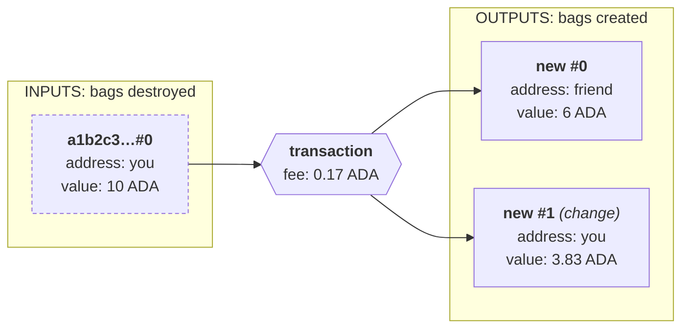
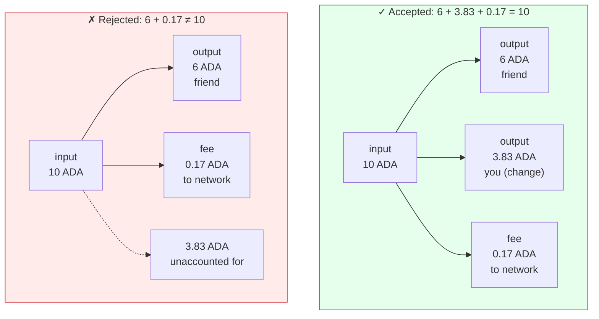
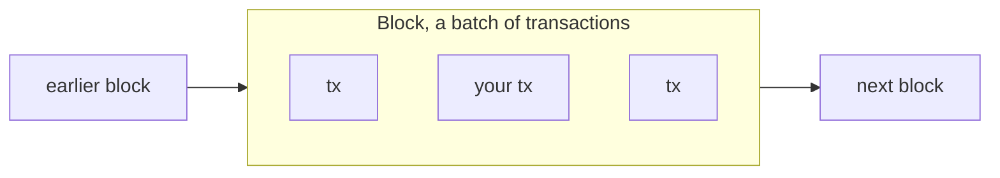

import Tabs from "@theme/Tabs";
import TabItem from "@theme/TabItem";
import CodeBlock from "@theme/CodeBlock";
import extractRegion from "@site/src/utils/extractRegion";
import SendAda from "!!raw-loader!@site/examples/onboarding/lectures/mesh/src/send-ada.ts";

# UTxOs & Transactions

You funded a wallet in the last lecture. Now let's see what that balance really is, and what happens when you spend it.

On many systems, your balance is a single number that goes up and down, like a bank account. Cardano works more similarly to cash. Your balance is made of separate **sealed bags of coins**. Each bag holds a fixed amount of coins determined when creating the bag. Your total balance is just the sum of all the bags in your address.

Each sealed bag is a **UTxO** (an _unspent transaction output_). If your address has one bag holding 10 ADA and another holding 2 ADA, together, that's a balance of 12 ADA, but they stay as two separate bags.

Here's the part that surprises people: **you can't reach into a bag and pull out part of it, they are sealed!** To spend your tokens, you have to do a transaction that releases the tokens by destroying the whole bag (consuming the UTxO), sends the tokens you wanted to spend to the new address, and sends the ones you didn't want to spend back to your address. Both in brand new sealed bags. Say you have a bag of 10 ADA and want to send 6 to a friend. You'll create a transaction that:

1. Takes your **whole 10 ADA bag** as an **input**.
2. Destroys the bag, releasing the ADA, to freely rearrange them into **outputs** (new bags).
3. Creates two new sealed bags (outputs), one with 6 ADA on your friend's address and another with 4 ADA in your address.
4. Checks the **ledger rules**, above all that the sum of ADA in the inputs equals the sum in the outputs **plus the fee**, so nothing is created or lost.

This is a diagram of that transaction. Inputs go in, outputs go out:

Each bag carries three things: a **reference** (`a1b2c3…#0`, the transaction that created it and which output it was), an **address** saying who can spend it, and a **value**. The dashed border marks the input as destroyed.

This is why any amount works: the blockchain isn't handing you an existing "6 ADA note", it **makes fresh bags for the exact amounts**. Your original bag is gone forever. A bag is always used **all at once, never partially** (a small fee is taken from your change to pay for the processed transaction). That's the **UTxO model**. Each "bag" is called UTxO (_Unspent Transaction Output_) because it's an Output from a previous Transaction that hasn't been spent yet.

## Nothing is lost: inputs = outputs + fee

A transaction can't make ADA appear or disappear. The network accepts it **only** when the inputs exactly equal the outputs plus the fee. Each **output** is a new bag: some go to other people, one comes back to you as **change**. On top of the outputs, a small **fee** goes to the network for processing the transaction. That amount isn't arbitrary, the network's **protocol parameters** set it from the transaction's size, so a bigger transaction costs a little more. Spend a 10 ADA bag to send 6, and the leftover can't just disappear, the remaining ADA (minus the fee) has to come back to you as change, or the whole transaction is **rejected**.

Both spend the same 10 ADA bag. The **accepted** one balances to the lovelace, so it's valid; the **rejected** one leaves 3.83 ADA unaccounted for, so the network won't accept it. To spend part of a bag, you always send the rest back to yourself as change.

## Blocks: how a transaction reaches the chain

A transaction doesn't land on the chain by itself. When you submit it, it's sent to the network and waits briefly, then a **block producer** bundles it together with other people's transactions into a **block**, and that block is added to the chain.

That's what a **blockchain** literally is: a chain of blocks, each one linked to the block before it, in order. Once your transaction is inside a block it's **confirmed**, which is why, right after you send, you wait a moment for it to "appear", it's waiting to be picked up into the next block.

Think of it like a ledger book: each transaction is one entry, a block is a page that gathers many entries at once, and the pages are bound in order into the book, the chain.

## Try it: a transaction by hand

Make a real transaction with your wallet, no code needed, and watch it split into inputs and outputs.

1. In **[Lace](https://www.lace.io/)** (on **Preview**, from the last lecture), send a small amount of ADA to **your own address**, copy your address and paste it as the recipient, then approve it.
2. Wait a moment for it to confirm, then open it on the **[Cardano explorer for Preview](https://explorer.cardano.org/preview)** (search your address and pick your latest transaction).
3. Read its two sides: the **Inputs** (the bag, or UTxO, your wallet spent), the **Outputs** (the ADA to yourself plus the **change**), and the small **fee** taken from what went in.

That's the input-to-output split from the diagram above, made by you.

## Build it in code with an SDK

You just did that by hand in the **Lace wallet**. To do the same from an **app**, you build the transaction **in code** with an **SDK**: a library your project installs as a **dependency** and calls from its own code to build transactions for you.

When you build and send a transaction, it's almost always the same four steps: the SDK **reads** the chain for what it needs (your UTxOs, the current fees), **builds** the transaction from what you asked for, including **coin selection** (choosing which of your bags to spend), hands it to your wallet to **sign** (which proves it's you, **the SDK never sees the private key**), and **submits** it to the network. SDKs also do plenty more, like querying chain data, deriving addresses, and serializing data. But **read, build, sign, submit** is the flow you'll reach for most.

The hardest part it handles for you is making the transaction **add up**: inputs must equal outputs plus the fee (builders call this **balancing** a transaction). Getting it right by hand, pick enough bags, then work out the change, is easy to get wrong; the SDK does it automatically from a plain "send 1 ADA to this address," and you can still take over which bags it picks when you need to.

There's an SDK for almost any language, browse the full set in **[Builder Tools](/tools/?tags=sdk)**. The examples in these lectures use **[Mesh](https://meshsdk.dev/)** and **[Evolution](https://no-witness-labs.github.io/evolution-sdk/)** (both TypeScript). You install one from npm and call it from your app.

### See it in code

Here's the same "send 1 ADA to yourself" you just did by hand, now in code:

<Tabs groupId="offchain">
<TabItem value="mesh" label="Mesh" default>

<CodeBlock language="ts" title="send-ada.ts">
  {extractRegion(SendAda, "send-ada")}
</CodeBlock>

Two lines do the adding-up for you:

- `await wallet.getUtxos()` hands the SDK **all** your current bags (UTxOs).
- `.selectUtxosFrom(...)` lets it pick from them, and `.complete()` **makes the transaction add up**: it selects just enough bags to cover the payment plus the fee, and returns the leftover to `.changeAddress(...)` as change.

</TabItem>
<TabItem value="evolution" label="Evolution">

An [Evolution](https://no-witness-labs.github.io/evolution-sdk/) version is coming soon. The idea is identical, only the library calls differ.

</TabItem>
</Tabs>

**Run it and see it on the explorer.** This code is waiting for you in the **[playground](/docs/developers/onboarding/lectures/beginner/introduction#the-playground)**, a tiny app with every example from this track wired to a button (it takes a minute to set up, and you'll use it for the rest of the track). Start it, click **Connect Lace and send 1 ADA to myself**, and approve it in Lace. It prints an **explorer link** to your brand-new transaction, read it beside the one you sent by hand above: **same shape** (inputs, outputs, change, fee), only this time your code built it and the SDK did the balancing.

## Go deeper

- [The Extended UTXO Model](/docs/developers/curriculum/fundamentals/core-concepts/eutxo) — the model behind inputs, outputs, and change.
- [Transactions](/docs/developers/curriculum/fundamentals/core-concepts/transactions) — a transaction's full anatomy.
- [Transaction fees](/docs/developers/curriculum/fundamentals/core-concepts/fees) — how the fee is calculated and where it goes.
- [What Is a Blockchain?](/docs/developers/curriculum/fundamentals/what-is-a-blockchain) — how blocks link together into a chain.
- [Choose your tools](/docs/developers/curriculum/start-building/choose-your-tools) — Mesh, Evolution, and how to pick an SDK.
- [Coin selection](/docs/developers/curriculum/start-building/transaction-building#coin-selection) — how an SDK picks which UTxOs to spend.
- [Transaction building](/docs/developers/curriculum/start-building/transaction-building) — building and balancing transactions in depth.

Next: **[Time on Cardano](/docs/developers/onboarding/lectures/beginner/time-on-cardano)**.
