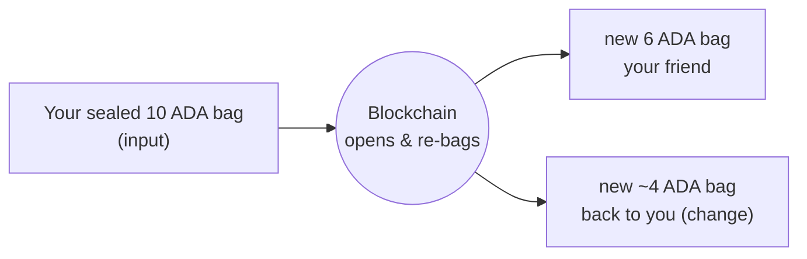
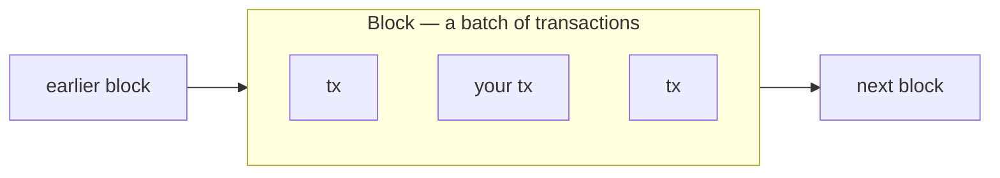

import Tabs from "@theme/Tabs";
import TabItem from "@theme/TabItem";
import CodeBlock from "@theme/CodeBlock";
import extractRegion from "@site/src/utils/extractRegion";
import SendAda from "!!raw-loader!@site/examples/onboarding/lectures/mesh/src/send-ada.ts";

# UTxOs & transactions

You funded a wallet in the last lecture. Now let's see what that balance really is, and what happens when you spend it.

On many systems your balance is a single number that goes up and down, like a bank account. Cardano works differently. Your balance is made of separate **sealed bags of coins**. Each bag holds a fixed amount, and once it's sealed **only the blockchain can open it**. Your balance is just the sum of all your bags.

Each sealed bag is a **UTxO** (an _unspent transaction output_). You might have one bag holding 10 ADA and another holding 2 ADA, together that's a balance of 12 ADA, but they stay two separate bags.

Here's the part that surprises people: **you can't reach into a bag and pull out part of it.** To spend, you hand a whole bag to the blockchain and let _it_ do the opening. Say you have a bag of 10 ADA and want to send 6 to a friend:

1. You put your **whole 10 ADA bag** into a **transaction**, it goes in as an **input**.
2. The blockchain **opens it**, counts out 6 ADA, and seals them in a **new bag addressed to your friend**.
3. It seals the leftover 4 ADA in **another new bag and sends it back to you** as change.

Those two new bags are the transaction's **outputs**.



This is why any amount works: the blockchain isn't handing you an existing "6 ADA note", it **makes fresh bags for the exact amounts**. Your original bag is gone forever, a bag is always used **all at once, never partially** (a small fee is taken from your change). That's the **eUTxO model**, and because every bag going in and coming out is spelled out up front, a Cardano transaction either does exactly what it says or doesn't happen at all.

## Blocks: how a transaction reaches the chain

A transaction doesn't land on the chain by itself. When you submit it, it's sent to the network and waits briefly, then a **block producer** bundles it together with other people's transactions into a **block**, and that block is added to the chain.

That's what a **blockchain** literally is: a chain of blocks, each one linked to the block before it, in order. Once your transaction is inside a block it's **confirmed**, which is why, right after you send, you wait a moment for it to "appear", it's waiting to be picked up into the next block.



Think of it like a ledger book: each transaction is one entry, a block is a page that gathers many entries at once, and the pages are bound in order into the book, the chain.

## See it in code

Let's actually create one. This connects your wallet and sends **1 ADA to yourself**, sending to your own address is the simplest way to watch a real transaction appear, with no second wallet to set up. It uses **only the connected wallet**: the wallet gives up the bags to spend, signs, and submits, with no extra service in between.

Before you read it, one thing worth calling out, because it can feel like magic and it isn't: **you never hand-pick which bag to spend.** Two lines in the code do it for you:

- `await wallet.getUtxos()` asks the wallet for **all** your current bags (UTxOs).
- `.selectUtxosFrom(...)` hands that whole pile to Mesh, which then does **coin selection**: inside `.complete()` it picks just enough bags to cover your 1 ADA payment plus the network fee, while `.changeAddress(...)` says where the leftover comes back as change.

So the picking is **automated, not hidden**, you can point to the exact line where your UTxOs go in and where the change comes out.

<Tabs groupId="offchain">
<TabItem value="mesh" label="Mesh" default>

<CodeBlock language="ts" title="send-ada.ts">
  {extractRegion(SendAda, "send-ada")}
</CodeBlock>

**Run it and see it on the explorer.** You'll need **[Lace](https://www.lace.io/)** on the **Preview** network with a little test ADA (from Lecture 1). Grab just this example (no need to clone the whole repo) and start it:

```bash
npx giget@latest gh:cardano-foundation/developer-portal/examples/onboarding/lectures/mesh lectures-mesh
cd lectures-mesh
npm install
npm run dev
```

Open the printed URL in the browser where Lace lives, click **Connect Lace & send 1 ADA to myself**, and approve it in Lace. It prints an **explorer link** to your brand-new transaction, let's open it and pull it apart next.

</TabItem>
<TabItem value="evolution" label="Evolution">

An [Evolution](https://no-witness-labs.github.io/evolution-sdk/) version is coming soon. The idea is identical, only the library calls differ.

</TabItem>
</Tabs>

## Try it

Now open your transaction on the explorer, use the **link the app printed** (or search your address on the **[Cardano explorer for Preview](https://explorer.cardano.org/preview)** and pick your latest one), and read it side by side with what you built:

1. **Inputs**, the bag (UTxO) your wallet chose to spend.
2. **Outputs**, 1 ADA back to yourself, plus the **change** returning the rest.
3. The small **fee**, taken from what went in.

That's a transaction you created, laid out in full, the same inputs-and-outputs split from the diagram above. _(No wallet set up yet? Do the same with the transaction where the faucet funded you in Lecture 1, open your address and read its inputs and outputs.)_

## Go deeper

- [The Extended UTXO Model](/docs/developers/curriculum/fundamentals/core-concepts/eutxo) — the model behind inputs, outputs, and change.
- [Transactions](/docs/developers/curriculum/fundamentals/core-concepts/transactions) — a transaction's full anatomy.
- [What Is a Blockchain?](/docs/developers/curriculum/fundamentals/what-is-a-blockchain) — how blocks link together into a chain.
- [Consensus & Ouroboros](/docs/developers/curriculum/fundamentals/consensus-and-ouroboros) — how blocks get produced, and who the block producers are.

Next: **[Tokens: fungible & NFTs](/docs/developers/onboarding/lectures/beginner/tokens-fungible-and-nfts)**.
