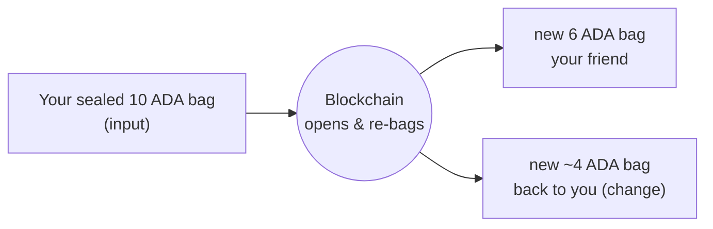
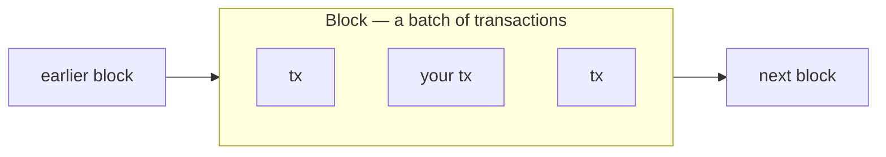

# UTxOs & Transactions

You funded a wallet in the last lecture. Now let's see what that balance really is, and what happens when you spend it.

On many systems, your balance is a single number that goes up and down, like a bank account. Cardano works more similarly to cash. Your balance is made of separate **sealed bags of coins**. Each bag holds a fixed amount of coins determined when creating the bag. Your total balance is just the sum of all the bags in your address.

Each sealed bag is a **UTxO** (an _unspent transaction output_). If your address has one bag holding 10 ADA and another holding 2 ADA, together, that's a balance of 12 ADA, but they stay as two separate bags.

Here's the part that surprises people: **you can't reach into a bag and pull out part of it; they are sealed!** To spend your tokens, you have to do a transaction that releases the tokens by destroying the whole bag (consuming the UTxO), sends the tokens you wanted to spend to the new address, and sends the ones you didn't want to spend back to your address. Both in brand new sealed bags. Say you have a bag of 10 ADA and want to send 6 to a friend. You'll create a transaction that:

1. Takes your **whole 10 ADA bag** as an **input**.
2. Destroys the bag, releasing the ADA, to freely rearrange them into **outputs** (new bags).
3. Creates two new sealed bags (outputs), one with 6 ADA on your friend's address and another with 4 ADA in your address.
4. Checks that some rules called "ledger rules" are respected (like the sum of ADA in all inputs is equal to the sum of ADA of all outputs).

This is a diagram of that transaction. Inputs go in, outputs go out:

This is why any amount works: the blockchain isn't handing you an existing "6 ADA note", it **makes fresh bags for the exact amounts**. Your original bag is gone forever. A bag is always used **all at once, never partially** (a small fee is taken from your change to pay for the processed transaction). That's the **UTxO model**. Each "bag" is called UTxO (_Unspent Transaction Output_) because it's an Output from a previous Transaction that hasn't been spent yet.

## Blocks: how a transaction reaches the chain

A transaction doesn't land on the chain by itself. When you submit it, it's sent to the network and waits briefly, then a **block producer** bundles it together with other people's transactions into a **block**, and that block is added to the chain.

That's what a **blockchain** literally is: a chain of blocks, each one linked to the block before it, in order. Once your transaction is inside a block it's **confirmed**, which is why, right after you send, you wait a moment for it to "appear", it's waiting to be picked up into the next block.

Think of it like a ledger book: each transaction is one entry, a block is a page that gathers many entries at once, and the pages are bound in order into the book, the chain.

## Try it

Make a real transaction with your wallet, no code needed, and watch it split into inputs and outputs.

1. In **[Lace](https://www.lace.io/)** (on **Preview**, from the last lecture), send a small amount of ADA to **your own address**, copy your address and paste it as the recipient, then approve it.
2. Wait a moment for it to confirm, then open it on the **[Cardano explorer for Preview](https://explorer.cardano.org/preview)** (search your address and pick your latest transaction).
3. Read its two sides: the **Inputs** (the bag, or UTxO, your wallet spent), the **Outputs** (the ADA to yourself plus the **change**), and the small **fee** taken from what went in.

That's the input-to-output split from the diagram above, made by you. In the next lecture you'll do the very same thing **in code**, with an off-chain SDK.

## Go deeper

- [The Extended UTXO Model](/docs/developers/curriculum/fundamentals/core-concepts/eutxo) — the model behind inputs, outputs, and change.
- [Transactions](/docs/developers/curriculum/fundamentals/core-concepts/transactions) — a transaction's full anatomy.
- [What Is a Blockchain?](/docs/developers/curriculum/fundamentals/what-is-a-blockchain) — how blocks link together into a chain.
- [Consensus & Ouroboros](/docs/developers/curriculum/fundamentals/consensus-and-ouroboros) — how blocks get produced, and who the block producers are.

Next: **[Off-chain SDKs](/docs/developers/onboarding/lectures/beginner/off-chain-sdks)**.
