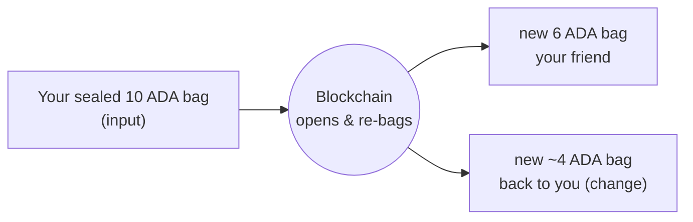

import Tabs from "@theme/Tabs";
import TabItem from "@theme/TabItem";
import CodeBlock from "@theme/CodeBlock";
import extractRegion from "@site/src/utils/extractRegion";
import SendAda from "!!raw-loader!@site/examples/onboarding/lectures/mesh/src/send-ada.ts";

# UTxOs & transactions

You funded a wallet in the last lecture. Now let's see what that balance really is, and what happens when you spend it.

On many systems your balance is a single number that goes up and down, like a bank account. Cardano works differently. Your balance is made of separate **sealed bags of coins**. Each bag holds a fixed amount, and once it's sealed **only the blockchain can open it**. Your balance is just the sum of all your bags.

Each sealed bag is a **UTxO** (an _unspent transaction output_). You might have one bag holding 10 ADA and another holding 2 ADA, together that's a balance of 12 ADA, but they stay two separate bags.

Here's the part that surprises people: **you can't reach into a bag and pull out part of it.** To spend, you hand a whole bag to the blockchain and let _it_ do the opening. Say you have a bag of 10 ADA and want to send 6 to a friend:

1. You put your **whole 10 ADA bag** into a **transaction**, it goes in as an **input**.
2. The blockchain **opens it**, counts out 6 ADA, and seals them in a **new bag addressed to your friend**.
3. It seals the leftover 4 ADA in **another new bag and sends it back to you** as change.

Those two new bags are the transaction's **outputs**.



This is why any amount works: the blockchain isn't handing you an existing "6 ADA note", it **makes fresh bags for the exact amounts**. Your original bag is gone forever, a bag is always used **all at once, never partially** (a small fee is taken from your change). That's the **eUTxO model**, and because every bag going in and coming out is spelled out up front, a Cardano transaction either does exactly what it says or doesn't happen at all.

## Try it

Let's watch a real transaction split into inputs and outputs.

1. Open the **[Cardano explorer for Preview](https://explorer.cardano.org/preview)** and search your address from Lecture 1.
2. Open the transaction where the faucet sent you test ADA.
3. Look at its two sides: **Inputs** (the UTxOs it spent) and **Outputs** (the UTxOs it created, one of them is your ADA).

Send some ADA to another address and look again, you'll see your UTxO become an input, and new outputs (the payment + your change) appear.

## See it in code

Let's actually create one. This connects your wallet and sends **1 ADA to yourself**, sending to your own address is the simplest way to watch a real transaction appear, with no second wallet to set up. It uses **only the connected wallet**: the wallet gives up the bags to spend, signs, and submits, with no extra service in between.

<Tabs groupId="offchain">
<TabItem value="mesh" label="Mesh" default>

<CodeBlock language="ts" title="send-ada.ts">
  {extractRegion(SendAda, "send-ada")}
</CodeBlock>

**Run it and see it on the explorer.** You'll need **[Lace](https://www.lace.io/)** on the **Preview** network with a little test ADA (from Lecture 1). Grab just this example (no need to clone the whole repo) and start it:

```bash
npx giget@latest gh:cardano-foundation/developer-portal/examples/onboarding/lectures/mesh lectures-mesh
cd lectures-mesh
npm install
npm run dev
```

Open the printed URL in the browser where Lace lives, click **Connect Lace & send 1 ADA to myself**, and approve it in Lace. It prints an **explorer link**, open it and you'll see your brand-new transaction: the input bag on one side, the outputs (your 1 ADA + change) on the other. That's the same inputs-and-outputs split from the diagram above, this time created by you.

</TabItem>
<TabItem value="evolution" label="Evolution">

An [Evolution](https://no-witness-labs.github.io/evolution-sdk/) version is coming soon. The idea is identical, only the library calls differ.

</TabItem>
</Tabs>

## Go deeper

- [The Extended UTXO Model](/docs/developers/curriculum/fundamentals/core-concepts/eutxo)
- [Transactions](/docs/developers/curriculum/fundamentals/core-concepts/transactions)

Next: **[Tokens: fungible & NFTs](/docs/developers/onboarding/lectures/beginner/tokens-fungible-and-nfts)**.
