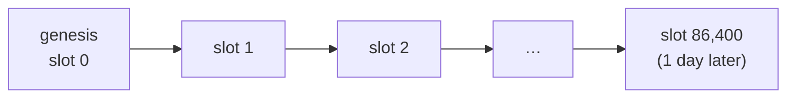
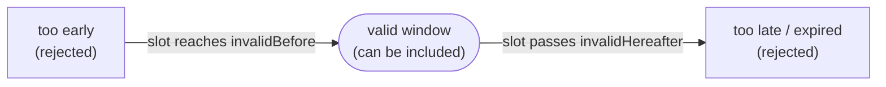

import Tabs from "@theme/Tabs";
import TabItem from "@theme/TabItem";
import CodeBlock from "@theme/CodeBlock";
import extractRegion from "@site/src/utils/extractRegion";
import SendWithDeadline from "!!raw-loader!@site/examples/onboarding/lectures/mesh/src/send-with-deadline.ts";

# Time on Cardano

Here's something that trips up almost every newcomer: **you can't ask Cardano what time it is.** A transaction has no field meaning "now", and nothing that checks it reads a clock. What it does have is a **window of slots it may be included in**, which you set when you build it, and the network holds it to that window. (The chain itself does move forward in real time, as we'll see.) To use time on Cardano, you first have to understand how the chain measures it.

## Slots: the chain's heartbeat

Cardano keeps time in **slots**. A slot is a fixed tick of the clock, **one second today**, and slots are simply numbered in order starting from the chain's birth (its _genesis_). Slot 1, slot 2, slot 3, forever.

Slot length is a **network parameter**, not a law of nature: it was 20 seconds in Cardano's first era and became 1 second in the next one. Changing it takes a **hard fork**, so it doesn't move day to day, but "one slot = one second" is today's setting rather than something baked in forever.

A slot is just a _turn_ to maybe add a block, so **not every slot has a block** (on average a block appears roughly every 20 seconds). Think of slots as the steady ticking, and blocks as the moments something actually gets written down.

:::tip A slot is a moment in time
A slot isn't just a counter, it's a **point in time**. Slot 0 is the chain's start, and at today's one-second slots each later slot is one second on from it, so a slot number works as a timestamp. When a block is minted in a given slot, that slot pins it to an exact second: you can turn a slot number into a wall-clock time, and a time back into a slot. That bridge is what lets your app later say "valid until two minutes from now."

There's a limit, though, and it follows from slot length being a parameter: since a future hard fork could change it, nobody can say exactly what wall-clock time a distant slot will land on. The conversion is only dependable a fixed distance ahead (roughly a day and a half right now). Past that, a slot number is an estimate rather than a promise, however you worked it out.
:::

## Why "now" doesn't exist

Cardano is **deterministic**: whether a transaction is valid depends only on things that are written down, the transaction itself, the outputs it spends, and the slot of the block it goes into. Nothing is measured at the moment of checking. That's why you can tell before you submit whether it will go through, and why anyone re-checking that same block years from now reaches the same answer. A wall clock is written down nowhere, so no part of the check reads one.

Instead, a transaction carries a **validity interval**: the slot window in which it is allowed to be included in a block. It has up to two bounds:

- **`invalidBefore`** the earliest slot the transaction may appear in ("not before this time").
- **`invalidHereafter`** (also called the **TTL**) the latest slot it may appear in ("expires after this time").

The **ledger** checks that window against the current slot before the transaction is accepted. So when a native script says _"only after slot X,"_ it doesn't look up the time itself, it relies on the window the ledger already verified. **Your app is the one holding a real clock**: it turns a date into a slot number when it builds the transaction.

Reading left to right is time moving forward. As the current slot crosses each bound, the transaction goes from too-early, to allowed, to expired:

So "time" on Cardano is really **"which slots is this transaction allowed in?"**, a range, not a clock reading.

## See it in code

Let's set a deadline. This sends **1 ADA to yourself**, but marks the transaction valid **only for the next ~2 minutes**. Notice the one time-related line: off-chain we take the real clock (`now + 2 min`), turn it into a slot, and cap the transaction with `invalidHereafter`.

<Tabs groupId="offchain">
<TabItem value="mesh" label="Mesh" default>

<CodeBlock language="ts" title="send-with-deadline.ts">
  {extractRegion(SendWithDeadline, "deadline")}
</CodeBlock>

</TabItem>
<TabItem value="evolution" label="Evolution">

An [Evolution](https://no-witness-labs.github.io/evolution-sdk/) version is coming soon. The idea is identical, only the library calls differ.

</TabItem>
</Tabs>

**Run it and see it on the explorer.** In the **[playground](/docs/developers/onboarding/lectures/beginner/introduction#the-playground)**, click **Connect Lace and send a time-limited transaction**, and approve it. Because you submit right away, you're inside the window and it succeeds, follow the **explorer link** and look for the transaction's **TTL / validity** field, that's the upper slot you set. _(If you somehow waited past the window, the ledger would reject it, that's time being enforced with no clock involved.)_

## Try it

- On the **[Cardano explorer for Preview](https://explorer.cardano.org/preview)**, open a recent transaction and look for its **validity interval** / **TTL**, the slot after which it would have expired.
- Keep this in mind for the next lecture: when a native script says `before slot …`, that's exactly this window doing the work.

## Go deeper

- [Consensus & Ouroboros](/docs/developers/curriculum/fundamentals/consensus-and-ouroboros) — how slots structure time, and where epochs come in.
- [Transactions: validity intervals and time](/docs/developers/curriculum/fundamentals/core-concepts/transactions#validity-intervals-and-time) — the bounds in detail, and slot↔time conversion.
- [Cardano for Ethereum developers](/docs/developers/cardano-for-ethereum-developers) — why there's no `block.timestamp`.

Next: **[Native scripts & metadata](/docs/developers/onboarding/lectures/beginner/native-scripts-and-metadata)**.
