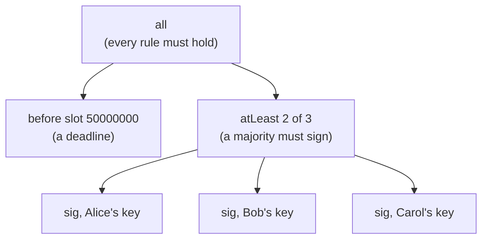
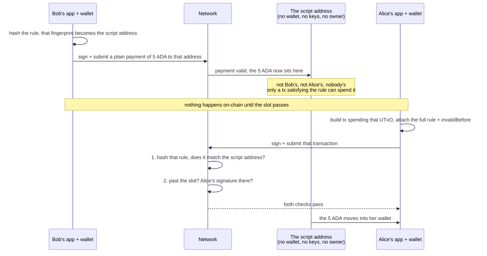

import Tabs from "@theme/Tabs";
import TabItem from "@theme/TabItem";
import CodeBlock from "@theme/CodeBlock";
import extractRegion from "@site/src/utils/extractRegion";
import NativeScript from "!!raw-loader!@site/examples/onboarding/lectures/mesh/src/native-script.ts";
import SendWithMetadata from "!!raw-loader!@site/examples/onboarding/lectures/mesh/src/send-with-metadata.ts";

# Native scripts & metadata

Two building blocks, and neither needs a smart contract.

## Native scripts

You've now met the two ingredients a simple rule is made of: **signatures** (from the [wallets lecture](/docs/developers/onboarding/lectures/beginner/wallets-keys-addresses)) and **time windows** (from the [last lecture](/docs/developers/onboarding/lectures/beginner/time-on-cardano)). A **native script** combines exactly those into an on-chain rule, with **no smart contract** and no code to compile.

### Simple rules, no code

A **native script** expresses a **simple condition** as data, no smart-contract language required, like the **rules on a shared bank account** ("any two of us must sign", "not before this date").

Here's a **time-locked shared wallet**, _"before a deadline, and at least 2 of 3 people must sign"_:

```json
{
  "type": "all",
  "scripts": [
    { "type": "before", "slot": 50000000 },
    {
      "type": "atLeast",
      "required": 2,
      "scripts": [
        { "type": "sig", "keyHash": "ALICE_KEY_HASH" },
        { "type": "sig", "keyHash": "BOB_KEY_HASH" },
        { "type": "sig", "keyHash": "CAROL_KEY_HASH" }
      ]
    }
  ]
}
```

Reading it: `sig` = a specific key must sign, named by its **key hash** (a short public fingerprint of the key, safe to share, not the secret); `all` = every condition must hold; `atLeast` = a minimum number of them must (there's also `any`); and `before`/`after` are time conditions (measured in [slots](/docs/developers/onboarding/lectures/beginner/time-on-cardano), which you just met). Each person gets their own key hash from their wallet, an off-chain SDK derives it from their address or public key, so they only ever share that fingerprint, never a secret. The power is that they **nest**, small rules combine into a bigger one. The same rule as a tree:

:::note `before` and `after` name a slot, not a date
A native script can only talk about **slot numbers**. Your app picks the slot by converting a date when it writes the rule, but the rule itself never stores that date. Since [slot length is a network parameter](/docs/developers/onboarding/lectures/beginner/time-on-cardano) that a hard fork can change, a lock set years out could come due at a somewhat different wall-clock moment than the one you had in mind. Fine for a deadline weeks away, worth a thought for one far in the future.
:::



Because it's just data, you assemble it in code like any object. First get each signer's **key hash** from their address, then build the rule and hash it, that **script hash** is the same value that becomes a **minting policy ID** or a **script address**:

<Tabs groupId="offchain">
<TabItem value="mesh" label="Mesh" default>

<CodeBlock language="ts" title="native-script.ts">
  {extractRegion(NativeScript, "native-script")}
</CodeBlock>

In the **Tokens** lecture you'll use exactly this: a token's **minting policy** is just a native script, and hashing it gives the token's **policy ID**.

</TabItem>
<TabItem value="evolution" label="Evolution">

An [Evolution](https://no-witness-labs.github.io/evolution-sdk/) version is coming soon. The idea is identical, only the library calls differ.

</TabItem>
</Tabs>

### Spending it: lock first, satisfy the rule later

A rule guards nothing until value is actually sitting at its address, and that takes **two transactions**, usually far apart in time.

Say **Bob** wants to hand 5 ADA to **Alice**, but not before a certain date. He builds a rule that names her key and that date:

```json
{
  "type": "all",
  "scripts": [
    { "type": "after", "slot": 60000000 },
    { "type": "sig", "keyHash": "ALICE_KEY_HASH" }
  ]
}
```

**Bob locks.** First his app **hashes** the rule. Hashing turns the rule into a short fingerprint of itself, the same idea as the key hashes above, and two properties are what make it useful: feed in the same rule and you always get the same fingerprint back, and change the smallest detail (Alice's key for Bob's, one digit of the slot) and the fingerprint comes out completely different. **That fingerprint, written as an address, is the script's address.**

And that's a **different kind of address** from the one your wallet hands you. A wallet address is controlled by a **key**: whoever holds the matching private key can spend what sits there, which is why it belongs to a person. A script address is controlled by a **rule**: there's no wallet behind it, no keys, no owner, nobody to ask. Whatever sits there can be spent by anyone who hands the network a transaction satisfying the rule, and by no one else.

So Bob's app builds an ordinary payment to that address, Bob signs it, and it's submitted. Nothing about building or signing it is special, paying a script address works exactly like paying a person. The 5 ADA leaves Bob's wallet and lands at an address that has no key of its own.

The rule itself, though, **isn't sent**: the network only sees its fingerprint. It validates the payment like any other, Bob's inputs, his signature, the fee, but it has no idea what conditions now guard the 5 ADA, and it doesn't check them. Afterwards the 5 ADA sits in a **[UTxO](/docs/developers/onboarding/lectures/beginner/utxos-and-transactions) at the script address**, and the rule is what guards it: **Bob can no longer touch it**, and no one but Alice ever will, not before that slot.

**Alice unlocks.** Once the slot has passed, her app builds a transaction that **spends** that output, and now the rule finally has to show up: she **sends the full rule along with the transaction**, spelled out exactly as Bob wrote it, plus a validity window that starts **after** the slot (`invalidBefore`) and **Alice's signature**, which she signs in her wallet.

The moment that transaction arrives, the network checks two separate things:

1. **Is this really Bob's rule?** It hashes the rule Alice just sent and compares that fingerprint against the address the 5 ADA is sitting at. If they don't match, she handed over some other rule and the transaction is rejected. This is what makes a mere fingerprint enough to guard money: no one can quietly substitute a friendlier rule later, because a different rule hashes to a different address, and that address isn't holding the ADA.
2. **Does the rule pass?** Only now are the conditions themselves checked: is the transaction's validity window entirely **after** the slot, and is **Alice's** signature on it? Both must hold.

Pass both and the 5 ADA moves to Alice. Everything is settled before the transaction is ever accepted, so there's no "submit now, unlock later": submit too early and the ledger just rejects it.



This rule names a single signer, so one signature is enough. A rule that needs several, a 2-of-3, say, works the same way: each signature is collected **off-chain**, and the transaction is only submitted once it has enough of them.

### When would you use one?

**Native scripts** shine when you need a rule, but signatures and time are enough, so a full smart contract would be overkill:

- **Shared treasury / multisig wallet.** Funds that need, say, 2 of 3 signers to move. _Why:_ no single person can spend alone, and there's no smart-contract code to audit or get wrong.
- **Time-locked funds (simple vesting).** Value that can't move before a certain slot. _Why:_ enforce the release date with a plain rule instead of a program.
- **Simple issuance control.** "Only these keys may mint this token." _Why:_ cheap, clear, and auditable when you don't need custom logic.

The rule of thumb: reach for a **native script** when your condition is only about **who signs and when**, reach for a smart contract when the rules depend on amounts, on-chain state, or anything more.

## Metadata

**Metadata** is like the **memo field on a bank transfer**: extra information (text, or any structured data) you attach to a transaction. It isn't money, but it travels with the transaction and is stored on-chain forever.

:::warning Contracts can't read metadata
Metadata is stored on-chain, but **smart contracts can't read it**. It's for "off-chain" readers like wallets and explorers. If you need a value that on-chain code can check, use a **datum** instead.
:::

### See it in code

Let's attach one. This sends a tiny transaction to yourself with a **memo** attached, then you can read it back on the explorer. Wallet-only, no provider needed.

<Tabs groupId="offchain">
<TabItem value="mesh" label="Mesh" default>

<CodeBlock language="ts" title="send-with-metadata.ts">
  {extractRegion(SendWithMetadata, "metadata")}
</CodeBlock>

</TabItem>
<TabItem value="evolution" label="Evolution">

An [Evolution](https://no-witness-labs.github.io/evolution-sdk/) version is coming soon. The idea is identical, only the library calls differ.

</TabItem>
</Tabs>

**Run it and see it on the explorer.** In the **[playground](/docs/developers/onboarding/lectures/beginner/introduction#the-playground)**, click **Connect Lace and send a transaction with a memo**, and approve it. Follow the **explorer link** and open the transaction's **metadata**, your message is sitting there on-chain, attached to the payment.

### When would you use it?

**Metadata** shines whenever you want durable, tamper-proof information tied to a transaction:

- **NFT details (CIP-25).** When you mint an NFT (next lecture), its name, description, and image link live in the minting transaction's metadata. _Why:_ wallets and marketplaces read it straight from the chain, no separate database to trust.
- **Receipts & order references.** Attach an invoice or order ID to a payment. _Why:_ buyer and seller share one permanent, unforgeable link between the money and the order.
- **Proof a document existed (timestamping).** Store a file's fingerprint (its hash), not the file. _Why:_ you can later prove the document existed unchanged on that date, without revealing it.
- **Messages (CIP-20).** A human-readable note on a transfer, exactly the example above. _Why:_ context for a payment that anyone can read.

## Try it

- **Read a rule:** in the native-script JSON above, change `atLeast`'s `"required"` from `2` to `3`, now all three keys must sign, not just a majority.
- **Read metadata:** on the **[Cardano explorer for Preview](https://explorer.cardano.org/preview)**, open the memo transaction you sent above and find its **metadata**, that's the note attached to the payment.

## Go deeper

- [Minting policies](/docs/developers/curriculum/native-tokens/minting-policies) — the "Native script policies" section shows these scripts in full.
- [Token metadata & registry](/docs/developers/curriculum/native-tokens/metadata-registry) — the metadata standards: CIP-25 (NFTs), CIP-68 (on-chain datum), CIP-26 (registry).
- [Transactions](/docs/developers/curriculum/fundamentals/core-concepts/transactions) — metadata is part of a transaction's anatomy.
- [Datum, redeemer & script context](/docs/developers/curriculum/smart-contracts/datum-redeemer-context) — the on-chain data a contract _can_ read, where a full smart contract picks up when signatures, time, and metadata aren't enough.

Next: **[Tokens: fungible & NFTs](/docs/developers/onboarding/lectures/beginner/tokens-fungible-and-nfts)**.
