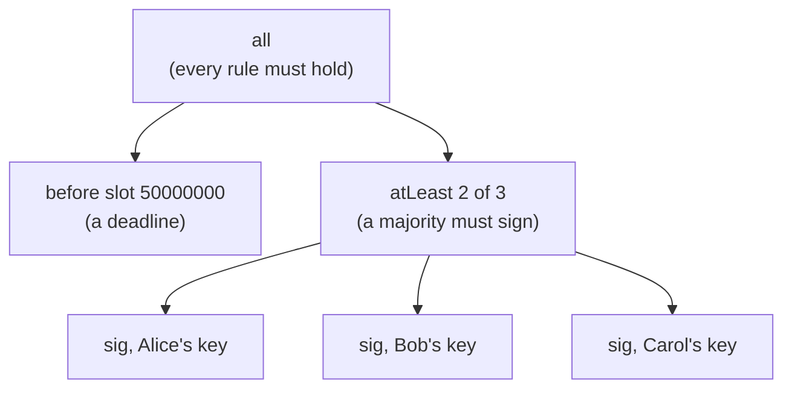

import Tabs from "@theme/Tabs";
import TabItem from "@theme/TabItem";
import CodeBlock from "@theme/CodeBlock";
import extractRegion from "@site/src/utils/extractRegion";
import NativeScript from "!!raw-loader!@site/examples/onboarding/lectures/mesh/src/native-script.ts";
import SendWithMetadata from "!!raw-loader!@site/examples/onboarding/lectures/mesh/src/send-with-metadata.ts";

# Native scripts & metadata

Two building blocks, and neither needs a smart contract.

## Native scripts

You've now met the two ingredients a simple rule is made of: **signatures** (from the [wallets lecture](/docs/developers/onboarding/lectures/beginner/wallets-keys-addresses)) and **time windows** (from the [last lecture](/docs/developers/onboarding/lectures/beginner/time-on-cardano)). A **native script** combines exactly those into an on-chain rule, with **no smart contract** and no code to compile.

### Simple rules, no code

A **native script** expresses a **simple condition** as data, no smart-contract language required, like the **rules on a shared bank account** ("any two of us must sign", "not before this date").

Here's one that says _"both keys must sign"_:

```json
{
  "type": "all",
  "scripts": [
    { "type": "sig", "keyHash": "KEY_HASH_1" },
    { "type": "sig", "keyHash": "KEY_HASH_2" }
  ]
}
```

`sig` = this key must sign, `all` = every condition must hold (there's also `any` and `atLeast`), plus time conditions like `before`/`after` (measured in [slots](/docs/developers/onboarding/lectures/beginner/time-on-cardano), which you just met). The power is that they **nest**: you combine small rules into a bigger one. This tree means _"before a deadline **and** at least 2 of 3 people sign"_, a time-locked shared wallet:



Because it's just data, you assemble it in code like any object. Hashing it gives the **script hash**, the same value that becomes a **minting policy ID** or a **script address**:

<Tabs groupId="offchain">
<TabItem value="mesh" label="Mesh" default>

<CodeBlock language="ts" title="native-script.ts">
  {extractRegion(NativeScript, "native-script")}
</CodeBlock>

In the **Tokens** lecture you'll use exactly this: a token's **minting policy** is just a native script, and hashing it gives the token's **policy ID**.

</TabItem>
<TabItem value="evolution" label="Evolution">

An [Evolution](https://no-witness-labs.github.io/evolution-sdk/) version is coming soon. The idea is identical, only the library calls differ.

</TabItem>
</Tabs>

### When would you use one?

**Native scripts** shine when you need a rule, but signatures and time are enough, so a full smart contract would be overkill:

- **Shared treasury / multisig wallet.** Funds that need, say, 2 of 3 signers to move. _Why:_ no single person can spend alone, and there's no smart-contract code to audit or get wrong.
- **Fixed-supply NFTs & capped collections.** A time-locked minting policy so no more can ever be minted after a deadline. _Why:_ provable scarcity, which is what makes a collection trustworthy.
- **Time-locked funds (simple vesting).** Value that can't move before a certain slot. _Why:_ enforce a cliff or release date with a plain rule instead of a program.
- **Simple issuance control.** "Only these keys may mint this token." _Why:_ cheap, clear, and auditable when you don't need custom logic.

The rule of thumb: reach for a **native script** when your condition is only about **who signs and when**, reach for a smart contract when the rules depend on amounts, on-chain state, or anything more.

## Metadata

**Metadata** is like the **memo field on a bank transfer**: extra information (text, or any structured data) you attach to a transaction. It isn't money, but it travels with the transaction and is stored on-chain forever.

:::warning Contracts can't read metadata
Metadata is stored on-chain, but **smart contracts can't read it**. It's for "off-chain" readers like wallets and explorers. If you need a value that on-chain code can check, use a **datum** instead.
:::

### See it in code

Let's attach one. This sends a tiny transaction to yourself with a **memo** attached, then you can read it back on the explorer. Wallet-only, no provider needed.

<Tabs groupId="offchain">
<TabItem value="mesh" label="Mesh" default>

<CodeBlock language="ts" title="send-with-metadata.ts">
  {extractRegion(SendWithMetadata, "metadata")}
</CodeBlock>

**Run it and see it on the explorer.** Same setup as before, **[Lace](https://www.lace.io/)** on **Preview** with a little test ADA.

```bash
npx giget@latest gh:cardano-foundation/developer-portal/examples/onboarding/lectures/mesh lectures-mesh
cd lectures-mesh
npm install
npm run dev
```

Open the printed URL in the browser where Lace lives, click **Connect Lace and send a transaction with a memo**, and approve it. Follow the **explorer link** and open the transaction's **metadata**, your message is sitting there on-chain, attached to the payment. _(Already downloaded this folder? Just `npm run dev` again.)_

</TabItem>
<TabItem value="evolution" label="Evolution">

An [Evolution](https://no-witness-labs.github.io/evolution-sdk/) version is coming soon. The idea is identical, only the library calls differ.

</TabItem>
</Tabs>

### When would you use it?

**Metadata** shines whenever you want durable, tamper-proof information tied to a transaction:

- **NFT details (CIP-25).** When you mint an NFT (next lecture), its name, description, and image link live in the minting transaction's metadata. _Why:_ wallets and marketplaces read it straight from the chain, no separate database to trust.
- **Receipts & order references.** Attach an invoice or order ID to a payment. _Why:_ buyer and seller share one permanent, unforgeable link between the money and the order.
- **Proof a document existed (timestamping).** Store a file's fingerprint (its hash), not the file. _Why:_ you can later prove the document existed unchanged on that date, without revealing it.
- **Messages (CIP-20).** A human-readable note on a transfer, exactly the example above. _Why:_ context for a payment that anyone can read.

## Try it

- **Read a rule:** in the native-script JSON above, change `"all"` to `"any"`, now _either_ key can sign instead of both.
- **Read metadata:** on the **[Cardano explorer for Preview](https://explorer.cardano.org/preview)**, open the memo transaction you sent above and find its **metadata**, that's the note attached to the payment.

## Go deeper

- [Minting policies](/docs/developers/curriculum/native-tokens/minting-policies) — the "Native script policies" section shows these scripts in full.
- [Token metadata & registry](/docs/developers/curriculum/native-tokens/metadata-registry) — the metadata standards: CIP-25 (NFTs), CIP-68 (on-chain datum), CIP-26 (registry).
- [Transactions](/docs/developers/curriculum/fundamentals/core-concepts/transactions) — metadata is part of a transaction's anatomy.
- [Datum, redeemer & script context](/docs/developers/curriculum/smart-contracts/datum-redeemer-context) — the on-chain data a contract _can_ read, where a full smart contract picks up when signatures, time, and metadata aren't enough.

Next: **[Tokens: fungible & NFTs](/docs/developers/onboarding/lectures/beginner/tokens-fungible-and-nfts)**.
